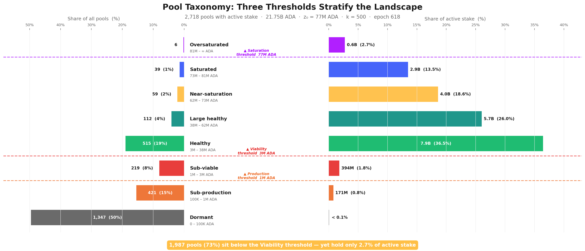
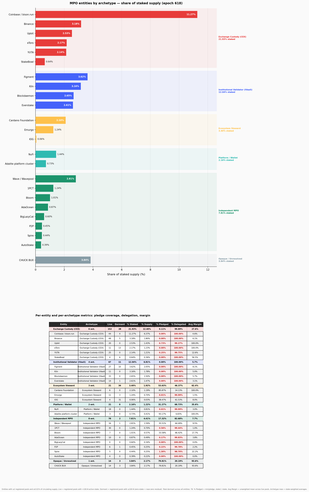
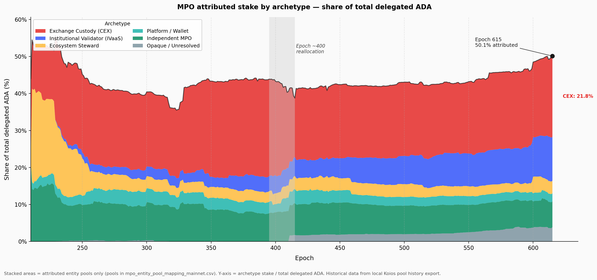
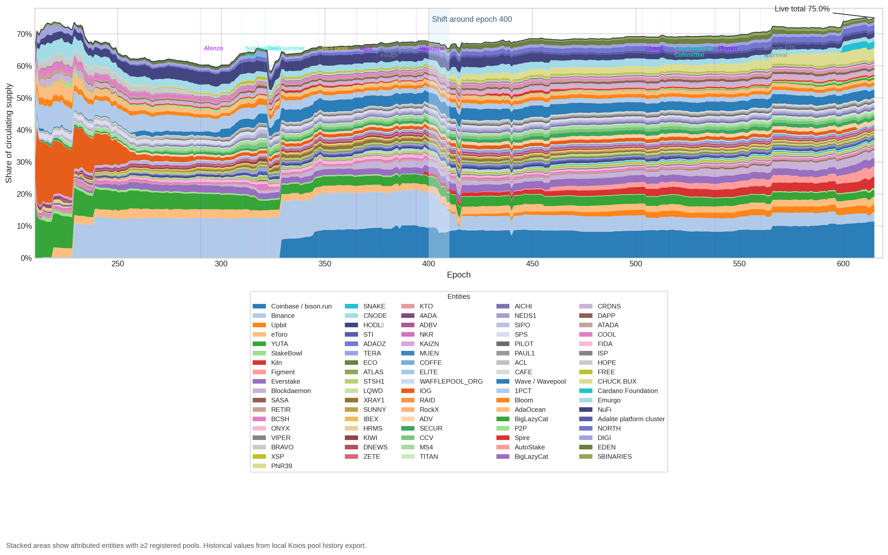
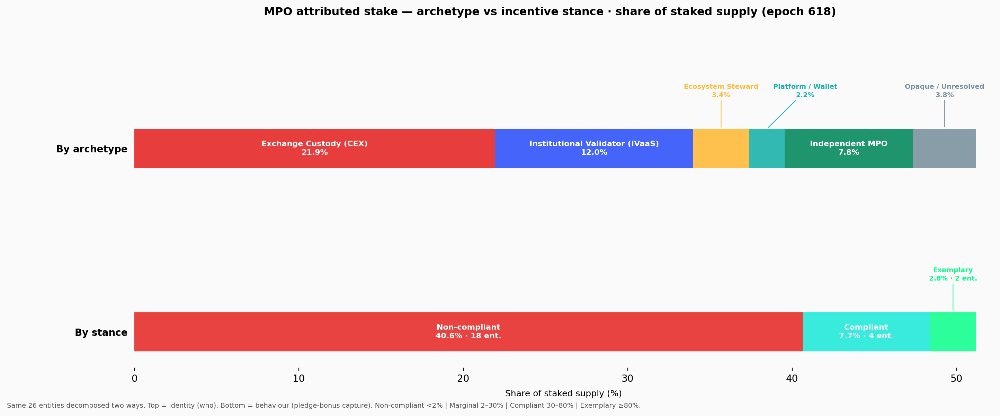
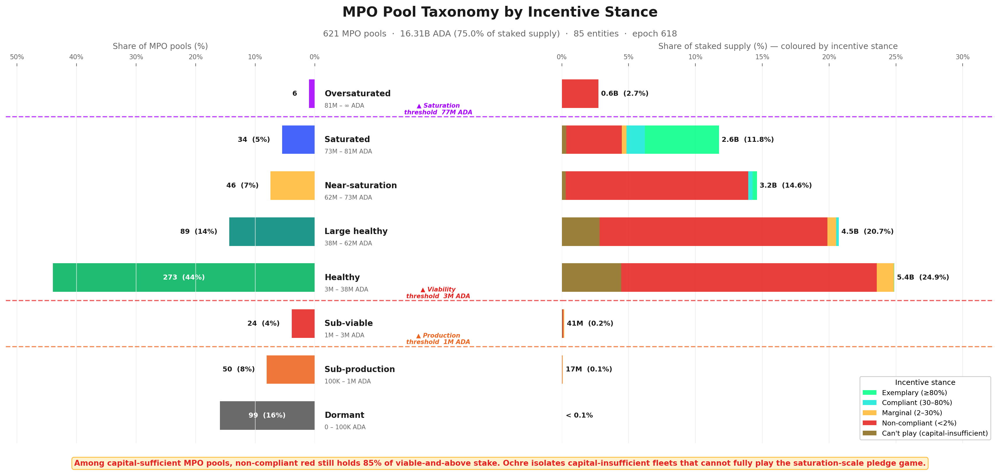
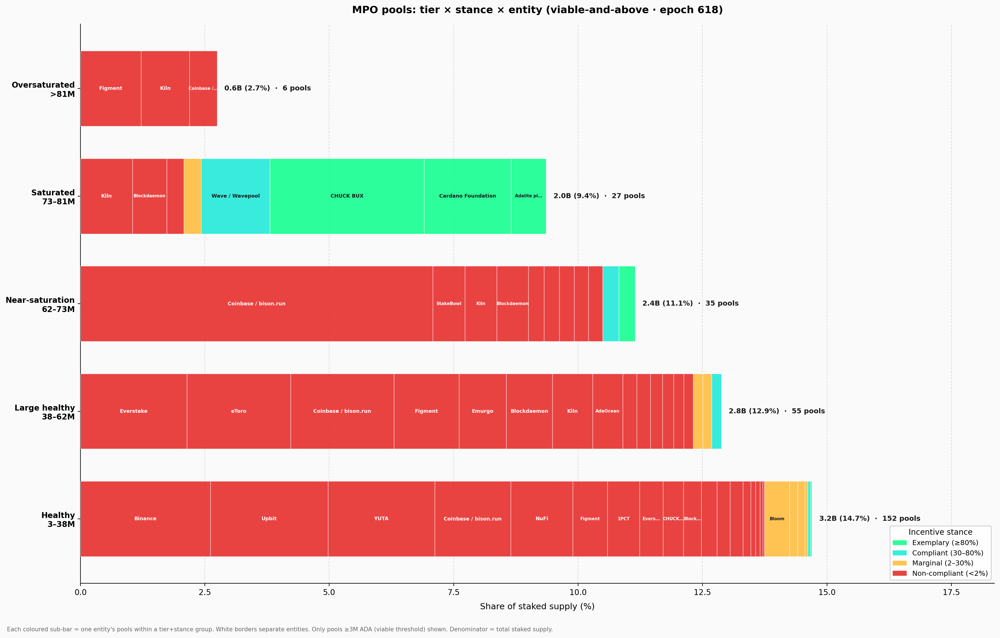
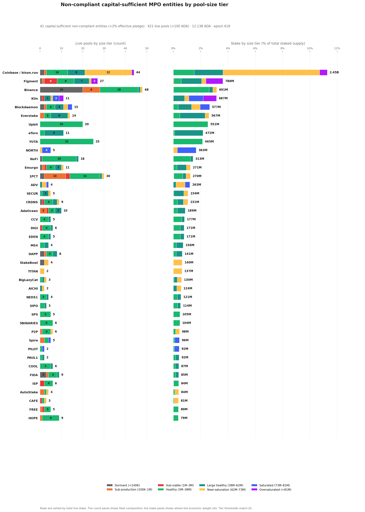
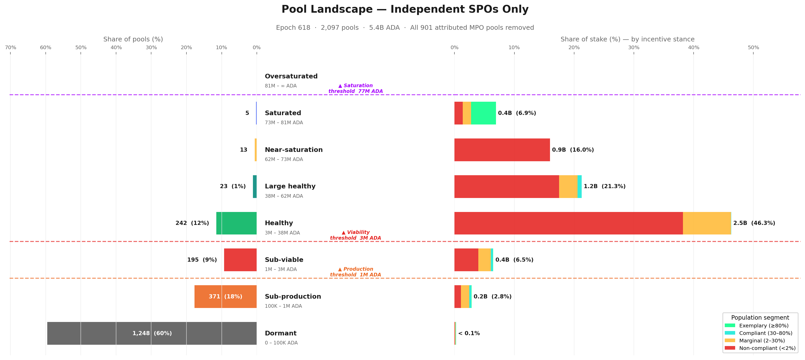
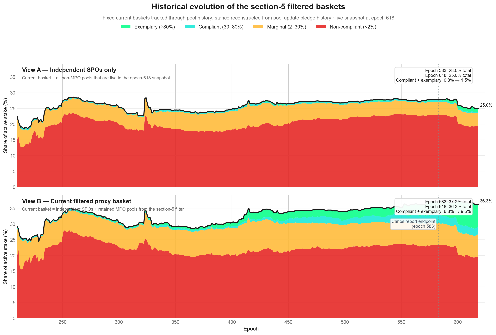

# Pools Distribution — Mainnet Analysis

_Built on 2026/03/18 from mainnet data at epoch `618` plus historical analysis from epoch `208` (Shelley inception)._

## Objective

This report analyses the **pool-level reward distribution** — the second stage of Cardano's reward pipeline — and traces a single diagnostic thread from mechanism to actors to consequences.

Every epoch, the pools pot (~15.5M ADA at epoch 616) enters this stage. The reward curve allocates it across pools based on their stake, pledge, and block performance. What is not distributed **returns to the reserve**. At epoch 616, only **43.7%** of the pools pot reached operators and delegators. This report asks *why*, and follows the answer where it leads.

The argument proceeds in two steps:

1. **Diagnosis** (§2). A waterfall decomposition of the pools pot reveals that two causes account for over half the loss. The participation gap (31.6%) is upstream and outside the formula's control. The unused pledge-incentive budget (22.1%) is the single largest *addressable* inefficiency — and has been unchanged since Shelley launch. The pledge mechanism, designed as Cardano's primary Sybil-resistance tool, has never activated.

2. **Dissection** (§3). The pool landscape is examined first by size (pool taxonomy), then by the entities behind the pools. 75% of staked supply is controlled by 85 multi-pool operators — exchanges, institutional validators, and community fleets — most of which are structurally or strategically outside the pledge game. The remaining single-pool operators are the community base any reform aims to support. Once non-responsive MPOs are set aside, the RSS-exposed arena shrinks to 36% of active stake, and 561 marginal SPOs — operators who partially pledge and sit at the decision boundary — emerge as the highest-return target for incentive reform. The section separates who genuinely struggles, who deliberately wastes, and who is exemplary.

All counts and amounts use the latest available pool snapshot (**epoch 618**) and the latest complete epoch with reward data (**epoch 616**) unless stated otherwise.

## Contents

1. [Mainnet Observations](#1-mainnet-observations)
2. [Distribution efficiency](#2-distribution-efficiency)
   - 2.1 [The participation gap](#21-the-participation-gap)
   - 2.2 [Pledge-not-met confiscation](#22-pledge-not-met-confiscation)
   - 2.3 [The reward formula](#23-the-reward-formula)
   - 2.4 [The eligible pot and the pledge problem](#24-the-eligible-pot-and-the-pledge-problem)
      - 2.4.1 [Why pledge matters — and why this is not zero-sum](#241-why-pledge-matters--and-why-this-is-not-zero-sum)
      - 2.4.2 [The playing field: what pledge actually buys](#242-the-playing-field-what-pledge-actually-buys)
      - 2.4.3 [The envelope mechanics](#243-the-envelope-mechanics)
      - 2.4.4 [The evidence on mainnet](#244-the-evidence-on-mainnet)
   - 2.5 [Performance and oversaturation](#25-performance-and-oversaturation)
   - 2.6 [Summary](#26-summary)
      - 2.6.1 [Current snapshot](#261-current-snapshot)
      - 2.6.2 [Historical evolution](#262-historical-evolution)
      - 2.6.3 [Conclusion](#263-conclusion)
3. [The pool landscape — who wastes, who pledges, and who struggles](#3-the-pool-landscape--who-wastes-who-pledges-and-who-struggles)
   - 3.1 [Pool taxonomy](#31-pool-taxonomy)
      - 3.1.1 [The case for pool categorization](#311-the-case-for-pool-categorization)
      - 3.1.2 [Structural thresholds](#312-structural-thresholds)
         - 3.1.2.1 [Production threshold](#3121-production-threshold)
         - 3.1.2.2 [Viability threshold](#3122-viability-threshold)
         - 3.1.2.3 [Saturation threshold](#3123-saturation-threshold)
      - 3.1.3 [Tier definitions](#313-tier-definitions)
      - 3.1.4 [Pool distribution by tier](#314-pool-distribution-by-tier)
      - 3.1.5 [Conclusion](#315-conclusion)
   - 3.2 [Behind the pools — entity-level analysis](#32-behind-the-pools--entity-level-analysis)
      - 3.2.1 [Identifying multi-pool operators](#321-identifying-multi-pool-operators)
      - 3.2.2 [Operator archetypes](#322-operator-archetypes)
         - 3.2.2.1 [Classification](#3221-classification)
         - 3.2.2.2 [Current distribution](#3222-current-distribution)
         - 3.2.2.3 [Historical evolution](#3223-historical-evolution)
      - 3.2.3 [Pledge compliance — who plays and who doesn't](#323-pledge-compliance--who-plays-and-who-doesnt)
         - 3.2.3.1 [Exchange Custody (CEX)](#3231-exchange-custody-cex)
         - 3.2.3.2 [Institutional Validator (IVaaS)](#3232-institutional-validator-ivaas)
         - 3.2.3.3 [Pledge compliance classification](#3233-pledge-compliance-classification)
         - 3.2.3.4 [The cost of non-compliance](#3234-the-cost-of-non-compliance)
            - 3.2.3.4.1 [Top 10 contributors to MPO pledge waste](#32341-top-10-contributors-to-mpo-pledge-waste)
            - 3.2.3.4.2 [Top 10 most exemplary MPOs](#32342-top-10-most-exemplary-mpos)
         - 3.2.3.5 [Pledge compliance × pool tier](#3235-pledge-compliance--pool-tier)
   - 3.3 [The remaining single-pool operators](#33-the-remaining-single-pool-operators)
      - 3.3.1 [Pledge compliance among SPOs](#331-pledge-compliance-among-spos)
      - 3.3.2 [The marginal SPOs — the policy-sensitive population](#332-the-marginal-spos--the-policy-sensitive-population)
      - 3.3.3 [The SPO landscape in isolation](#333-the-spo-landscape-in-isolation)
   - 3.4 [The full picture — good actors, bad actors, and the struggling middle](#34-the-full-picture--good-actors-bad-actors-and-the-struggling-middle)
      - 3.4.1 [The filtered proxy — RSS-responsive field](#341-the-filtered-proxy--rss-responsive-field)
      - 3.4.2 [Historical evolution of the filtered field](#342-historical-evolution-of-the-filtered-field)
   - 3.5 [Conclusion](#35-conclusion)
      - 3.5.1 [What the filtered landscape reveals](#351-what-the-filtered-landscape-reveals)
4. [Reproduction](#4-reproduction)
   - 4.1 [Full rebuild](#41-full-rebuild)
   - 4.2 [Refreshing MPO data](#42-refreshing-mpo-data)

---

## 1. Mainnet Observations

| # | Observation | Section | Nature |
| --- | --- | --- | --- |
| | **O1 — Two causes account for 54% of the pools pot returning to reserve** | | |
| F1.1 | Only 6.79M of 15.53M ADA/epoch reaches operators and delegators — 44% distribution efficiency | §2.4 | Epoch 616 |
| F1.2 | The participation gap (unstaked ADA) alone returns 4.91M ADA/epoch — 31.6% of the pot | §2.1 | Upstream — outside formula control |
| F1.3 | The unused pledge-incentive budget returns 3.43M ADA/epoch — 22.1% of the pot, 95.6% of the bonus budget wasted | §2.3 | Addressable by formula reform |
| F1.4 | These two causes together (53.7% of pot) dwarf all others: pledge-not-met confiscation (2.1%), performance (0.5%), oversaturation (0.3%) are secondary | §2.4 | The reform priority is clear |
| | **O2 — The reward formula produces three structural thresholds** | | |
| F2.1 | 78% of staked ADA sits in pools with pledge ratio < 1%; stake-weighted median ratio is 0.07% | §2.4.4 | Structural — pledge is absent where stake concentrates |
| F2.2 | Yield on pledge capital is 0.68%/yr at best (full saturation) — below passive delegation yield of 2.3%/yr | §2.4.2 | Economically irrational to pledge |
| F2.3 | 3.4M ADA/epoch (22% of pot) is reserved for pledge bonus but returns to reserve unused | §2.6.1 | Structural cost of maintaining $a_0 = 0.3$ |
| | **O3 — The pool landscape is stratified into four tiers** | | |
| F3.1 | Regular block production requires ~3M ADA stake (~3 blocks/epoch) — the emergent viability boundary | §3.1.2 | Structural — not a protocol parameter |
| F3.2 | Below 1.1M ADA, the 340 ADA fixed cost exceeds pool reward — operators are in economic loss | §3.1.2 | 1,987 below-viability pools affected |
| F3.3 | Only 8 pools reach the saturation threshold ($z_0$ = 77M ADA) — the cap designed for 500 pools is nearly inactive | §3.1.2 | 1.6% of design target |
| F3.4 | Active stake fills only 56.5% of theoretical capacity ($k \times z_0$) — at most 282 pools could saturate | §3.1.2 | Capital constraint |
| | **O4 — Multi-pool operators control 75% of staked supply** | | |
| F4.1 | 85 MPO entities operate 901 pools holding 16.4B ADA — 75.4% of participating stake | §3 | Structural — concentration |
| F4.2 | 48 capital-sufficient MPOs (14.5B ADA) could play the pledge game; 37 capital-insufficient MPOs (1.74B ADA) cannot | §3.2.1 | Scale determines access |
| F4.3 | 41 of 48 capital-sufficient MPOs are non-compliant — they forfeit 550K ADA/epoch in pledge bonus | §3.2.3 | Strategic non-response |
| F4.4 | CEX + IVaaS alone hold 7.4B ADA (19.2% of supply) at structurally zero pledge | §3.2.3 | Custodial constraint |
| | **O5 — The RSS-responsive playing field is much smaller than the headline active set** | | |
| F5.1 | True single-pool SPOs hold only 5.44B ADA (25% of staked supply) across 2,097 pools | §3.3 | After MPO attribution |
| F5.2 | 78% of independent SPO stake is non-compliant — the pledge signal is correctly priced as irrelevant at their scale | §3.3.1 | Rational non-compliance |
| F5.3 | 561 marginal SPOs (0.87B ADA) sit at the decision boundary — the primary policy lever | §3.3.2 | Target for parameter reform |
| F5.4 | The filtered proxy (SPOs + retained MPOs) holds 7.89B ADA — 36% of active stake | §4.3 | The actual RSS arena |
| | **O6 — Non-compliance is a multi-game phenomenon, not a calibration failure** | | |
| F6.1 | 78 of 85 MPO entities (13.74B ADA, 63% of active stake) are outside the pledge-response path | §3.5 | Structural + strategic |
| F6.2 | CEX cannot pledge custodied funds; IVaaS cannot pledge client assets; community fleets choose not to | §3.2.3 | Three distinct mechanisms |
| F6.3 | Increasing $a_0$ would raise the penalty without changing behaviour — the waste would grow, not shrink | §3.5 | Reform constraint |

### The big picture

The pools pot enters this stage as a budget of ~15.5M ADA per epoch. Only **6.8M** reaches operators and delegators. The sequential decomposition in §2 reveals that just **two causes** account for over half the pot: **4.91M** (31.6%) returns because 43.5% of ADA is not staked, and **3.43M** (22.1%) returns because the pledge-incentive budget is 95.6% unused. Everything else — pledge-not-met confiscation, missed blocks, oversaturation — is secondary by an order of magnitude. The reform priority is clear: the participation gap is upstream and outside the formula's control; the unused pledge budget is the single largest addressable inefficiency.

The RSS design assumed 500 well-funded, pledge-committed pools operating near saturation with near-complete staking participation. Mainnet reality diverges on every dimension. Three structural thresholds — **production** (~1M ADA), **viability** (~3M ADA), and **saturation** (77M ADA) — stratify the pool landscape into tiers where 73% of pools sit below viability yet carry only 2.7% of stake. The pledge bonus, designed to differentiate pools by operator commitment, is functionally irrelevant for 95% of the landscape.

More fundamentally, **75% of staked supply is controlled by 85 multi-pool operators** — exchanges, institutional validators, community fleets, and opaque entities. Most of this stake is structurally or strategically outside the pledge game. The 48 capital-sufficient MPOs *could* play but 41 do not; the 37 capital-insufficient MPOs *cannot* play at saturation scale. This is not a calibration problem that parameter tuning can fix — it is a multi-game environment where the RSS is one sub-game among many.

The true RSS-responsive playing field — independent SPOs and the thin compliant/marginal MPO slice — holds only **7.89B ADA** (36% of active stake). Within it, the **561 marginal SPOs** who partially pledge represent the highest-return target for any incentive reform. The rest of the landscape is a fixed background: structurally non-responsive and strategically indifferent to marginal $a_0$ changes.

---

## 2. Distribution efficiency

> **56.3% of the pools pot never reaches operators or delegators.** Of the 15.53M ADA entering this stage at epoch 616, only 6.79M ADA was distributed. The rest returned to the reserve.

This section traces where the pot goes, step by step. Each step removes a slice before the next cause can act, and at each step we open the formula to show *why* that slice is lost.

### 2.1 The participation gap

The pools pot is sized for the full circulating supply. With 43.5% of ADA undelegated, a proportional share of the pot has no pool to claim it.

| | ADA/epoch | % of pot |
| --- | ---: | ---: |
| Pools pot | 15.53M | 100% |
| Participation gap | −4.91M | 31.6% |
| **Staked pot** | **10.62M** | **68.4%** |

Because the base is distribution-neutral, this gap depends *only* on how much ADA is staked — not on how it is arranged across pools. No formula change can close it. Only increased staking participation can.

### 2.2 Pledge-not-met confiscation

When a pool operator *declares* a pledge in their pool certificate but the owners' stake keys do not actually hold that amount at the epoch boundary, the protocol sets the pool's reward to **zero for the entire epoch**. Not a reduction — a total confiscation.

The pool still produces blocks and contributes to consensus. The delegators' ADA still participates in the protocol. But neither operator nor delegators receive anything. It is the only pathway where the network *does real work and gets nothing in return*.

| | ADA/epoch | % of pot |
| --- | ---: | ---: |
| Staked pot | 10.62M | 68.4% |
| Pledge-not-met confiscation | −0.32M | 2.1% |
| **Eligible pot** | **10.30M** | **66.3%** |

At epoch 615, **692 pools** failed this check. They produced **1,049 blocks**, and their **1.08B ADA** of delegated stake earned nothing. The confiscated 0.32M ADA/epoch (~23M/year) is almost entirely base reward — these pools had near-zero pledge, so their bonus entitlement was negligible.

This happens more often than one might expect. Historically, **2,797 pools** have experienced at least one pledge-unmet epoch, and **833 are chronically in default** (pledge met less than 50% of the time). The typical cause is operational: an operator moves ADA out of their pledge wallet for liquidity or DeFi, or mishandles a key rotation, and doesn't realize the consequence until rewards are already lost.

### 2.3 The reward formula

Before going further down the waterfall, we need to open the formula that governs everything below this point. Each pool's reward is:

$$\hat{f}'(\pi, \nu, \bar{p}) = \underbrace{\bar{p}}_{\text{performance}} \;\cdot\; \underbrace{P_{\max}}_{\text{ceiling}} \;\cdot\; \underbrace{\left( \lambda_{\min}\;\nu \;+\; \lambda_{\max}\;A(\pi, \nu) \right)}_{\text{proportioning envelope } E(\pi,\nu)}$$

Three multiplicative factors. When all three equal their maximum, the pool earns the full ceiling $P_{\max}$. Every departure from the ideal is a multiplicative discount — and the uncaptured fraction returns to the reserve.

| Factor | Symbol | What it captures | Ideal value |
| --- | --- | --- | --- |
| Performance | $\bar{p}$ | Did the pool produce its assigned blocks? | 1.0 |
| Ceiling | $P_{\max}$ | Maximum reward for any single pool per epoch | 31K ADA |
| Proportioning envelope | $E(\pi,\nu)$ | How well is the pool sized and pledged? | 1.0 (ν=1, π=1) |

The ceiling sets the scale:

$$P_{\max} = \frac{1}{k} \cdot R = \frac{1}{500} \times 15.53\text{M} \approx 31{,}060\text{ ADA/epoch}$$

> [!NOTE]
> **Protocol parameters governing this stage.** Three parameters directly control pool-level distribution. All have been constant since reaching their current value.
>
> | Parameter | Symbol | Value | History |
> | --- | --- | --- | --- |
> | Target pool count | $k$ | 500 | Raised from 150 to 500 at epoch 257, **unchanged since** |
> | Pledge influence | $a_0$ | 0.3 | Set at Shelley (epoch 208), **never changed** |
> | Saturation point | $z_0$ | 76.99M ADA | Mechanical consequence of $k$ and supply |

In the ideal design, $k = 500$ pools each earn $P_{\max}$, and the full pot is distributed. On mainnet, the sum of all pool rewards is **6.79M ADA** — only **43.7%**. The envelope $E$ splits into two additive components that explain where the rest goes:

| Component | Expression | Driven by | Range |
| --- | --- | --- | --- |
| **Base** | $\lambda_{\min} \cdot \nu = 76.923\% \cdot \nu$ | Pool size only | 0 → 76.923% |
| **Pledge bonus** | $\lambda_{\max} \cdot A(\pi,\nu) = 23.077\% \cdot A$ | Size + pledge | 0 → 23.077% |

The base is **distribution-neutral**: 100M ADA in one pool earns exactly the same base as 100M split across ten pools. The bonus is **distribution-sensitive**: the activation function $A(\pi,\nu) = \pi\nu - \pi^2(1-\nu)$ is non-linear, and under full self-pledge $A(\nu,\nu) = \nu^3$ — cubing sub-unit values crushes them.

This split — 76.9% for size, 23.1% for pledge — is the key to understanding everything that follows.

### 2.4 The eligible pot and the pledge problem

After removing the participation gap and confiscated rewards, **10.30M ADA/epoch** remains — the "eligible pot". This is what the formula distributes among pools that passed the pledge check. Within it, the single largest loss is the **unused pledge budget**.

#### 2.4.1 Why pledge matters — and why this is not zero-sum

The formula reserves $\lambda_{\max} = 23.1\%$ of the pot — **3.58M ADA every epoch** — as a bonus for operators who self-pledge. This is not a reward optimisation. It is the protocol's **primary Sybil-resistance mechanism**. The design specification (Brünjes et al., 2020) is explicit: the pledge requirement exists so that "an adversary who wishes to increase his chances of being elected [must] split his stake among several stakepools, decreasing each pool's apparent pledge and therefore its attractiveness." Pledge is the economic barrier that makes pool proliferation expensive. Without it, the cost of running a pool farm drops to near zero and the network's decentralisation guarantees erode.

The prior report (Lopez de Lara, 2025/11) characterised the pledge-bonus shortfall as economically neutral — a zero-sum redistribution where uncaptured ADA returns to the reserve. This framing is incomplete. **The 22.1% of the pot that returns unused is not idle capital awaiting redistribution. It is the budget the protocol explicitly allocates to its own security model — and 95.6% of that budget fails to activate.**

#### 2.4.2 The playing field: what pledge actually buys


**Three reward tiers:**

| Tier | Reward/epoch | Reward/year | What it requires |
| --- | --- | --- | --- |
| **$P_{\max}$** — absolute ceiling | **31,067 ADA** | **2.27M ADA** | 77M ADA stake + 77M ADA pledge + $\bar{p}=1$ |
| **Size ceiling** — zero pledge | **23,898 ADA** | **1.74M ADA** | 77M ADA stake + $\bar{p}=1$. No pledge needed. |
| **Pledge bonus** — the gap | **7,169 ADA** | **523K ADA** | The difference. Requires 77M ADA of *personal* capital pledged. |

The size-only ceiling ($\lambda_{\min} \times P_{\max}$) is what **any** saturated pool earns regardless of pledge. It captures 76.9% of $P_{\max}$. The remaining 23.1% requires the operator to **pledge the entire saturation amount** (77M ADA). The implied yield: $523\text{K ADA/yr} \div 77\text{M ADA} = 0.68\%\text{/yr}$ — below the passive delegation yield of ~2.3%/yr.

**The bonus at every scale:**

| Pool size | ν | Zero-pledge reward | Max pledge (π=ν) reward | Bonus | Relative uplift | Yield on pledge capital |
| --- | --- | --- | --- | --- | --- | --- |
| 3M ADA | 0.039 | 931 ADA/ep | 932 ADA/ep | **+0.4 ADA** | +0.05% | 0.001%/yr |
| 10M ADA | 0.130 | 3,104 ADA/ep | 3,120 ADA/ep | **+16 ADA** | +0.5% | 0.011%/yr |
| 30M ADA | 0.390 | 9,312 ADA/ep | 9,736 ADA/ep | **+424 ADA** | +4.6% | 0.10%/yr |
| 50M ADA | 0.649 | 15,520 ADA/ep | 17,484 ADA/ep | **+1,964 ADA** | +12.7% | 0.29%/yr |
| 77M ADA | 1.000 | 23,898 ADA/ep | 31,067 ADA/ep | **+7,169 ADA** | +30.0% | 0.68%/yr |

A 10M ADA pool where the operator pledges the entire pool earns 16 ADA more per epoch — a yield of **0.01%/yr** on a 10M lockup. A typical healthy pool (30M ADA stake, 100K ADA pledge) gains **3.6 ADA/epoch** from pledge — less than the variance of a single block.

The "game" for operators is overwhelmingly about **size** (ν), not **commitment** (π). The bonus exists in the formula but not in the economics.

#### 2.4.3 The envelope mechanics

The proportioning envelope determines what fraction of $P_{\max}$ the pool can capture:

$$E(\pi, \nu) = \underbrace{\lambda_{\min} \cdot \nu}_{\text{base}} + \underbrace{\lambda_{\max} \cdot A(\pi, \nu)}_{\text{pledge bonus}}$$

**The base:** A zero-pledge pool (π = 0) earns $E(0,\nu) = 76.923\% \cdot \nu$. Purely proportional to saturation, independent of pledge. At full saturation: 76.9% of $P_{\max}$. The remaining 23.1% is structurally inaccessible to it.

**The pledge bonus:** The activation function $A(\pi,\nu) = \pi\nu - \pi^2(1-\nu)$ controls access to that remaining 23.1%. Under full self-pledge (π = ν):

$$A(\nu, \nu) = \nu^3 \qquad \Rightarrow \qquad \text{max bonus at } \nu = \lambda_{\max} \cdot \nu^3$$

The cubic scaling is the crux. At ν = 0.1 (a 7.7M pool), even with perfect pledge, the bonus is 0.023% of $P_{\max}$. The mechanism was designed for a world of 500 saturated pools; the actual landscape cannot activate it.

| Saturation (ν) | Max $A$ | Bonus (% of $P_{\max}$) | Total $E$ | Relative uplift over zero-pledge |
| --- | --- | --- | --- | --- |
| 1.0 (full) | 1.000 | 23.077% | **100%** | **30.0%** |
| 0.8 | 0.512 | 11.82% | 73.36% | 19.2% |
| 0.5 | 0.125 | 2.88% | 41.35% | **7.50%** |
| 0.3 | 0.027 | 0.62% | 23.70% | 2.70% |
| 0.1 | 0.001 | 0.023% | 7.72% | 0.30% |

#### 2.4.4 The evidence on mainnet

Absolute pledge amounts are misleading — a 1M ADA pledge means something very different for a saturated pool (ν ≈ 1, π ≈ 0.013) than for a small one (ν ≈ 0.1, π ≈ 0.13). The relevant metric is the **pledge ratio**: declared pledge divided by active stake. This is what the formula actually prices through the $A(\pi, \nu)$ term.


The chart covers the 1,684 registered pools with meaningful delegation (active stake > 10K ADA), excluding dormant and zombie registrations.

| Pledge ratio threshold | Cumul. % of pools | Cumul. % of stake | Stake (ADA) |
| --- | --- | --- | --- |
| < 0.1% | 32.0% | **51.9%** | 11.3B |
| < 1% | 53.1% | **78.0%** | 16.9B |
| < 10% | 76.0% | **89.4%** | 19.4B |

**78% of all staked ADA** sits in pools where the operator pledges less than 1% of managed stake, and **89%** below 10%. Only one ADA in ten is delegated to a pool where the operator commits more than a tenth of the stake they manage.

The stake-weighted median pledge ratio is **0.07%** — meaning half of all staked ADA sits in pools where the operator's personal commitment is less than one thousandth of delegated funds. The unweighted median (0.73%) is 10× higher, reflecting the many smaller community pools with genuine skin-in-the-game but little stake weight.

This asymmetry is the structural signature of the pledge problem. The pools that dominate the network in economic terms — the ones that actually produce blocks and collect the bulk of rewards — operate with near-zero pledge ratios. For these pools, the $A(\pi, \nu)$ term contributes essentially nothing: at π = 0.001 and ν = 0.5, the bonus is 0.0006% of $P_{\max}$. The anti-Sybil mechanism is present in the formula but absent from the economics.

### 2.5 Performance and oversaturation

Two minor waste sources complete the picture:

**Performance** ($\bar{p}$): A pool's actual block production relative to its VRF-assigned expectation. The network-wide aggregate averages **0.977** — meaning ~2.3% of the pot is lost to missed blocks. This is the only factor the operator directly controls through infrastructure quality. For sub-production pools (expected blocks < 3/epoch), Poisson variance dominates and epoch-to-epoch results are noisy, but in aggregate the effect is small: **0.5% of the pot**.

**Oversaturation**: Seven pools hold stake above $z_0 = 76.99\text{M ADA}$; the excess earns nothing. The saturation cap was designed for 500 pools; only 8 reach it. It binds on **0.3% of the pot**.

Combined: **0.8% of the pot**. These are well-functioning mechanisms that do their job — they are not the problem.

### 2.6 Summary

#### 2.6.1 Current snapshot


> [!IMPORTANT]
> **Key observation (O1).** Two causes account for **53.7% of the entire pools pot** returning to reserve: the participation gap (31.6%) and the unused pledge budget (22.1%). Everything else — pledge-not-met confiscation (2.1%), performance (0.5%), oversaturation (0.3%) — is secondary by an order of magnitude. The reform priority is unambiguous: the participation gap is upstream and outside the formula's control; the unused pledge budget is the single largest inefficiency that incentive reform *can* address.

The unused pledge budget represents **3.43M ADA per epoch (~250M ADA per year)** that the protocol *wants* to distribute but cannot — because the bonus curve is too flat for most of the pool landscape and most operators do not pledge. §3 maps the population structure that produces this outcome.

#### 2.6.2 Historical evolution


The historical decomposition reveals two facts that the single-epoch snapshot cannot:

**The participation gap is the only component that has moved.** Distribution efficiency peaked at ~55% around epoch 300–400 and has since degraded to 43.6%. The entire decline traces to falling participation: the grey band widened from ~22% to 34% as the ratio of active stake to theoretical capacity ($k \times z_0$) fell. No other component changed materially.

**The bonus budget has never activated.** The red band — pledge bonus unused — has sat at **~22–23% of the pot since Shelley epoch 211**. It was 23.1% when $a_0 = 0.3$ was set, and it is 22.5% today. The pledge incentive was not functional at launch, did not improve after the $k$ increase at epoch 257, and has not responded to any subsequent change in the pool landscape. This is not a recent degradation. It is a **structural failure present since the mechanism was deployed**.

#### 2.6.3 Conclusion

The pledge bonus is the protocol's primary Sybil-resistance mechanism — the economic cost that makes pool proliferation expensive. When 95.6% of this budget fails to activate, the marginal cost of opening an additional pool drops to near zero. The mechanism designed to make pool farms expensive becomes permissive.

This is not a zero-sum redistribution. The **3.43M ADA** that returns to the **reserve** every epoch is the budget the protocol explicitly allocates to its **own security model** — and it has never worked. Not at launch, not after the $k$ increase, not after five years of pool landscape evolution. The mechanism never engaged.

> [!IMPORTANT]
> **The diagnostic is unambiguous.** The participation gap (31.6%) is upstream and outside the formula's control. The unused pledge budget (22.1%) is the single largest inefficiency that incentive reform *can* address — and the five-year historical record confirms it has never responded to any change in the pool landscape. §3 identifies the actors who control this landscape and why they do not pledge.

---

## 3. The pool landscape — who wastes, who pledges, and who struggles

§2 established that the pledge-incentive budget — 22.1% of the pools pot — has returned to the reserve every epoch since Shelley launch. The mechanism designed as Cardano's primary Sybil-resistance tool has never activated. This section asks the next question: *where* in the landscape does that failure sit, who bears the cost, and who — if anyone — actually plays the pledge game?

The answer requires two moves. First, examine the pool landscape by size to see where operators struggle and where they thrive (§3.1). Second, look *behind* the pools to identify the entities that control them — because 75% of staked supply turns out to be operated by multi-pool entities whose relationship to the pledge mechanism ranges from structural impossibility to strategic indifference (§3.2). With that map in hand, §3.3 isolates the remaining single-pool operators — the community base that any reform ultimately aims to support — and §3.4 assembles the full picture.

### 3.1 Pool taxonomy

Before investigating entities, we need a structural map of the pool landscape itself. The reward curve treats all pools identically, but the reality is stratified: pools cluster into groups with qualitatively different economic realities, separated by thresholds that emerge from the protocol's own mechanics.

#### 3.1.1 The case for pool categorization

The reward curve is continuous — it maps stake to reward without discrete jumps. Yet the pool landscape is not continuous: pools cluster into groups with qualitatively different economic realities, separated by thresholds that emerge from the protocol's own mechanics.

Treating all pools as points on a single spectrum obscures these structural differences. A pool with 50K ADA and one with 50M ADA both participate in the same reward formula, but they inhabit entirely different worlds: one barely produces blocks, the other anchors the delegation market. Applying the same analysis or the same CIP evaluation to both without distinguishing them leads to conclusions that are technically correct and analytically useless.

The taxonomy defined here uses three thresholds derived from protocol parameters and economic constraints — not arbitrary ADA amounts — to partition the pool space into tiers with distinct identities. Each tier has a characteristic behaviour, a characteristic problem (or none), and a characteristic response to parameter changes.

Crucially, these thresholds are **dynamic**. They are functions of active stake, fixed costs, reward rates, and protocol parameters like $k$. When a CIP proposes to change $k$ from 500 to 1000, or when active stake grows from 21B to 35B ADA, the threshold values shift — and so do the tier boundaries. The taxonomy is a framework for reasoning across scenarios, not a snapshot of today's values.

#### 3.1.2 Structural thresholds

Three thresholds emerge from the protocol's mechanics that create qualitatively distinct tiers in the pool landscape.

##### 3.1.2.1 Production threshold

#### The slot leadership formula

Cardano's Ouroboros Praos assigns block production rights slot by slot. For each of the $L$ slots in an epoch, a pool with relative active stake $\sigma_i$ is elected slot leader with probability:

$$\phi(f, \sigma_i) = 1 - (1-f)^{\sigma_i}$$

where $f$ is the **active slot coefficient** and $\sigma_i = \text{stake}_i / S_{\text{active}}$.

The expected number of blocks for pool $i$ per epoch is:

$$E[\text{blocks}_i] = L \times \phi(f, \sigma_i) = L \times \left(1 - (1-f)^{\sigma_i}\right)$$

For small $\sigma_i$ (all pools below saturation), this is well approximated by the linear form:

$$E[\text{blocks}_i] \approx L \times f \times \sigma_i = \frac{L \times f \times \text{stake}_i}{S_{\text{active}}}$$

#### Current parameters

| Parameter | Symbol | Value | History |
| --- | --- | --- | --- |
| Epoch length | $L$ | 432,000 slots | Protocol constant since Shelley |
| Active slot coefficient | $f$ | 0.05 | Protocol parameter, **never changed** |
| Expected blocks/epoch | $L \times f$ | 21,600 | Consequence of L and f |
| Total active stake (epoch 616) | | 21.57B ADA | Variable — increases with participation |

The threshold for $n$ blocks per epoch follows directly:

$$\text{stake}_{n\text{-blocks}} \approx \frac{n \times S_{\text{active}}}{L \times f}$$

#### What it depends on

The production threshold depends on exactly **three quantities**: epoch length $L$, active slot coefficient $f$, and total active stake. The first two are protocol constants/parameters that have never changed. The third — total active stake — is the only moving part.

This means the production threshold **scales linearly with total active stake**: as more ADA enters staking, every pool needs more stake to produce the same number of blocks. The viability line is not fixed — it rises with participation.

| Total active stake | 1-block threshold | 3-block threshold |
| --- | --- | --- |
| 10B ADA | 0.46M ADA | 1.39M ADA |
| 15B ADA | 0.69M ADA | 2.08M ADA |
| 20B ADA | 0.93M ADA | 2.78M ADA |
| **21.57B ADA** (current) | **0.97M ADA** | **2.92M ADA** |
| 25B ADA | 1.16M ADA | 3.47M ADA |
| 30B ADA | 1.39M ADA | 4.17M ADA |
| 38.49B ADA (full supply) | 1.78M ADA | 5.35M ADA |

If all circulating ADA were staked (full participation), the 3-block threshold would rise to **5.35M ADA** — the viability threshold would shift upward, pushing more pools below viability.

#### Production and variance

Block assignments follow a Bernoulli process across slots. For small $\sigma$, the block count per epoch is approximately **Poisson-distributed** with rate $\lambda = E[\text{blocks}]$. The coefficient of variation is $\text{CV} = 1/\sqrt{\lambda}$.

| Pool stake | E[blocks] | Std dev | CV | Practical meaning |
| --- | --- | --- | --- | --- |
| 100K ADA | 0.10 | 0.32 | 316% | Mostly zero — one block is an event |
| 500K ADA | 0.51 | 0.72 | 139% | One block every ~2 epochs, very noisy |
| **0.97M ADA** | **1.00** | **1.00** | **100%** | **1 block/epoch — Poisson noise dominates** |
| **2.92M ADA** | **3.00** | **1.73** | **58%** | **Regular production begins** |
| 10M ADA | 10.27 | 3.20 | 31% | Stable reward stream |
| 30M ADA | 30.81 | 5.55 | 18% | Reliable production |
| 77M ADA (z₀) | 79.09 | 8.89 | 11% | Near-deterministic |

At **1 block/epoch**, the CV is 100% — the reward is as variable as its own mean. An epoch with 0 blocks is just as likely as one with 2. A delegator observing such a pool sees wild oscillations between zero and double the expected reward.

At **3 blocks/epoch**, the CV drops to 58% — still volatile, but the pool produces blocks in the overwhelming majority of epochs. This is the threshold where a delegator can observe *consistent* performance. It coincides almost exactly with the **3M ADA viability line** identified in the prior report (Lopez de Lara, 2025/11) — not because 3M was chosen arbitrarily, but because regular block production is the minimum condition for a pool to demonstrate reliability.

#### Current landscape

| Threshold | Pools above | Active stake covered |
| --- | --- | --- |
| ≥1 block/epoch (0.97M ADA) | 946 | 99.1% |
| ≥3 blocks/epoch (2.92M ADA) | 729 | 97.3% |
| ≥10 blocks/epoch (10.1M ADA) | 511 | 91.6% |

The production threshold creates a natural cliff: pools below it produce too few blocks for delegators to assess reliability, and their reward variance is too high to sustain consistent yields.

##### 3.1.2.2 Viability threshold

Block production is necessary but not sufficient. A pool must also cover its operating costs — at minimum, the protocol-enforced **fixed cost** floor.

The reward per ADA staked per epoch is approximately **0.000312 ADA** (annualized: ~2.28%). For a pool with fixed cost of 340 ADA (the dominant setting at 66.3% of pools):

$$\text{Break-even stake} = \frac{\text{Fixed cost}}{\text{Reward per ADA}} = \frac{340}{0.000312} \approx 1.09\text{M ADA}$$

For 170 ADA fixed cost (17.3% of pools): break-even is ~0.54M ADA.

Below break-even, the pool's entire reward — and then some — is consumed by the fixed cost. The delegator receives nothing; the operator extracts more than the pool earns.

**The below-viability problem is severe:**

| Metric | Below viability (<3M) | Healthy (≥3M) |
| --- | --- | --- |
| Pools | 1,987 | 731 |
| Estimated group reward | 182K ADA/epoch | 6.61M ADA/epoch |
| Total fixed costs | 647K ADA/epoch | 1.56M ADA/epoch |
| Average pool reward | 91 ADA/epoch | 9,040 ADA/epoch |
| Fixed cost as % of avg reward | **372%** | 3.8% |
| Operator take | **358%** of group reward | 41.7% |

Below-viability pools collectively owe **647K ADA/epoch** in fixed costs but earn only **182K ADA**. The fixed cost exceeds pool reward by a factor of 3.6×. In aggregate, these pools destroy value: their delegators receive negative net reward (the fixed cost is deducted before any distribution).

This is not a marginal effect. The 1,987 below-viability pools represent 73% of all pools with stake. They exist — and attract delegators — despite being economically irrational for both parties. The persistence of this layer suggests delegators either do not understand the fee mechanics, are staking for non-economic reasons (governance, ideology, wallet defaults), or face friction in redelegating.

##### 3.1.2.3 Saturation threshold

The saturation point $z_0 = \text{Supply}/k = 76.99\text{M ADA}$ was designed as the central equilibrium mechanism: once a pool reaches z₀, the per-ADA reward for its delegators drops, pushing stake toward smaller pools until all k = 500 pools are equally sized.

| Metric | Value |
| --- | --- |
| Saturation point (z₀) | **76.99M ADA** |
| Theoretical capacity (k × z₀) | **38.49B ADA** |
| Active stake | **21.75B ADA** |
| Capacity utilisation | **56.5%** |
| Max pools that could saturate | **282** |
| Pools at ≥80% saturation | 104 |
| Pools at or above saturation | **8** |
| Design target | **500** |

The saturation cap is nearly inactive. It binds for 8 pools — 1.6% of the design target. The reason is arithmetic: with 21.75B ADA delegated and z₀ at 77M, the system can support at most 282 saturated pools even under perfect redistribution. The k = 500 target implicitly required near-complete participation (~100% of supply). Actual participation at 56.5% makes the target structurally unreachable.

The near-saturation zone (≥80% of z₀) contains 104 pools — a thin cluster rather than the broad plateau the design envisioned. The bulk of the healthy pool landscape sits between 3M and 60M ADA — far below saturation.

#### 3.1.3 Tier definitions

The three thresholds partition the pool space into nine tiers. Each tier is defined by its bounding thresholds, its characteristic block production behaviour, and its economic status.

| Tier | Range (mainnet, epoch 616) | Defining threshold | Block production | Economic status |
| --- | --- | --- | --- | --- |
| **Zero-stake** | 0 ADA | — | None | Not operational |
| **Dormant** | >0 → ~100K ADA | — | < 0.1 blocks/epoch — effectively zero | Registered but inactive |
| **Sub-production** | ~100K → ~1M ADA | Production threshold (lower) | Sporadic — high variance, unreliable | Below break-even; extreme fixed-cost burden |
| **Sub-viable** | ~1M → ~3M ADA | Production threshold (upper) / Viability threshold | Regular but insufficient to cover fixed costs | Economically loss-making for delegators |
| **Healthy** | ~3M → ~38.5M ADA (50% sat) | Viability threshold | Consistent block production | Viable — covers costs, rewards delegators |
| **Large healthy** | ~38.5M → ~61.6M ADA (80% sat) | — | High, stable | Well-capitalised, efficient |
| **Near-saturation** | ~61.6M → ~73.1M ADA (95% sat) | Saturation threshold (approach) | Near-optimal | Close to maximum reward density |
| **Saturated** | ~73.1M → ~80.8M ADA (105% sat) | Saturation threshold | Optimal | Maximum reward; cap binding |
| **Oversaturated** | > ~80.8M ADA | Saturation threshold (exceeded) | Capped | Delegators penalised; stake should migrate |

#### Threshold values are dynamic

The boundary values above are computed from current mainnet conditions (epoch 616, 21.57B ADA active stake). They shift with three inputs:

| Threshold | Depends on | Direction with more participation | Direction with higher $k$ |
| --- | --- | --- | --- |
| Production | Active stake, $L$, $f$ | Rises — pools need more stake to reach same block count | Unchanged |
| Viability | Fixed cost, reward rate per ADA | Rises if rewards per ADA fall (e.g. as reserves deplete) | Unchanged |
| Saturation | Circulating supply, $k$ | Unchanged | Falls — each pool's cap shrinks |

When evaluating a scenario such as $k = 1000$, the saturation threshold halves to ~38.5M ADA — immediately reclassifying every current "large healthy" pool as near-saturation or saturated. The production and viability thresholds are unaffected by $k$ alone. This asymmetry is analytically important: CIPs targeting $k$ reshape the upper tail; CIPs targeting fees or block production reshape the lower tail.

---

#### 3.1.4 Pool distribution by tier

The three thresholds produce a sharply asymmetric distribution: the vast majority of pools cluster at the bottom of the stake scale, while the overwhelming majority of delegated ADA concentrates in the upper tiers.



The inversion is stark: **1,987 pools (73%) sit below the Viability threshold — yet collectively hold only 2.7% of active stake.** The top four tiers (Healthy and above) account for 27% of pools but 96.6% of stake. This structural gap between pool count and stake share is the defining feature of the current landscape and the primary motivation for the CIP proposals under evaluation.

#### 3.1.5 Conclusion

The prior report (Lopez de Lara, 2025/11) identified the 3M ADA viability line and focused on the 873 operators below it as the primary policy concern. This analysis confirms that threshold and grounds it in the protocol's own mechanics: the viability line is not an arbitrary ADA amount but the point where expected block production becomes regular enough for a pool to demonstrate reliability. What the taxonomy adds is the full tier structure above and below that line, and the observation that these thresholds are *dynamic* — they shift with $k$, active stake, and fee parameters. Any CIP evaluation must account for where the boundaries move, not just where they sit today. §3.2.3 crosses this grid with the entity pledge-compliance classes documented in §3.2.


### 3.2 Behind the pools — entity-level analysis

The pool taxonomy above describes the terrain as if each pool were an independent actor. It is not. A significant fraction of the landscape is operated by **Multi-Pool Operators (MPOs)** — entities running two or more registered pools under a shared identity. The attributed entity set covers **901 pools across 85 entities**, holding **16.4B ADA** — **75.4% of participating stake** and 42.6% of circulating supply. Attribution combines public brand declarations, relay and metadata analysis, on-chain ownership clustering, and `pool_group` / `reward_addr` grouping (see `scripts/build_hidden_mpo_discovery.py`). This leaves **2,097 true single-pool SPOs** holding 5.44B ADA (25% of staked supply).

Viewing the landscape pool-by-pool without this attribution pollutes every metric: concentration appears lower, pledge ratios look more uniformly poor, and the policy-sensitive population is invisible. This section identifies the MPO entities (§3.2.1), characterises what they are (§3.2.2), and measures how they behave with respect to pledge (§3.2.3).

#### 3.2.1 Identifying multi-pool operators

Before examining operator identity, one structural distinction cuts across all 85 entities. The critical question is: **can the entity, if it chose to, self-pledge an entire pool to saturation?** The saturation cap $z_0 \approx 77M$ ADA divides the population in two. For the live-pool snapshot used below (epoch 618, pools with >100 ADA), the split is:

**Capital-sufficient** (total stake ≥ z0): **48 entities, 472 live pools, 14.50B ADA.** These operators hold enough stake to fully saturate and self-pledge at least one pool. For them, failure to capture the pledge bonus is not a lack of raw capital. It is either a structural constraint (custody, delegated institutional mandates) or an explicit strategic choice.

**Capital-insufficient** (total stake < z0): **37 entities, 113 live pools, 1.74B ADA.** These operators run multiple pools but their *aggregate* stake still falls short of a single saturation cap. Even perfect consolidation would leave them below the scale where the pledge game becomes economically meaningful. Their relationship to the RSS is therefore closer to that of a single SPO than to that of a large capital-sufficient MPO.

#### 3.2.2 Operator archetypes

The 85 entities do not form a homogeneous group. Their motivations, delegation sources, and relationship to the protocol's incentive design differ fundamentally. The capital split above is important enough that we elevate **Capital-insufficient** to a first-class archetype in its own right. This preserves the detailed operator taxonomy for the capital-sufficient side while cleanly isolating the structurally sub-scale fleets that should not be read through the same lens.

##### 3.2.2.1 Classification

| Archetype | Code | Entities | Delegation source | Self-pledge | Incentive alignment |
| --- | --- | ---: | --- | --- | --- |
| Exchange Custody | `cex` | 6 | Retail balances custodied by a centralised exchange | Structurally zero | None |
| Institutional Validator | `ivaas` | 4 | Institutional clients via staking-as-a-service | Near-zero | Partial |
| Capital-insufficient | `capital_insufficient` | 37 | Mixed sovereign/community/operator stake, but below one saturated pool in aggregate | Structurally limited by scale | SPO-like / outside large-MPO pledge game |
| Community Branded Fleet | `community_branded_fleet` | 13 | Sovereign delegators choosing a branded pool family | Variable | Full |
| Independent MPO | `independent_mpo` | 8 | Sovereign delegators choosing the operator directly | Meaningful | Full |
| Multi-Brand Fleet | `multi_brand_fleet` | 8 | Sovereign delegators across multiple brands | Variable | Full |
| Opaque / Unresolved | `opaque` | 1 | Unknown | High | Unknown |
| Ecosystem Steward | `ecosystem` | 2 | Foundation or protocol developer self-stake | High | Mission-driven |
| Platform / Wallet | `platform` | 2 | Wallet users; staking mediated by platform UX | Variable | Partial |
| Opaque Fleet | `opaque_fleet` | 4 | Unknown — no public-facing brand | Near-zero | Unknown |

The canonical classification is in `data/mpo_entity_archetypes.csv` and includes `exclude_from_baseline` and `capital_class` fields.

**Snapshot by archetype (epoch 618, live pools >100 ADA):**

| Archetype | Entities | Live pools | Stake (B ₳) | % supply | Capital class |
| --- | ---: | ---: | ---: | ---: | --- |
| Exchange Custody (CEX) | 6 | 152 | 4.77 | 12.39% | Sufficient |
| Institutional Validator (IVaaS) | 4 | 67 | 2.62 | 6.80% | Sufficient |
| Capital-insufficient | 37 | 113 | 1.74 | 4.51% | Insufficient |
| Community Branded Fleet | 13 | 45 | 1.78 | 4.62% | Sufficient |
| Independent MPO | 8 | 78 | 1.57 | 4.07% | Sufficient |
| Multi-Brand Fleet | 8 | 56 | 0.92 | 2.38% | Sufficient |
| Opaque / Unresolved | 1 | 14 | 0.83 | 2.17% | Sufficient |
| Opaque Fleet | 4 | 22 | 0.81 | 2.10% | Sufficient |
| Ecosystem Steward | 2 | 17 | 0.73 | 1.89% | Sufficient |
| Platform / Wallet | 2 | 21 | 0.47 | 1.22% | Sufficient |

The largest archetype by **entity count** is still the one that matters most structurally: **Capital-insufficient** with **37 of 85 entities**. This bucket absorbs most of the long tail that used to be scattered across community-branded fleets, protocol projects, and smaller independent clusters. In other words, the key first-order fact is not brand identity but scale: a very large minority of MPO entities are still sub-scale for the saturation-level pledge game.

In stake terms, however, the landscape is still dominated by capital-sufficient custodial and validator infrastructure. **CEX + IVaaS alone control 7.39B ADA (19.2% of circulating supply)** across **219 live pools**, all with near-zero effective pledge. The capital-sufficient sovereign archetypes that remain visible after removing the sub-scale tail — community fleets, independent MPOs, multi-brand fleets, ecosystem/platform operators, and opaque fleets — collectively manage another **7.11B ADA**. This is the population where the distinction between *can play*, *won't play*, and *does play* becomes analytically useful.

The two archetypes that sit structurally outside the incentive design — Exchange Custody and Institutional Validator — are detailed below in §3.2.3.

##### 3.2.2.2 Current distribution



Entities with ≥0.01% of circulating supply, grouped and colour-coded by archetype. Per-entity descriptions including pledge-coverage ratios are in the annex: **[docs/mpo_entity_profiles.md](docs/mpo_entity_profiles.md)**.

##### 3.2.2.3 Historical evolution

The MPO share of circulating supply has been structurally stable across three years of Shelley operation, despite significant internal rotation.



The archetype-level stability masks significant entity-level rotation, visible in the per-entity breakdown below.



The entity-level view reveals the dynamics hidden behind the stable aggregate: Binance has retreated from 7.4% (epoch 400) to 1.8% while Coinbase/bison.run held steady; Figment emerged from zero to 2.1% since epoch 584; CHUCK BUX appeared abruptly between epochs 410 and 584. The CEX share as a whole has remained at roughly 12–13% of supply throughout — the entities rotate but the total volume of shadow-custody stake persists.

#### 3.2.3 Pledge compliance — who plays and who doesn't

The archetype taxonomy answers *who is operating*. The more consequential question for mechanism design is *how does each entity sit relative to the pledge game?* This section details the two clearest cases of structural non-participation (exchanges and institutional validators), then classifies all 85 entities by their pledge-bonus capture rate.

##### 3.2.3.1 Exchange Custody (CEX)

The `cex` archetype is the most consequential deviation from the protocol's assumptions. Cardano's incentive mechanism was designed around a principal–agent relationship: an ADA holder (principal) freely delegates to a stake pool operator (agent) whose competitiveness is disciplined by pledge, margin, and saturation pressure. Exchange-custody staking breaks this relationship at every level.

**Why CEX entities cannot respond to protocol incentives:**

**1. Delegation is not a choice by the ADA owner.** Exchange users hold a claim on the exchange's balance sheet, not self-sovereign ADA. The exchange decides which pools to run and how to configure them. The individual "staker" has no visibility into pool parameters and cannot redirect their stake.

**2. Pledge is structurally impossible.** The pledge incentive ($\lambda_{\max} \times A(\pi, \nu)$) rewards pools whose operators commit their own capital. An exchange cannot legally pledge custodied user funds as the operator's own — doing so would commingle customer assets. CEX pools therefore always operate at pledge ≈ 0 and never capture the pledge premium. This is not negligence; it is structural.

**3. Saturation pressure is absorbed, not transmitted.** When a CEX pool approaches z₀, the exchange creates a new pool and silently redistributes internal delegation. The saturation mechanism that was designed to push delegation toward smaller operators never fires — the CEX absorbs it internally.

**4. Revenue model is orthogonal to pool quality.** CEX staking revenue = protocol reward − user payout. The exchange optimises to maximise total reward across its fleet (more pools near z₀) rather than to maximise per-pool quality. Delegators cannot penalise poor pledge because they have no visibility into pool configuration.

**Entity profiles:**

The six CEX entities split into two distinct reward models that illustrate the same structural problem from opposite directions.

_Pass-through model_ (Coinbase, Binance, YUTA, StakeBowl) — pools are set at a low nominal on-chain margin (4–13%), passing most protocol rewards to the user while the exchange earns on custody, trading spread, and service products. The low margin creates the appearance of a competitive pool, but because users cannot identify or switch individual pools, the margin is decorative.

- **Coinbase / bison.run** is the largest single entity in the attributed set at 2.45B ₳ (6.4% of supply) across 47 active pools, 23 of which sit at near-saturation. It operates entirely behind deliberate infrastructure obfuscation: bison.run and herd.run subdomains, hashed metadata, randomised tickers — no first-party Coinbase branding is visible on-chain. Pool creation tracks exchange ADA inflows directly; the 23 near-saturation pools represent the maximum-reward configuration, not a response to delegation demand from external stakers.

- **Binance** registered 114 pools at peak and has since reduced to 50 active. The retreat from 7.4% (epoch 400) to 1.8% (epoch 618) is the steepest in the attributed set and tracks Binance's restructuring of its Earn product, not organic delegation outflow. The 64 dormant pools are a ghost fleet — pre-registered capacity that was never retired after the product scale-back.

- **YUTA** is a multi-brand cluster (coinzzz.jp, tokyostaker.com, katanapool.com, popool.net) aggregated by Koios and BalanceAnalytics under a single operator identity. 25 active pools, gradual decline from 2.0% to 1.2% since epoch 400. The multi-brand structure amplifies the attribution ambiguity inherent to CEX clusters.

- **StakeBowl** (neoply.io) operates 9 pools at 80.7% average margin — the highest within the pass-through group, approaching the full-internalisation model. Recent doubling from 0.18% to 0.36% between epochs 584 and 618 is unexplained.

_Full-internalisation model_ (Upbit, eToro) — pools set 100% on-chain margin, retaining all protocol rewards. The exchange pays users a separate fixed APY from its own treasury. The protocol reward signal is entirely decoupled from the user experience: users earn a yield determined by the exchange's product team, not by pool configuration.

- **Upbit** (Dunamu, South Korea) is the fastest-growing CEX entity: from near-zero at epoch 400 to 1.43% at epoch 618, entirely driven by exchange deposit growth. All 20 pools carry UPBIT tickers and point to staking-static.upbit.com metadata — the most transparent branding of any CEX entity. The 100% margin is not hidden.

- **eToro** has halved its active pool count from 24 to 12 since registration, signalling a partial wind-down of the Cardano staking product. Despite holding 1.23% of supply, 12 pools are dormant — the product is contracting while the stake persists.

##### 3.2.3.2 Institutional Validator (IVaaS)

IVaaS entities serve institutional clients — asset managers, custodians, exchanges, and wallets — via a staking-as-a-service product. Delegation is at the discretion of the client institution, not a sovereign retail choice. Unlike CEX, the underlying ADA holders could in principle choose another provider; in practice, switching costs and contractual arrangements create similar lock-in.

IVaaS entities could in principle pledge operator equity. The obstacle is scale: to shift the pledge premium $\lambda_{\max} \times (A_{\max} - A_i)$ by a meaningful amount at 500–800M ₳ of managed stake would require self-pledging hundreds of millions of ADA — an unrealistic ask for a staking-infrastructure company whose equity base is a fraction of the ADA it manages. The `cex` and `ivaas` archetypes therefore both suppress the protocol's pledge signal, but IVaaS does so by economic necessity, not by legal constraint.

**Entity profiles:**

- **Figment** is the most striking recent entrant in the full attributed set: non-existent before epoch 584, now at 2.07% with 36 active pools. It operates as the back-end staking provider for Ledger Live, meaning its apparent growth is driven by Ledger hardware wallet adoption rather than direct institutional sales. All metadata is hosted on pcpm.s3.amazonaws.com (no first-party Figment branding on-chain); Koios surfaces the cluster under the FIGMENT label. With 17 pools currently below the viability threshold, capacity was pre-registered ahead of demand.

- **Kiln** serves enterprises and major wallets and is the only IVaaS entity with explicit first-party on-chain branding (KILN0–KILN4 tickers, kiln.fi metadata). Its pools also appear under the ADALITE Koios label due to a legacy surface-level grouping shared with NuFi. All 11 pools are active; 6 sit at near-saturation — the most efficiently deployed fleet among IVaaS entities. Steady growth from 0.66% to 1.82% across the full measurement window, with the strongest acceleration between epochs 410 and 584.

- **Blockdaemon** combines node infrastructure, staking, and MPC vault products for enterprise clients. cardano.blockdaemon.com metadata and BD\* tickers provide clear first-party signals. 15 pools, broadly stable at 1.3–1.5% across all epochs — the flattest institutional trajectory, consistent with a mature, diversified enterprise client base rather than concentrated wallet inflows.

- **Everstake** markets Validator-as-a-Service and wallet/yield SDKs; its EVRST/EVERS/ESTK tickers and everstake.one metadata are unambiguous. 15 active pools, with the most stable share of any IVaaS entity: 1.41% → 1.43% → 1.20% → 1.47% across four epochs. The small dip at epoch 584 reversed fully, suggesting a single client rebalancing event rather than structural outflow. At 2.9% average margin, it operates the lowest-margin fleet in the IVaaS group.

- **RockX** is an Asian institutional validator with near-zero active stake across all measurement periods. Its pledge (≈1M ₳) currently exceeds its managed delegation — pools are registered and maintained but have not attracted meaningful institutional mandates on Cardano.

**Pledge suppression — CEX and IVaaS entities with <10K ₳ median pledge and ≥5 active pools (epoch 618):**

| Entity | Archetype | Pools (act) | Stake (B ₳) | Near-sat | Med. pledge | Margin | Why pledge ≈ 0 |
| --- | --- | ---: | ---: | ---: | ---: | ---: | --- |
| Coinbase / bison.run | CEX | 47 | 2.451 | 23 | 0 | 4.6% | Cannot pledge custodied funds (legal) |
| Binance | CEX | 50 | 0.691 | 1 | 2 ₳ | 6.1% | Cannot pledge custodied funds (legal) |
| Figment | IVaaS | 36 | 0.788 | 4 | 0 | 8.4% | Scale makes pledge premium uneconomic |
| Kiln | IVaaS | 11 | 0.687 | 6 | 100 ₳ | 5.0% | Scale makes pledge premium uneconomic |
| Everstake | IVaaS | 15 | 0.567 | 1 | 1K ₳ | 2.9% | Scale makes pledge premium uneconomic |
| Blockdaemon | IVaaS | 15 | 0.561 | 4 | 200 ₳ | 5.7% | Scale makes pledge premium uneconomic |
| Upbit | CEX | 20 | 0.551 | 0 | 200K ₳ | 100% | Cannot pledge custodied funds (legal) |
| eToro | CEX | 12 | 0.472 | 0 | 0 | 100% | Cannot pledge custodied funds (legal) |
| YUTA | CEX | 25 | 0.465 | 0 | 50K ₳ | 12.6% | Custodial/platform staking |
| StakeBowl | CEX | 9 | 0.140 | 2 | 0 | 80.7% | Custodial/platform staking |

**CEX-adjusted baseline.** Excluding CEX entities remains analytically useful because it removes structurally pledge-zero, non-sovereign stake from the denominator. But the revised §3 framing shows that this is only a partial cleanup: a second fixed population also exists in the form of capital-insufficient MPOs. The `exclude_from_baseline: true` flag in `data/mpo_entity_archetypes.csv` identifies the custodial entities to drop when a CEX-free comparison is desired.

##### 3.2.3.3 Pledge compliance classification

The archetype analysis above shows that CEX and IVaaS entities cannot or do not pledge — but the broader MPO set is not cleanly split between "inside" and "outside" the mechanism. The pool-level pledge data reveals two different forms of non-response:

1. **Structural inaccessibility**: capital-insufficient fleets do not have enough aggregate stake to make the saturation-level pledge game economically relevant.
2. **Capital-sufficient non-compliance**: entities that *could* operate inside the RSS at meaningful scale, but still capture almost none of the pledge premium.

**The pledge bonus is linear.** For a saturated pool ($\sigma' = z_0$), the bonus captured scales exactly as $s'/z_0$ — at 1% effective pledge ratio, 1% of the bonus is captured; at 30%, 30%. For a half-saturated pool the relationship is mildly super-linear (30% pledge captures ~51% of that pool's maximum bonus), but the qualitative picture is the same: very low pledge means very low capture, and the reward foregone returns to the reserve as *within-stake inefficiency*.

This creates a natural behavioural classification based on how much of the pledge bonus an entity actually captures. We retain the same 2% / 30% / 80% thresholds for **capital-sufficient** entities, but we do **not** force capital-insufficient fleets into the same ladder. Instead, they are isolated in a separate stance:

| Stance | Eligibility | Effective pledge ratio | Interpretation |
| --- | --- | --- | --- |
| **Can't play** | Capital-insufficient | n/a | Multi-pool by structure, but sub-scale for the saturation-level pledge game. Better analysed as SPO-like background than as a stance failure. |
| **Exemplary** | Capital-sufficient | ≥ 80% | Captures the vast majority of the bonus. The last 20% of pledge yields diminishing marginal gains. |
| **Compliant** | Capital-sufficient | 30–80% | Captures a meaningful share of the bonus and is clearly responsive to RSS incentives. |
| **Marginal** | Capital-sufficient | 2–30% | Partial capture. This is the real decision boundary for parameter adjustments. |
| **Non-compliant** | Capital-sufficient | < 2% | Forfeits the bonus almost entirely despite having enough aggregate stake to play. |

The 2% lower threshold still marks the point below which bonus capture is indistinguishable from noise. The 30% threshold remains the median-capture point for half-saturated pools, and 80% still marks the zone where most of the available premium is already captured. The only conceptual change is upstream: **capital-insufficient entities are removed from this ladder before classification**.

**Applied to all 85 MPO entities (epoch 618):**

| Stance | Entities | Stake (B ₳) | % supply | Composition |
| --- | ---: | ---: | ---: | --- |
| **Can't play** | 37 | 1.74 | 4.51% | Capital-insufficient fleets: mostly smaller branded clusters, protocol projects, and SPO-like MPOs below one saturated pool in aggregate |
| **Non-compliant** | 41 | 12.00 | 31.17% | All CEX, all IVaaS, Emurgo, NuFi, BigLazyCat, and most capital-sufficient community / opaque fleets |
| **Marginal** | 2 | 0.22 | 0.56% | ATADA and ACL — the only capital-sufficient entities in the 2–30% band |
| **Compliant** | 3 | 1.67 | 4.33% | CHUCK BUX, Wave / Wavepool, and Bloom |
| **Exemplary** | 2 | 0.61 | 1.60% | Cardano Foundation and Adalite |

The critical finding is now two-layered. First, **37 of 85 entities (1.74B ADA)** sit outside the large-MPO pledge game altogether: they **can't play** in any economically meaningful sense. Second, among the **48 capital-sufficient MPOs**, fully **41 are non-compliant**, holding **12.00B ADA** — **31.17% of circulating supply**. So once scale is no longer an excuse, non-compliance is not a fringe pattern but the overwhelming norm.

This separates two very different interpretations of "low pledge". In the **can't-play** bucket, low capture mostly reflects sub-scale economics: the bonus is too small to justify treating these fleets like saturation-level actors. In the **non-compliant** bucket, low capture reflects either a hard structural constraint (custody, IVaaS) or a revealed strategic preference to ignore the pledge game despite having enough aggregate stake to enter it.

The responsive middle is correspondingly tiny. Only **two** capital-sufficient entities are truly **marginal** at the decision boundary, and only **three** are clearly **compliant** without already being near-fully self-funded. The exemplary pair — **Cardano Foundation** and **Adalite** — already capture almost the full premium and act more as a positive control than as a policy target.

> [!NOTE]
> **Implication for mechanism-design work.** Any proposed change to $a_0$, $k$, or the pledge-benefit curve should be evaluated against three separate populations, not one MPO blob: **Can't play** (37 entities, 4.51% of supply), **capital-sufficient non-compliant** (41 entities, 31.17%), and the thin **responsive middle** of marginal + compliant operators (5 entities, 4.89%). The exemplary population (1.60%) already captures most of the bonus. Small parameter changes cannot solve what is fundamentally a population-structure problem.



The figure decomposes the same attributed stake two ways: top bar by structural archetype, bottom bar by pledge compliance. The key split is now explicit: **1.74B ADA sits in the ochre "Can't play" bucket**, while **12.00B ADA sits in capital-sufficient non-compliance**. The problem is therefore not a single low-pledge mass but a combination of structural inaccessibility and large-scale strategic non-response.

##### 3.2.3.4 The cost of non-compliance

§2.4 established that the network-wide pledge bonus uncaptured is **~770K ADA/epoch (~56.2M/year)** — the second-largest component of within-staked waste at 39% of the total. The pledge-compliance classification allows us to attribute this waste to its sources.

For each MPO pool, we compute three reward levels under the current formula $\hat{f}'(\pi, \nu, \bar{p})$:

- **Actual reward**: using the pool's current effective pledge ($\min(\text{declared}, \sigma \cdot S_{\text{active}})$)
- **Maximum reward**: assuming full self-pledge ($\pi = \nu$) at the pool's current stake level
- **Lost reward**: the difference — ADA that returns to the reserve instead of being distributed

**MPO entities — reward loss by pledge compliance (epoch 618, all live pools >100 ADA):**

| Stance | Entities | Stake (B ₳) | Lost (₳/epoch) | Lost (₳/year) | Share of MPO loss |
| --- | ---: | ---: | ---: | ---: | ---: |
| **Can't play** | 37 | 1.74 | 40,626 | 2,965,697 | 6.4% |
| **Non-compliant** | 41 | 12.00 | 550,564 | 40,191,181 | **86.5%** |
| **Marginal** | 2 | 0.22 | 10,361 | 756,337 | 1.6% |
| **Compliant** | 3 | 1.67 | 28,521 | 2,082,069 | 4.5% |
| **Exemplary** | 2 | 0.61 | 6,698 | 488,967 | 1.1% |
| **Total** | **85** | **16.23** | **636,771** | **46,484,250** | 100% |

> [!NOTE]
> The table above covers the full attributed MPO set: **85 entities** and **588 live pools** with more than 100 ADA of active stake in the epoch 618 snapshot. Reward-loss estimates use the current pool stake and declared pledge under the epoch 616 reward pot assumptions already used in §2.

These MPO entities account for **636,771 ADA/epoch** of pledge-bonus waste — **82.7% of the network-wide total** (~770K). The remaining ~17% is distributed across the true SPO population and the residual edge cases outside the attributed MPO set.

The main source of that waste is now sharper than before: **86.5% of MPO-attributable loss comes from the 41 capital-sufficient non-compliant entities**. They hold **12.00B ADA** and collectively forfeit **~550.6K ADA/epoch (~40.2M/year)** in pledge bonus. By contrast, the entire **can't-play** population — 37 structurally sub-scale MPOs — contributes **40.6K ADA/epoch (~2.97M/year)**. Their leakage is real, but it is an order of magnitude smaller and qualitatively closer to SPO under-capitalisation than to large-fleet strategic non-response.

**Top five contributors to MPO pledge waste:**

| Entity | Stance | Stake (B ₳) | Lost (₳/epoch) | Lost (₳/year) | % of max reward lost |
| --- | --- | ---: | ---: | ---: | ---: |
| Coinbase / bison.run | Non-compliant | 2.45 | 155,714 | 11,367,098 | 17.2% |
| Kiln | Non-compliant | 0.69 | 49,846 | 3,638,734 | 20.3% |
| Figment | Non-compliant | 0.79 | 38,777 | 2,830,752 | 14.3% |
| Blockdaemon | Non-compliant | 0.58 | 34,153 | 2,493,204 | 16.0% |
| NORTH | Non-compliant | 0.36 | 30,226 | 2,206,526 | 21.2% |

Coinbase alone accounts for **24.5% of all MPO pledge waste** (~156K/epoch). The top five — all capital-sufficient non-compliant — account for **48.5%** of the total; adding **Everstake** brings the top six to just above **52%**. These are large-scale entities where the absolute ADA forfeited is substantial, but as a percentage of their maximum reward it still ranges from roughly **11% to 21%** — the "cost of not pledging" is a modest tax on reward, not a punitive penalty. This is precisely why they remain non-compliant: the current $a_0 = 0.3$ makes the pledge bonus a nice-to-have, not a must-have.

Within the **can't-play** bucket, the largest contributors are much smaller in absolute terms: **RETIR** (~6.3K/epoch), **SNAKE** (~4.0K), **BRAVO** (~3.0K), **ADAOZ** (~3.0K), and **SASA** (~2.2K). These are not giant custodial fleets refusing a meaningful bonus. They are sub-scale operators for whom the pledge premium remains economically secondary.

> [!NOTE]
> **Connection to §2.4.** The **636,771 ADA/epoch** of MPO pledge waste is the dominant subset of the ~770K network-wide "pledge bonus uncaptured" identified in §2.4. MPO entities contribute **82.7%** of this waste because they concentrate large stake volumes at near-zero pledge ratios. The remaining ~17% is distributed across thousands of smaller pools where low absolute pledge is more a function of operator capital constraints than of strategic indifference.
>
> **Why this matters for mechanism design.** If a parameter change (e.g., increasing $a_0$) aims to reduce within-staked inefficiency, its impact would differ by stance. For **can't-play** MPOs it would mostly raise a cost they are structurally too small to optimise away. For **capital-sufficient non-compliant** MPOs it would increase a penalty they already ignore or cannot operationally access. In both cases, the likely first-order effect is more ADA returning to the reserve, not a clean behavioural transition toward pledge.

###### 3.2.3.4.1 Top 10 contributors to MPO pledge waste

The "top five" table above understates the concentration: extending to ten entities captures over half of all MPO-attributable waste. The table below uses a per-pool bonus model — $\lambda_{\max} \cdot R \cdot \sigma \cdot \frac{s}{s + a_0(1-s)}$ where $s = \min(\text{pledge}/z_0,\,1)$ — applied to every pool of each entity.

| Rank | Entity | Pools | Pledge (ADA) | Stake (ADA) | Ratio | Waste (₳/epoch) | Bonus capture |
| ---: | --- | ---: | ---: | ---: | ---: | ---: | ---: |
| 1 | Coinbase | 46 | 1,000 | 2,428M | 0.00% | 174,676 | 0.0% |
| 2 | AdaLite | 31 | 147,229,000 | 1,224M | 12.03% | 76,927 | 12.6% |
| 3 | Figment | 32 | 22 | 746M | 0.00% | 53,683 | 0.0% |
| 4 | Binance | 50 | 74 | 691M | 0.00% | 49,691 | 0.0% |
| 5 | Eve | 15 | 11,040 | 568M | 0.00% | 40,826 | 0.0% |
| 6 | Upbit | 20 | 4,000,000 | 546M | 0.73% | 38,713 | 1.5% |
| 7 | Blockdaemon | 14 | 2,300 | 531M | 0.00% | 38,208 | 0.0% |
| 8 | eToro | 12 | 0 | 472M | 0.00% | 33,942 | 0.0% |
| 9 | Yuta | 25 | 1,150,000 | 466M | 0.25% | 33,431 | 0.4% |
| 10 | NORTH | 5 | 50,000 | 363M | 0.01% | 26,097 | 0.1% |

These ten entities collectively forfeit **~566K ADA/epoch** — **52% of all MPO pledge waste**. Eight of the ten have bonus capture below 2%, meaning the pledge mechanism is essentially invisible to them. AdaLite is the notable outlier: it pledges 147M ADA (12% ratio), yet its large fleet still leaves 77K/epoch on the table — demonstrating that even partial pledging at scale produces significant absolute waste.

###### 3.2.3.4.2 Top 10 most exemplary MPOs

Not all multi-pool operators ignore pledge. A handful treat it as a genuine commitment. To qualify for this table, an entity must operate at least 2 pools with a combined stake above 10M ADA.

| Rank | Entity | Pools | Pledge (ADA) | Stake (ADA) | Ratio | Bonus (₳/epoch) | Capture |
| ---: | --- | ---: | ---: | ---: | ---: | ---: | ---: |
| 1 | Cardano Foundation | 6 | 391,750,000 | 456M | 85.87% | 30,813 | 93.9% |
| 2 | Chuck / Bux | 15 | 742,000,000 | 830M | 89.44% | 48,417 | 81.1% |
| 3 | Liqwid | 2 | 40,000,000 | 47M | 84.33% | 2,523 | 73.9% |
| 4 | Wave | 16 | 227,001,535 | 602M | 37.68% | 27,692 | 63.9% |
| 5 | Hodla | 2 | 16,330,000 | 60M | 26.99% | 1,892 | 43.5% |
| 6 | Bloom | 7 | 74,000,000 | 220M | 33.68% | 5,890 | 37.3% |
| 7 | IOG | 7 | 325,001,000 | 13M | >100% | 247 | 26.5% |
| 8 | AdaLite | 31 | 147,229,000 | 1,224M | 12.03% | 11,090 | 12.6% |
| 9 | ATADA | 4 | 2,825,000 | 131M | 2.16% | 868 | 9.2% |
| 10 | Beast | 2 | 2,000,000 | 19M | 10.52% | 99 | 7.3% |

The contrast with §3.2.3 is stark. The top three — Cardano Foundation (93.9% capture), Chuck/Bux (81.1%), and Liqwid (73.9%) — demonstrate that high pledge ratios *are* achievable at scale. These entities have made an active choice to lock capital, accepting the opportunity cost. Yet even the "exemplary" tier drops off quickly: only six MPOs exceed 30% capture, and only three exceed 70%. The mechanism is designed so that every entity *should* be at 100%; the fact that it barely reaches double digits for most of the landscape confirms the §2.4 diagnosis — pledge as anti-Sybil friction is functionally broken.

##### 3.2.3.5 Pledge compliance × pool tier

Crossing the pledge-compliance classification with the pool-size taxonomy (§3.2.1) reveals where MPO pledge compliance *actually sits* in the stake landscape — and the picture is more telling than either dimension alone.



The entity-level breakdown below shows exactly who sits where — each sub-bar is one entity's pools within a tier × stance group:



A third view isolates only the **capital-sufficient non-compliant** entities and recolours the bars by **pool-size tier** rather than by stance. The left panel shows fleet composition; the right panel shows where the stake sits:



The most striking observation is that **capital-sufficient non-compliance is not a small-pool problem** — it is a *scale* phenomenon. Among capital-sufficient MPOs, non-compliant entities still dominate *every viable-and-above tier*, from Healthy through Oversaturated, accounting for **82.9% of capital-sufficient viable MPO stake**. Nearly all of the **12.00B ADA** held by these entities — **over 99%** — already sits in viable-and-above pools. The intuition that low-pledge MPOs are marginal, under-resourced operators is flatly contradicted by the data: the largest single non-compliant fleet, **Coinbase / bison.run** (2.45B ADA), is one of the most operationally successful entities on the network.

This non-compliance is also **widely spread across the tier spectrum**. Across the **41 capital-sufficient non-compliant entities**, live stake splits between Healthy (**4.07B ADA**), Large healthy (**3.49B**), Near-saturation (**3.03B**), and Saturated or Oversaturated (**1.50B**), while only **~42M ADA** sits below viability. No single size bucket contains the problem. This matters for mechanism design: if non-compliance were confined to one tier, a targeted parameter adjustment might address it. Instead, any change to $z_0$, $minPoolCost$, or $a_0$ would ripple across *all* tiers — affecting compliant operators alongside the non-compliant ones it aims to reach.

The **can't-play** population is different in cause but not in surface footprint. Of its **1.74B ADA**, fully **1.72B** already sits in viable-and-above pools, concentrated mostly in **Healthy (0.97B)** and **Large healthy (0.61B)**. So isolating capital-insufficient fleets does **not** reveal a dormant micro-pool fringe. It reveals a second structural population of MPOs that are operationally real, often viable, but still too small in aggregate for the saturation-level pledge game to be the right behavioural lens.

The entity profiles reinforce this pattern. **Upbit** and **YUTA** remain almost pure Healthy-tier non-compliant operators. **Binance** remains visibly bimodal — a healthy core alongside a long Dormant/Sub-production tail. **Kiln**, **Blockdaemon**, **eToro**, and **Everstake** skew upward into Large healthy, Saturated, or Oversaturated tiers, showing that the pledge signal remains ignored even once pools are already operating at scale. The capital-insufficient long tail, meanwhile, also clusters mostly in Healthy and Large healthy bands rather than in the fringe of dormant micro-pools.

On the other side of the spectrum, **exemplary compliance exists only at saturation scale**: **Cardano Foundation** and **Adalite** self-pledge tens of millions of ADA per pool to reach the ≥80% threshold at $z_0 = 77M$. The **compliant class** (**Wave**, **Bloom**, **CHUCK BUX**) appears in Near-saturation and Healthy tiers with 30–80% pledge ratios — proof that meaningful bonus capture *is* feasible at mid-scale, but only for operators who **own** their delegated stake. The **marginal class**, by contrast, is nearly empty among MPOs: just **ATADA** and **ACL**.

Taken together, the tier × stance overlay reveals a double asymmetry. **1.74B ADA of MPO stake cannot really enter the game**, and another **12.00B ADA could enter it but largely does not**. This is not a calibration gap that parameter tuning can close. It is a structural mismatch between the mechanism's assumptions and the operator populations that now dominate the upper end of the stake landscape.

### 3.3 The remaining single-pool operators

The entity-level analysis above accounts for **16.4B ADA** across 85 MPO entities. The remaining **2,097 pools** carrying **5.44B ADA** (25% of staked supply) are genuine single-pool operators — individuals, small teams, and community projects running one pool with their own stake and organic delegation. These are the operators the RSS was originally designed for, and they are the population most affected by any parameter reform.

#### 3.3.1 Pledge compliance among SPOs

Applying the same pledge-compliance classification to independent SPOs produces a stark picture:

| Stance | Pools | Stake (B ₳) | % of SPO stake | Reading |
| --- | ---: | ---: | ---: | --- |
| **Non-compliant** | 905 | 4.25 | 78.1% | The large majority — pledge signal too weak at their scale |
| **Marginal** | 561 | 0.87 | 16.1% | Operators who *partially* pledge (2–30%) — the policy-sensitive population |
| **Exemplary** | 360 | 0.23 | 4.3% | Self-staked micro-pools and a handful of high-pledge community operators |
| **Compliant** | 271 | 0.08 | 1.5% | Mostly very small pools with high pledge ratios but negligible stake |

Without MPO stake, the exemplary and compliant classes are economically negligible — **5.8% of SPO stake combined**. The pledge bonus, at current $a_0$, does not meaningfully reward community operators. Nearly **78%** of independent stake is non-compliant — not because operators are irrational, but because the incentive is *correctly priced as irrelevant* at their scale.

#### 3.3.2 The marginal SPOs — the policy-sensitive population

The **561 marginal SPOs** (0.87B ADA, 16.1% of SPO stake) sit at the decision boundary. These operators partially pledge — enough to show awareness of the mechanism, not enough to capture a significant share of the bonus. They are the population most likely to respond to a parameter change: already engaged with the pledge concept, but not yet committed at a level where the current reward justifies further capital lock-up.

For mechanism design, this is the highest-return target. A reformed pledge curve that differentiates at realistic pledge levels (100K–10M ADA) rather than at saturation scale could shift this population toward higher compliance — provided the marginal reward exceeds the opportunity cost of locking additional capital.

#### 3.3.3 The SPO landscape in isolation

To visualise this population without MPO distortion, all 85 MPO entities (901 pools) are removed from the landscape.




Stripping all 85 MPO entities reveals the community operator base in its purest form: **5.44B ADA** across **2,097 pools** — the population analysed in §3.3.1. In stake terms, it is only **25.0%** of the active system.

The landscape is dominated by a **massive Dormant tail** in pool count and a **Healthy-tier core** in stake terms. The Healthy tier (3M–38M ADA) is the undisputed centre of gravity for community operators. Above it, the tiers thin out rapidly — reaching Near-saturation as an independent single-pool operator, without custodial or institutional delegation, is genuinely rare.

The pledge-compliance breakdown (§3.3.1.1) showed that **78% of independent stake is non-compliant** and the exemplary + compliant classes hold only 5.8% of SPO stake combined. The visual above confirms this from the tier perspective: the Healthy core that anchors independent operators sits almost entirely in the non-compliant band.
### 3.4 The full picture — good actors, bad actors, and the struggling middle

Combining the MPO analysis (§3.2) and the SPO analysis (§3.3) produces the complete map of who plays the pledge game and who does not.

**The waste side.** 41 capital-sufficient non-compliant MPOs hold **12.00B ADA** and forfeit **~550.6K ADA/epoch** (~40.2M/year). The top 10 alone account for 52% of all MPO pledge waste. These are not struggling operators — they are exchanges, institutional validators, and large fleets that either *cannot* pledge (custody constraints) or *choose not to* (the penalty is a nice-to-have, not a must-have at $a_0 = 0.3$). Adding 37 capital-insufficient MPOs (1.74B ADA, ~40.6K/epoch waste) brings the MPO total to **636.8K ADA/epoch** — **82.7%** of the network-wide pledge waste.

**The exemplary side.** A handful of entities demonstrate that high pledge *is* achievable at scale. Cardano Foundation (93.9% bonus capture), Chuck/Bux (81.1%), Liqwid (73.9%), and Wave (63.9%) have made an active choice to lock capital. Among SPOs, 360 exemplary operators self-pledge at high ratios — but they hold only 0.23B ADA, economically marginal in the aggregate.

**The struggling middle.** The real victims of a broken pledge mechanism are not the MPOs forfeiting bonus they don't need. They are the **561 marginal SPOs** and the broader community operator base — 2,097 pools holding **5.44B ADA** — competing for delegation in a landscape where 75% of stake is controlled by entities that operate outside the rules the protocol designed for them. These operators face saturation pressure from MPO fleets, earn no meaningful pledge premium, and sit below the scale where the RSS differentiates effectively. They are the population any reform should aim to support.

#### 3.4.1 The filtered proxy — RSS-responsive field

Once non-responsive MPOs are set aside, the RSS-exposed arena can be reconstructed. Starting from the entity-level mapping above, all pools belonging to non-responsive MPOs are removed. Among the remaining MPO entities, only pools that are at least **marginal** are retained. This yields **2,218 pools** carrying **7.89B ADA**, of which **121 retained MPO pools** account for **2.45B ADA**.


Adding back the **121 retained MPO pools** transforms the upper tiers. The Saturated tier, nearly empty in the SPO-only view, now carries **2.0B ADA** (**24.8%** of the filtered basket) and is dominated by retained MPO stake. These are not all fully compliant: the retained set contains **70 marginal**, **17 compliant**, and **34 exemplary** MPO pools. But together they mark the slice of the MPO universe that still responds strongly enough to the pledge signal to clear the filter today.

**Stance distribution (current filtered proxy):**

| Stance | Pools | Stake (B ₳) | % filtered stake | Profile |
| --- | ---: | ---: | ---: | --- |
| **Non-compliant** | 905 | 4.25 | 53.8% | Community SPOs — same population as View A |
| **Marginal** | 631 | 1.57 | 19.9% | Expands with the retained MPO marginal set |
| **Exemplary** | 394 | 1.56 | 19.8% | Large self-pledged pools, mostly upper-tier MPOs |
| **Compliant** | 288 | 0.51 | 6.4% | Mid-range pledge operators |

The contrast between the two views remains the key result. In the SPO-only landscape, **compliant + exemplary** pools hold just **0.32B ADA** (**5.8%**). In the filtered proxy, they hold **2.07B ADA** (**26.3%**) — a **6.6× increase**. The pledge bonus *does* capture meaningful capital, but mostly in the segment of the market that can already operate at or near saturation scale.
#### 3.4.2 Historical evolution of the filtered field




To match the MPO history work, the historical reconstruction keeps today's filtered baskets fixed and tracks them backwards through `koios_pool_history_mainnet.csv`; each pool's stance at a past epoch is reconstructed from `koios_pool_updates_mainnet.csv`. This lets us ask a precise question: **is the current RSS-exposed field widening, or merely changing composition?**

Against the endpoint of Carlos's analysis window — **epoch 583** — the answer is clear. Today's independent SPO basket falls from **28.0%** to **25.0%** of active stake by **epoch 618**. The broader filtered proxy moves from **37.2%** to **36.3%**. So the RSS-exposed field has **not** expanded since the earlier report; if anything, it has narrowed slightly in stake terms.

What *did* improve is the quality mix inside that smaller field. In the filtered proxy, **compliant + exemplary** stake rises from **6.8%** to **9.5%** of active stake between epochs **583** and **618**. In the SPO-only basket, the same pair rises only from **0.8%** to **1.5%**. The top of the filtered landscape got cleaner, but the independent base remains overwhelmingly non-compliant.
### 3.5 Conclusion


The MPO landscape now resolves into **two different non-responsive populations**, not one.

The first is structural: **37 capital-insufficient entities** holding **1.74B ADA**. These fleets are multi-pool by form but SPO-like in economic reality. They do not have the aggregate scale for saturation-level self-pledge to be a meaningful operating choice. Their foregone pledge bonus is real — **~40.6K ADA per epoch (~2.97M/year)** — but it is best understood as a consequence of sub-scale economics, not as defection from the intended large-MPO strategy.

The second is far larger and more consequential: among the **48 capital-sufficient MPOs**, fully **41 are non-compliant**, holding **12.00B ADA** and forfeiting **~550.6K ADA per epoch (~40.2M/year)** in pledge bonus. Coinbase alone accounts for almost a quarter of total MPO waste, and the top six contributors still account for just over half. Yet even here the penalty remains modest relative to total reward — often only **11% to 21%** of maximum reward among the biggest offenders. At the current $a_0 = 0.3$, the pledge bonus is a **nice-to-have, not a must-have**.

This is not irrational. It is a clear manifestation of ***multi-game optimization***: these actors are not maximizing within the RSS alone. They are optimizing across a broader strategic landscape where other payoffs dominate.

For **CEX** and **IVaaS** operators, the dominant constraint is architectural. Exchanges like Coinbase, Binance, and Upbit cannot pledge customer deposits. Validator-as-a-service providers like Kiln, Figment, Blockdaemon, and Everstake do not own the institutional stake they operate. In both cases, the pledge signal is structurally inaccessible. For the remaining capital-sufficient community and opaque fleets, the story is different: they *could* play, but the revealed reward trade-off is too weak relative to operational cost, brand continuity, governance posture, or adjacent business lines.

The implication runs deeper than any single parameter. The Reward Sharing Scheme must be understood not as *the* game these actors play, but as **one sub-game embedded within a larger system of incentives**. The RSS design specification (SL-D1) necessarily modelled a single-game world to derive tractable equilibria — this was standard and appropriate. But the on-chain reality is a multi-game environment where **78 of 85 MPO entities**, controlling **13.74B ADA** (**63.2% of active stake**), are effectively outside the intended pledge-response path: **37 can't play**, **41 can but do not**. This is not a marginal edge effect. It *fundamentally* limits the predictive power of models that assume single-game rationality, and it explains why the observed pool distribution diverges from the $k$-equilibrium the model predicts.

For mechanism design, the practical consequence is sobering. Increasing $a_0$ to “punish” low pledge would mostly do two things: raise the cost borne by the **can't-play** population, and increase the amount forfeited by **capital-sufficient non-compliant** fleets that already ignore or cannot access the signal. Neither effect is likely to produce a broad behavioural transition. Any future reform must therefore be evaluated against the **actual population structure** documented here — not against the simplifying assumption that all MPOs are playing the same game.

The prior report (Lopez de Lara, 2025/11) treated the active pool set as a broadly homogeneous competitive landscape of 741 healthy pools. This analysis reaches the same headline count but draws a fundamentally different conclusion: that landscape is not one market but several, and 75% of it is controlled by entities that do not — and in many cases *cannot* — respond to the pledge signal. The prior report's policy focus on sub-viability SPOs is well placed but incomplete: the struggling small operators are real, but they are a *consequence* of a landscape dominated by MPOs operating outside the rules the protocol designed for them. §3.4 quantifies the RSS-responsive field that remains after this population is set aside.

#### 3.5.1 What the filtered landscape reveals


---

## 4. Reproduction

### 4.1 Full rebuild

All figures and data summaries rebuild from a single entry point:

```bash
cd scripts/
bash build_all.sh
```

Or selectively:

```bash
python3 build_pool_distribution_snapshot.py   # snapshot JSON + MD
python3 build_reward_anatomy.py               # reward anatomy JSON
python3 build_reward_anatomy_visual.py
python3 build_playing_field_visual.py
python3 build_pledge_bonus_activation_visual.py
python3 build_saturation_utilisation_visual.py
python3 build_pool_landscape_by_size_visual.py
python3 build_three_thresholds_visual.py
python3 build_mpo_entity_deep_dive.py          # fetches Koios — see §4.2
python3 build_mpo_progression_analysis.py      # reads local history CSV
```

**Requirements:** Python 3.9+, `matplotlib`, `numpy`. No other dependencies.

**Static input data** (self-contained in `data/`, no network required):
- `koios_pool_list_mainnet.csv` — current pool snapshot (one row per pool)
- `koios_pool_history_mainnet.csv` — epoch-by-epoch pool stake timeseries
- `pool_reward_pool_summary_mainnet.csv` — aggregated pool-level rewards
- `pool_reward_epoch_summary_mainnet.csv` — epoch-wide reward totals
- `koios_pool_updates_mainnet.csv` — pool registration/update history
- `mainnet_entity_owner_capital_status_quo.csv` — entity attribution

**MPO derived data** (generated by `build_mpo_entity_deep_dive.py`, checked in for offline use):
- `mpo_entity_summary_mainnet.csv` — one row per attributed entity
- `mpo_entity_pool_mapping_mainnet.csv` — pool → entity mapping
- `mpo_entity_health_overview_mainnet.csv` — health metrics per entity
- `mpo_unresolved_group_labels_mainnet.csv` — unresolved Koios group labels
- `mpo_progression_proxy_key_epochs_mainnet.csv` — historical concentration at key epochs

### 4.2 Refreshing MPO data

The MPO scripts (`build_mpo_entity_deep_dive.py` and `build_mpo_progression_analysis.py`) fetch live data from the [Koios REST API](https://api.koios.rest) and require an internet connection. They should be re-run whenever a new epoch's pool snapshot is needed.

**Refresh procedure:**

```bash
cd scripts/

# Step 1 — refresh the base pool list and history (if not already done)
# These come from Koios exports — replace data/koios_pool_list_mainnet.csv
# and data/koios_pool_history_mainnet.csv with updated exports.

# Step 2 — re-run the MPO entity analysis (fetches live Koios data)
python3 build_mpo_entity_deep_dive.py

# Step 3 — re-run the progression analysis (reads local history CSV)
python3 build_mpo_progression_analysis.py
```

`build_mpo_entity_deep_dive.py` calls three Koios endpoints:
- `pool_list` — all registered pools with current stake and metadata
- `pool_groups` — Koios-curated group labels (used as a seed for entity attribution)
- `tip` + `totals` — live epoch number and circulating supply

The entity attribution logic (regex patterns, manual overrides, pledge thresholds) is entirely self-contained in the script — no external configuration file is needed. To add or update an entity cluster, edit the `ENTITY_PATTERNS` block near the top of `build_mpo_entity_deep_dive.py`.

---

_Last updated: 2026/03/18_
