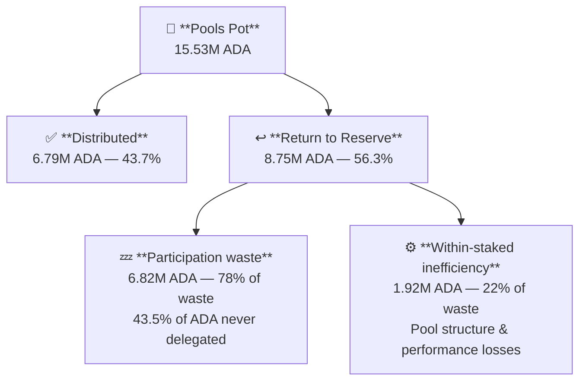
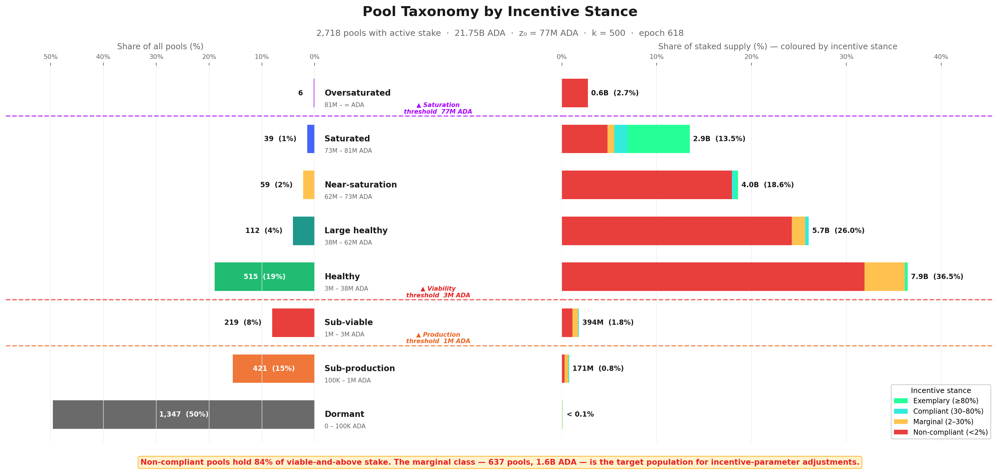
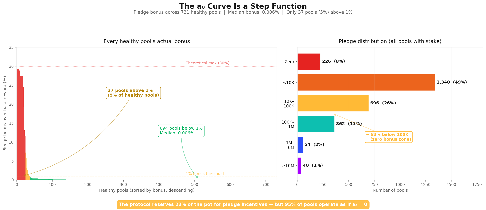
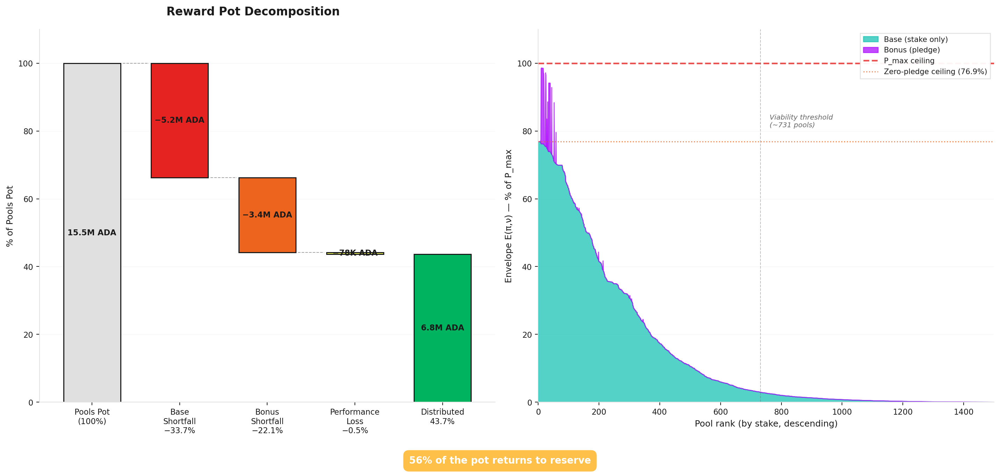
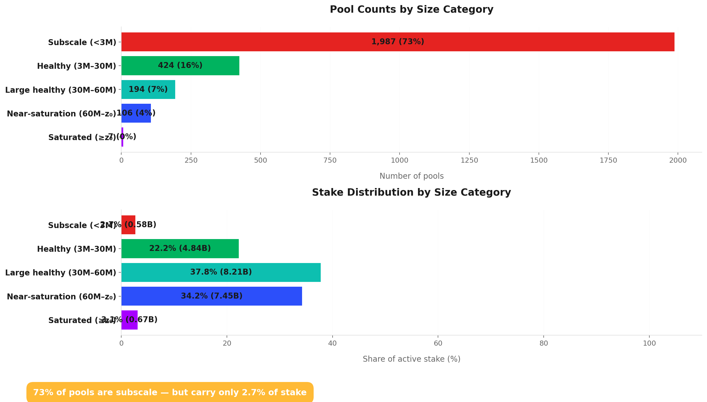
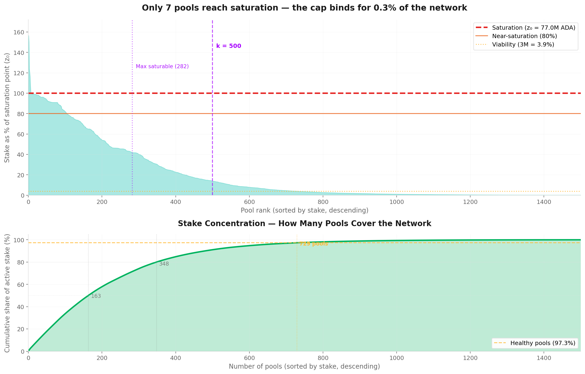

# Pools Distribution — Mainnet Analysis

_Built on 2026/03/18 from mainnet data at epoch `618` plus historical analysis from epoch `208` (Shelley inception)._

## Objective

This report analyses the **pool-level reward distribution** — the second stage of Cardano's reward pipeline.

Every epoch, the pools pot (~15.5M ADA at epoch 616) enters this stage. The reward curve allocates it across pools based on their stake, pledge, and block performance. What is not distributed **returns to the reserve**.

At epoch 616, only **43.7%** of the pools pot reached operators and delegators. This report decomposes that inefficiency, identifies the structural thresholds that shape the pool landscape, and documents the mainnet observations that motivate the CIP proposals under evaluation.

All counts and amounts use the latest available pool snapshot (**epoch 618**) and the latest complete epoch with reward data (**epoch 616**) unless stated otherwise.

## Contents

1. [Mainnet Observations](#1-mainnet-observations)
2. [Distribution efficiency](#2-distribution-efficiency)
   - 2.1 [Waste decomposition](#21-waste-decomposition)
   - 2.2 [Within-staked inefficiency](#22-within-staked-inefficiency)
3. [Pool taxonomy](#3-pool-taxonomy)
   - 3.1 [The case for pool categorization](#31-the-case-for-pool-categorization)
   - 3.2 [Structural thresholds](#32-structural-thresholds)
      - 3.2.1 [Production threshold](#321-production-threshold)
      - 3.2.2 [Viability threshold](#322-viability-threshold)
      - 3.2.3 [Saturation threshold](#323-saturation-threshold)
   - 3.3 [Tier definitions](#33-tier-definitions)
   - 3.4 [Pool distribution by tier](#34-pool-distribution-by-tier)
4. [Entity and MPO concentration](#4-entity-and-mpo-concentration)
   - 4.1 [Archetypes](#41-archetypes)
      - 4.1.1 [Classification](#411-classification)
      - 4.1.2 [Current distribution](#412-current-distribution)
      - 4.1.3 [Historical evolution](#413-historical-evolution)
   - 4.2 [From archetype to incentive stance](#42-from-archetype-to-incentive-stance)
      - 4.2.1 [Exchange Custody (CEX)](#421-exchange-custody-cex)
      - 4.2.2 [Institutional Validator (IVaaS)](#422-institutional-validator-ivaas)
      - 4.2.3 [Incentive stance: reclassifying by pledge-bonus capture](#423-incentive-stance-reclassifying-by-pledge-bonus-capture)
   - 4.3 [Within-staked inefficiency: the cost of non-compliance](#43-within-staked-inefficiency-the-cost-of-non-compliance)
   - 4.4 [MPO pool taxonomy by incentive stance](#44-mpo-pool-taxonomy-by-incentive-stance)
   - 4.5 [Conclusion](#45-conclusion)
5. [Pool taxonomy by incentive stance](#5-pool-taxonomy-by-incentive-stance)
   - 5.1 [Stance recap](#51-stance-recap)
   - 5.2 [The full landscape](#52-the-full-landscape)
   - 5.3 [Distribution by stance (all pools)](#53-distribution-by-stance-all-pools)
6. [Reward formula anatomy](#6-reward-formula-anatomy)
   - 6.1 [The full formula](#61-the-full-formula)
   - 6.2 [Factor 1 — Performance ($\bar{p}$)](#62-factor-1--performance-barp)
   - 6.3 [Factor 2 — The ceiling ($P_{\max}$)](#63-factor-2--the-ceiling-p_max)
   - 6.4 [The playing field](#64-the-playing-field)
      - [Three reward tiers](#three-reward-tiers)
      - [The bonus at every scale](#the-bonus-at-every-scale)
      - [What this means](#what-this-means)
   - 6.5 [Factor 3 — The proportioning envelope ($E$)](#65-factor-3--the-proportioning-envelope-e)
      - 6.5.1 [The base: what size alone buys](#651-the-base-what-size-alone-buys)
      - 6.5.2 [The pledge bonus: what commitment adds](#652-the-pledge-bonus-what-commitment-adds)
      - 6.5.3 [Envelope on mainnet](#653-envelope-on-mainnet)
   - 6.6 [Reward efficiency decomposition](#66-reward-efficiency-decomposition)
      - [The base is distribution-neutral](#the-base-is-distribution-neutral)
      - [The bonus is distribution-sensitive](#the-bonus-is-distribution-sensitive)
      - [Decomposition by formula factor](#decomposition-by-formula-factor)
      - [Where the waste lives](#where-the-waste-lives)
      - [Relationship to §2 waste decomposition](#relationship-to-2-waste-decomposition)
7. [Pool landscape](#7-pool-landscape)
   - 7.1 [Current snapshot](#71-current-snapshot)
   - 7.2 [Reward concentration](#72-reward-concentration)
   - 7.3 [Entity and MPO concentration](#73-entity-and-mpo-concentration)
8. [Protocol parameters](#8-protocol-parameters)
9. [Forward-looking](#9-forward-looking)
10. [Reproduction](#10-reproduction)
   - 10.1 [Full rebuild](#101-full-rebuild)
   - 10.2 [Refreshing MPO data](#102-refreshing-mpo-data)
   - 9.1 [Full rebuild](#91-full-rebuild)
   - 9.2 [Refreshing MPO data](#92-refreshing-mpo-data)

---

## 1. Mainnet Observations

| # | Observation | Section | Status |
| --- | --- | --- | --- |
| | **O1 — The pools pot is distributed at 44% efficiency** | | |
| F1.1 | 8.75M ADA/epoch returns to the reserve undistributed — 56% of the pools pot | §2.1 | Epoch 616 |
| F1.2 | 78% of the waste is caused by inactive stake (upstream) — 16.75B ADA not delegated | §2.1 | Capital constraint |
| F1.3 | The remaining 22% (~1.9M ADA/epoch) is distribution inefficiency within staked ADA | §2.2 | Structural — pool landscape |
| | **O2 — Three structural thresholds stratify the pool landscape** | | |
| F2.1 | Regular block production requires ~3M ADA stake (~3 blocks/epoch) — this is the emergent viability boundary | §3.1 | Structural — not a protocol parameter |
| F2.2 | Below 1.1M ADA, the 340 ADA fixed cost exceeds pool reward — operators are in economic loss | §3.2 | 1,987 below-viability pools affected |
| F2.3 | Below-viability pools collectively owe 647K ADA/epoch in fixed costs but earn only 182K ADA — a 358% overdraw | §3.2 | Fixed cost creates a value-destructive layer |
| F2.4 | Only 8 pools reach the saturation threshold (z₀ = 76.99M ADA) — the cap designed for 500 pools is nearly inactive | §3.3 | 1.6% of design target |
| | **O3 — The pledge bonus is functionally irrelevant** | | |
| F3.1 | At median pledge, the bonus adds ~0.006% to pool rewards — undetectable by delegators | §5.5.3 | Structural — a0 curve too flat |
| F3.2 | Only 37 out of 731 healthy pools (5%) receive a pledge bonus above 1% | §5.5.3 | Dominated by high-pledge institutional pools |
| F3.3 | 83% of pools with stake pledge below 100K ADA — well within the flat zone of the a0 curve | §5.5.3 | Pledge has no meaningful effect below ~1M ADA |
| F3.4 | Yield on pledge capital is 0.68%/yr at best (full saturation) — below passive delegation yield of 2.3%/yr | §5.4 | Economically irrational to pledge |
| F3.5 | 3.4M ADA/epoch (22% of pot) is reserved for pledge bonus but returns to reserve unused | §5.6 | Structural cost of maintaining a0 = 0.3 |
| | **O4 — Saturation is structurally unreachable at current participation** | | |
| F4.1 | Active stake fills only 56.5% of theoretical capacity (k × z₀) — at most 282 pools could saturate | §3.3 | Capital constraint |
| F4.2 | 104 pools sit in the near-saturation zone (≥80% z₀) — a thin cluster, not a broad plateau | §3.3 | Far from the k = 500 design |
| F4.3 | k = 500 is feasible only at near-complete participation (~100% of supply staked) | §3.3 | Design assumption unmet |

### The big picture

The pools pot enters this stage as a budget of ~15.5M ADA. Only **6.8M** reaches operators and delegators. The rest returns to the reserve — not because the mechanism is broken, but because **the pool landscape it was designed for does not exist**.

The design assumed 500 well-funded, pledge-committed pools operating near saturation with near-complete staking participation. Mainnet reality is a stratified market where three structural thresholds create distinct tiers: a **production threshold** (~1M ADA) below which pools barely produce blocks, a **viability threshold** (~3M ADA) below which pools produce blocks regularly but cannot cover their fixed costs, and a **saturation threshold** (77M ADA) that almost nothing reaches. Between viability and saturation sits the actual delegation market — 731 pools carrying 97% of stake.

The pledge bonus, designed to differentiate pools by operator commitment, is irrelevant for 95% of the landscape. The saturation cap, designed to prevent concentration, binds for 8 pools. The distribution inefficiency is real but modest (22% of waste) — the dominant loss is upstream: 43.5% of ADA does not participate.

---

## 2. Distribution efficiency

> **56.3% of the pools pot never reaches operators or delegators.** Of the 15.53M ADA entering this stage at epoch 616, only 6.79M ADA was distributed. The rest returned to the reserve.

### 2.1 Waste decomposition



| Component | ADA/epoch | Share |
| --- | ---: | ---: |
| Pools pot (epoch 616) | 15.53M | — |
| ✅ Distributed to operators & delegators | 6.79M | 43.7% |
| ↩️ **Return to reserve** | **8.75M** | **56.3%** |
| &nbsp;&nbsp;└ Participation waste | 6.82M | 78% of waste |
| &nbsp;&nbsp;└ Within-staked inefficiency | 1.92M | 22% of waste |

**Participation waste** is mechanical and upstream: 43.5% of circulating supply does not delegate, so the reward curve — which is sized for the full supply — distributes proportionally less. This waste passes through this stage transparently and is the same return-to-reserve documented at §1.1 O3.

**Within-staked inefficiency** is the analytically interesting component — the 1.92M ADA lost even among the 21.75B ADA that *does* participate.

### 2.2 Within-staked inefficiency

The **~1.98M ADA/epoch** of within-staked waste has four orthogonal causes, derived from the reward formula $E(\pi, \nu) = \lambda_{\min}\nu + \lambda_{\max}A(\pi, \nu)$.

For each pool, the maximum achievable reward (at full self-pledge $\pi = \nu$, perfect performance, no oversaturation) is $\nu \cdot P_{\max}$. The gap between this maximum and what pools actually earn decomposes as follows.

| Source | Mechanism | ₳/epoch | ₳/year | Share |
| --- | --- | ---: | ---: | ---: |
| 📉 Sub-saturation structural loss | $\lambda_{\max} \sum_i \nu_i(1-\nu_i^2) \cdot P_{\max}$ — the pledge multiplier is structurally suppressed at low $\nu$: even a fully self-pledged pool at 10% saturation captures only 1% of the bonus headroom | **1.09M** | **~79.6M** | **~55%** |
| 🪙 Pledge bonus uncaptured | $\lambda_{\max} \sum_i (\nu_i^3 - A_i) \cdot P_{\max}$ — at each pool's stake level, additional pledge would increase $A(\pi,\nu)$ toward $\nu^3$, but actual mainnet pledge is far below stake | **0.77M** | **~56.2M** | **~39%** |
| 🎯 Performance losses | $\sum_i E_i \cdot (1 - \hat{\eta}_i) \cdot P_{\max}$ — missed blocks reduce reward proportionally. Network-wide $\hat{\eta} = 0.990$ | **78K** | **~5.7M** | **~4%** |
| ✂️ Saturation cap clipping | 7 oversaturated pools have stake above $z_0$; the capped portion earns nothing | **42K** | **~3.1M** | **~2%** |

The sub-saturation and pledge terms are **orthogonal**: they sum exactly to the total E-gap ($\lambda_{\max} \sum_i(\nu_i - A_i) \cdot P_{\max} = 1.86\text{M}$ ADA), with no double-counting.

> [!NOTE]
> **Performance is a minor driver.** With $\hat{\eta} = 0.990$, performance accounts for only ~4% of within-staked waste. The dominant losses are structural — baked into the formula's behaviour at low stake levels — and cannot be resolved by pool operator improvements alone.

> [!NOTE]
> **The dominant loss remains upstream.** Participation waste (~6.8M ADA) dwarfs within-staked inefficiency (~2.0M ADA) by 3.4×. CIPs targeting pool fee structure or reward formula shape address only the ~23% — the ~77% requires increasing staking participation.

> [!WARNING]
> **94% of within-staked inefficiency is structural, not operational.** Sub-saturation loss and uncaptured pledge bonus together account for ~94% of the 1.98M ADA/epoch lost within the staked pool. This is the budget that well-designed incentive reforms can target — and it is the motivation for the scenario evaluations in §6.

---

## 3. Pool taxonomy

### 3.1 The case for pool categorization

The reward curve is continuous — it maps stake to reward without discrete jumps. Yet the pool landscape is not continuous: pools cluster into groups with qualitatively different economic realities, separated by thresholds that emerge from the protocol's own mechanics.

Treating all pools as points on a single spectrum obscures these structural differences. A pool with 50K ADA and one with 50M ADA both participate in the same reward formula, but they inhabit entirely different worlds: one barely produces blocks, the other anchors the delegation market. Applying the same analysis or the same CIP evaluation to both without distinguishing them leads to conclusions that are technically correct and analytically useless.

The taxonomy defined here uses three thresholds derived from protocol parameters and economic constraints — not arbitrary ADA amounts — to partition the pool space into tiers with distinct identities. Each tier has a characteristic behaviour, a characteristic problem (or none), and a characteristic response to parameter changes.

Crucially, these thresholds are **dynamic**. They are functions of active stake, fixed costs, reward rates, and protocol parameters like $k$. When a CIP proposes to change $k$ from 500 to 1000, or when active stake grows from 21B to 35B ADA, the threshold values shift — and so do the tier boundaries. The taxonomy is a framework for reasoning across scenarios, not a snapshot of today's values.

### 3.2 Structural thresholds

Three thresholds emerge from the protocol's mechanics that create qualitatively distinct tiers in the pool landscape.

#### 3.2.1 Production threshold

#### The slot leadership formula

Cardano's Ouroboros Praos assigns block production rights slot by slot. For each of the $L$ slots in an epoch, a pool with relative active stake $\sigma_i$ is elected slot leader with probability:

$$\phi(f, \sigma_i) = 1 - (1-f)^{\sigma_i}$$

where $f$ is the **active slot coefficient** and $\sigma_i = \text{stake}_i / \text{total\_active\_stake}$.

The expected number of blocks for pool $i$ per epoch is:

$$E[\text{blocks}_i] = L \times \phi(f, \sigma_i) = L \times \left(1 - (1-f)^{\sigma_i}\right)$$

For small $\sigma_i$ (all pools below saturation), this is well approximated by the linear form:

$$E[\text{blocks}_i] \approx L \times f \times \sigma_i = \frac{L \times f \times \text{stake}_i}{\text{total\_active\_stake}}$$

#### Current parameters

| Parameter | Symbol | Value | History |
| --- | --- | --- | --- |
| Epoch length | $L$ | 432,000 slots | Protocol constant since Shelley |
| Active slot coefficient | $f$ | 0.05 | Protocol parameter, **never changed** |
| Expected blocks/epoch | $L \times f$ | 21,600 | Consequence of L and f |
| Total active stake (epoch 616) | | 21.57B ADA | Variable — increases with participation |

The threshold for $n$ blocks per epoch follows directly:

$$\text{stake}_{n\text{-blocks}} \approx \frac{n \times \text{total\_active\_stake}}{L \times f}$$

#### What it depends on

The production threshold depends on exactly **three quantities**: epoch length $L$, active slot coefficient $f$, and total active stake. The first two are protocol constants/parameters that have never changed. The third — total active stake — is the only moving part.

This means the production threshold **scales linearly with total active stake**: as more ADA enters staking, every pool needs more stake to produce the same number of blocks. The viability line is not fixed — it rises with participation.

| Total active stake | 1-block threshold | 3-block threshold |
| --- | --- | --- |
| 10B ADA | 0.46M ADA | 1.39M ADA |
| 15B ADA | 0.69M ADA | 2.08M ADA |
| 20B ADA | 0.93M ADA | 2.78M ADA |
| **21.57B ADA** (current) | **0.97M ADA** | **2.92M ADA** |
| 25B ADA | 1.16M ADA | 3.47M ADA |
| 30B ADA | 1.39M ADA | 4.17M ADA |
| 38.49B ADA (full supply) | 1.78M ADA | 5.35M ADA |

If all circulating ADA were staked (full participation), the 3-block threshold would rise to **5.35M ADA** — the viability threshold would shift upward, pushing more pools below viability.

#### Production and variance

Block assignments follow a Bernoulli process across slots. For small $\sigma$, the block count per epoch is approximately **Poisson-distributed** with rate $\lambda = E[\text{blocks}]$. The coefficient of variation is $\text{CV} = 1/\sqrt{\lambda}$.

| Pool stake | E[blocks] | Std dev | CV | Practical meaning |
| --- | --- | --- | --- | --- |
| 100K ADA | 0.10 | 0.32 | 316% | Mostly zero — one block is an event |
| 500K ADA | 0.51 | 0.72 | 139% | One block every ~2 epochs, very noisy |
| **0.97M ADA** | **1.00** | **1.00** | **100%** | **1 block/epoch — Poisson noise dominates** |
| **2.92M ADA** | **3.00** | **1.73** | **58%** | **Regular production begins** |
| 10M ADA | 10.27 | 3.20 | 31% | Stable reward stream |
| 30M ADA | 30.81 | 5.55 | 18% | Reliable production |
| 77M ADA (z₀) | 79.09 | 8.89 | 11% | Near-deterministic |

At **1 block/epoch**, the CV is 100% — the reward is as variable as its own mean. An epoch with 0 blocks is just as likely as one with 2. A delegator observing such a pool sees wild oscillations between zero and double the expected reward.

At **3 blocks/epoch**, the CV drops to 58% — still volatile, but the pool produces blocks in the overwhelming majority of epochs. This is the threshold where a delegator can observe *consistent* performance. It coincides almost exactly with the **3M ADA viability line** identified in the prior report (Lopez de Lara, 2025/11) — not because 3M was chosen arbitrarily, but because regular block production is the minimum condition for a pool to demonstrate reliability.

#### Current landscape

| Threshold | Pools above | Active stake covered |
| --- | --- | --- |
| ≥1 block/epoch (0.97M ADA) | 946 | 99.1% |
| ≥3 blocks/epoch (2.92M ADA) | 729 | 97.3% |
| ≥10 blocks/epoch (10.1M ADA) | 511 | 91.6% |

The production threshold creates a natural cliff: pools below it produce too few blocks for delegators to assess reliability, and their reward variance is too high to sustain consistent yields.

#### 3.2.2 Viability threshold

Block production is necessary but not sufficient. A pool must also cover its operating costs — at minimum, the protocol-enforced **fixed cost** floor.

The reward per ADA staked per epoch is approximately **0.000312 ADA** (annualized: ~2.28%). For a pool with fixed cost of 340 ADA (the dominant setting at 66.3% of pools):

$$\text{Break-even stake} = \frac{\text{Fixed cost}}{\text{Reward per ADA}} = \frac{340}{0.000312} \approx 1.09\text{M ADA}$$

For 170 ADA fixed cost (17.3% of pools): break-even is ~0.54M ADA.

Below break-even, the pool's entire reward — and then some — is consumed by the fixed cost. The delegator receives nothing; the operator extracts more than the pool earns.

**The below-viability problem is severe:**

| Metric | Below viability (<3M) | Healthy (≥3M) |
| --- | --- | --- |
| Pools | 1,987 | 731 |
| Estimated group reward | 182K ADA/epoch | 6.61M ADA/epoch |
| Total fixed costs | 647K ADA/epoch | 1.56M ADA/epoch |
| Average pool reward | 91 ADA/epoch | 9,040 ADA/epoch |
| Fixed cost as % of avg reward | **372%** | 3.8% |
| Operator take | **358%** of group reward | 41.7% |

Below-viability pools collectively owe **647K ADA/epoch** in fixed costs but earn only **182K ADA**. The fixed cost exceeds pool reward by a factor of 3.6×. In aggregate, these pools destroy value: their delegators receive negative net reward (the fixed cost is deducted before any distribution).

This is not a marginal effect. The 1,987 below-viability pools represent 73% of all pools with stake. They exist — and attract delegators — despite being economically irrational for both parties. The persistence of this layer suggests delegators either do not understand the fee mechanics, are staking for non-economic reasons (governance, ideology, wallet defaults), or face friction in redelegating.

#### 3.2.3 Saturation threshold

The saturation point $z_0 = \text{Supply}/k = 76.99\text{M ADA}$ was designed as the central equilibrium mechanism: once a pool reaches z₀, the per-ADA reward for its delegators drops, pushing stake toward smaller pools until all k = 500 pools are equally sized.

| Metric | Value |
| --- | --- |
| Saturation point (z₀) | **76.99M ADA** |
| Theoretical capacity (k × z₀) | **38.49B ADA** |
| Active stake | **21.75B ADA** |
| Capacity utilisation | **56.5%** |
| Max pools that could saturate | **282** |
| Pools at ≥80% saturation | 104 |
| Pools at or above saturation | **8** |
| Design target | **500** |

The saturation cap is nearly inactive. It binds for 8 pools — 1.6% of the design target. The reason is arithmetic: with 21.75B ADA delegated and z₀ at 77M, the system can support at most 282 saturated pools even under perfect redistribution. The k = 500 target implicitly required near-complete participation (~100% of supply). Actual participation at 56.5% makes the target structurally unreachable.

The near-saturation zone (≥80% of z₀) contains 104 pools — a thin cluster rather than the broad plateau the design envisioned. The bulk of the healthy pool landscape sits between 3M and 60M ADA — far below saturation.

### 3.3 Tier definitions

The three thresholds partition the pool space into nine tiers. Each tier is defined by its bounding thresholds, its characteristic block production behaviour, and its economic status.

| Tier | Range (mainnet, epoch 616) | Defining threshold | Block production | Economic status |
| --- | --- | --- | --- | --- |
| **Zero-stake** | 0 ADA | — | None | Not operational |
| **Dormant** | >0 → ~100K ADA | — | < 0.1 blocks/epoch — effectively zero | Registered but inactive |
| **Sub-production** | ~100K → ~1M ADA | Production threshold (lower) | Sporadic — high variance, unreliable | Below break-even; extreme fixed-cost burden |
| **Sub-viable** | ~1M → ~3M ADA | Production threshold (upper) / Viability threshold | Regular but insufficient to cover fixed costs | Economically loss-making for delegators |
| **Healthy** | ~3M → ~38.5M ADA (50% sat) | Viability threshold | Consistent block production | Viable — covers costs, rewards delegators |
| **Large healthy** | ~38.5M → ~61.6M ADA (80% sat) | — | High, stable | Well-capitalised, efficient |
| **Near-saturation** | ~61.6M → ~73.1M ADA (95% sat) | Saturation threshold (approach) | Near-optimal | Close to maximum reward density |
| **Saturated** | ~73.1M → ~80.8M ADA (105% sat) | Saturation threshold | Optimal | Maximum reward; cap binding |
| **Oversaturated** | > ~80.8M ADA | Saturation threshold (exceeded) | Capped | Delegators penalised; stake should migrate |

#### Threshold values are dynamic

The boundary values above are computed from current mainnet conditions (epoch 616, 21.57B ADA active stake). They shift with three inputs:

| Threshold | Depends on | Direction with more participation | Direction with higher $k$ |
| --- | --- | --- | --- |
| Production | Active stake, $L$, $f$ | Rises — pools need more stake to reach same block count | Unchanged |
| Viability | Fixed cost, reward rate per ADA | Rises if rewards per ADA fall (e.g. as reserves deplete) | Unchanged |
| Saturation | Circulating supply, $k$ | Unchanged | Falls — each pool's cap shrinks |

When evaluating a scenario such as $k = 1000$, the saturation threshold halves to ~38.5M ADA — immediately reclassifying every current "large healthy" pool as near-saturation or saturated. The production and viability thresholds are unaffected by $k$ alone. This asymmetry is analytically important: CIPs targeting $k$ reshape the upper tail; CIPs targeting fees or block production reshape the lower tail.

---

### 3.4 Pool distribution by tier

The three thresholds produce a sharply asymmetric distribution: the vast majority of pools cluster at the bottom of the stake scale, while the overwhelming majority of delegated ADA concentrates in the upper tiers.


The inversion is stark: **1,987 pools (73%) sit below the Viability threshold — yet collectively hold only 2.7% of active stake.** The top four tiers (Healthy and above) account for 27% of pools but 96.6% of stake. This structural gap between pool count and stake share is the defining feature of the current landscape and the primary motivation for the CIP proposals evaluated in §6.

---

## 4. Entity and MPO concentration

A significant fraction of the landscape is operated by **Multi-Pool Operators (MPOs)** — entities running two or more registered pools under a shared identity. The attributed entity set covers **451 registered pools across 26 entities**, representing **28.92%** of circulating supply by stake and **51.15% of participating stake** (on a ≥2 pools basis).

### 4.1 Archetypes

The 26 attributed entities do not form a homogeneous group. Their motivations, delegation sources, and relationship to the protocol's incentive design differ fundamentally. Five archetypes emerge, anchored on two axes: **delegation sovereignty** (who controls the delegating ADA and made the staking decision) and **incentive alignment** (can the entity respond to the pledge and saturation signals the protocol sends?).

#### 4.1.1 Classification

| Archetype | Code | Delegation source | Self-pledge | Incentive alignment |
| --- | --- | --- | --- | --- |
| Exchange Custody | `cex` | Retail balances custodied by a centralised exchange | Structurally zero | None |
| Institutional Validator | `ivaas` | Institutional clients delegating via a staking-as-a-service provider | Near-zero | Partial |
| Ecosystem Steward | `ecosystem` | Foundation or protocol developer self-stake | High | Mission-driven |
| Platform / Wallet | `platform` | Wallet users; staking mediated by platform UX | Variable | Partial |
| Independent MPO | `independent_mpo` | Sovereign ADA holders choosing the operator directly | Meaningful | Full |

A sixth class, `opaque`, covers entities whose attribution and behavioral type cannot be resolved from public on-chain data. The canonical classification is in `data/mpo_entity_archetypes.csv` and includes an `exclude_from_baseline` flag for pledge-coverage, efficiency, and concentration analyses.

**Snapshot by archetype (epoch 618):**

| Archetype | Entities | Act. pools | Stake (B ₳) | % supply | Near-sat | Avg margin | Med. pledge |
| --- | ---: | ---: | ---: | ---: | ---: | ---: | ---: |
| Exchange Custody (CEX) | 6 | 163 | 4.77 | 12.40% | 26 | 50.7% | ≈ 0 |
| Institutional Validator (IVaaS) | 5 | 87 | 2.62 | 6.81% | 15 | 4.8% | ≈ 0 |
| Ecosystem Steward | 3 | 26 | 0.74 | 1.92% | 7 | 53.6% | ~64M ₳ |
| Platform / Wallet | 2 | 21 | 0.47 | 1.22% | 2 | 51.5% | ~36M ₳ |
| Independent MPO | 9 | 89 | 1.70 | 4.42% | 11 | 7.0% | ~10K ₳ |
| Opaque / Unresolved | 1 | 15 | 0.83 | 2.17% | 10 | 94.0% | ~73M ₳ |

CEX and IVaaS together hold **~19.2% of circulating supply** across 250 active pools with near-zero median pledge. The nine independent MPOs collectively manage 4.42% with a pledge-to-stake ratio orders of magnitude higher. High average margins in the Ecosystem Steward and Platform/Wallet groups reflect mission-driven or self-sovereign configurations — 100% margin pools run by CF, IOG, and Upbit for their own stake — not a competitive pricing signal. The two archetypes that sit structurally outside the incentive design are detailed in §4.2.

#### 4.1.2 Current distribution


Entities with ≥0.01% of circulating supply, grouped and colour-coded by archetype. Bars show share of circulating supply at epoch 618; right-side labels show archetype totals.

> The attributed set holds **84.61% of all declared pledge** — dominated by a handful of high-pledge entities (Cardano Foundation, CHUCK BUX, Adalite cluster) rather than broad pledge discipline. When CEX entities are excluded the picture shifts significantly toward the ecosystem stewards.

Per-entity descriptions including historical trajectory and pledge-coverage ratios are in the annex: **[docs/mpo_entity_profiles.md](docs/mpo_entity_profiles.md)**.

#### 4.1.3 Historical evolution

The attributed entity share of circulating supply has been structurally stable across three years of Shelley operation, despite significant internal rotation.


This cohort currently covers **451 pools** across **26 entities**, representing **11.176B ₳** of active stake (51.15% of participating stake, 29.03% of circulating supply) and **3.635B ₳** of declared pledge (84.61% of all registered pledge). The archetype-level stability masks significant entity-level rotation, visible in the per-entity breakdown below.


The entity-level view reveals the dynamics hidden behind the stable aggregate: Binance has retreated from 7.4% (epoch 400) to 1.8% while Coinbase/bison.run held steady; Figment emerged from zero to 2.1% since epoch 584; CHUCK BUX appeared abruptly between epochs 410 and 584. The CEX share as a whole has remained at roughly 12–13% of supply throughout — the entities rotate but the total volume of shadow-custody stake persists.

### 4.2 From archetype to incentive stance

The archetype taxonomy (§4.1.1) answers *who is operating*: an exchange, a staking provider, a community pool family. But for assessing the effectiveness of incentive-parameter adjustments, the more useful question is *how does this entity behave relative to the mechanism's assumptions?*

Examining the pledge-coverage metrics across all 26 attributed entities reveals a pattern that cuts across archetype boundaries. Two archetypes — Exchange Custody and Institutional Validator — sit clearly outside the incentive design, but they are not alone. Several independent MPOs, an ecosystem steward (Emurgo), and a platform operator (NuFi) also operate at near-zero effective pledge, forfeiting the pledge bonus entirely. The distinction between archetype and incentive behaviour matters because **any proposed parameter adjustment — to $a_0$, $k$, or the pledge-benefit function — will only affect entities that currently capture a non-trivial share of the bonus**. Entities that already forfeit it are structurally insensitive to marginal changes.

This section details the two most clear-cut archetypes outside the design (§4.2.1–4.2.2), then introduces a behavioural reclassification — *incentive stance* — that replaces the identity-based lens with a pledge-bonus-capture lens (§4.2.3).

#### 4.2.1 Exchange Custody (CEX)

The `cex` archetype is the most consequential deviation from the protocol's assumptions. Cardano's incentive mechanism was designed around a principal–agent relationship: an ADA holder (principal) freely delegates to a stake pool operator (agent) whose competitiveness is disciplined by pledge, margin, and saturation pressure. Exchange-custody staking breaks this relationship at every level.

**Why CEX entities cannot respond to protocol incentives:**

**1. Delegation is not a choice by the ADA owner.** Exchange users hold a claim on the exchange's balance sheet, not self-sovereign ADA. The exchange decides which pools to run and how to configure them. The individual "staker" has no visibility into pool parameters and cannot redirect their stake.

**2. Pledge is structurally impossible.** The pledge incentive ($\lambda_{\max} \times A(\pi, \nu)$) rewards pools whose operators commit their own capital. An exchange cannot legally pledge custodied user funds as the operator's own — doing so would commingle customer assets. CEX pools therefore always operate at pledge ≈ 0 and never capture the pledge premium. This is not negligence; it is structural.

**3. Saturation pressure is absorbed, not transmitted.** When a CEX pool approaches z₀, the exchange creates a new pool and silently redistributes internal delegation. The saturation mechanism that was designed to push delegation toward smaller operators never fires — the CEX absorbs it internally.

**4. Revenue model is orthogonal to pool quality.** CEX staking revenue = protocol reward − user payout. The exchange optimises to maximise total reward across its fleet (more pools near z₀) rather than to maximise per-pool quality. Delegators cannot penalise poor pledge because they have no visibility into pool configuration.

**Entity profiles:**

The six CEX entities split into two distinct reward models that illustrate the same structural problem from opposite directions.

_Pass-through model_ (Coinbase, Binance, YUTA, StakeBowl) — pools are set at a low nominal on-chain margin (4–13%), passing most protocol rewards to the user while the exchange earns on custody, trading spread, and service products. The low margin creates the appearance of a competitive pool, but because users cannot identify or switch individual pools, the margin is decorative.

- **Coinbase / bison.run** is the largest single entity in the attributed set at 2.45B ₳ (6.4% of supply) across 47 active pools, 23 of which sit at near-saturation. It operates entirely behind deliberate infrastructure obfuscation: bison.run and herd.run subdomains, hashed metadata, randomised tickers — no first-party Coinbase branding is visible on-chain. Pool creation tracks exchange ADA inflows directly; the 23 near-saturation pools represent the maximum-reward configuration, not a response to delegation demand from external stakers.

- **Binance** registered 114 pools at peak and has since reduced to 50 active. The retreat from 7.4% (epoch 400) to 1.8% (epoch 618) is the steepest in the attributed set and tracks Binance's restructuring of its Earn product, not organic delegation outflow. The 64 dormant pools are a ghost fleet — pre-registered capacity that was never retired after the product scale-back.

- **YUTA** is a multi-brand cluster (coinzzz.jp, tokyostaker.com, katanapool.com, popool.net) aggregated by Koios and BalanceAnalytics under a single operator identity. 25 active pools, gradual decline from 2.0% to 1.2% since epoch 400. The multi-brand structure amplifies the attribution ambiguity inherent to CEX clusters.

- **StakeBowl** (neoply.io) operates 9 pools at 80.7% average margin — the highest within the pass-through group, approaching the full-internalisation model. Recent doubling from 0.18% to 0.36% between epochs 584 and 618 is unexplained.

_Full-internalisation model_ (Upbit, eToro) — pools set 100% on-chain margin, retaining all protocol rewards. The exchange pays users a separate fixed APY from its own treasury. The protocol reward signal is entirely decoupled from the user experience: users earn a yield determined by the exchange's product team, not by pool configuration.

- **Upbit** (Dunamu, South Korea) is the fastest-growing CEX entity: from near-zero at epoch 400 to 1.43% at epoch 618, entirely driven by exchange deposit growth. All 20 pools carry UPBIT tickers and point to staking-static.upbit.com metadata — the most transparent branding of any CEX entity. The 100% margin is not hidden.

- **eToro** has halved its active pool count from 24 to 12 since registration, signalling a partial wind-down of the Cardano staking product. Despite holding 1.23% of supply, 12 pools are dormant — the product is contracting while the stake persists.

#### 4.2.2 Institutional Validator (IVaaS)

IVaaS entities serve institutional clients — asset managers, custodians, exchanges, and wallets — via a staking-as-a-service product. Delegation is at the discretion of the client institution, not a sovereign retail choice. Unlike CEX, the underlying ADA holders could in principle choose another provider; in practice, switching costs and contractual arrangements create similar lock-in.

IVaaS entities could in principle pledge operator equity. The obstacle is scale: to shift the pledge premium $\lambda_{\max} \times (A_{\max} - A_i)$ by a meaningful amount at 500–800M ₳ of managed stake would require self-pledging hundreds of millions of ADA — an unrealistic ask for a staking-infrastructure company whose equity base is a fraction of the ADA it manages. The `cex` and `ivaas` archetypes therefore both suppress the protocol's pledge signal, but IVaaS does so by economic necessity, not by legal constraint.

**Entity profiles:**

- **Figment** is the most striking recent entrant in the full attributed set: non-existent before epoch 584, now at 2.07% with 36 active pools. It operates as the back-end staking provider for Ledger Live, meaning its apparent growth is driven by Ledger hardware wallet adoption rather than direct institutional sales. All metadata is hosted on pcpm.s3.amazonaws.com (no first-party Figment branding on-chain); Koios surfaces the cluster under the FIGMENT label. With 17 pools currently below the viability threshold, capacity was pre-registered ahead of demand.

- **Kiln** serves enterprises and major wallets and is the only IVaaS entity with explicit first-party on-chain branding (KILN0–KILN4 tickers, kiln.fi metadata). Its pools also appear under the ADALITE Koios label due to a legacy surface-level grouping shared with NuFi. All 11 pools are active; 6 sit at near-saturation — the most efficiently deployed fleet among IVaaS entities. Steady growth from 0.66% to 1.82% across the full measurement window, with the strongest acceleration between epochs 410 and 584.

- **Blockdaemon** combines node infrastructure, staking, and MPC vault products for enterprise clients. cardano.blockdaemon.com metadata and BD\* tickers provide clear first-party signals. 15 pools, broadly stable at 1.3–1.5% across all epochs — the flattest institutional trajectory, consistent with a mature, diversified enterprise client base rather than concentrated wallet inflows.

- **Everstake** markets Validator-as-a-Service and wallet/yield SDKs; its EVRST/EVERS/ESTK tickers and everstake.one metadata are unambiguous. 15 active pools, with the most stable share of any IVaaS entity: 1.41% → 1.43% → 1.20% → 1.47% across four epochs. The small dip at epoch 584 reversed fully, suggesting a single client rebalancing event rather than structural outflow. At 2.9% average margin, it operates the lowest-margin fleet in the IVaaS group.

- **RockX** is an Asian institutional validator with near-zero active stake across all measurement periods. Its pledge (≈1M ₳) currently exceeds its managed delegation — pools are registered and maintained but have not attracted meaningful institutional mandates on Cardano.

**Pledge suppression — CEX and IVaaS entities with <10K ₳ median pledge and ≥5 active pools (epoch 618):**

| Entity | Archetype | Pools (act) | Stake (B ₳) | Near-sat | Med. pledge | Margin | Why pledge ≈ 0 |
| --- | --- | ---: | ---: | ---: | ---: | ---: | --- |
| Coinbase / bison.run | CEX | 47 | 2.451 | 23 | 0 | 4.6% | Cannot pledge custodied funds (legal) |
| Binance | CEX | 50 | 0.691 | 1 | 2 ₳ | 6.1% | Cannot pledge custodied funds (legal) |
| Figment | IVaaS | 36 | 0.788 | 4 | 0 | 8.4% | Scale makes pledge premium uneconomic |
| Kiln | IVaaS | 11 | 0.687 | 6 | 100 ₳ | 5.0% | Scale makes pledge premium uneconomic |
| Everstake | IVaaS | 15 | 0.567 | 1 | 1K ₳ | 2.9% | Scale makes pledge premium uneconomic |
| Blockdaemon | IVaaS | 15 | 0.561 | 4 | 200 ₳ | 5.7% | Scale makes pledge premium uneconomic |
| Upbit | CEX | 20 | 0.551 | 0 | 200K ₳ | 100% | Cannot pledge custodied funds (legal) |
| eToro | CEX | 12 | 0.472 | 0 | 0 | 100% | Cannot pledge custodied funds (legal) |
| YUTA | CEX | 25 | 0.465 | 0 | 50K ₳ | 12.6% | Custodial/platform staking |
| StakeBowl | CEX | 9 | 0.140 | 2 | 0 | 80.7% | Custodial/platform staking |

**CEX-adjusted baseline.** When CEX entities are excluded, the attributed set covers **~6.41B ₳ across 20 entities** (16.6% of circulating supply, 29.3% of participating stake). Analyses of pledge coverage, reward efficiency, and concentration risk are materially cleaner against this baseline because it removes structurally pledge-zero, non-sovereign stake from the denominator. The `exclude_from_baseline: true` flag in `data/mpo_entity_archetypes.csv` identifies which entities to drop.

#### 4.2.3 Incentive stance: reclassifying by pledge-bonus capture

The archetype analysis above shows that CEX and IVaaS entities cannot or do not pledge — but it frames the problem as confined to two categories. The pool-level pledge data tells a different story.

**The pledge bonus is linear.** For a saturated pool ($\sigma' = z_0$), the bonus captured scales exactly as $s'/z_0$ — at 1% effective pledge ratio, 1% of the bonus is captured; at 30%, 30%. For a half-saturated pool the relationship is mildly super-linear (30% pledge captures ~51% of that pool's maximum bonus), but the qualitative picture is the same: very low pledge means very low capture, and the reward foregone returns to the reserve as *within-stake inefficiency*.

This linearity creates a natural classification based on how much of the pledge bonus an entity actually captures. We define four **incentive stances** based on the effective pledge ratio ($= \min(\text{declared\_pledge}, \text{active\_stake}) / \text{active\_stake}$, aggregated across all active pools of the entity):

| Stance | Effective pledge ratio | Bonus captured (saturated) | Bonus captured (half-sat) | Interpretation |
| --- | --- | --- | --- | --- |
| **Exemplary** | ≥ 80% | ≥ 80% | ≥ 90% | Captures the vast majority of the bonus. 80/20 principle: the last 20% of pledge captures diminishing marginal returns. |
| **Compliant** | 30–80% | 30–80% | 51–90% | Captures a significant share. Sensitive to parameter changes. |
| **Marginal** | 2–30% | 2–30% | 4–51% | Partial capture. Primary target population for incentive adjustments. |
| **Non-compliant** | < 2% | < 2% | < 4% | Forfeits the bonus entirely. Structurally insensitive to any marginal change to $a_0$ or the pledge function. |

The 2% lower threshold reflects the point below which the bonus captured is indistinguishable from noise (< 2% of the available premium). The 30% threshold is the *median capture point* for half-saturated pools: below 30% pledge, the entity wastes more than half of the bonus available to it. The 80% threshold follows the Pareto principle — at 80% pledge, an entity captures the vast majority of the available bonus; the remaining 20% of pledge effort yields diminishing marginal returns.

**Applied to the 26 attributed MPO entities (epoch 618):**

| Stance | Entities | Stake (B ₳) | % supply | Composition |
| --- | --- | --- | --- | --- |
| **Non-compliant** | 19 | 8.70 | 22.6% | All 6 CEX, all 5 IVaaS, Emurgo (ecosystem), NuFi (platform), and 5 independent MPOs (1PCT, AdaOcean, P2P, Spire, AutoStake) |
| **Marginal** | 0 | — | — | Empty at MPO entity level (gap between 1.3% and 33.6%) |
| **Compliant** | 5 | 1.69 | 4.4% | Bloom (33.6%), Wave (35.5%), IOG (38.5%), RAID (56.5%), CHUCK BUX (79.8%) |
| **Exemplary** | 2 | 0.61 | 1.6% | CF (85.9%), Adalite (93.2%) |

The critical finding: **19 of 26 entities — 73% — are non-compliant**, and this group is not coextensive with CEX + IVaaS. Five independent MPOs (1PCT, AdaOcean, P2P, Spire, AutoStake) operate at < 2% effective pledge despite having no legal or structural barrier to pledging. Emurgo, a founding ecosystem steward, operates at 0.01% effective pledge. These entities forfeit ~23% of their maximum possible reward ($1/(1+a_0) \approx 0.769$) — they have *chosen* not to play the pledge game, and no marginal adjustment to $a_0$ will change this calculus because the pledge bonus they currently capture is effectively zero.

The marginal class is empty at MPO entity level, reflecting a bimodal distribution: MPO operators either ignore the pledge signal entirely (< 2%) or commit substantially (> 30%). This gap is expected to fill when the classification is extended to all ~3,000 active pools, where individual SPOs show much more granular pledge-to-stake ratios.

The five compliant entities — representing 4.4% of supply — are the population where parameter adjustments most directly bite. Wave and Bloom exemplify the compliant independent operator: meaningful pledge (34–36% of stake), competitive margin, sovereign delegators. CHUCK BUX (79.8%) sits just below the exemplary threshold. The two exemplary entities (CF, Adalite) at 1.6% of supply are effectively self-staked — they already capture ≥80% of the bonus and would be the least affected by marginal changes.

> [!NOTE]
> **Implication for mechanism-design work.** Any proposed change to $a_0$, $k$, or the pledge-benefit curve should be evaluated against its effect on the *compliant* population (~4.4% of supply), not against the full MPO set or the full pool set. The non-compliant population (22.6% of supply) is a fixed point — it will not respond. The exemplary population (1.6%) already captures most of the bonus and will be marginally affected. The within-stake inefficiency generated by non-compliant entities (~30% of forgone pledge bonus across ~8.7B ₳) is a structural feature of the current ecosystem, not a parameter to be optimised away by small adjustments.


The figure decomposes the same attributed stake two ways: top bar by archetype (identity), bottom bar by incentive stance (behaviour). The dominance of the non-compliant segment is immediately visible — nearly 80% of the attributed MPO stake forfeits the pledge bonus entirely.

### 4.3 Within-staked inefficiency: the cost of non-compliance

§2.2 established that the network-wide pledge bonus uncaptured is **~770K ADA/epoch (~56.2M/year)** — the second-largest component of within-staked waste at 39% of the total. The incentive-stance classification allows us to attribute this waste to its sources.

For each MPO pool, we compute three reward levels under the current formula $\hat{f}'(\pi, \nu, \bar{p})$:

- **Actual reward**: using the pool's current effective pledge ($\min(\text{declared}, \text{active\_stake})$)
- **Maximum reward**: assuming full self-pledge ($\pi = \nu$) at the pool's current stake level
- **Lost reward**: the difference — ADA that returns to the reserve instead of being distributed

**MPO entities — reward loss by incentive stance (epoch 618):**

| Stance | Entities | Stake (B ₳) | Lost (₳/epoch) | Lost (₳/year) | Share of MPO loss |
| --- | ---: | ---: | ---: | ---: | ---: |
| **Non-compliant** | 19 | 8.84 | 178,359 | 13,020,199 | **92.1%** |
| **Compliant** | 5 | 1.68 | 12,452 | 908,984 | 6.4% |
| **Exemplary** | 2 | 0.61 | 2,926 | 213,621 | 1.5% |
| **Total MPO** | **26** | **11.13** | **193,737** | **14,142,803** | 100% |

The 26 attributed MPO entities account for **193,737 ADA/epoch** of pledge-bonus waste — **25.2% of the network-wide total** (~770K). The remaining ~75% is distributed across the ~2,700 other active pools (mostly individual SPOs with low pledge-to-stake ratios at small scale).

The critical number: **92.1% of MPO-attributable waste comes from the non-compliant population**. These 19 entities — holding 8.84B ADA of active stake (40.6% of staked supply) — collectively forfeit ~178K ADA/epoch (~13M/year) in pledge bonus. This is reward that the protocol *would* distribute if these entities pledged their stake, but which instead returns to the reserve.

**Top five contributors to MPO pledge waste:**

| Entity | Stance | Stake (B ₳) | Lost (₳/epoch) | Lost (₳/year) | % of max reward lost |
| --- | --- | ---: | ---: | ---: | ---: |
| Coinbase / bison.run | Non-compliant | 2.45 | 68,028 | 4,966,071 | 17.2% |
| Kiln | Non-compliant | 0.69 | 21,777 | 1,589,695 | 20.3% |
| Figment | Non-compliant | 0.79 | 16,941 | 1,236,702 | 14.3% |
| Blockdaemon | Non-compliant | 0.58 | 14,921 | 1,089,234 | 16.0% |
| Everstake | Non-compliant | 0.57 | 9,854 | 719,324 | 11.4% |

Coinbase alone accounts for **35% of all MPO pledge waste** (68K/epoch). The top five — all non-compliant — account for 68% of the total. These are large-scale entities where the absolute ADA forfeited is substantial, but as a percentage of their maximum reward it ranges from 11–20% — the "cost of not pledging" is a modest tax on reward, not a punitive penalty. This is precisely why they remain non-compliant: the current $a_0 = 0.3$ makes the pledge bonus a nice-to-have, not a must-have.

> [!NOTE]
> **Connection to §2.2.** The 193,737 ADA/epoch of MPO pledge waste is a subset of the 770K network-wide "pledge bonus uncaptured" identified in §2.2. The MPO entities — despite being only 26 entities out of ~2,700 with stake — contribute 25% of this waste because they concentrate large stake volumes at near-zero pledge ratios. The remaining 75% is distributed across thousands of smaller pools where low absolute pledge is more a function of operator capital constraints than of strategic indifference.
>
> **Why this matters for mechanism design.** If a parameter change (e.g., increasing $a_0$) aims to reduce within-staked inefficiency, its impact on the 19 non-compliant MPOs would be *to increase the penalty they already ignore*. The waste would grow in absolute terms, but the entities would not change behaviour — they *cannot* pledge (CEX/IVaaS) or *choose* not to (independent MPOs). The reform would effectively transfer more ADA from these entities to the reserve, which may or may not be the intended outcome.

### 4.4 MPO pool taxonomy by incentive stance

Crossing the incentive-stance classification with the pool-size taxonomy (§3) reveals where MPO pledge compliance sits in the stake landscape.


The entity-level breakdown below shows exactly who sits where — each sub-bar is one entity's pools within a tier+stance group:


A third view isolates the aggregate non-compliant entities and recolours the bars by **pool-size tier** rather than by stance. The left panel shows fleet composition; the right panel shows where the stake actually sits:


This filtered view makes the internal shape of the non-compliant population much easier to read. It is **not concentrated in a single size bucket**: across the 19 non-compliant entities, live stake is split between **Healthy (2.85B ADA)**, **Large healthy (2.51B)**, and **Near-saturation (2.40B)**, with another **1.05B ADA** already sitting in Saturated or Oversaturated pools. In other words, non-compliance persists all the way from mid-scale fleets to pools already operating at or above $z_0$.

The entity profiles are distinct. **Coinbase / bison.run** is the clearest near-saturation fleet: 22 of its 44 live pools sit in Near-saturation, carrying most of its 2.45B ADA. **Upbit** and **YUTA** are almost pure Healthy-tier operators, while **Binance** is visibly bimodal — a healthy core plus a long Dormant/Sub-production tail. **Kiln**, **Blockdaemon**, **eToro**, and **Everstake** skew upward into Large healthy, Saturated, or Oversaturated tiers, showing that the pledge signal is still ignored even once pools are already at scale.

The 396 live MPO pools carry 11.08B ADA (51.0% of staked supply) across the full tier spectrum. The stance decomposition shows:

**Non-compliant red dominates every viable-and-above tier.** From Healthy through Oversaturated, non-compliant MPO pools account for 81% of MPO viable stake. The pattern holds across all size classes — it is not concentrated in a single tier.

**Exemplary green appears only in Saturated and Near-saturation.** These are the self-staked CF and Adalite pools operating at or near z₀. Exemplary compliance at scale requires large capital commitment — at z₀ = 77M ADA, an exemplary pool needs ≥62M ADA of self-pledge.

**Compliant pools (teal) are visible in Near-saturation and Healthy.** Wave, Bloom, and CHUCK BUX pools appear here — operators who pledge 30–80% of their pool stake, capturing significant bonus.

**The marginal class is nearly empty among MPOs.** Unlike the all-pool analysis (§5), where 637 pools sit in the marginal band, MPO entities almost never land between 2% and 30% pledge. This confirms the bimodal behaviour observed in §4.2.3: MPO operators either fully ignore the pledge signal or commit substantially.

### 4.5 Conclusion

The MPO landscape reveals a striking and somewhat counterintuitive outcome.
A significant subset of MPOs possess sufficient capital to fully optimize their position within the Reward Sharing Scheme, notably by saturating additional pools and leveraging pledge to capture increased rewards. However, empirical observations show that many of them deliberately do not pursue this strategy to its theoretical optimum.

This behavior implies a measurable opportunity cost.
By not fully saturating their pool portfolio or not optimizing pledge allocation, these operators forgo an estimated X ADA per epoch, corresponding to approximately X ADA annually across the observed population.

This is not an anomaly, nor is it irrational.

Instead, it is a clear manifestation of multi-game optimization: these actors are not solely maximizing within the RSS framework, but are instead optimizing across a broader strategic landscape that includes branding, reputation, delegation stickiness, operational complexity, governance positioning, and potentially external revenue streams. As introduced in previous sections, the RSS must therefore be understood as a sub-game embedded within a larger system of incentives.

The implication is critical:

A substantial portion of the network, approximately 40% of MPOs, can be classified as non-compliant with the pure RSS equilibrium assumptions.

This is not a marginal effect. It fundamentally challenges the predictive power of models that assume single-game rationality.

In the next section, “Pool Landscape without Non-Compliant MPOs”, we isolate and analyze the subset of actors that behave in closer alignment with RSS incentives. This allows us to better understand the underlying equilibrium dynamics of the system when abstracting away from cross-game interference.

---

## 5. Pool taxonomy by incentive stance

§3 classified pools by *size* — where they sit relative to the production, viability, and saturation thresholds. §4 introduced *incentive stance* — whether an entity captures the pledge bonus (compliant/exemplary) or forfeits it (non-compliant). This section overlays the two dimensions to answer: **where in the pool landscape does pledge-bonus compliance actually live?**

### 5.1 Stance recap

The incentive-stance classification developed in §4.2.3 applies the same thresholds to all ~2,700 active pools, not just the 26 attributed MPO entities. Each pool's effective pledge ratio ($= \min(\text{declared\_pledge}, \text{active\_stake}) / \text{active\_stake}$) determines its stance:

| Stance | Pledge ratio | Mechanism-design interpretation |
| --- | --- | --- |
| **Exemplary** | ≥ 80% | Captures the vast majority of the pledge bonus. Strategy is incentive-compatible by construction. |
| **Compliant** | 30–80% | Captures significant bonus share. Incentive-compatible; would respond to parameter changes. |
| **Marginal** | 2–30% | Partial capture. The *marginal* population — behaviour shifts with small parameter adjustments. |
| **Non-compliant** | < 2% | Forfeits the bonus. Strategy is not incentive-compatible; insensitive to marginal changes. |

### 5.2 The full landscape



The butterfly chart above uses the same tier structure as §3 but colours the right-side stake bars by incentive stance. The picture is unambiguous:

**Non-compliant pools dominate the viable-and-above tiers.** Across Healthy, Large healthy, Near-saturation, Saturated, and Oversaturated, non-compliant pools hold 84% of the stake. This is not a marginal phenomenon — it is the *default operating mode* of the Cardano staking landscape.

**The marginal class fills in below viability.** Unlike the MPO-level analysis (§4.2.3) where the marginal class was empty, at pool level it contains 637 pools holding 1.6B ADA (7.4% of staked supply). These are predominantly small pools (Healthy and Sub-viable tiers) where the operator has pledged a meaningful fraction of their modest stake. This is the population that would respond to parameter changes — and it sits in the part of the landscape with the least economic weight.

**Exemplary pools concentrate in Near-saturation.** The green segments are almost entirely near-saturation pools — these are self-staked operators (like CF pools, Adalite, and high-pledge community operators) running at or near z₀ with >80% pledge coverage. They already capture the bonus and would be the *least* affected by any reform.

### 5.3 Distribution by stance (all pools)

| Stance | Pools | Stake (B ₳) | % staked supply | Dominant tiers |
| --- | ---: | ---: | ---: | --- |
| **Non-compliant** | 1,629 | 18.07 | 83.1% | Healthy through Oversaturated |
| **Marginal** | 637 | 1.60 | 7.4% | Healthy + Sub-viable |
| **Compliant** | 288 | 0.51 | 2.3% | Dormant + Sub-production (small self-staked) |
| **Exemplary** | 394 | 1.56 | 7.2% | Near-saturation + Dormant |

> [!WARNING]
> **83% of staked supply is non-compliant.** This is not a problem that parameter adjustment alone can solve. The non-compliant population includes not only CEX and IVaaS entities (structurally unable to pledge) but also the majority of healthy-and-above pools operated by community SPOs who have chosen — rationally, given $a_0 = 0.3$ — not to pledge. The current pledge bonus is a ~23% discount on maximum reward, and most operators treat it as an acceptable cost of doing business.

> [!NOTE]
> **The marginal class is the policy lever.** At 637 pools and 1.6B ADA, the marginal population is small but non-trivial. These operators have demonstrated willingness to pledge (2–30% of stake) and sit at the decision boundary. A well-calibrated increase in $a_0$ or a reshaped pledge function that increases the penalty for low pledge could push marginal operators toward compliant — but would not affect the 83% that is already non-compliant.

---

## 6. Reward formula anatomy

The pool reward curve is the single expression that governs how the pools pot is distributed. Every pool's reward — and every ADA that returns to the reserve — is determined by this formula. This section reads it left to right, factor by factor, to show exactly where value is captured and where it leaks.

### 6.1 The full formula

$$\hat{f}'(\pi, \nu, \bar{p}) = \underbrace{\bar{p}}_{\text{performance}} \;\cdot\; \underbrace{P_{\max}}_{\text{ceiling}} \;\cdot\; \underbrace{\left( \lambda_{\min}\;\nu \;+\; \lambda_{\max}\;A(\pi, \nu) \right)}_{\text{proportioning envelope } E(\pi,\nu)}$$

Three multiplicative factors. Each ranges from 0 to 1 (effectively). When all three equal their maximum, the pool earns the full ceiling $P_{\max}$. Every departure from the ideal is a multiplicative discount — and the uncaptured fraction returns to the reserve.

| Factor | Symbol | What it captures | Ideal value |
| --- | --- | --- | --- |
| Performance | $\bar{p}$ | Did the pool produce its assigned blocks? | 1.0 |
| Ceiling | $P_{\max}$ | Maximum reward for any single pool per epoch | 31K ADA |
| Proportioning envelope | $E(\pi,\nu)$ | How well is the pool sized and pledged? | 1.0 (ν=1, π=1) |

The actual reward = $\bar{p} \times P_{\max} \times E(\pi,\nu)$. The ratio of actual to $P_{\max}$ is the pool's **reward efficiency**: $\eta_i = \bar{p}_i \times E_i$.

### 6.2 Factor 1 — Performance ($\bar{p}$)

The pool's actual block production relative to its VRF-assigned expectation:

$$\bar{p} = \frac{\text{blocks produced}}{\text{blocks expected}} = \frac{n_{\text{actual}}}{L \cdot \phi(f, \sigma_i)}$$

where $L = 21{,}600$ slots/epoch, $f = 0.05$, and $\phi(f, \sigma) = 1 - (1-f)^{\sigma}$ is the slot leadership probability (§5.2).

For a saturated pool (σ ≈ 0.2%), expected blocks ≈ 43/epoch. The Poisson coefficient of variation is $1/\sqrt{43} \approx 15\%$, so epoch-to-epoch variance is moderate. Over a rolling window, $\bar{p}$ converges toward 1.0 for well-operated pools.

**On mainnet:** The network-wide aggregate performance $\hat{\eta}$ averages **0.977** — meaning ~2.3% of the pot is lost to missed blocks. Individual pool performance varies more widely, particularly for sub-production pools where expected block counts are low and variance dominates (§5.2).

$\bar{p}$ is the only factor the operator directly controls through infrastructure quality. The remaining two factors are structural — determined by the pool's stake and pledge relative to protocol parameters.

### 6.3 Factor 2 — The ceiling ($P_{\max}$)

$$P_{\max} = \frac{1}{k} \cdot R = \frac{1}{500} \times 15.53\text{M} \approx 31{,}060\text{ ADA/epoch}$$

where $R = PoolsPot^{\text{epoch}}$ is the total pot available for distribution (after treasury cut and $\eta$ adjustment), and $1/k$ is the share each of the $k = 500$ target pools would receive in the ideal case.

$P_{\max}$ is **not a parameter** — it is an emergent ceiling. It is the reward a single pool earns when $\bar{p} = 1$, $\nu = 1$ (fully saturated), and $\pi = 1$ (fully pledged). No pool can exceed it. It sets the scale of the entire distribution.

(Recall: $z_0 = \text{Supply}/k = 76.99\text{M ADA}$ is the saturation threshold in ADA. Here $1/k = 0.2\%$ is the corresponding share of the pot — the same fraction, expressed as a pot share rather than a stake amount.)

In the ideal design, $k = 500$ pools each earn $P_{\max}$, and the full pot is distributed: $500 \times P_{\max} = R$. On mainnet, the sum of all pool rewards is **6.79M ADA** — only **43.7%** of the 15.53M pot. The gap is the subject of §5.5.

### 6.4 The playing field

Before analysing the envelope's mechanics, it is worth framing the **rules of the game** concretely: what can a pool earn, what does each level cost in capital, and what does the pledge bonus actually buy?


#### Three reward tiers

| Tier | Reward/epoch | Reward/year | What it requires |
| --- | --- | --- | --- |
| **$P_{\max}$** — absolute ceiling | **31,067 ADA** | **2.27M ADA** | 77M ADA stake + 77M ADA pledge + $\bar{p}=1$ |
| **Size ceiling** — zero pledge | **23,898 ADA** | **1.74M ADA** | 77M ADA stake + $\bar{p}=1$. No pledge needed. |
| **Pledge bonus** — the gap | **7,169 ADA** | **523K ADA** | The difference. Requires 77M ADA of *personal* capital pledged. |

The size-only ceiling ($\lambda_{\min} \times P_{\max}$) is what **any** saturated pool earns regardless of pledge commitment. It captures 76.9% of $P_{\max}$. The remaining 23.1% is the pledge bonus — and unlocking it in full requires the operator to **pledge the entire saturation amount** (77M ADA) as personal capital.

The implied yield on that pledge commitment: $523\text{K ADA/yr} \div 77\text{M ADA} = 0.68\%\text{/yr}$. For comparison, the base staking yield (delegator) is ~2.3%/yr. An operator who pledges 77M ADA earns **less incremental return on that capital** than they would by simply delegating it to another pool.

#### The bonus at every scale

| Pool size | ν | Zero-pledge reward | Max pledge (π=ν) reward | Bonus | Relative uplift | Yield on pledge capital |
| --- | --- | --- | --- | --- | --- | --- |
| 3M ADA | 0.039 | 931 ADA/ep | 932 ADA/ep | **+0.4 ADA** | +0.05% | 0.001%/yr |
| 10M ADA | 0.130 | 3,104 ADA/ep | 3,120 ADA/ep | **+16 ADA** | +0.5% | 0.011%/yr |
| 30M ADA | 0.390 | 9,312 ADA/ep | 9,736 ADA/ep | **+424 ADA** | +4.6% | 0.10%/yr |
| 50M ADA | 0.649 | 15,520 ADA/ep | 17,484 ADA/ep | **+1,964 ADA** | +12.7% | 0.29%/yr |
| 77M ADA | 1.000 | 23,898 ADA/ep | 31,067 ADA/ep | **+7,169 ADA** | +30.0% | 0.68%/yr |

Reading the table: a 10M ADA pool where the operator pledges the entire pool (fully self-funded, no delegators) earns 16 ADA more per epoch than the same pool with zero pledge. That is 1,168 ADA/year on a 10M ADA capital lockup — a yield of **0.01%/yr**. The "max pledge" column assumes π = ν (the operator pledges the entire stake — no external delegators), which is the physical maximum for the bonus.

**A typical healthy pool** (30M ADA stake, 100K ADA pledge — the median configuration):

$$E = 76.923\% \times 0.39 + 23.077\% \times A(0.0013, 0.39) = 30.0\% + 0.012\% = 30.01\%$$

Reward: **9,316 ADA/epoch**. The pledge adds **3.6 ADA/epoch** — less than the epoch-to-epoch variance of a single block.

#### What this means

The protocol allocates 23.1% of $P_{\max}$ — equivalent to **3.4M ADA/epoch across all pools** — to incentivise pledge. But the incentive's structure makes it economically irrational to respond to: at every pool size below full saturation, the yield on pledged capital is a fraction of what passive delegation earns. The "game" for operators is overwhelmingly about **size** (ν), not **commitment** (π). The bonus exists in the formula but not in the economics.

### 6.5 Factor 3 — The proportioning envelope ($E$)

$$E(\pi, \nu) = \underbrace{\lambda_{\min} \cdot \nu}_{\text{base}} + \underbrace{\lambda_{\max} \cdot A(\pi, \nu)}_{\text{pledge bonus}}$$

with $\lambda_{\min} = \frac{1}{1+a_0} = 76.923\%$, $\lambda_{\max} = \frac{a_0}{1+a_0} = 23.077\%$, and $A(\pi,\nu) = \pi\nu - \pi^2(1-\nu)$.

The envelope $E$ determines what fraction of $P_{\max}$ the pool can capture. It has two additive components:

| Component | Expression | Driven by | Range |
| --- | --- | --- | --- |
| **Base** | $\lambda_{\min} \cdot \nu = 76.923\% \cdot \nu$ | Pool size only | 0 → 76.923% |
| **Pledge bonus** | $\lambda_{\max} \cdot A(\pi,\nu) = 23.077\% \cdot A$ | Size + pledge | 0 → 23.077% |
| **Envelope total** | $E(\pi,\nu)$ | | 0 → 100% |

#### 6.5.1 The base: what size alone buys

A pool with **zero pledge** (π = 0) has $A(0, \nu) = 0$. Its envelope collapses to:

$$E(0, \nu) = 76.923\% \cdot \nu$$

This is the reward floor — purely proportional to saturation level, independent of pledge. A zero-pledge pool at full saturation (ν = 1) earns $76.923\% \times P_{\max} \approx 23.8\text{K ADA}$. The remaining 23.077% of $P_{\max}$ is structurally inaccessible to it.

At half saturation (ν = 0.5): $E(0, 0.5) = 38.46\%$. At typical healthy-pool sizes (ν = 0.05 to 0.5): $E$ ranges from 3.8% to 38.5% of $P_{\max}$.

#### 6.5.2 The pledge bonus: what commitment adds

The activation function $A(\pi, \nu) = \pi\nu - \pi^2(1-\nu)$ controls access to the remaining 23.077% of $P_{\max}$. Its behaviour:

**Full pledge + full saturation** (π = 1, ν = 1): $A(1,1) = 1$, so $E = 76.923\% + 23.077\% = 100\%$. The pool earns the full $P_{\max}$.

**Full pledge + half saturation** (π = ν = 0.5): $A(0.5, 0.5) = 0.125$, so $E = 38.46\% + 2.88\% = 41.35\%$. The bonus adds **2.88 percentage points** — a 7.5% uplift over the zero-pledge base.

**Physical constraint: π ≤ ν.** Pledge is part of total stake, so π can never exceed ν. The maximum bonus at a given ν is reached when pledge = total stake (π = ν, fully self-funded pool):

$$A(\nu, \nu) = \nu^3 \qquad \Rightarrow \qquad \text{max bonus at } \nu = \lambda_{\max} \cdot \nu^3$$

$$\text{Max relative uplift at } \nu = \frac{\lambda_{\max} \cdot \nu^3}{\lambda_{\min} \cdot \nu} = a_0 \cdot \nu^2$$

| Saturation (ν) | Max $A$ | Bonus (% of $P_{\max}$) | Total $E$ | Relative uplift over zero-pledge |
| --- | --- | --- | --- | --- |
| 1.0 (full) | 1.000 | 23.077% | **100%** | **30.0%** |
| 0.8 | 0.512 | 11.82% | 73.36% | 19.2% |
| 0.5 | 0.125 | 2.88% | 41.35% | **7.50%** |
| 0.3 | 0.027 | 0.62% | 23.70% | 2.70% |
| 0.1 | 0.001 | 0.023% | 7.72% | 0.30% |

The 30% headline bonus requires ν = 1 (77M ADA fully pledged). At typical mainnet sizes (ν = 0.05 to 0.5), even a fully self-funded pool gets between 0.08% and 7.5% relative uplift. The pledge bonus is **structurally suppressed by undersaturation**.

#### 6.5.3 Envelope on mainnet



| Pledge | π | $A$ at ν=1 | Bonus (ν=1) | $A$ at ν=0.5 | Bonus (ν=0.5) |
| --- | --- | --- | --- | --- | --- |
| 100 ADA | 0.0000013 | 0.0000013 | 0.000% | 0.0000003 | 0.000% |
| 10K ADA | 0.00013 | 0.00013 | 0.004% | 0.000057 | 0.004% |
| 100K ADA | 0.0013 | 0.0013 | 0.039% | 0.00057 | 0.034% |
| 1M ADA | 0.013 | 0.013 | 0.39% | 0.0056 | 0.34% |
| 10M ADA | 0.13 | 0.13 | 3.90% | 0.0566 | 3.39% |
| 38.5M ADA | 0.50 | 0.50 | 15.0% | **0.125** | **7.50%** ← max at ν=0.5 |
| 50M ADA | 0.65 | 0.65 | 19.5% | — | n/a (π > ν) |
| 77M ADA | 1.00 | **1.00** | **30.0%** | — | n/a (π > ν) |

**Pledge bonus distribution across healthy pools:**

| Statistic | Value |
| --- | --- |
| Median relative bonus | **0.006%** |
| P75 | 0.051% |
| P90 | 0.224% |
| P99 | 29.2% |
| Pools with bonus > 1% | **37** out of 731 (5%) |
| Pools with bonus > 5% | 28 |
| Pools with bonus > 10% | 25 |

The a0 curve is effectively a **step function**: near-zero for pools below ~10M ADA pledge (95% of pools), meaningful only for ~40 institutional/foundation pools that concentrate enough capital to move $A$.

**Pledge band distribution:**

| Pledge band | Pools | % of pools |
| --- | --- | --- |
| Zero (0 ADA) | 226 | 8.3% |
| Micro (<10K ADA) | 1,340 | 49.3% |
| Low (10K–100K ADA) | 696 | 25.6% |
| Modest (100K–1M ADA) | 362 | 13.3% |
| Material (1M–10M ADA) | 54 | 2.0% |
| High (≥10M ADA) | 40 | 1.5% |

83% of pools with stake pledge below 100K ADA. The median pledge-to-stake ratio for healthy pools is **0.14%**. The bonus mechanism was designed for a world where operators commit meaningful capital; the actual landscape is one where it is functionally invisible.

### 6.6 Reward efficiency decomposition

The three factors combine multiplicatively. For each pool $i$:

$$\text{Reward}_i = \bar{p}_i \times P_{\max} \times E(\pi_i, \nu_i)$$

Summing across all pools with stake, the **aggregate distribution efficiency** is:

$$\eta_{\text{dist}} = \frac{\sum_i \bar{p}_i \cdot E_i}{k} = \frac{\text{Total distributed}}{R} = \frac{6.79\text{M}}{15.53\text{M}} = 43.7\%$$

The remaining **56.3% returns to the reserve**. This waste decomposes by formula factor — each factor's shortfall from its ideal maps directly to a structural loss.



#### The base is distribution-neutral

A key structural property: the base term $\lambda_{\min} \cdot \nu$ is **linear in ν**. This means:

$$\frac{\sum \text{base}_i}{k} = \frac{\lambda_{\min} \cdot \sum \nu_i}{k} = \frac{76.923\% \times 282.5}{500} = 43.5\%$$

where $\sum \nu_i = \text{total\_stake} / z_0 = 21.75\text{B} / 76.99\text{M} = 282.5$ saturation units. Because the sum is linear, **it does not matter how pools are distributed** — 282 equal pools or 2,718 varied pools produce the same aggregate base (modulo the 7 oversaturated pools losing 0.27% to the cap). The base captures what participation allows and nothing more.

#### The bonus is distribution-sensitive

The bonus term $\lambda_{\max} \cdot A(\pi, \nu)$ is **non-linear** — $A$ depends on the product $\pi\nu$ and is cubic in ν when π = ν. This means the bonus is structurally sensitive to both pool size and pledge level.

$$\frac{\sum \text{bonus}_i}{k} = \frac{\lambda_{\max} \cdot \sum A_i}{k} = 1.00\%$$

The bonus captures only **1.00%** of the pot — out of a theoretical maximum of 23.077% (if all 500 pools were at π = ν = 1). Even under the weaker assumption that every pool maximises its pledge (π = ν for each), the maximum possible bonus would be $\lambda_{\max} \cdot \sum \nu_i^3 / k$, which is small because cubing sub-unit ν values crushes them. The a0 mechanism was designed for a world of 500 saturated, pledged pools; the actual landscape cannot activate it.

#### Decomposition by formula factor

| Formula factor | Contribution to pot | Ideal (500 pools, π=ν=1) | Shortfall |
| --- | --- | --- | --- |
| Base ($\lambda_{\min} \cdot \nu$) | **43.19%** | 76.923% | 33.73% |
| Bonus ($\lambda_{\max} \cdot A$) | **1.00%** | 23.077% | 22.08% |
| **Envelope $E$ (pre-performance)** | **44.19%** | 100% | **55.81%** |
| Performance ($\bar{p}$) | −0.50% | 0% | 0.50% |
| **Actual distributed** | **43.7%** | 100% | **56.3%** |

Reading the table: the base alone captures 43.19% of the pot (driven entirely by participation level). The bonus adds 1.00% (mostly from ~40 high-pledge pools). Performance losses shave off another 0.50%. The rest — 56.3% — returns to the reserve.

#### Where the waste lives

| Waste source | % of pot lost | % of total waste | Mechanism |
| --- | --- | --- | --- |
| **Base shortfall** (participation) | 33.73% | **59.9%** | $\sum \nu_i = 282.5 < k = 500$; not enough stake participates |
| **Bonus shortfall** (pledge + structure) | 22.08% | **39.2%** | π ≈ 0 for most pools; $A$ cubic in ν crushes undersaturated pools |
| **Performance loss** | 0.50% | **0.9%** | Missed blocks ($\bar{p} < 1$) |
| **Total** | **56.31%** | **100%** | |

The bonus shortfall (22.08%) is the second-largest waste source — larger than one might expect for a "negligible" mechanism. This is because the bonus envelope reserves **23.077% of the pot** for pledge activation, but the actual landscape activates almost none of it. This is not idle capacity that could be redirected; under the current formula, it is structurally unreachable.

To make this concrete: the bonus shortfall of 22.08% of the pot equals **~3.4M ADA/epoch** that the formula allocates to the pledge incentive but that returns to the reserve unused. This is the cost of maintaining $a_0 = 0.3$ in a landscape where pledge is functionally irrelevant.

#### Relationship to §2 waste decomposition

The §2 decomposition split waste into participation (78%) and within-staked inefficiency (22%). The formula decomposition offers a finer-grained view:

- The **participation waste** from §2 (78% of waste, 6.82M ADA) maps to most of the base shortfall — but the base shortfall also includes the bonus's dependence on ν. Even under perfect pledge, the bonus is suppressed by low participation because $A(\nu,\nu) = \nu^3$ scales cubically with saturation.
- The **within-staked inefficiency** from §2 (22%, 1.92M ADA) includes both the pledge shortfall at the current participation level and performance losses.

Both views confirm the same conclusion: the dominant loss is participation, the pledge mechanism is inert, and pool structure contributes modest additional waste.

---

## 7. Pool landscape

### 7.1 Current snapshot





| Metric | Value |
| --- | --- |
| Circulating supply | **38.49B ADA** |
| Active stake in registered pools | **21.75B ADA** (56.5% of supply) |
| Protocol k | **500** |
| Saturation point (z₀) | **76.99M ADA** |
| Registered pools | **2,948** |
| Pools with stake | **2,718** |
| Healthy pools (≥3M ADA) | **731** (carry 97.3% of active stake) |
| Below viability (<3M ADA) | **1,987** (carry 2.7% of active stake) |
| Near-saturation (≥80% z₀) | **104** |
| At or above saturation | **8** |

Historical reference (canonical landscape report):
- Positive-stake pools peaked at **3,029** in epoch 331; now **2,718**.
- Healthy pools peaked at **851** in epoch 439; now **731**.
- Near-saturation layer peaked at **240** pools in epoch 248; now **104**.

The trend is slow contraction: fewer pools, more stake concentration in the surviving healthy core.

### 7.2 Reward concentration

Recent-window data (epochs 593+) from the canonical reward distribution report:

| Rank | Reward share |
| --- | --- |
| Top 10 pools | 3.1% |
| Top 50 pools | 12.9% |
| Top 100 pools | 23.2% |
| Top 250 pools | 46.9% |

| Category | Reward share | Block share |
| --- | --- | --- |
| Dormant + Sub-production + Sub-viable (<3M) | 2.2% | 2.3% |
| Healthy (3M–30M) | 36.5% | 37.1% |
| Large healthy (30M–60M) | 23.7% | 24.1% |
| Near-saturation (60M–z₀) | 19.4% | 19.5% |
| Saturated (z₀+) | 16.8% | 15.1% |
| Oversaturated | 1.3% | 1.8% |

Reward share tracks block share closely — the reward curve does not dramatically amplify or compress differences in pool scale. The dominant factor in reward allocation is stake size, not pledge or performance.

### 7.3 Entity and MPO concentration

The attributed MPO entity set covers **451 registered pools** across **26 entities**, representing **51.15% of staked ADA** (29.03% of supply) and **84.61% of all declared pledge**.

Top 5 entities by stake:

| Entity | Stake (B ADA) | % supply | Pools | Median pledge |
| --- | --- | --- | --- | --- |
| Coinbase / bison.run | 2.45 | 6.37% | 48 | 0 ADA |
| CHUCK BUX | 0.83 | 2.17% | 17 | 73M ADA |
| Figment | 0.79 | 2.05% | 37 | 0 ADA |
| Binance | 0.69 | 1.80% | 53 | 2 ADA |
| Kiln | 0.69 | 1.78% | 11 | 100 ADA |

The largest entities by stake (Coinbase, Figment, Binance, Kiln) operate with near-zero pledge. The pledge mechanism does not differentiate them from solo operators. This is the stable configuration of a staking economy where institutional actors dominate capital deployment.

---

## 8. Protocol parameters

Three protocol parameters directly govern pool-level distribution. All have been constant since reaching their current value.

| Parameter | Symbol | Value | History |
| --- | --- | --- | --- |
| Target pool count | $k$ | 500 | Raised from 150 to 500 at epoch 257, **unchanged since** |
| Pledge influence | $a_0$ | 0.3 | Set at Shelley (epoch 208), **never changed** |
| Saturation point | $z_0$ | 76.99M ADA | Mechanical consequence of k and supply |

---

## 9. Forward-looking

**Capital constraint.** If participation remains at ~56.5%, the maximum number of saturable pools is fixed at ~282 regardless of formula changes. Governance incentives, exchange policy changes, and new delegation products could shift this.

**Pledge reform.** CIP-0050 and CIP-0037 both target the pledge-bonus ineffectiveness (O3) and saturation underutilisation (O4). Their effectiveness depends on whether they can shift the a0 curve from a step function to a gradient that differentiates at realistic pledge levels (100K–10M ADA).

**k parameter.** Any increase in k raises the saturation bar further. k = 1000 would require ~77B ADA in delegation (200% of supply) — clearly infeasible.

**Fixed cost reform.** CIP-0023 and CIP-0082 operate at the downstream operator/delegator layer, but interact with this layer through the fixed-cost floor. Removing or reforming the 340 ADA minimum would directly address the below-viability pool value-destruction documented in §3.2.

---

## 10. Reproduction

### 10.1 Full rebuild

All figures and data summaries rebuild from a single entry point:

```bash
cd scripts/
bash build_all.sh
```

Or selectively:

```bash
python3 build_pool_distribution_snapshot.py   # snapshot JSON + MD
python3 build_reward_anatomy.py               # reward anatomy JSON
python3 build_reward_anatomy_visual.py
python3 build_playing_field_visual.py
python3 build_pledge_bonus_activation_visual.py
python3 build_saturation_utilisation_visual.py
python3 build_pool_landscape_by_size_visual.py
python3 build_three_thresholds_visual.py
python3 build_mpo_entity_deep_dive.py          # fetches Koios — see §9.2
python3 build_mpo_progression_analysis.py      # reads local history CSV
```

**Requirements:** Python 3.9+, `matplotlib`, `numpy`. No other dependencies.

**Static input data** (self-contained in `data/`, no network required):
- `koios_pool_list_mainnet.csv` — current pool snapshot (one row per pool)
- `koios_pool_history_mainnet.csv` — epoch-by-epoch pool stake timeseries
- `pool_reward_pool_summary_mainnet.csv` — aggregated pool-level rewards
- `pool_reward_epoch_summary_mainnet.csv` — epoch-wide reward totals
- `koios_pool_updates_mainnet.csv` — pool registration/update history
- `mainnet_entity_owner_capital_status_quo.csv` — entity attribution

**MPO derived data** (generated by `build_mpo_entity_deep_dive.py`, checked in for offline use):
- `mpo_entity_summary_mainnet.csv` — one row per attributed entity
- `mpo_entity_pool_mapping_mainnet.csv` — pool → entity mapping
- `mpo_entity_health_overview_mainnet.csv` — health metrics per entity
- `mpo_unresolved_group_labels_mainnet.csv` — unresolved Koios group labels
- `mpo_progression_proxy_key_epochs_mainnet.csv` — historical concentration at key epochs

### 10.2 Refreshing MPO data

The MPO scripts (`build_mpo_entity_deep_dive.py` and `build_mpo_progression_analysis.py`) fetch live data from the [Koios REST API](https://api.koios.rest) and require an internet connection. They should be re-run whenever a new epoch's pool snapshot is needed.

**Refresh procedure:**

```bash
cd scripts/

# Step 1 — refresh the base pool list and history (if not already done)
# These come from Koios exports — replace data/koios_pool_list_mainnet.csv
# and data/koios_pool_history_mainnet.csv with updated exports.

# Step 2 — re-run the MPO entity analysis (fetches live Koios data)
python3 build_mpo_entity_deep_dive.py

# Step 3 — re-run the progression analysis (reads local history CSV)
python3 build_mpo_progression_analysis.py
```

`build_mpo_entity_deep_dive.py` calls three Koios endpoints:
- `pool_list` — all registered pools with current stake and metadata
- `pool_groups` — Koios-curated group labels (used as a seed for entity attribution)
- `tip` + `totals` — live epoch number and circulating supply

The entity attribution logic (regex patterns, manual overrides, pledge thresholds) is entirely self-contained in the script — no external configuration file is needed. To add or update an entity cluster, edit the `ENTITY_PATTERNS` block near the top of `build_mpo_entity_deep_dive.py`.

---

_Last updated: 2026/03/18_
