# The Pools Pot Distribution Gaps — A Mainnet Analysis of Cardano's Pool Reward Distribution

_Built on 2026/03/18 from mainnet data at epoch `618` plus historical analysis from epoch `208` (Shelley inception)._

## Objective

This report analyses the **pool-level reward distribution** — the second stage of Cardano's reward pipeline — and traces a single diagnostic thread from mechanism to actors to consequences. It extends the empirical baseline established in the [*Analysis of Cardano's Incentive Mechanism*](https://github.com/input-output-hk/spo-incentives/blob/main/report.pdf) (Lopez de Lara, 2025; hereafter the *Incentive Mechanism Analysis*).

Every epoch, the pools pot (~15.5M ADA at epoch 616) enters this stage. The reward curve allocates it across pools based on their stake, pledge, and block performance. What is not distributed **returns to the reserve**. At epoch 616, only **43.7%** of the pools pot reached operators and delegators. This report asks *why*, and follows the answer where it leads.

The argument proceeds in four steps:

1. **The initial design** (§2). The pool-level reward formula — from SL-D1's original specification through a reader-friendly rewrite in normalized saturation coordinates to mainnet parameterization. This establishes the mechanism whose behaviour the rest of the report diagnoses.

2. **Diagnosis** (§3). A waterfall decomposition of the pools pot reveals that two causes account for over half the loss. The participation gap (31.6%) is upstream and outside the formula's control. The unused pledge-incentive budget (22.1%) is the single largest *addressable* inefficiency — unchanged since Shelley launch. The pledge mechanism, designed as Cardano's primary Sybil-resistance tool, has never activated.

3. **Dissection** (§4.1–4.3). The pool landscape is examined layer by layer:
   - **By structure** (§4.1) — a tier taxonomy from Dormant to Oversaturated, grounded in protocol-derived thresholds (production, viability, saturation).
   - **By entity** (§4.2) — 85 multi-pool operators control 75% of staked supply. Most are structurally or strategically outside the pledge game. 41 of 48 capital-sufficient MPOs *could* pledge but do not — a revealed preference explained by multi-game optimization.
   - **By the independent base** (§4.3) — the 2,097 single-pool operators that remain after MPO extraction. The [*Incentive Mechanism Analysis*](https://github.com/input-output-hk/spo-incentives/blob/main/report.pdf)'s 741 healthy pools collapse to 283 once fleet members are removed. 78% of independent stake is non-compliant; 561 marginal operators represent the narrow policy-sensitive population.

4. **Synthesis** (§4.4). The full picture reassembles these layers. The incentive-responsive field — pools that demonstrably react to the pledge signal — holds only 36% of active stake. The reward sharing scheme was designed for a world of independent operators competing on pledge commitment; the world that exists is a multi-game environment dominated by entities operating outside the mechanism's reach.

All counts and amounts use the latest available pool snapshot (**epoch 618**) and the latest complete epoch with reward data (**epoch 616**) unless stated otherwise.

## Contents

1. [Mainnet Observations](#1-mainnet-observations)
2. [The initial design](#2-the-initial-design)
   - 2.1 [Upstream: how the pools pot is assembled](#21-upstream-how-the-pools-pot-is-assembled)
   - 2.2 [Flow overview](#22-flow-overview)
   - 2.3 [Formulas](#23-formulas)
      - 2.3.1 [SL-D1 (Original)](#231-sl-d1-original)
      - 2.3.2 [Interpretation of the original reward function](#232-interpretation-of-the-original-reward-function)
      - 2.3.3 [Why rewrite the original formulation](#233-why-rewrite-the-original-formulation)
      - 2.3.4 [Normalized saturation coordinates](#234-normalized-saturation-coordinates)
      - 2.3.5 [Reader-friendly reward function](#235-reader-friendly-reward-function)
      - 2.3.6 [Summary in normalized notation](#236-summary-in-normalized-notation)
      - 2.3.7 [Mainnet parameterization](#237-mainnet-parameterization)
      - 2.3.8 [Concept glossary](#238-concept-glossary)
3. [Distribution efficiency](#3-distribution-efficiency)
   - 3.1 [The participation gap](#31-the-participation-gap)
   - 3.2 [Pledge-not-met confiscation](#32-pledge-not-met-confiscation)
   - 3.3 [The reward formula](#33-the-reward-formula)
   - 3.4 [The eligible pot and the pledge problem](#34-the-eligible-pot-and-the-pledge-problem)
      - 3.4.1 [Why pledge matters — and why this is not zero-sum](#341-why-pledge-matters--and-why-this-is-not-zero-sum)
      - 3.4.2 [The playing field: what pledge actually buys](#342-the-playing-field-what-pledge-actually-buys)
      - 3.4.3 [The envelope mechanics](#343-the-envelope-mechanics)
      - 3.4.4 [The evidence on mainnet](#344-the-evidence-on-mainnet)
   - 3.5 [Performance and oversaturation](#35-performance-and-oversaturation)
   - 3.6 [Summary](#36-summary)
      - 3.6.1 [Current snapshot](#361-current-snapshot)
      - 3.6.2 [Historical evolution](#362-historical-evolution)
      - 3.6.3 [Conclusion](#363-conclusion)
4. [The pool landscape — who wastes, who pledges, and who struggles](#4-the-pool-landscape--who-wastes-who-pledges-and-who-struggles)
   - 4.1 [Theoretical pool classification](#41-theoretical-pool-classification)
      - 4.1.1 [The case for pool categorization](#411-the-case-for-pool-categorization)
      - 4.1.2 [Structural thresholds](#412-structural-thresholds)
         - 4.1.2.1 [Production threshold](#4121-production-threshold)
         - 4.1.2.2 [Viability threshold](#4122-viability-threshold)
         - 4.1.2.3 [Saturation threshold](#4123-saturation-threshold)
      - 4.1.3 [Tier definitions](#413-tier-definitions)
      - 4.1.4 [Pool distribution by tier](#414-pool-distribution-by-tier)
      - 4.1.5 [Conclusion](#415-conclusion)
   - 4.2 [Behind the pools — entity-level analysis](#42-behind-the-pools--entity-level-analysis)
      - 4.2.1 [Attribution method and headline figures](#421-attribution-method-and-headline-figures)
      - 4.2.2 [The capital-sufficiency divide](#422-the-capital-sufficiency-divide)
      - 4.2.3 [Operator archetypes](#423-operator-archetypes)
         - 4.2.3.1 [Classification](#4231-classification)
         - 4.2.3.2 [Current distribution](#4232-current-distribution)
         - 4.2.3.3 [Historical evolution](#4233-historical-evolution)
      - 4.2.4 [Pledge compliance — who plays and who doesn't](#424-pledge-compliance--who-plays-and-who-doesnt)
         - 4.2.4.1 [Pledge compliance classification](#4241-pledge-compliance-classification)
         - 4.2.4.2 [Structural non-compliance — CEX and IVaaS](#4242-structural-non-compliance--cex-and-ivaas)
         - 4.2.4.3 [The cost of non-compliance](#4243-the-cost-of-non-compliance)
            - 4.2.4.3.1 [Top 10 contributors to MPO pledge waste](#42431-top-10-contributors-to-mpo-pledge-waste)
            - 4.2.4.3.2 [Top 10 most exemplary MPOs](#42432-top-10-most-exemplary-mpos)
         - 4.2.4.4 [Pledge compliance × pool tier](#4244-pledge-compliance--pool-tier)
      - 4.2.5 [Conclusion](#425-conclusion)
   - 4.3 [The remaining single-pool operators](#43-the-remaining-single-pool-operators)
      - 4.3.1 [Tier distribution — what MPO removal reveals](#431-tier-distribution--what-mpo-removal-reveals)
      - 4.3.2 [Pledge compliance and the policy-sensitive population](#432-pledge-compliance-and-the-policy-sensitive-population)
      - 4.3.3 [Historical evolution](#433-historical-evolution)
      - 4.3.4 [Conclusion](#434-conclusion)
   - 4.4 [The full picture](#44-the-full-picture)
      - 4.4.1 [The bad actors](#441-the-bad-actors)
      - 4.4.2 [The good actors](#442-the-good-actors)
      - 4.4.3 [The struggling middle](#443-the-struggling-middle)
      - 4.4.4 [The incentive-responsive field](#444-the-incentive-responsive-field)
      - 4.4.5 [The structural mismatch](#445-the-structural-mismatch)
5. [Reproduction](#5-reproduction)
   - 5.1 [Full rebuild](#51-full-rebuild)
   - 5.2 [Refreshing MPO data](#52-refreshing-mpo-data)

---

## 1. Mainnet Observations

| # | Observation | Section | Nature |
| --- | --- | --- | --- |
| | **O1 — Two causes account for 54% of the pools pot returning to reserve** | | |
| F1.1 | Only 6.79M of 15.53M ADA/epoch reaches operators and delegators — 44% distribution efficiency | §3.6.1 | Epoch 616 |
| F1.2 | The participation gap (unstaked ADA) alone returns 4.91M ADA/epoch — 31.6% of the pot | §3.1 | Upstream — outside formula control |
| F1.3 | The unused pledge-incentive budget returns 3.43M ADA/epoch — 22.1% of the pot, 95.6% of the bonus budget wasted | §3.4.1 | Addressable by formula reform |
| F1.4 | These two causes together (53.7% of pot) dwarf all others: pledge-not-met confiscation (2.1%), performance (0.5%), oversaturation (0.3%) are secondary | §3.6.1 | The reform priority is clear |
| | **O2 — The pledge mechanism is economically broken** | | |
| F2.1 | 78% of staked ADA sits in pools with pledge ratio < 1%; stake-weighted median ratio is 0.07% | §3.4.4 | Structural — pledge is absent where stake concentrates |
| F2.2 | Yield on pledge capital is 0.68%/yr at best (full saturation) — below passive delegation yield of 2.3%/yr | §3.4.2 | Economically irrational to pledge |
| F2.3 | 3.4M ADA/epoch (22% of pot) is reserved for pledge bonus but returns to reserve unused | §3.6.1 | Structural cost of maintaining $a_0 = 0.3$ |
| | **O3 — The pool landscape is stratified into four tiers** | | |
| F3.1 | Regular block production requires ~3M ADA stake (~3 blocks/epoch) — the emergent viability boundary | §4.1.2.1 | Structural — not a protocol parameter |
| F3.2 | Below 1.1M ADA, the 340 ADA fixed cost exceeds pool reward — operators are in economic loss | §4.1.2.2 | 1,987 below-viability pools affected |
| F3.3 | Only 8 pools reach the saturation threshold ($z_0$ = 77M ADA) — the cap designed for 500 pools is nearly inactive | §4.1.2.3 | 1.6% of design target |
| F3.4 | Active stake fills only 56.5% of theoretical capacity ($k \times z_0$) — at most 282 pools could saturate | §4.1.2.3 | Capital constraint |
| F3.5 | Tier boundaries are dynamic — they shift with active stake, fixed costs, and $k$; any CIP evaluation must track where they move | §4.1.5 | Framework — not a snapshot |
| F3.6 | CIPs targeting $k$ reshape the upper tail; CIPs targeting fees reshape the lower tail — reforms hit different tiers | §4.1.5 | Asymmetric reform impact |
| | **O4 — Multi-pool operators control 75% of staked supply** | | |
| F4.1 | 85 MPO entities operate 901 pools holding 16.4B ADA — 75.4% of participating stake | §4.2.1 | Structural — concentration |
| F4.2 | 48 capital-sufficient MPOs (14.5B ADA) could play the pledge game; 37 capital-insufficient MPOs (1.74B ADA) cannot | §4.2.2 | Scale determines access |
| F4.3 | 41 of 48 capital-sufficient MPOs are non-compliant — they forfeit ~550K ADA/epoch in pledge bonus | §4.2.4.1 | Strategic non-response |
| F4.4 | CEX + IVaaS alone hold 7.4B ADA (19.2% of supply) at structurally zero pledge | §4.2.4.2 | Custodial constraint |
| F4.5 | Capital-sufficient non-compliance is a scale phenomenon — 82.9% of capital-sufficient viable MPO stake, >99% of 12B ADA in viable-and-above pools | §4.2.4.4 | Non-compliance spans every viable tier |
| F4.6 | Non-compliance is spread across the full tier spectrum — no single-tier fix exists; any parameter change ripples across all tiers | §4.2.4.4 | Reform constraint |
| F4.7 | 3 exemplary MPOs capture 82% of bonus ADA among pledging entities — but CF pledges by mandate; the mechanism's output rests on 2 private entities (67% of pledging bonus) | §4.2.4.3 | A Sybil-resistance tool for 500 pools is a transfer to two |
| | **O5 — The independent operator base is far smaller and weaker than it appears** | | |
| F3.7 | The [*Incentive Mechanism Analysis*](https://github.com/input-output-hk/spo-incentives/blob/main/report.pdf)'s 741 healthy pools collapse to 283 independent viable operators once MPO fleet members are removed — the other 61% were fleet pools | §4.3.1 | The competitive field is 3× smaller than headline |
| F3.8 | 78% of independent single-pool stake is non-compliant — the pledge signal is correctly priced as irrelevant at their scale | §4.3.2 | Rational non-compliance |
| F3.9 | 561 marginal single-pool operators (16% of single-pool stake) partially pledge — the narrow policy-sensitive population | §4.3.2 | Target for parameter reform |
| F3.10 | Independent operators' share of active stake has fallen from 28.0% to 25.0% since epoch 583 — internal pledge composition barely changed | §4.3.3 | Slow structural decline |
| | **O6 — The incentive-responsive field is a fraction of the network** | | |
| F6.1 | 78 of 85 MPO entities (13.74B ADA, 63% of active stake) are outside the pledge-response path — multi-game optimization, not calibration failure | §4.4.1 | Structural + strategic |
| F6.2 | CEX cannot pledge custodied funds; IVaaS cannot pledge client assets; community fleets choose not to — three distinct mechanisms | §4.2.4.2 | Architectural vs strategic |
| F6.3 | The filtered proxy (single-pool operators + retained MPOs) holds 7.89B ADA — only 36% of active stake responds to the pledge signal | §4.4.4 | The actual incentive-responsive arena |

### The big picture

**Where the money goes.** The pools pot enters this stage as a budget of ~15.5M ADA per epoch. Only **6.8M** reaches operators and delegators — the rest returns to the reserve. Two causes account for over half the loss:

- **4.91M ADA/epoch** (31.6%) — the participation gap. 43.5% of ADA is not staked; no formula change can close this.
- **3.43M ADA/epoch** (22.1%) — the unused pledge-incentive budget. 95.6% of the bonus allocation goes unclaimed. This is the single largest *addressable* inefficiency.

Everything else — pledge-not-met confiscation (2.1%), missed blocks (0.5%), oversaturation (0.3%) — is secondary by an order of magnitude.

**What the design assumed vs what exists.** The reward sharing scheme was built for ~500 well-funded, pledge-committed pools operating near saturation. Mainnet reality diverges on every dimension:

- **73% of pools** sit below the viability threshold (~3M ADA) yet carry only **2.7% of stake**. The pledge bonus is functionally irrelevant at their scale.
- **75% of staked supply** is controlled by 85 multi-pool operators — exchanges, institutional validators, community fleets. Most are structurally or strategically outside the pledge game.
- Of the 48 capital-sufficient MPOs, **41 do not pledge**. The 37 capital-insufficient MPOs *cannot*. This is not a calibration gap — it is a multi-game environment where the reward sharing scheme is one sub-game among many.

**Who actually responds.** Once non-responsive entities are stripped out, the incentive-exposed arena shrinks to **2,218 pools** holding **7.89B ADA** — **36% of active stake**. Within that field:

- **561 marginal single-pool operators** partially pledge and sit at the decision boundary — the highest-return target for any incentive reform.
- **283 viable independent operators** remain from a headline of 741 — the rest were MPO fleet members.
- The independent base is in slow structural decline: its share of active stake has fallen from 28.0% to 25.0% since epoch 583.

The rest of the landscape is a fixed background — structurally non-responsive and strategically indifferent to the pledge signal.

---

## 2. The initial design

The pool-level reward mechanism analysed in this report was specified in [*Design Specification for Delegation and Incentives in Cardano*](https://github.com/IntersectMBO/cardano-ledger/releases/latest/download/shelley-delegation.pdf) (Kant, Brünjes & Coutts, IOHK, 2019 — deliverable **SL-D1**). The scheme has been operational on mainnet since the Shelley hard fork on 2020/07/29 and its core parameters ($a_0$, $k$, $\rho$, $\tau$) have never been modified since.

This section presents the mechanism in two parts: the upstream pipeline that produces the budget (§2.1), and the formula that allocates it across pools (§2.2–2.3). Understanding both is necessary to interpret the efficiency and behavioural analysis that follows.

### 2.1 Upstream: how the pools pot is assembled

Before any individual pool receives rewards, the protocol must answer a prior question: **how much ADA is available this epoch?**

The answer comes from the *Treasury & Pool Pots Distribution* stage — the first layer of the reward pipeline. Each epoch, the protocol assembles an **epoch pot** from three on-chain sources, then splits it between the treasury and the pools:

$$
Pot^{\text{epoch}}
= Fee^{\text{epoch}}_{\text{tx}}
+ Deposit^{\text{epoch}}_{\text{nonRefundable}}
+ \min\!\left(\frac{Blocks^{\text{epoch}}_{\text{produced}}}{Blocks^{\text{epoch}}_{\text{expected}}},\,1\right)
\cdot \rho \cdot (T_{\infty} - T)
$$

$$
PoolsPot^{\text{epoch}} = (1 - \tau) \cdot Pot^{\text{epoch}}
\qquad\qquad
TreasuryPot^{\text{epoch}} = \tau \cdot Pot^{\text{epoch}}
$$

On mainnet: $\rho = 0.3\%$ (monetary expansion rate), $\tau = 20\%$ (treasury take). The split is exhaustive — nothing is lost.

In practice, this stage is dominated by a single input: **monetary expansion accounts for ~99.8% of the epoch pot**. Transaction fees contribute ~0.19%; deposits are unmeasurable at epoch granularity. SPOs produce ~97% of assigned blocks on average, so the pot assembles reliably. The mechanism works — but it runs on a finite fuel supply.

**Key facts from the upstream analysis** (documented in the companion report *Treasury & Pool Pots Distribution*):

- **The reserve has crossed its half-life.** From 13.29B to 6.53B ADA in 5.5 years. The nominal expansion draw has halved from ~39.9M to ~19.5M ADA/epoch. Significant reward pressure is projected around epochs 1000–1200 (~2028–2029).

- **Fee revenue is orders of magnitude below self-sufficiency.** Even at full realistic capacity (~3.1 TPS), fees would cover only ~1.3% of the reserve expansion term. Reaching fee self-sufficiency requires 12–16× today's realistic throughput — both a capacity upgrade and a structural increase in demand.

- **Only ~44% of the pools pot is distributed.** Of the ~15.5M ADA entering the pool-distribution stage at epoch 616, only ~6.8M reaches operators and delegators. The rest returns to the reserve — primarily because 43.5% of circulating ADA does not participate in delegation.

- **Reward parameters have never been adjusted.** $\rho = 0.3\%$ and $\tau = 20\%$ are unchanged since Shelley inception. Neither has been the subject of a formal governance proposal.

These upstream conditions define the sustainability context within which the pool-level mechanism operates. They are outside the scope of the pool-distribution formula analysed below — but they set the budget ceiling that makes every inefficiency at this layer more consequential.

### 2.2 Flow overview

The pools pot ($PoolsPot^{\text{epoch}}$) enters this stage as a single budget. The protocol distributes it across individual pools in three steps:

1. **Saturation clipping.** Both total stake ($\sigma_i$) and pledge ($s_i$) are capped at the saturation threshold $z_0 = 1/k$. This prevents any single pool from capturing a disproportionate share.

2. **Reward curve evaluation.** A reward function $f$ computes the pool's *optimal* allocation from its clipped stake and pledge. The curve has two components: a **base stake term** (proportional to delegation) and a **pledge-bonus term** (nonlinear, governed by $a_0$). The pledge bonus is meant to reward operator commitment ("skin in the game").

3. **Performance adjustment.** The optimal allocation is scaled by apparent performance $\bar{p}_i$ to produce the *actual* allocation. Pools that miss blocks receive less. If the registered pledge is not met, the allocation is zeroed entirely.

Any rewards not distributed ($\sum_i \hat{f}_i < R$) return to the reserve.

Two design choices matter for the rest of the analysis:

- **Pledge sensitivity via $a_0$.** The parameter $a_0$ controls how much additional reward a pool can earn through pledge. At $a_0 = 0.3$, the pledge bonus represents at most ~23% of the optimal allocation. Whether this is sufficient to meaningfully incentivise pledge is a central question.

- **Uniform saturation threshold.** All pools share the same cap $z_0 = 1/k$. There is no mechanism to differentiate saturation based on pledge level or pool characteristics — CIP-0050 and CIP-0037 both propose to change this.

### 2.3 Formulas

#### 2.3.1 SL-D1 (Original)

The original SL-D1 pool-distribution rules are:

$$
f(s,\sigma)
= \frac{R}{1+a_0}
\left(
\sigma' + s'a_0\cdot\frac{\sigma' - s'\left(\frac{z_0-\sigma'}{z_0}\right)}{z_0}
\right)
$$

$$
\hat f(s,\sigma,\bar p) := \bar p \cdot f(s,\sigma)
$$

$$
\sum_i \hat f(s_i,\sigma_i,\bar p_i) \le R
$$

$$
R - \sum_i \hat f(s_i,\sigma_i,\bar p_i) \; \text{is not paid out and remains accounted in } (T_{\infty}-T)
$$

$$
\text{if pledge not met in epoch } \Rightarrow \hat f = 0
$$

#### 2.3.2 Interpretation of the original reward function

The core reward function is evaluated on the clipped inputs
$s' := \min(s,z_0)$ and $\sigma' := \min(\sigma,z_0)$, not directly on the raw quantities $s$ and $\sigma$.
Thus:

- $s$ — operator pledge before clipping
- $\sigma$ — total stake delegated to the pool before clipping
- $s'$ — pledge after clipping at the saturation threshold
- $\sigma'$ — total stake after clipping at the saturation threshold

The function has two components:

- A **base term**, $\sigma'$, which rewards stake up to saturation.
- A **pledge-bonus term**, $s'a_0 \cdot \dfrac{\sigma' - s'\left(\frac{z_0-\sigma'}{z_0}\right)}{z_0}$.

The factor $\left(\frac{z_0-\sigma'}{z_0}\right)$ measures the remaining headroom before saturation. As the pool approaches saturation, this headroom shrinks and the pledge-bonus term is progressively dampened. The outer factor $\dfrac{R}{1+a_0}$ keeps the overall reward mass bounded.

#### 2.3.3 Why rewrite the original formulation

The original SL-D1 formula is correct, but awkward to analyze directly:

- It mixes two separate concerns in a single expression — the clipping step that enforces saturation, and the reward computation performed after clipping.
- The pledge-sensitive part is harder to read than it needs to be. The term $\sigma' - s'\left(\frac{z_0-\sigma'}{z_0}\right)$ hides a quadratic dependence on pledge that only becomes obvious after expansion.
- The most natural coordinates for analysis are not the raw stake shares $s$ and $\sigma$, but their positions relative to the saturation threshold $z_0$.

#### 2.3.4 Normalized saturation coordinates

In the **non-saturated regime** where clipping is inactive ($s' = s$, $\sigma' = \sigma$), we introduce two normalized coordinates measured relative to the saturation threshold $z_0$:

$$
\pi := \frac{s}{z_0}
\qquad\text{and}\qquad
\nu := \frac{\sigma}{z_0}
$$

Under $0 < s \le \sigma \le z_0$, these satisfy $0 < \pi \le \nu \le 1$.

The variables have a direct interpretation:

- $\pi$ is the **pledge saturation level** — what fraction of the saturation threshold is covered by operator pledge
- $\nu$ is the **total-stake saturation level** — what fraction of the saturation threshold is covered by the pool's total stake

An important structural property emerges: the allocation depends only on the **ratios of pledge and total stake relative to the saturation threshold**, not on their absolute values. The saturation threshold $z_0$ acts purely as a scaling parameter; the shape of the reward curve is governed by $a_0$ alone.

Substituting $s = \pi z_0$ and $\sigma = \nu z_0$ into the non-saturated SL-D1 formula gives:

$$
f(\pi z_0,\nu z_0)
= z_0R
\left(
\frac{1}{1+a_0}\nu
+
\frac{a_0}{1+a_0}\left(\pi\nu-\pi^2(1-\nu)\right)
\right)
$$

This makes the structure explicit:

- $z_0R$ — the **maximum reward scale of a fully saturated pool**
- $\frac{1}{1+a_0}\nu$ — the **base stake component**
- $\frac{a_0}{1+a_0}\left(\pi\nu-\pi^2(1-\nu)\right)$ — the **pledge-sensitive component**

The nonlinear pledge-sensitive part isolates as

$$
A(\pi,\nu) := \pi\nu - \pi^2(1-\nu)
$$

which we call the **pledge-bonus activation function**.

#### 2.3.5 Reader-friendly reward function

Define three derived quantities:

| Symbol | Name | Definition | Interpretation |
| --- | --- | --- | --- |
| $P_{\max}$ | **Reward ceiling** | $z_0R$ | Maximum any single pool can earn per epoch. In the ideal design, $k$ pools each earn $P_{\max}$ and the full pot is distributed. |
| $\lambda_{\min}$ | **Size fraction** | $\frac{1}{1+a_0}$ | Share of $P_{\max}$ accessible through stake alone (zero pledge). Defines the **size ceiling**. |
| $\lambda_{\max}$ | **Pledge fraction** | $\frac{a_0}{1+a_0}$ | Remaining share of $P_{\max}$ unlockable by pledge. The **commitment premium**. |

These satisfy $\lambda_{\min} + \lambda_{\max} = 1$.

The reward function becomes:

$$
f'(\pi,\nu)
= P_{\max}
\left(
\lambda_{\min}\nu
+
\lambda_{\max}A(\pi,\nu)
\right)
$$

This reads as: **ceiling** ($P_{\max}$) × **proportioning envelope** $E(\pi,\nu)$, where

$$
E(\pi,\nu) = \lambda_{\min}\nu + \lambda_{\max}A(\pi,\nu)
$$

The envelope determines what fraction of $P_{\max}$ the pool captures, and ranges from 0 to 1:

| Tier | Envelope value | What it requires | Interpretation |
| --- | --- | --- | --- |
| Absolute ceiling | $E = 1$ | $\nu = 1, \pi = 1$ | Full saturation + full pledge → pool earns $P_{\max}$ |
| Size ceiling | $E = \lambda_{\min}$ | $\nu = 1, \pi = 0$ | Full saturation, zero pledge → pool earns $\lambda_{\min} \times P_{\max}$ |
| Typical pool | $E \ll 1$ | $\nu \ll 1$ | Undersaturated → reward scales linearly with $\nu$ |

Two structural properties of the envelope:

- The **base term** $\lambda_{\min}\nu$ is **linear in $\nu$** — it depends only on total pool size relative to saturation. The distribution of stake across pools does not affect the aggregate base.

- The **bonus term** $\lambda_{\max}A(\pi,\nu)$ is **non-linear** — at maximum pledge ($\pi = \nu$) it reduces to $\lambda_{\max}\nu^3$. The cubic dependence means the bonus is structurally suppressed at low saturation levels and favours fewer, larger pools.

#### 2.3.6 Summary in normalized notation

| Rule / function | Mathematical form | Interpretation |
| --- | --- | --- |
| Pledge-bonus activation | $A(\pi,\nu) := \pi\nu - \pi^2(1-\nu)$ | Nonlinear pledge-sensitive part of the reward curve |
| Normalized optimal reward | $f'(\pi,\nu) = P_{\max}\left(\lambda_{\min}\nu + \lambda_{\max}A(\pi,\nu)\right)$ | Ceiling × envelope |
| Performance-adjusted allocation | $\hat f'(\pi,\nu,\bar p) := \bar p \cdot f'(\pi,\nu)$ | Actual pool allocation |
| Epoch consistency | $\sum_i \hat f'(\pi_i,\nu_i,\bar p_i) \le R$ | Total cannot exceed budget |
| Undistributed remainder | $R - \sum_i \hat f'(\pi_i,\nu_i,\bar p_i)$ | Returns to reserve |
| Pledge enforcement | if pledge not met → $\hat f' = 0$ | Pool allocation zeroed |

#### 2.3.7 Mainnet parameterization

On mainnet, the key protocol parameters are:

$$
a_0 = 0.3 \qquad k = 500 \qquad z_0 = \frac{1}{k} = 0.2\%
$$

From which:

$$
\lambda_{\min} = \frac{1}{1.3} \approx 76.9\% \qquad \lambda_{\max} = \frac{0.3}{1.3} \approx 23.1\%
$$

$$
P_{\max} = z_0 \cdot R = 0.2\% \times PoolsPot^{\text{epoch}}
$$

The three reward tiers under mainnet conditions (epoch 616, $R \approx 15.53\text{M ADA}$):

| Tier | Formula | Reward/epoch | Capital required |
| --- | --- | --- | --- |
| **Absolute ceiling** ($P_{\max}$) | $\frac{R}{k}$ | ~31K ADA | 77M ADA stake + 77M ADA pledge |
| **Size ceiling** ($\lambda_{\min} P_{\max}$) | $\frac{R}{k} \cdot 76.9\%$ | ~23.9K ADA | 77M ADA stake, no pledge |
| **Commitment premium** ($\lambda_{\max} P_{\max}$) | $\frac{R}{k} \cdot 23.1\%$ | ~7.2K ADA | Gap — requires 77M ADA personal pledge |

The size ceiling is accessible to **any** saturated pool regardless of pledge. The commitment premium reserves 23.1% of $P_{\max}$ for pledge activation — but unlocking it requires operator capital equal to the full saturation threshold. The implied yield on that capital ($\lambda_{\max} \cdot P_{\max}$ annualized / $z_0$ in ADA) is substantially below the passive delegation yield, making the pledge bonus economically weak as an incentive.

The full formula including apparent performance reads as a cascade:

$$
\hat f'(\pi,\nu,\bar p) = \underbrace{\bar{p}}_{\text{performance}} \;\cdot\; \underbrace{P_{\max}}_{\text{ceiling}} \;\cdot\; \underbrace{E(\pi,\nu)}_{\text{envelope}}
$$

Each factor acts as a discount from $P_{\max}$. When all three equal their ideal value, the pool earns the full ceiling. Every departure reduces the payout, and the difference returns to the reserve. §3 decomposes exactly how much is lost at each step on mainnet.

#### 2.3.8 Concept glossary

| SL-D1 | Normalized | Meaning | Mainnet |
| --- | --- | --- | --- |
| $R$ | $PoolsPot^{\text{epoch}}$ | Pool-side reward budget | ~15.5M ADA |
| $a_0$ | $\alpha^{\text{protocol}}_{\text{skinInTheGame}}$ | Pledge-influence strength | 0.3 |
| $z_0$ | $k^{\text{protocol}}_{\text{saturation}}$ | Saturation threshold per pool | 0.2% |
| $\sigma$ | $\sigma^{\text{totalStaked}}_{i}$ | Total stake before clipping | Dynamic |
| $s$ | $\pi^{\text{pledged}}_{i}$ | Pledge before clipping | Dynamic |
| $f$ | $PoolPot^{\text{optimal}}_{i}$ | Optimal pool allocation | Dynamic |
| $\bar p$ | $\bar p^{\text{pool}}_{\text{apparent},i}$ | Performance multiplier | ~1 |
| $\hat f$ | $PoolPot^{\text{actual}}_{i}$ | Actual pool allocation | Dynamic |
| — | $\pi$ | Normalized pledge ($s/z_0$) | $0 < \pi < 1$ |
| — | $\nu$ | Normalized total stake ($\sigma/z_0$) | $0 < \nu < 1$ |
| — | $A(\pi,\nu)$ | Pledge-bonus activation | $\pi\nu - \pi^2(1-\nu)$ |
| — | $P_{\max}$ | Reward ceiling | $z_0 R$ |
| — | $\lambda_{\min}$ | Size fraction | $1/(1+a_0)$ |
| — | $\lambda_{\max}$ | Pledge fraction | $a_0/(1+a_0)$ |
| — | $E(\pi,\nu)$ | Proportioning envelope | $\lambda_{\min}\nu + \lambda_{\max}A(\pi,\nu)$ |

---

## 3. Distribution efficiency

> **56.3% of the pools pot never reaches operators or delegators.** Of the 15.53M ADA entering this stage at epoch 616, only 6.79M ADA was distributed. The rest returned to the reserve.

This section traces where the pot goes, step by step. Each step removes a slice before the next cause can act, and at each step we open the formula to show *why* that slice is lost.

### 3.1 The participation gap

The pools pot is sized for the full circulating supply. With 43.5% of ADA undelegated, a proportional share of the pot has no pool to claim it.

| | ADA/epoch | % of pot |
| --- | ---: | ---: |
| Pools pot | 15.53M | 100% |
| Participation gap | −4.91M | 31.6% |
| **Staked pot** | **10.62M** | **68.4%** |

> **Finding F1.2 — The participation gap returns 4.91M ADA/epoch (31.6% of the pot) to the reserve.** Because the base is distribution-neutral, this gap depends *only* on how much ADA is staked — not on how it is arranged across pools. No formula change can close it. Only increased staking participation can.

### 3.2 Pledge-not-met confiscation

When a pool operator *declares* a pledge in their pool certificate but the owners' stake keys do not actually hold that amount at the epoch boundary, the protocol sets the pool's reward to **zero for the entire epoch**. Not a reduction — a total confiscation.

The pool still produces blocks and contributes to consensus. The delegators' ADA still participates in the protocol. But neither operator nor delegators receive anything. It is the only pathway where the network *does real work and gets nothing in return*.

| | ADA/epoch | % of pot |
| --- | ---: | ---: |
| Staked pot | 10.62M | 68.4% |
| Pledge-not-met confiscation | −0.32M | 2.1% |
| **Eligible pot** | **10.30M** | **66.3%** |

At epoch 615, **692 pools** failed this check. They produced **1,049 blocks**, and their **1.08B ADA** of delegated stake earned nothing. The confiscated 0.32M ADA/epoch (~23M/year) is almost entirely base reward — these pools had near-zero pledge, so their bonus entitlement was negligible.

This happens more often than one might expect. Historically, **2,797 pools** have experienced at least one pledge-unmet epoch, and **833 are chronically in default** (pledge met less than 50% of the time). The typical cause is operational: an operator moves ADA out of their pledge wallet for liquidity or DeFi, or mishandles a key rotation, and doesn't realize the consequence until rewards are already lost.

### 3.3 The reward formula

Before going further down the waterfall, we need to open the formula that governs everything below this point. Each pool's reward is:

$$\hat{f}'(\pi, \nu, \bar{p}) = \underbrace{\bar{p}}_{\text{performance}} \;\cdot\; \underbrace{P_{\max}}_{\text{ceiling}} \;\cdot\; \underbrace{\left( \lambda_{\min}\;\nu \;+\; \lambda_{\max}\;A(\pi, \nu) \right)}_{\text{proportioning envelope } E(\pi,\nu)}$$

Three multiplicative factors. When all three equal their maximum, the pool earns the full ceiling $P_{\max}$. Every departure from the ideal is a multiplicative discount — and the uncaptured fraction returns to the reserve.

| Factor | Symbol | What it captures | Ideal value |
| --- | --- | --- | --- |
| Performance | $\bar{p}$ | Did the pool produce its assigned blocks? | 1.0 |
| Ceiling | $P_{\max}$ | Maximum reward for any single pool per epoch | 31K ADA |
| Proportioning envelope | $E(\pi,\nu)$ | How well is the pool sized and pledged? | 1.0 (ν=1, π=1) |

The ceiling sets the scale:

$$P_{\max} = \frac{1}{k} \cdot R = \frac{1}{500} \times 15.53\text{M} \approx 31{,}060\text{ ADA/epoch}$$

> [!NOTE]
> **Protocol parameters governing this stage.** Three parameters directly control pool-level distribution. All have been constant since reaching their current value.
>
> | Parameter | Symbol | Value | History |
> | --- | --- | --- | --- |
> | Target pool count | $k$ | 500 | Raised from 150 to 500 at epoch 257, **unchanged since** |
> | Pledge influence | $a_0$ | 0.3 | Set at Shelley (epoch 208), **never changed** |
> | Saturation point | $z_0$ | 76.99M ADA | Mechanical consequence of $k$ and supply |

In the ideal design, $k = 500$ pools each earn $P_{\max}$, and the full pot is distributed. On mainnet, the sum of all pool rewards is **6.79M ADA** — only **43.7%**. The envelope $E$ splits into two additive components that explain where the rest goes:

| Component | Expression | Driven by | Range |
| --- | --- | --- | --- |
| **Base** | $\lambda_{\min} \cdot \nu = 76.923\% \cdot \nu$ | Pool size only | 0 → 76.923% |
| **Pledge bonus** | $\lambda_{\max} \cdot A(\pi,\nu) = 23.077\% \cdot A$ | Size + pledge | 0 → 23.077% |

The base is **distribution-neutral**: 100M ADA in one pool earns exactly the same base as 100M split across ten pools. The bonus is **distribution-sensitive**: the activation function $A(\pi,\nu) = \pi\nu - \pi^2(1-\nu)$ is non-linear, and under full self-pledge $A(\nu,\nu) = \nu^3$ — cubing sub-unit values crushes them.

This split — 76.9% for size, 23.1% for pledge — is the key to understanding everything that follows.

### 3.4 The eligible pot and the pledge problem

After removing the participation gap and confiscated rewards, **10.30M ADA/epoch** remains — the "eligible pot". This is what the formula distributes among pools that passed the pledge check. Within it, the single largest loss is the **unused pledge budget**.

#### 3.4.1 Why pledge matters — and why this is not zero-sum

The formula reserves $\lambda_{\max} = 23.1\%$ of the pot — **3.58M ADA every epoch** — as a bonus for operators who self-pledge. This is not a reward optimisation. It is the protocol's **primary Sybil-resistance mechanism**. The design specification (Brünjes et al., 2020) is explicit: the pledge requirement exists so that "an adversary who wishes to increase his chances of being elected [must] split his stake among several stakepools, decreasing each pool's apparent pledge and therefore its attractiveness." Pledge is the economic barrier that makes pool proliferation expensive. Without it, the cost of running a pool farm drops to near zero and the network's decentralisation guarantees erode.

The [*Incentive Mechanism Analysis*](https://github.com/input-output-hk/spo-incentives/blob/main/report.pdf) characterised the pledge-bonus shortfall as economically neutral — a zero-sum redistribution where uncaptured ADA returns to the reserve. This framing is incomplete. **The 22.1% of the pot that returns unused is not idle capital awaiting redistribution. It is the budget the protocol explicitly allocates to its own security model — and 95.6% of that budget fails to activate.**

> **Finding F1.3 — The unused pledge-incentive budget returns 3.43M ADA/epoch (~250M ADA/year) — 22.1% of the pot, with 95.6% of the bonus budget wasted.** This is the single largest inefficiency that incentive reform *can* address. Unlike the participation gap, it is entirely within the formula's control.

#### 3.4.2 The playing field: what pledge actually buys

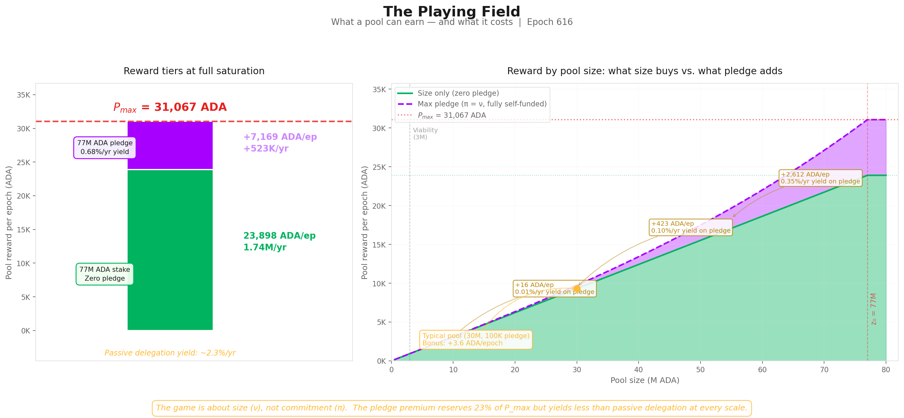

**Three reward tiers:**

| Tier | Reward/epoch | Reward/year | What it requires |
| --- | --- | --- | --- |
| **$P_{\max}$** — absolute ceiling | **31,067 ADA** | **2.27M ADA** | 77M ADA stake + 77M ADA pledge + $\bar{p}=1$ |
| **Size ceiling** — zero pledge | **23,898 ADA** | **1.74M ADA** | 77M ADA stake + $\bar{p}=1$. No pledge needed. |
| **Pledge bonus** — the gap | **7,169 ADA** | **523K ADA** | The difference. Requires 77M ADA of *personal* capital pledged. |

The size-only ceiling ($\lambda_{\min} \times P_{\max}$) is what **any** saturated pool earns regardless of pledge. It captures 76.9% of $P_{\max}$. The remaining 23.1% requires the operator to **pledge the entire saturation amount** (77M ADA). The implied yield: $523\text{K ADA/yr} \div 77\text{M ADA} = 0.68\%\text{/yr}$ — below the passive delegation yield of ~2.3%/yr.

**The bonus at every scale:**

| Pool size | ν | Zero-pledge reward | Max pledge (π=ν) reward | Bonus | Relative uplift | Yield on pledge capital |
| --- | --- | --- | --- | --- | --- | --- |
| 3M ADA | 0.039 | 931 ADA/ep | 932 ADA/ep | **+0.4 ADA** | +0.05% | 0.001%/yr |
| 10M ADA | 0.130 | 3,104 ADA/ep | 3,120 ADA/ep | **+16 ADA** | +0.5% | 0.011%/yr |
| 30M ADA | 0.390 | 9,312 ADA/ep | 9,736 ADA/ep | **+424 ADA** | +4.6% | 0.10%/yr |
| 50M ADA | 0.649 | 15,520 ADA/ep | 17,484 ADA/ep | **+1,964 ADA** | +12.7% | 0.29%/yr |
| 77M ADA | 1.000 | 23,898 ADA/ep | 31,067 ADA/ep | **+7,169 ADA** | +30.0% | 0.68%/yr |

A 10M ADA pool where the operator pledges the entire pool earns 16 ADA more per epoch — a yield of **0.01%/yr** on a 10M lockup. A typical healthy pool (30M ADA stake, 100K ADA pledge) gains **3.6 ADA/epoch** from pledge — less than the variance of a single block.

> **Finding F2.2 — The yield on pledge capital is 0.68%/yr at best (full saturation, full self-pledge) — below passive delegation yield of ~2.3%/yr.** At every realistic scale, the bonus is too small to justify the capital lockup. The "game" for operators is overwhelmingly about **size** (ν), not **commitment** (π).

The bonus exists in the formula but not in the economics.

#### 3.4.3 The envelope mechanics

The proportioning envelope determines what fraction of $P_{\max}$ the pool can capture:

$$E(\pi, \nu) = \underbrace{\lambda_{\min} \cdot \nu}_{\text{base}} + \underbrace{\lambda_{\max} \cdot A(\pi, \nu)}_{\text{pledge bonus}}$$

**The base:** A zero-pledge pool (π = 0) earns $E(0,\nu) = 76.923\% \cdot \nu$. Purely proportional to saturation, independent of pledge. At full saturation: 76.9% of $P_{\max}$. The remaining 23.1% is structurally inaccessible to it.

**The pledge bonus:** The activation function $A(\pi,\nu) = \pi\nu - \pi^2(1-\nu)$ controls access to that remaining 23.1%. Under full self-pledge (π = ν):

$$A(\nu, \nu) = \nu^3 \qquad \Rightarrow \qquad \text{max bonus at } \nu = \lambda_{\max} \cdot \nu^3$$

The cubic scaling is the crux. At ν = 0.1 (a 7.7M pool), even with perfect pledge, the bonus is 0.023% of $P_{\max}$. The mechanism was designed for a world of 500 saturated pools; the actual landscape cannot activate it.

| Saturation (ν) | Max $A$ | Bonus (% of $P_{\max}$) | Total $E$ | Relative uplift over zero-pledge |
| --- | --- | --- | --- | --- |
| 1.0 (full) | 1.000 | 23.077% | **100%** | **30.0%** |
| 0.8 | 0.512 | 11.82% | 73.36% | 19.2% |
| 0.5 | 0.125 | 2.88% | 41.35% | **7.50%** |
| 0.3 | 0.027 | 0.62% | 23.70% | 2.70% |
| 0.1 | 0.001 | 0.023% | 7.72% | 0.30% |

#### 3.4.4 The evidence on mainnet

Absolute pledge amounts are misleading — a 1M ADA pledge means something very different for a saturated pool (ν ≈ 1, π ≈ 0.013) than for a small one (ν ≈ 0.1, π ≈ 0.13). The relevant metric is the **pledge ratio**: declared pledge divided by active stake. This is what the formula actually prices through the $A(\pi, \nu)$ term.

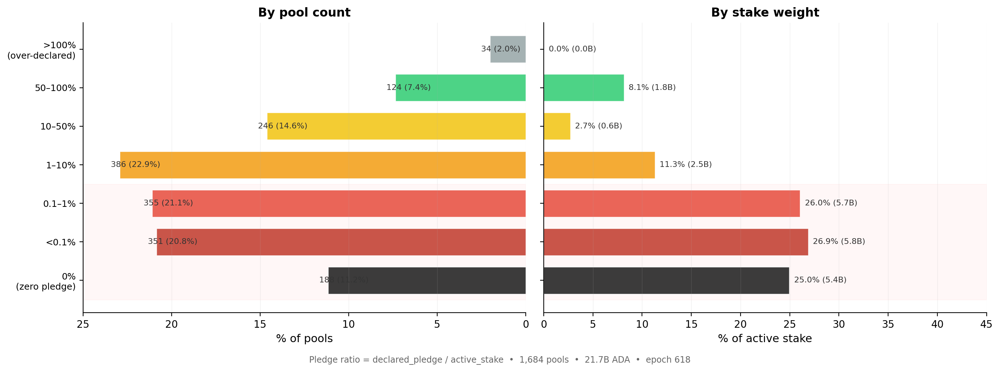

The chart covers the 1,684 registered pools with meaningful delegation (active stake > 10K ADA), excluding dormant and zombie registrations.

| Pledge ratio threshold | Cumul. % of pools | Cumul. % of stake | Stake (ADA) |
| --- | --- | --- | --- |
| < 0.1% | 32.0% | **51.9%** | 11.3B |
| < 1% | 53.1% | **78.0%** | 16.9B |
| < 10% | 76.0% | **89.4%** | 19.4B |

**78% of all staked ADA** sits in pools where the operator pledges less than 1% of managed stake, and **89%** below 10%. Only one ADA in ten is delegated to a pool where the operator commits more than a tenth of the stake they manage.

The stake-weighted median pledge ratio is **0.07%** — meaning half of all staked ADA sits in pools where the operator's personal commitment is less than one thousandth of delegated funds. The unweighted median (0.73%) is 10× higher, reflecting the many smaller community pools with genuine skin-in-the-game but little stake weight.

> **Finding F2.1 — 78% of staked ADA sits in pools with pledge ratio < 1%; the stake-weighted median ratio is 0.07%.** Pledge is absent precisely where stake concentrates. The pools that dominate the network in economic terms operate with near-zero pledge ratios — for them, the $A(\pi, \nu)$ term contributes essentially nothing.

This asymmetry is the structural signature of the pledge problem. At π = 0.001 and ν = 0.5, the bonus is 0.0006% of $P_{\max}$. The anti-Sybil mechanism is present in the formula but absent from the economics.

### 3.5 Performance and oversaturation

Two minor waste sources complete the picture:

**Performance** ($\bar{p}$): A pool's actual block production relative to its VRF-assigned expectation. The network-wide aggregate averages **0.977** — meaning ~2.3% of the pot is lost to missed blocks. This is the only factor the operator directly controls through infrastructure quality. For sub-production pools (expected blocks < 3/epoch), Poisson variance dominates and epoch-to-epoch results are noisy, but in aggregate the effect is small: **0.5% of the pot**.

**Oversaturation**: Seven pools hold stake above $z_0 = 76.99\text{M ADA}$; the excess earns nothing. The saturation cap was designed for 500 pools; only 8 reach it. It binds on **0.3% of the pot**.

Combined: **0.8% of the pot**. These are well-functioning mechanisms that do their job — they are not the problem.

### 3.6 Summary

#### 3.6.1 Current snapshot

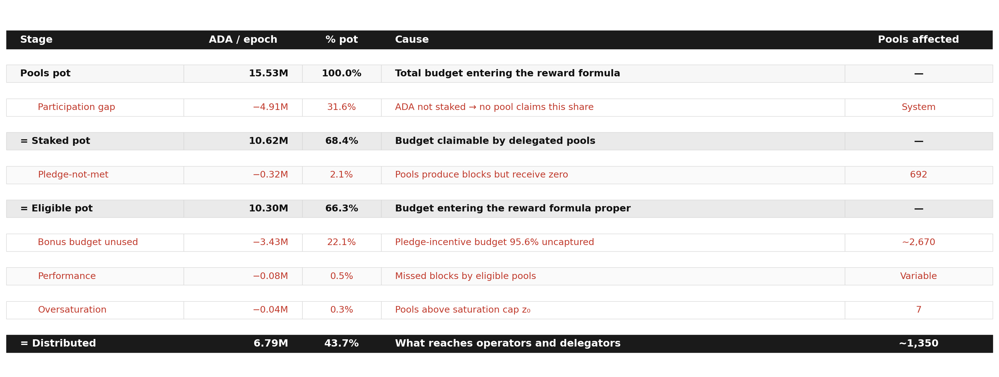

> [!IMPORTANT]
> **Key observation (O1).** Two causes account for **53.7% of the entire pools pot** returning to reserve: the participation gap (31.6%) and the unused pledge budget (22.1%). Everything else — pledge-not-met confiscation (2.1%), performance (0.5%), oversaturation (0.3%) — is secondary by an order of magnitude. The reform priority is unambiguous: the participation gap is upstream and outside the formula's control; the unused pledge budget is the single largest inefficiency that incentive reform *can* address.

> **Finding F1.1 — Only 6.79M of 15.53M ADA/epoch reaches operators and delegators — 44% distribution efficiency.** More than half the pools pot returns to reserve every epoch.

> **Finding F1.4 — Two causes together (53.7% of pot) dwarf all others.** Pledge-not-met confiscation (2.1%), performance (0.5%), and oversaturation (0.3%) are secondary by an order of magnitude. The reform priority is unambiguous.

> **Finding F2.3 — 3.43M ADA/epoch (~250M ADA/year) is reserved for the pledge bonus but returns to reserve unused.** This is the structural cost of maintaining $a_0 = 0.3$ on a landscape that cannot activate the bonus curve.

§3 maps the population structure that produces this outcome.

#### 3.6.2 Historical evolution

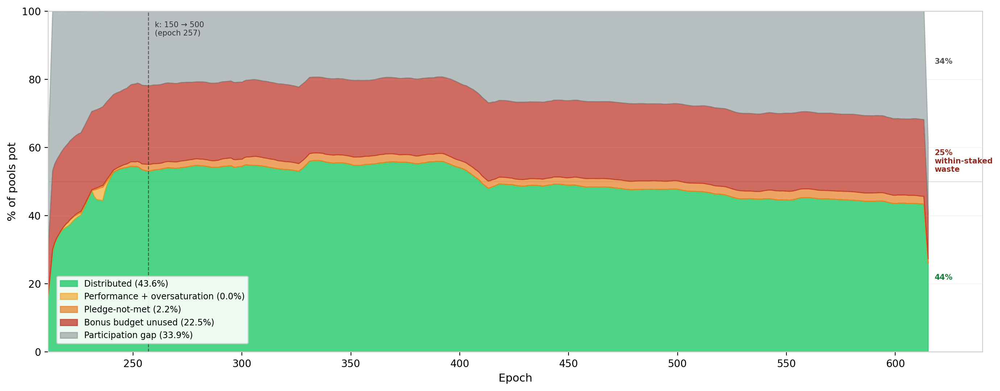

The historical decomposition reveals two facts that the single-epoch snapshot cannot:

**The participation gap is the only component that has moved.** Distribution efficiency peaked at ~55% around epoch 300–400 and has since degraded to 43.6%. The entire decline traces to falling participation: the grey band widened from ~22% to 34% as the ratio of active stake to theoretical capacity ($k \times z_0$) fell. No other component changed materially.

**The bonus budget has never activated.** The red band — pledge bonus unused — has sat at **~22–23% of the pot since Shelley epoch 211**. It was 23.1% when $a_0 = 0.3$ was set, and it is 22.5% today. The pledge incentive was not functional at launch, did not improve after the $k$ increase at epoch 257, and has not responded to any subsequent change in the pool landscape. This is not a recent degradation. It is a **structural failure present since the mechanism was deployed**.

#### 3.6.3 Conclusion

**What the [*Incentive Mechanism Analysis*](https://github.com/input-output-hk/spo-incentives/blob/main/report.pdf) established.** Lopez de Lara (2025) produced the first waterfall decomposition of the pools pot and identified the participation gap and the pledge-bonus shortfall as the two dominant waste channels. The analysis characterised the bonus shortfall as economically neutral — a zero-sum redistribution where uncaptured ADA returns to the reserve.

**What this analysis adds.** The zero-sum framing is incomplete. The pledge bonus is the protocol's primary Sybil-resistance mechanism — the economic cost that makes pool proliferation expensive. When 95.6% of this budget fails to activate, the marginal cost of opening an additional pool drops to near zero. The mechanism designed to make pool farms expensive becomes permissive. The **3.43M ADA** returning to the reserve every epoch is the budget the protocol explicitly allocates to its own security model — and the five-year historical record (§3.6.2) confirms it has never responded to any change in the pool landscape. This is not a recent degradation; it is a structural failure present since the mechanism was deployed. Furthermore, the yield analysis (§3.4.2) shows the bonus is economically irrational to pursue at every realistic scale, and the mainnet evidence (§3.4.4) confirms that operators have responded accordingly — pledge is absent precisely where stake concentrates.

> **Finding F1.1 — Only 44% distribution efficiency.** 6.79M of 15.53M ADA/epoch reaches operators and delegators.
>
> **Finding F1.2 — The participation gap returns 31.6% of the pot.** Upstream and outside the formula's control.
>
> **Finding F1.3 — The unused pledge budget returns 22.1% of the pot.** The single largest addressable inefficiency — 95.6% of the bonus budget wasted.
>
> **Finding F1.4 — Two causes dominate all others.** Together 53.7% of the pot; everything else is secondary by an order of magnitude.
>
> **Finding F2.1 — 78% of staked ADA at < 1% pledge ratio.** Pledge is absent where stake concentrates.
>
> **Finding F2.2 — Best-case yield on pledge capital is 0.68%/yr.** Below passive delegation yield — economically irrational to pledge.
>
> **Finding F2.3 — 3.43M ADA/epoch reserved for pledge bonus returns unused.** The structural cost of $a_0 = 0.3$ on a landscape that cannot activate it.

§3 identifies the actors who control this landscape and why they do not pledge.

---

## 4. The pool landscape — who wastes, who pledges, and who struggles

§2 showed that **56.3% of the pools pot** never reaches operators — and that the single largest addressable cause is the **unused pledge-incentive budget**:

> **3.43M ADA/epoch (~250M ADA/year)** — returning to the reserve unused since Shelley launch.

The pledge mechanism — designed as Cardano's primary Sybil-resistance tool — has never activated:

| Signal | Value | Reading |
| --- | ---: | --- |
| Bonus budget wasted | **95.6%** | Near-total failure |
| Staked ADA in pools with pledge ratio < 1% | **78%** | Pledge is absent where stake concentrates |
| Best-case yield on pledge capital | **0.68%/yr** | Below passive delegation yield (2.3%/yr) |

By every measure, the mechanism is broken.

---

**The question this section asks:** prior work identified a population of struggling pools below the viability line as the primary policy concern. But how many operators are genuinely in that position? Who are they? And is their struggle a *cause* of the pledge failure — or a *consequence* of something deeper about who controls the landscape?

**How we answer it:**

- **§4.1 — Theoretical pool classification.** A size-based taxonomy grounded in the protocol's own mechanics, separating where operators struggle from where they thrive.
- **§4.2 — Behind the pools: entity-level analysis.** 75% of staked supply turns out to be operated by multi-pool entities whose relationship to the pledge mechanism ranges from structural impossibility to strategic indifference.
- **§4.3 — The remaining single-pool operators.** The community base that any reform ultimately aims to support — isolated from the MPO landscape.
- **§4.4 — The full picture.** Who wastes, who pledges, and who genuinely struggles.

### 4.1 Theoretical pool classification

Before looking at who controls the pools, we need a structural map of the landscape itself.

#### 4.1.1 The case for pool categorization

The reward curve is continuous — it maps stake to reward without discrete jumps. Yet the pool landscape is **not** continuous. A pool with 50K ADA and one with 50M ADA both participate in the same formula, but they inhabit entirely different worlds: one barely produces blocks, the other anchors the delegation market.

Treating them as points on a single spectrum leads to conclusions that are technically correct and analytically useless. Three thresholds — **production**, **viability**, and **saturation** — emerge from the protocol's own mechanics and partition the space into tiers with distinct identities:

| Threshold | What it captures | Derived from |
| --- | --- | --- |
| **Production** | Minimum stake for regular block production | Slot leadership probability × epoch length |
| **Viability** | Minimum stake to cover operating costs | Fixed-cost floor ÷ reward rate per ADA |
| **Saturation** | Maximum efficient stake per pool | Circulating supply ÷ $k$ |

Each tier has a characteristic behaviour, a characteristic problem (or none), and a characteristic response to parameter changes.

> **Why this matters for CIP evaluation.** These thresholds are **dynamic** — they are functions of active stake, fixed costs, reward rates, and $k$. When a CIP proposes to change $k$ from 500 to 1000, the saturation cap halves and the tier boundaries shift. When active stake grows from 21B to 35B ADA, the production and viability lines rise. The taxonomy is a framework for reasoning across scenarios, not a snapshot of today's values.

#### 4.1.2 Structural thresholds

##### 4.1.2.1 Production threshold

> **Key result:** at current active stake (21.57B ADA), a pool needs **~1M ADA** to expect 1 block/epoch and **~3M ADA** to produce blocks regularly. This threshold scales linearly with participation — it is not fixed.

**The mechanism.** Cardano's Ouroboros Praos assigns block production rights slot by slot. For each of the $L$ slots in an epoch, a pool with relative active stake $\sigma_i$ is elected slot leader with probability:

$$\phi(f, \sigma_i) = 1 - (1-f)^{\sigma_i}$$

where $f$ is the **active slot coefficient** and $\sigma_i = \text{stake}_i / S_{\text{active}}$. For small $\sigma_i$ (all pools below saturation), the expected block count simplifies to:

$$E[\text{blocks}_i] \approx L \times f \times \sigma_i$$

The protocol constants have **never changed**:

| Parameter | Symbol | Value |
| --- | --- | --- |
| Epoch length | $L$ | 432,000 slots |
| Active slot coefficient | $f$ | 0.05 |
| Expected blocks/epoch | $L \times f$ | 21,600 |

The only moving part is **total active stake** — and that makes the threshold dynamic:

$$\text{stake}_{n\text{-blocks}} \approx \frac{n \times S_{\text{active}}}{L \times f}$$

| Total active stake | 1-block threshold | 3-block threshold |
| --- | --- | --- |
| 10B ADA | 0.46M ADA | 1.39M ADA |
| 15B ADA | 0.69M ADA | 2.08M ADA |
| **21.57B ADA** (current) | **0.97M ADA** | **2.92M ADA** |
| 30B ADA | 1.39M ADA | 4.17M ADA |
| 38.49B ADA (full supply) | 1.78M ADA | 5.35M ADA |

At full participation the 3-block threshold rises to **5.35M ADA** — pushing more pools below viability.

**Why 3 blocks matters.** Block assignments are Poisson-distributed. The coefficient of variation ($\text{CV} = 1/\sqrt{\lambda}$) tells the story:

| Pool stake | E[blocks] | CV | What a delegator sees |
| --- | --- | --- | --- |
| 100K ADA | 0.10 | 316% | Mostly zero — one block is an event |
| 500K ADA | 0.51 | 139% | One block every ~2 epochs, very noisy |
| **~1M ADA** | **1.00** | **100%** | **0 blocks as likely as 2 — unreliable** |
| **~3M ADA** | **3.00** | **58%** | **Regular production begins** |
| 10M ADA | 10.27 | 31% | Stable reward stream |
| 77M ADA (z₀) | 79.09 | 11% | Near-deterministic |

At 1 block/epoch the reward is as variable as its own mean. At **3 blocks/epoch** the pool produces in the overwhelming majority of epochs — this is where a delegator can first observe *consistent* performance. The ~3M ADA line identified in prior work is not an arbitrary ADA amount: it is the point where Poisson noise stops dominating.

**Current landscape:**

| Threshold | Pools above | Active stake covered |
| --- | --- | --- |
| ≥1 block/epoch (0.97M ADA) | 946 | 99.1% |
| ≥3 blocks/epoch (2.92M ADA) | 729 | 97.3% |
| ≥10 blocks/epoch (10.1M ADA) | 511 | 91.6% |

Below this threshold, pools produce too few blocks for delegators to assess reliability — and their reward variance is too high to sustain consistent yields.

##### 4.1.2.2 Viability threshold

> **Key result:** 1,987 pools (73% of all pools with stake) sit below viability. They collectively owe **647K ADA/epoch** in fixed costs but earn only **182K ADA** — destroying value for their delegators.

Block production is necessary but not sufficient. A pool must also cover the protocol-enforced **fixed cost** floor. The break-even point is straightforward:

$$\text{Break-even stake} = \frac{\text{Fixed cost}}{\text{Reward per ADA per epoch}}$$

| Fixed cost | Share of pools | Break-even stake |
| --- | --- | --- |
| 340 ADA (dominant) | 66.3% | ~1.09M ADA |
| 170 ADA | 17.3% | ~0.54M ADA |

Below break-even, the pool's entire reward is consumed by the fixed cost. The delegator receives nothing; the operator extracts more than the pool earns.

**The scale of the problem:**

| Metric | Below viability (<3M) | Healthy (≥3M) |
| --- | --- | --- |
| Pools | 1,987 | 731 |
| Estimated group reward | 182K ADA/epoch | 6.61M ADA/epoch |
| Total fixed costs | 647K ADA/epoch | 1.56M ADA/epoch |
| Fixed cost as % of avg reward | **372%** | 3.8% |

In aggregate, below-viability pools **destroy value**: their fixed costs exceed their total reward by 3.6×. Delegators to these pools receive negative net reward.

> **Why do they persist?** 1,987 below-viability pools represent 73% of all pools with stake — yet they exist and attract delegators despite being economically irrational for both parties. The persistence suggests delegators either do not understand the fee mechanics, stake for non-economic reasons (governance, ideology, wallet defaults), or face friction in redelegating.

##### 4.1.2.3 Saturation threshold

> **Key result:** the saturation cap binds for **8 pools** — 1.6% of the design target of 500. With 56.5% participation, the system can support at most **282** saturated pools. The mechanism's central equilibrium tool is nearly inactive.

The saturation point $z_0 = \text{Supply}/k = 76.99\text{M ADA}$ was designed as the central equilibrium mechanism: once a pool reaches $z_0$, the per-ADA reward for its delegators drops, pushing stake toward smaller pools until all $k = 500$ pools are equally sized.

| Metric | Design | Reality |
| --- | --- | --- |
| Target pools at saturation | **500** | **8** |
| Theoretical capacity ($k \times z_0$) | **38.49B ADA** | — |
| Active stake | — | **21.75B ADA** |
| Capacity utilisation | 100% | **56.5%** |
| Max pools that could saturate | 500 | **282** |

The reason is arithmetic: $k = 500$ implicitly required near-complete participation (~100% of supply). Actual participation at 56.5% makes the target structurally unreachable — regardless of operator behaviour or pledge reform.

The near-saturation zone (≥80% of $z_0$) contains 104 pools — a thin cluster rather than the broad plateau the design envisioned. The bulk of the healthy pool landscape sits between 3M and 60M ADA, far below saturation.

#### 4.1.3 Tier definitions

The three thresholds partition the pool space into **nine tiers**. Boundary values are for epoch 616 (21.57B ADA active stake).

**Below viability — the struggling pools:**

| Tier | Stake range | What happens |
| --- | --- | --- |
| **Zero-stake** | 0 ADA | Registered, no stake, not operational |
| **Dormant** | >0 → ~100K | < 0.1 blocks/epoch — effectively zero production |
| **Sub-production** | ~100K → ~1M | Sporadic blocks, high variance — unreliable for delegators |
| **Sub-viable** | ~1M → ~3M | Produces blocks but cannot cover the 340 ADA fixed cost |

**Above viability — the functioning landscape:**

| Tier | Stake range | What happens |
| --- | --- | --- |
| **Healthy** | ~3M → ~38.5M | Consistent production, viable economics — the core operating tier |
| **Large healthy** | ~38.5M → ~61.6M | Well-capitalised, efficient, stable reward stream |
| **Near-saturation** | ~61.6M → ~73.1M | Close to maximum reward density |
| **Saturated** | ~73.1M → ~80.8M | At the cap — maximum reward; mechanism binding |
| **Oversaturated** | > ~80.8M | Past the cap — delegators penalised, stake should migrate |

> **Finding F3.5 — These boundaries move.** The tier ranges above are not fixed ADA amounts — they are functions of active stake, fixed costs, and $k$. When a CIP proposes $k = 1000$, the saturation threshold halves to ~38.5M ADA and every current "Large healthy" pool is reclassified as near-saturation. When active stake grows, the production and viability lines rise.
>
> **Finding F3.6 — CIPs hit different tails.** CIPs targeting $k$ reshape the upper tail of the distribution; CIPs targeting fees or block production reshape the lower tail. Any reform proposal must be evaluated against the tier it actually moves — not against the landscape as a whole.

#### 4.1.4 Pool distribution by tier

The three thresholds produce a sharply asymmetric distribution: the vast majority of pools cluster at the bottom of the stake scale, while the overwhelming majority of delegated ADA concentrates in the upper tiers.


The inversion is stark: **1,987 pools (73%) sit below the Viability threshold — yet collectively hold only 2.7% of active stake.** The top four tiers (Healthy and above) account for 27% of pools but 96.6% of stake. This structural gap between pool count and stake share is the defining feature of the current landscape and the primary motivation for the CIP proposals under evaluation.

#### 4.1.5 Conclusion

**What prior work established.** The ~3M ADA viability line was identified as the primary policy concern, with operators below it flagged as the struggling population requiring reform attention.

**What this analysis adds.** The viability line is not an arbitrary ADA amount — it is the point where Poisson noise stops dominating block production (~3 blocks/epoch, CV = 58%). This analysis grounds it in the protocol's own slot-leadership mechanics, extends it into a full nine-tier taxonomy spanning from zero-stake pools to oversaturated fleets, and reveals two properties that matter for any CIP evaluation:

> **Finding F3.5 — Tier boundaries are dynamic, not fixed.** They are functions of active stake, fixed costs, and $k$. When a CIP proposes $k = 1000$, the saturation threshold halves to ~38.5M ADA and every current "Large healthy" pool is reclassified as near-saturation. When active stake grows from 21B to 35B ADA, the production and viability lines rise proportionally. Any reform evaluation must account for where the boundaries *move*, not just where they sit today.

> **Finding F3.6 — CIPs hit different tails.** CIPs targeting $k$ reshape the upper tail of the distribution (saturation, near-saturation); CIPs targeting fees or block production reshape the lower tail (sub-viable, sub-production). Any reform proposal must be evaluated against the tier it actually moves — not against the landscape as a whole.

But the taxonomy describes the terrain as if each pool were independent. It is not. Nothing in the Cardano protocol prevents a single entity — an exchange, a staking-as-a-service provider, or even a well-capitalised individual — from registering and operating multiple pools under different identities. Each pool appears as a separate entry on-chain, but the economic decisions (how much to pledge, how to price fees, whether to respond to incentive signals) are made at the entity level, not the pool level. §4.2 looks behind the pools to identify who actually controls them — and the answer reshapes the entire landscape.


### 4.2 Behind the pools — entity-level analysis

The pool taxonomy above describes the terrain as if each pool were an independent actor. It is not. Nothing in the Cardano protocol prevents a single entity — an exchange, a staking-as-a-service provider, or a well-capitalised individual — from registering and operating multiple pools. Each pool appears as a separate entry on-chain, but the economic decisions (how much to pledge, how to price fees, whether to respond to incentive signals) are made at the **entity level**, not the pool level.

Viewing the landscape pool-by-pool without entity attribution pollutes every metric: concentration appears lower, pledge ratios look more uniformly poor, and the policy-sensitive population is invisible. This section first identifies who these entities are and how many there are (§4.2.1), distinguishes who has enough capital to play the pledge game (§4.2.2), classifies them by archetype (§4.2.3), and measures how they behave with respect to pledge (§4.2.4).

#### 4.2.1 Attribution method and headline figures

Cardano's on-chain data does not natively group pools by operator. A pool is registered with a cold key, a VRF key, and optional metadata — but nothing links two pools to the same controlling entity. Attribution therefore relies on layered heuristics:

| Signal | What it captures |
| --- | --- |
| **Public brand declarations** | Tickers, metadata URLs, and websites that explicitly name the operator |
| **Relay and metadata clustering** | Shared relay IPs, identical metadata hashes, or co-located infrastructure |
| **On-chain ownership clustering** | Common `pool_group`, shared `reward_addr`, or overlapping owner keys |
| **Manual resolution** | Cross-referencing community databases, social-media announcements, and known brand aliases |

The full pipeline is implemented in `scripts/build_hidden_mpo_discovery.py`.

**Result (epoch 618, live pools with >100 ADA):**

| | Entities | Pools | Stake | % of active stake |
| --- | ---: | ---: | ---: | ---: |
| **Attributed MPOs** | 85 | 901 | 16.4B ADA | **75.4%** |
| **Unattributed pools** | — | 2,097 | 5.44B ADA | 25.0% |

> **Finding F4.1 — 85 MPO entities operate 901 pools holding 16.4B ADA — 75.4% of participating stake.** Three quarters of the network's economic weight is controlled by entities running multiple pools. The remaining 2,097 pools (25% of stake) are not attributed to any MPO — they *appear* as single-pool operators, but some may be undiscovered MPOs. They are analysed in §4.3 under that caveat.

#### 4.2.2 The capital-sufficiency divide

Before classifying these 85 entities by identity, one structural distinction matters above all others. The critical question for any MPO is: **can the entity, if it chose to, self-pledge an entire pool to saturation?**

The saturation cap $z_0 \approx 77\text{M ADA}$ divides the population in two:

| Class | Entities | Live pools | Stake | What it means |
| --- | ---: | ---: | ---: | --- |
| **Capital-sufficient** (≥ z₀) | 48 | 472 | 14.50B ADA | Could saturate and self-pledge ≥1 pool. Non-compliance is structural or strategic. |
| **Capital-insufficient** (< z₀) | 37 | 113 | 1.74B ADA | Aggregate stake below one saturation cap. Even perfect consolidation cannot reach the pledge game. |

For capital-sufficient entities, failure to capture the pledge bonus is not a lack of raw capital — it is either a **structural constraint** (custody, delegated institutional mandates) or an **explicit strategic choice**. Capital-insufficient entities are closer to single-pool operators in their relationship to the reward sharing scheme.

#### 4.2.3 Operator archetypes

Capital-sufficiency tells us whether an entity *can* play the pledge game. It does not tell us *why* it does or doesn't. An exchange with 2B ADA and a community fleet with 200M ADA are both capital-sufficient — but their relationship to pledge is entirely different. One holds custodied retail funds it legally cannot pledge; the other chooses not to.

To separate structural constraints from strategic choices, we classify each entity by its **delegation source and operating model**. The capital split from §4.2.2 is important enough that we elevate **Capital-insufficient** to a first-class archetype in its own right — cleanly isolating the sub-scale fleets that should not be read through the same lens as a Coinbase or a Binance.

##### 4.2.3.1 Classification

**Archetype definitions:**

| Archetype | Code | Entities | Delegation source | Self-pledge | Incentive alignment |
| --- | --- | ---: | --- | --- | --- |
| Exchange Custody | `cex` | 6 | Retail balances custodied by a centralised exchange | Structurally zero | None |
| Institutional Validator | `ivaas` | 4 | Institutional clients via staking-as-a-service | Near-zero | Partial |
| Capital-insufficient | `capital_insufficient` | 37 | Mixed sovereign/community/operator stake, below one saturated pool in aggregate | Structurally limited by scale | single-pool-like |
| Community Branded Fleet | `community_branded_fleet` | 13 | Sovereign delegators choosing a branded pool family | Variable | Full |
| Independent MPO | `independent_mpo` | 8 | Sovereign delegators choosing the operator directly | Meaningful | Full |
| Multi-Brand Fleet | `multi_brand_fleet` | 8 | Sovereign delegators across multiple brands | Variable | Full |
| Opaque / Unresolved | `opaque` | 1 | Unknown | High | Unknown |
| Ecosystem Steward | `ecosystem` | 2 | Foundation or protocol developer self-stake | High | Mission-driven |
| Platform / Wallet | `platform` | 2 | Wallet users; staking mediated by platform UX | Variable | Partial |
| Opaque Fleet | `opaque_fleet` | 4 | Unknown — no public-facing brand | Near-zero | Unknown |

The canonical classification is in `data/mpo_entity_archetypes.csv` (includes `exclude_from_baseline` and `capital_class` fields).

**Snapshot by archetype (epoch 618, live pools >100 ADA):**

| Archetype | Entities | Live pools | Stake (B ₳) | % supply | Capital class |
| --- | ---: | ---: | ---: | ---: | --- |
| Exchange Custody (CEX) | 6 | 152 | 4.77 | 12.39% | Sufficient |
| Institutional Validator (IVaaS) | 4 | 67 | 2.62 | 6.80% | Sufficient |
| Capital-insufficient | 37 | 113 | 1.74 | 4.51% | Insufficient |
| Community Branded Fleet | 13 | 45 | 1.78 | 4.62% | Sufficient |
| Independent MPO | 8 | 78 | 1.57 | 4.07% | Sufficient |
| Multi-Brand Fleet | 8 | 56 | 0.92 | 2.38% | Sufficient |
| Opaque / Unresolved | 1 | 14 | 0.83 | 2.17% | Sufficient |
| Opaque Fleet | 4 | 22 | 0.81 | 2.10% | Sufficient |
| Ecosystem Steward | 2 | 17 | 0.73 | 1.89% | Sufficient |
| Platform / Wallet | 2 | 21 | 0.47 | 1.22% | Sufficient |

**Two readings from this table:**

**By entity count** — the largest archetype is **Capital-insufficient** (37 of 85). Most of the long tail that appears as community-branded fleets, protocol projects, and smaller independent clusters falls into this bucket. The first-order fact is not brand identity but **scale**: nearly half of all MPO entities are sub-scale for the saturation-level pledge game.

**By stake** — the landscape is dominated by custodial and validator infrastructure. **CEX + IVaaS alone control 7.39B ADA (19.2% of circulating supply)** across 219 live pools, all with near-zero effective pledge. The capital-sufficient sovereign archetypes (community fleets, independent MPOs, multi-brand fleets, ecosystem/platform operators, opaque fleets) collectively manage another **7.11B ADA**. This is the population where the distinction between *can play*, *won't play*, and *does play* becomes analytically useful — §4.2.4 measures exactly that.

> **Finding F4.4 — CEX + IVaaS alone hold 7.39B ADA (19.2% of supply) at structurally zero pledge.** These ten entities operate 219 pools whose delegation source — custodied retail balances and institutional client assets — makes pledge structurally impossible. No parameter change can move this stake into the pledge game.

##### 4.2.3.2 Current distribution

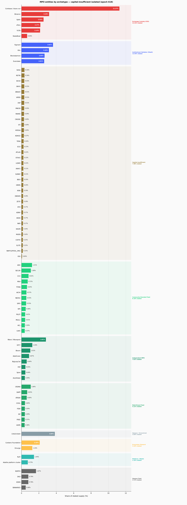

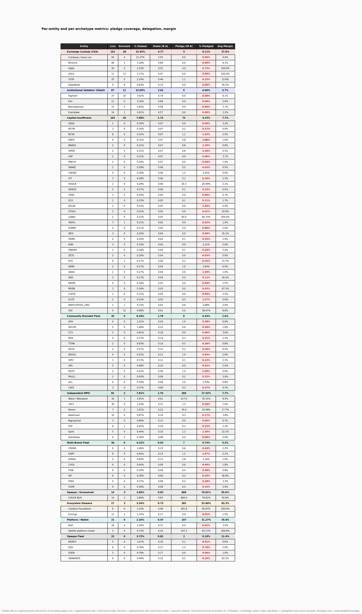

The figure groups every entity with ≥0.01% of circulating supply by archetype. The bar chart shows their share of staked supply; the metrics table below it reports pool counts, pledge coverage, and average margin for each entity and archetype subtotal.

The concentration is immediate: the top six entities (Coinbase, Binance, Figment, CHUCK BUX, Upbit, Cardano Foundation) collectively exceed 20% of staked supply. The long tail of capital-insufficient and community fleets — numerous by entity count — barely registers in stake terms.

Per-entity descriptions including pledge-coverage ratios are in the annex: **[docs/mpo_entity_profiles.md](docs/mpo_entity_profiles.md)**.

##### 4.2.3.3 Historical evolution

The archetype-level composition has been remarkably stable across three years of Shelley operation. The aggregate MPO share has hovered around 42–43% of circulating supply since epoch 300 — the internal mix shifts, but the total barely moves.

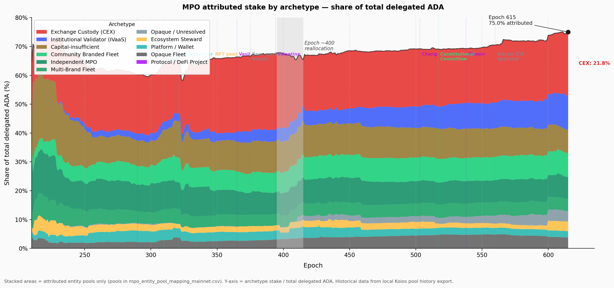

That stability masks significant **entity-level rotation**:

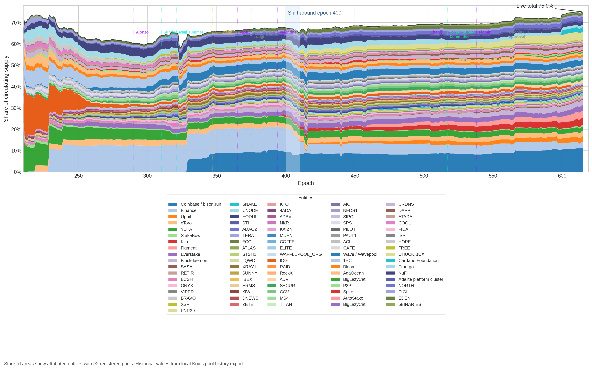

| Movement | Epoch range | What happened |
| --- | --- | --- |
| **Binance** retreat | 400 → 618 | 7.4% → 1.8% of supply — largest single-entity decline |
| **Coinbase / bison.run** steady | 300 → 618 | Held ~6% throughout — the anchor of the CEX archetype |
| **Figment** emergence | 584 → 618 | Zero → 2.1% — rapid institutional validator growth |
| **CHUCK BUX** appearance | 410 → 584 | Appeared abruptly, now 3.8% — opaque provenance |

The entities rotate but the archetype totals persist. CEX as a whole has remained at roughly 12–13% of supply throughout. This is the structural signature of a **fixed background**: the MPO landscape is not converging toward pledge compliance over time — it is cycling entities through the same non-compliant archetypes.

#### 4.2.4 Pledge compliance — who plays and who doesn't

The archetype taxonomy answers *who is operating*. The more consequential question for mechanism design is: **how does each entity sit relative to the pledge game?** Before answering that, we need to define what "playing the pledge game" means — and why the answer is not a simple binary.

##### 4.2.4.1 Pledge compliance classification

The pool-level pledge data reveals that MPO non-response to pledge incentives takes two distinct forms:

1. **Structural inaccessibility** — capital-insufficient fleets do not have enough aggregate stake to make the saturation-level pledge game economically relevant.
2. **Capital-sufficient non-compliance** — entities that *could* operate inside the reward sharing scheme at meaningful scale, but still capture almost none of the pledge premium.

**How the pledge bonus scales.** For a saturated pool ($\sigma' = z_0$), the bonus captured scales exactly as $s'/z_0$ — at 1% effective pledge ratio, 1% of the bonus is captured; at 30%, 30%. For a half-saturated pool the relationship is mildly super-linear (30% pledge captures ~51% of that pool's maximum bonus), but the qualitative picture is the same: very low pledge means very low capture, and the reward foregone returns to the reserve as *within-stake inefficiency*.

This creates a natural behavioural classification based on how much of the pledge bonus an entity actually captures. We retain the same 2% / 30% / 80% thresholds for **capital-sufficient** entities, but we do **not** force capital-insufficient fleets into the same ladder. Instead, they are isolated in a separate stance:

| Stance | Eligibility | Effective pledge ratio | Interpretation |
| --- | --- | --- | --- |
| **Can't play** | Capital-insufficient | n/a | Multi-pool by structure, but sub-scale for the saturation-level pledge game. Better analysed as single-pool-like background than as a stance failure. |
| **Non-compliant** | Capital-sufficient | < 2% | Forfeits the bonus almost entirely despite having enough aggregate stake to play. |
| **Marginal** | Capital-sufficient | 2–30% | Partial capture. This is the real decision boundary for parameter adjustments. |
| **Compliant** | Capital-sufficient | 30–80% | Captures a meaningful share of the bonus and is clearly responsive to the reward sharing scheme's incentives. |
| **Exemplary** | Capital-sufficient | ≥ 80% | Captures the vast majority of the bonus. The last 20% of pledge yields diminishing marginal gains. |

The 2% lower threshold marks the point below which bonus capture is indistinguishable from noise. The 30% threshold is the median-capture point for half-saturated pools, and 80% marks the zone where most of the available premium is already captured. The only conceptual change is upstream: **capital-insufficient entities are removed from this ladder before classification**.

**Applied to all 85 MPO entities (epoch 618):**

| Stance | Entities | Stake (B ₳) | % supply | Composition |
| --- | ---: | ---: | ---: | --- |
| **Can't play** | 37 | 1.74 | 4.51% | Capital-insufficient fleets: mostly smaller branded clusters, protocol projects, and single-pool-like MPOs below one saturated pool in aggregate |
| **Non-compliant** | 41 | 12.00 | 31.17% | All CEX, all IVaaS, Emurgo, NuFi, BigLazyCat, and most capital-sufficient community / opaque fleets |
| **Marginal** | 2 | 0.22 | 0.56% | ATADA and ACL — the only capital-sufficient entities in the 2–30% band |
| **Compliant** | 3 | 1.67 | 4.33% | CHUCK BUX, Wave / Wavepool, and Bloom |
| **Exemplary** | 2 | 0.61 | 1.60% | Cardano Foundation and Adalite |

The result is two-layered. First, **37 of 85 entities (1.74B ADA)** sit outside the large-MPO pledge game altogether — they **can't play** in any economically meaningful sense. Second, among the **48 capital-sufficient MPOs**, fully **41 are non-compliant**, holding **12.00B ADA (31.17% of circulating supply)**. Once scale is no longer an excuse, non-compliance is not a fringe pattern but the overwhelming norm.

> **Finding F4.3 — 41 of 48 capital-sufficient MPOs are non-compliant — they forfeit ~550K ADA/epoch in pledge bonus.** The responsive middle is tiny: 2 marginal, 3 compliant, 2 exemplary. Small parameter changes cannot solve what is fundamentally a population-structure problem.

The responsive middle is correspondingly thin. Only **two** capital-sufficient entities are truly **marginal** at the decision boundary, and only **three** are clearly **compliant** without already being near-fully self-funded. The exemplary pair — **Cardano Foundation** and **Adalite** — already capture almost the full premium and act more as a positive control than as a policy target.

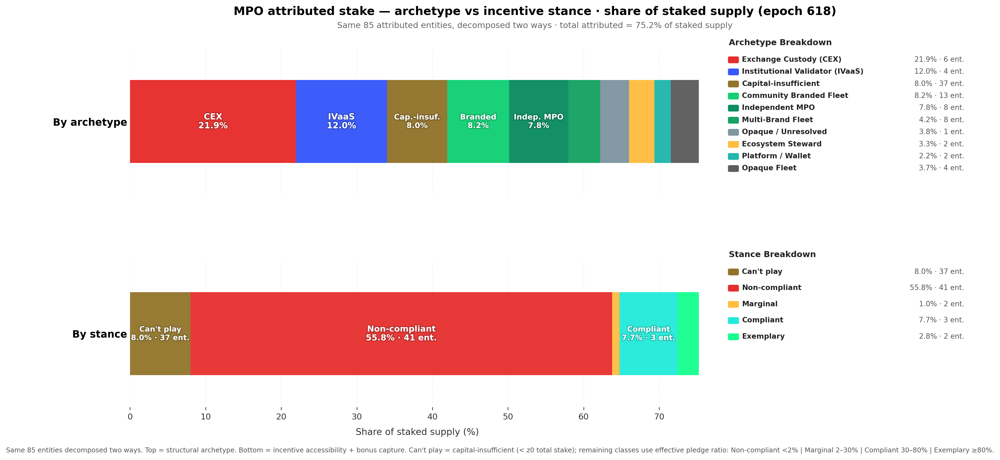

The figure decomposes the same attributed stake two ways: top bar by structural archetype, bottom bar by pledge compliance. The key split is now explicit: **1.74B ADA sits in the ochre "Can't play" bucket**, while **12.00B ADA sits in capital-sufficient non-compliance**. The problem is therefore not a single low-pledge mass but a combination of structural inaccessibility and large-scale strategic non-response.

> [!NOTE]
> **Implication for mechanism-design work.** Any proposed change to $a_0$, $k$, or the pledge-benefit curve should be evaluated against three separate populations, not one MPO blob: **Can't play** (37 entities, 4.51% of supply), **capital-sufficient non-compliant** (41 entities, 31.17%), and the thin **responsive middle** of marginal + compliant operators (5 entities, 4.89%). The exemplary population (1.60%) already captures most of the bonus.

##### 4.2.4.2 Structural non-compliance — CEX and IVaaS

The 41 non-compliant entities are not a uniform mass. Two archetypes — **Exchange Custody** and **Institutional Validator** — account for 10 entities and 7.39B ADA, and their non-compliance is *structural*, not strategic. Understanding why they cannot play is essential before attempting any reform.

**Exchange Custody (CEX)** — 6 entities, 152 pools, 4.77B ADA (12.4% of supply)

Cardano's incentive mechanism was designed around a principal–agent relationship: an ADA holder freely delegates to a pool operator whose competitiveness is disciplined by pledge, margin, and saturation pressure. Exchange-custody staking breaks this relationship at every level:

| Assumption | Protocol design | CEX reality |
| --- | --- | --- |
| Delegation is a sovereign choice | ADA holder picks a pool | Exchange assigns internally |
| Pledge reflects operator commitment | Operator locks own capital | Cannot pledge custodied funds (legal) |
| Saturation pushes stake to smaller pools | Delegators migrate when pool fills | Exchange creates a new pool silently |
| Margin signals quality | Delegators compare margins | Users see a fixed APY, not pool params |

The six CEX entities split into two revenue models. The *pass-through model* (Coinbase, Binance, YUTA, StakeBowl) sets low on-chain margins (4–13%) and earns on custody, trading spread, and service products. The *full-internalisation model* (Upbit, eToro) sets 100% on-chain margin and pays users a separate fixed APY — the protocol reward signal is entirely decoupled from the user experience.

**Institutional Validator (IVaaS)** — 4 entities, 67 pools, 2.62B ADA (6.8% of supply)

IVaaS entities serve institutional clients via staking-as-a-service. Unlike CEX, the underlying ADA holders could in principle choose another provider; in practice, switching costs and contractual arrangements create similar lock-in. IVaaS entities could in principle pledge operator equity, but the obstacle is scale: to shift the pledge premium meaningfully at 500–800M ADA of managed stake would require self-pledging hundreds of millions of ADA — unrealistic for a staking-infrastructure company whose equity base is a fraction of the ADA it manages. IVaaS suppresses the pledge signal by economic necessity, not by legal constraint.

**Pledge suppression summary — CEX and IVaaS entities (epoch 618):**

| Entity | Archetype | Pools (act) | Stake (B ₳) | Near-sat | Med. pledge | Margin | Why pledge ≈ 0 |
| --- | --- | ---: | ---: | ---: | ---: | ---: | --- |
| Coinbase / bison.run | CEX | 47 | 2.451 | 23 | 0 | 4.6% | Cannot pledge custodied funds (legal) |
| Binance | CEX | 50 | 0.691 | 1 | 2 ₳ | 6.1% | Cannot pledge custodied funds (legal) |
| Figment | IVaaS | 36 | 0.788 | 4 | 0 | 8.4% | Scale makes pledge premium uneconomic |
| Kiln | IVaaS | 11 | 0.687 | 6 | 100 ₳ | 5.0% | Scale makes pledge premium uneconomic |
| Everstake | IVaaS | 15 | 0.567 | 1 | 1K ₳ | 2.9% | Scale makes pledge premium uneconomic |
| Blockdaemon | IVaaS | 15 | 0.561 | 4 | 200 ₳ | 5.7% | Scale makes pledge premium uneconomic |
| Upbit | CEX | 20 | 0.551 | 0 | 200K ₳ | 100% | Cannot pledge custodied funds (legal) |
| eToro | CEX | 12 | 0.472 | 0 | 0 | 100% | Cannot pledge custodied funds (legal) |
| YUTA | CEX | 25 | 0.465 | 0 | 50K ₳ | 12.6% | Custodial/platform staking |
| StakeBowl | CEX | 9 | 0.140 | 2 | 0 | 80.7% | Custodial/platform staking |

Detailed entity profiles (Coinbase obfuscation, Binance ghost fleet, Figment/Ledger Live back-end, Kiln enterprise wallets, etc.) are in the annex: **[docs/mpo_entity_profiles.md](docs/mpo_entity_profiles.md)**.

**CEX-adjusted baseline.** Excluding CEX entities remains analytically useful because it removes structurally pledge-zero, non-sovereign stake from the denominator. But the revised §3 framing shows that this is only a partial cleanup: a second fixed population also exists in the form of capital-insufficient MPOs. The `exclude_from_baseline: true` flag in `data/mpo_entity_archetypes.csv` identifies the custodial entities to drop when a CEX-free comparison is desired.

##### 4.2.4.3 The cost of non-compliance

§3.4 established that the network-wide pledge bonus uncaptured is **~770K ADA/epoch (~56.2M/year)** — the second-largest component of within-staked waste at 39% of the total. The pledge-compliance classification allows us to attribute this waste to its sources.

For each MPO pool, we compute three reward levels under the current formula $\hat{f}'(\pi, \nu, \bar{p})$:

- **Actual reward**: using the pool's current effective pledge ($\min(\text{declared}, \sigma \cdot S_{\text{active}})$)
- **Maximum reward**: assuming full self-pledge ($\pi = \nu$) at the pool's current stake level
- **Lost reward**: the difference — ADA that returns to the reserve instead of being distributed

**MPO entities — reward loss by pledge compliance (epoch 618, all live pools >100 ADA):**

| Stance | Entities | Stake (B ₳) | Lost (₳/epoch) | Lost (₳/year) | Share of MPO loss |
| --- | ---: | ---: | ---: | ---: | ---: |
| **Can't play** | 37 | 1.74 | 40,626 | 2,965,697 | 6.4% |
| **Non-compliant** | 41 | 12.00 | 550,564 | 40,191,181 | **86.5%** |
| **Marginal** | 2 | 0.22 | 10,361 | 756,337 | 1.6% |
| **Compliant** | 3 | 1.67 | 28,521 | 2,082,069 | 4.5% |
| **Exemplary** | 2 | 0.61 | 6,698 | 488,967 | 1.1% |
| **Total** | **85** | **16.23** | **636,771** | **46,484,250** | 100% |

> [!NOTE]
> The table above covers the full attributed MPO set: **85 entities** and **588 live pools** with more than 100 ADA of active stake in the epoch 618 snapshot. Reward-loss estimates use the current pool stake and declared pledge under the epoch 616 reward pot assumptions already used in §2.

These MPO entities account for **636,771 ADA/epoch** of pledge-bonus waste — **82.7% of the network-wide total** (~770K). The remaining ~17% is distributed across the unattributed single-pool population and residual edge cases outside the attributed MPO set.

> **Finding F4.3 (restated) — 86.5% of MPO-attributable pledge waste comes from the 41 capital-sufficient non-compliant entities.** They hold 12.00B ADA and collectively forfeit ~550.6K ADA/epoch (~40.2M/year). The entire can't-play population (37 entities) contributes 40.6K ADA/epoch (~2.97M/year) — an order of magnitude smaller.

The two populations of non-compliance are qualitatively different. In the **can't-play** bucket, low capture reflects sub-scale economics — closer to single-pool under-capitalisation than to strategic indifference. In the **non-compliant** bucket, large-fleet operators forfeit substantial absolute ADA but experience it as a modest tax (11–21% of maximum reward), not a punitive penalty.

**Top five contributors to MPO pledge waste:**

| Entity | Stance | Stake (B ₳) | Lost (₳/epoch) | Lost (₳/year) | % of max reward lost |
| --- | --- | ---: | ---: | ---: | ---: |
| Coinbase / bison.run | Non-compliant | 2.45 | 155,714 | 11,367,098 | 17.2% |
| Kiln | Non-compliant | 0.69 | 49,846 | 3,638,734 | 20.3% |
| Figment | Non-compliant | 0.79 | 38,777 | 2,830,752 | 14.3% |
| Blockdaemon | Non-compliant | 0.58 | 34,153 | 2,493,204 | 16.0% |
| NORTH | Non-compliant | 0.36 | 30,226 | 2,206,526 | 21.2% |

Coinbase alone accounts for **24.5% of all MPO pledge waste** (~156K/epoch). The top five — all capital-sufficient non-compliant — account for **48.5%** of the total; adding **Everstake** brings the top six to just above **52%**. These are large-scale entities where the absolute ADA forfeited is substantial, but as a percentage of their maximum reward it still ranges from roughly **11% to 21%** — the "cost of not pledging" is a modest tax on reward, not a punitive penalty. This is precisely why they remain non-compliant: the current $a_0 = 0.3$ makes the pledge bonus a nice-to-have, not a must-have.

Within the **can't-play** bucket, the largest contributors are much smaller in absolute terms: **RETIR** (~6.3K/epoch), **SNAKE** (~4.0K), **BRAVO** (~3.0K), **ADAOZ** (~3.0K), and **SASA** (~2.2K). These are not giant custodial fleets refusing a meaningful bonus. They are sub-scale operators for whom the pledge premium remains economically secondary.

> [!NOTE]
> **Connection to §3.4.** The **636,771 ADA/epoch** of MPO pledge waste is the dominant subset of the ~770K network-wide "pledge bonus uncaptured" identified in §3.4. MPO entities contribute **82.7%** of this waste because they concentrate large stake volumes at near-zero pledge ratios. The remaining ~17% is distributed across thousands of smaller pools where low absolute pledge is more a function of operator capital constraints than of strategic indifference.
>
> **Why this matters for mechanism design.** If a parameter change (e.g., increasing $a_0$) aims to reduce within-staked inefficiency, its impact would differ by stance. For **can't-play** MPOs it would mostly raise a cost they are structurally too small to optimise away. For **capital-sufficient non-compliant** MPOs it would increase a penalty they already ignore or cannot operationally access. In both cases, the likely first-order effect is more ADA returning to the reserve, not a clean behavioural transition toward pledge.

###### 4.2.4.3.1 Top 10 contributors to MPO pledge waste

The "top five" table above understates the concentration: extending to ten entities captures over half of all MPO-attributable waste. The table below uses a per-pool bonus model — $\lambda_{\max} \cdot R \cdot \sigma \cdot \frac{s}{s + a_0(1-s)}$ where $s = \min(\text{pledge}/z_0,\,1)$ — applied to every pool of each entity.

| Rank | Entity | Pools | Pledge (ADA) | Stake (ADA) | Ratio | Waste (₳/epoch) | Bonus capture |
| ---: | --- | ---: | ---: | ---: | ---: | ---: | ---: |
| 1 | Coinbase | 46 | 1,000 | 2,428M | 0.00% | 174,676 | 0.0% |
| 2 | AdaLite | 31 | 147,229,000 | 1,224M | 12.03% | 76,927 | 12.6% |
| 3 | Figment | 32 | 22 | 746M | 0.00% | 53,683 | 0.0% |
| 4 | Binance | 50 | 74 | 691M | 0.00% | 49,691 | 0.0% |
| 5 | Eve | 15 | 11,040 | 568M | 0.00% | 40,826 | 0.0% |
| 6 | Upbit | 20 | 4,000,000 | 546M | 0.73% | 38,713 | 1.5% |
| 7 | Blockdaemon | 14 | 2,300 | 531M | 0.00% | 38,208 | 0.0% |
| 8 | eToro | 12 | 0 | 472M | 0.00% | 33,942 | 0.0% |
| 9 | Yuta | 25 | 1,150,000 | 466M | 0.25% | 33,431 | 0.4% |
| 10 | NORTH | 5 | 50,000 | 363M | 0.01% | 26,097 | 0.1% |

These ten entities collectively forfeit **~566K ADA/epoch** — **52% of all MPO pledge waste**. Eight of the ten have bonus capture below 2%, meaning the pledge mechanism is essentially invisible to them. AdaLite is the notable outlier: it pledges 147M ADA (12% ratio), yet its large fleet still leaves 77K/epoch on the table — demonstrating that even partial pledging at scale produces significant absolute waste.

###### 4.2.4.3.2 Top 10 most exemplary MPOs

Not all multi-pool operators ignore pledge. A handful treat it as a genuine commitment. To qualify for this table, an entity must operate at least 2 pools with a combined stake above 10M ADA.

| Rank | Entity | Pools | Pledge (ADA) | Stake (ADA) | Ratio | Bonus (₳/epoch) | Capture |
| ---: | --- | ---: | ---: | ---: | ---: | ---: | ---: |
| 1 | Cardano Foundation | 6 | 391,750,000 | 456M | 85.87% | 30,813 | 93.9% |
| 2 | Chuck / Bux | 15 | 742,000,000 | 830M | 89.44% | 48,417 | 81.1% |
| 3 | Liqwid | 2 | 40,000,000 | 47M | 84.33% | 2,523 | 73.9% |
| 4 | Wave | 16 | 227,001,535 | 602M | 37.68% | 27,692 | 63.9% |
| 5 | Hodla | 2 | 16,330,000 | 60M | 26.99% | 1,892 | 43.5% |
| 6 | Bloom | 7 | 74,000,000 | 220M | 33.68% | 5,890 | 37.3% |
| 7 | IOG | 7 | 325,001,000 | 13M | >100% | 247 | 26.5% |
| 8 | AdaLite | 31 | 147,229,000 | 1,224M | 12.03% | 11,090 | 12.6% |
| 9 | ATADA | 4 | 2,825,000 | 131M | 2.16% | 868 | 9.2% |
| 10 | Beast | 2 | 2,000,000 | 19M | 10.52% | 99 | 7.3% |

The contrast with §4.2.4.3 is stark. The top three — Cardano Foundation (93.9% capture), Chuck/Bux (81.1%), and Liqwid (73.9%) — demonstrate that high pledge ratios *are* achievable at scale. These entities have made an active choice to lock capital, accepting the opportunity cost. Yet even the "exemplary" tier drops off quickly: only six MPOs exceed 30% capture, and only three exceed 70%. The mechanism is designed so that every entity *should* be at 100%; the fact that it barely reaches double digits for most of the landscape confirms the §3.4 diagnosis — pledge as anti-Sybil friction is functionally broken.

The concentration is extreme. Among entities that actively pledge — the exemplary, compliant, and marginal stances combined — the **3 exemplary entities alone capture 82% of all bonus ADA** (107K of 131K ADA/epoch) and hold **70% of pledging-population stake** (1.35B of 1.92B ADA). The compliant class (Wave, Bloom) adds 18% of captured bonus; the marginal class is effectively empty among MPOs. Of those three, **Cardano Foundation** accounts for a third of the exemplary bonus (35.7K ADA/epoch) — but it pledges by institutional mandate, not because the mechanism incentivises it to do so. Remove the Foundation and the mechanism's entire success story rests on **two private entities** (Chuck/Bux and Adalite) capturing 67% of all pledging-population bonus. A Sybil-resistance mechanism designed for 500 pools is, in practice, a transfer programme for two.

> **Finding F4.7 — The pledge mechanism's entire output rests on 3 entities — one of which pledges by mandate, not incentive.** Among MPOs that actively pledge, 3 exemplary entities capture 82% of all bonus ADA (107K of 131K ADA/epoch). Cardano Foundation (33% of the exemplary bonus) pledges by institutional obligation, not economic incentive. The remaining two private entities (Chuck/Bux, Adalite) account for 67% of all bonus captured by pledging MPOs. A mechanism designed to differentiate 500 pools has collapsed into a transfer to two.

##### 4.2.4.4 Pledge compliance × pool tier

Crossing the pledge-compliance classification with the pool-size taxonomy (§4.1) reveals where MPO pledge compliance *actually sits* in the stake landscape — and the picture is more telling than either dimension alone.

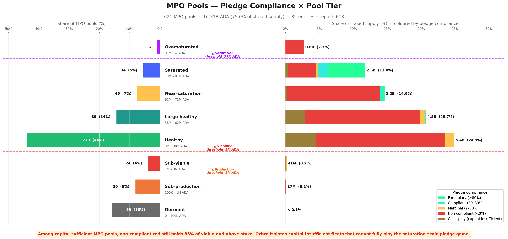

The entity-level breakdown below shows exactly who sits where — each sub-bar is one entity's pools within a tier × stance group:

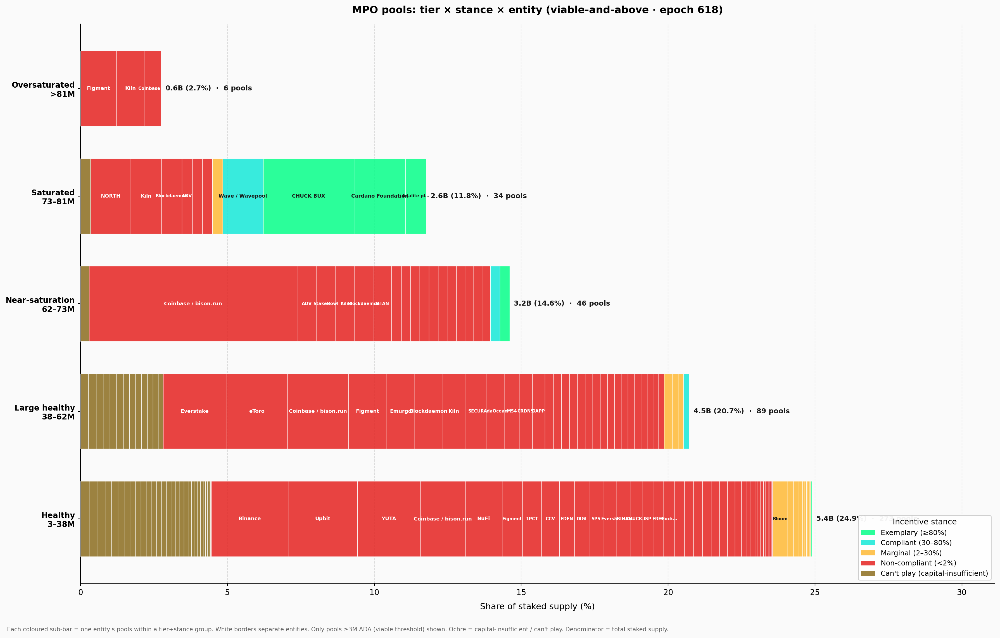

A third view isolates only the **capital-sufficient non-compliant** entities and recolours the bars by **pool-size tier** rather than by stance. The left panel shows fleet composition; the right panel shows where the stake sits:


The most striking observation is that **capital-sufficient non-compliance is not a small-pool problem** — it is a *scale* phenomenon. Among capital-sufficient MPOs, non-compliant entities still dominate *every viable-and-above tier*, from Healthy through Oversaturated, accounting for **82.9% of capital-sufficient viable MPO stake**. Nearly all of the **12.00B ADA** held by these entities — **over 99%** — already sits in viable-and-above pools. The intuition that low-pledge MPOs are marginal, under-resourced operators is flatly contradicted by the data: the largest single non-compliant fleet, **Coinbase / bison.run** (2.45B ADA), is one of the most operationally successful entities on the network.

> **Finding F4.5 — Capital-sufficient non-compliance is a scale phenomenon, not a small-pool problem.** Non-compliant entities hold 82.9% of capital-sufficient viable MPO stake and dominate every tier from Healthy through Oversaturated. Over 99% of their 12.00B ADA already sits in viable-and-above pools.

This non-compliance is also **widely spread across the tier spectrum**. Across the **41 capital-sufficient non-compliant entities**, live stake splits between Healthy (**4.07B ADA**), Large healthy (**3.49B**), Near-saturation (**3.03B**), and Saturated or Oversaturated (**1.50B**), while only **~42M ADA** sits below viability. No single size bucket contains the problem. This matters for mechanism design: if non-compliance were confined to one tier, a targeted parameter adjustment might address it. Instead, any change to $z_0$, $minPoolCost$, or $a_0$ would ripple across *all* tiers — affecting compliant operators alongside the non-compliant ones it aims to reach.

> **Finding F4.6 — Non-compliance is spread across the full tier spectrum with no single-tier concentration.** Stake splits across Healthy (4.07B), Large healthy (3.49B), Near-saturation (3.03B), and Saturated/Oversaturated (1.50B). Any parameter change to $z_0$, $minPoolCost$, or $a_0$ ripples across all tiers — affecting compliant operators alongside the non-compliant ones.

The **can't-play** population is different in cause but not in surface footprint. Of its **1.74B ADA**, fully **1.72B** already sits in viable-and-above pools, concentrated mostly in **Healthy (0.97B)** and **Large healthy (0.61B)**. So isolating capital-insufficient fleets does **not** reveal a dormant micro-pool fringe. It reveals a second structural population of MPOs that are operationally real, often viable, but still too small in aggregate for the saturation-level pledge game to be the right behavioural lens.

The entity profiles reinforce this pattern. **Upbit** and **YUTA** remain almost pure Healthy-tier non-compliant operators. **Binance** remains visibly bimodal — a healthy core alongside a long Dormant/Sub-production tail. **Kiln**, **Blockdaemon**, **eToro**, and **Everstake** skew upward into Large healthy, Saturated, or Oversaturated tiers, showing that the pledge signal remains ignored even once pools are already operating at scale. The capital-insufficient long tail, meanwhile, also clusters mostly in Healthy and Large healthy bands rather than in the fringe of dormant micro-pools.

On the other side of the spectrum, **exemplary compliance exists only at saturation scale**: **Cardano Foundation** and **Adalite** self-pledge tens of millions of ADA per pool to reach the ≥80% threshold at $z_0 = 77M$. The **compliant class** (**Wave**, **Bloom**, **CHUCK BUX**) appears in Near-saturation and Healthy tiers with 30–80% pledge ratios — proof that meaningful bonus capture *is* feasible at mid-scale, but only for operators who **own** their delegated stake. The **marginal class**, by contrast, is nearly empty among MPOs: just **ATADA** and **ACL**.

#### 4.2.5 Conclusion

**What the [*Incentive Mechanism Analysis*](https://github.com/input-output-hk/spo-incentives/blob/main/report.pdf) established.** Lopez de Lara (2025) identified multi-pool operators as a significant presence in the landscape and flagged exchange-custody stake as structurally outside the pledge mechanism. The analysis treated MPOs as a single population and recommended excluding CEX entities from baseline calculations.

**What this analysis adds.** The single-population framing obscures three distinct sub-populations with fundamentally different relationships to the pledge mechanism. Attribution of 85 entities across 901 pools reveals that 75% of staked supply is controlled by MPOs — but these entities split into capital-sufficient (48) and capital-insufficient (37) classes, and further into ten archetypes with different delegation sources, operating models, and structural constraints. The compliance classification shows that non-compliance is not a fringe pattern but the overwhelming norm among capital-sufficient MPOs (41 of 48), and that the cost of that non-compliance (550K ADA/epoch) is concentrated in a handful of large entities for whom the penalty is a modest tax, not a deterrent. The tier × stance cross-analysis confirms that non-compliance spans *every* viable tier — it is a scale phenomenon, not a small-pool problem.

> **Finding F4.1 — 85 MPO entities operate 901 pools holding 16.4B ADA — 75.4% of participating stake.** Three quarters of the network's economic weight is controlled by entities running multiple pools.
>
> **Finding F4.2 — 48 capital-sufficient MPOs (14.5B ADA) could play the pledge game; 37 capital-insufficient MPOs (1.74B ADA) cannot.** Scale determines access — nearly half of MPO entities are sub-scale for the saturation-level pledge game.
>
> **Finding F4.3 — 41 of 48 capital-sufficient MPOs are non-compliant — they forfeit ~550K ADA/epoch in pledge bonus.** 86.5% of MPO-attributable waste comes from this group. The responsive middle is tiny: 2 marginal, 3 compliant, 2 exemplary.
>
> **Finding F4.4 — CEX + IVaaS alone hold 7.39B ADA (19.2% of supply) at structurally zero pledge.** Their non-compliance is not strategic — it is structural. No parameter change can move this stake into the pledge game.
>
> **Finding F4.5 — Capital-sufficient non-compliance is a scale phenomenon, not a small-pool problem.** Non-compliant entities hold 82.9% of capital-sufficient viable MPO stake and dominate every tier from Healthy through Oversaturated. Over 99% of their 12.00B ADA already sits in viable-and-above pools.
>
> **Finding F4.6 — Non-compliance is spread across the full tier spectrum with no single-tier concentration.** Stake splits across Healthy (4.07B), Large healthy (3.49B), Near-saturation (3.03B), and Saturated/Oversaturated (1.50B). Any parameter change ripples across all tiers — affecting compliant operators alongside the non-compliant ones.
>
> **Finding F4.7 — The pledge mechanism's entire output rests on 3 entities — one of which pledges by mandate, not incentive.** Among MPOs that actively pledge, 3 exemplary entities capture 82% of all bonus ADA (107K of 131K ADA/epoch). Cardano Foundation (33% of the exemplary bonus) pledges by institutional obligation, not economic incentive. The remaining two private entities (Chuck/Bux, Adalite) account for 67% of all bonus captured by pledging MPOs. A mechanism designed to differentiate 500 pools has collapsed into a transfer to two.

The double asymmetry is now sharp: **1.74B ADA of MPO stake cannot enter the game**, and another **12.00B ADA could enter it but largely does not**. This is not a calibration gap that parameter tuning can close — it is a structural mismatch between the mechanism's assumptions and the operator populations that now dominate the stake landscape. §4.3 turns to the remaining 25% of stake: the unattributed single-pool operators who are the intended beneficiaries of any reform.

### 4.3 The remaining single-pool operators

The entity-level analysis above accounts for **16.3B ADA** across 85 MPO entities. The remaining **2,097 pools** carrying **5.44B ADA** (25% of staked supply) are the unattributed single-pool operators — individuals, small teams, and community projects running one pool with their own stake and organic delegation. These are the operators the reward sharing scheme was originally designed for, and they are the population most affected by any parameter reform.

#### 4.3.1 Tier distribution — what MPO removal reveals

**Reassessing the [*Incentive Mechanism Analysis*](https://github.com/input-output-hk/spo-incentives/blob/main/report.pdf)'s landscape.** Lopez de Lara (2025) classified all 2,919 non-retired pools at epoch 583 into four viability tiers, treating each pool as an independent actor:

- **Inactive** — 1,305 pools (44%), 47M ADA. Unmet pledge, no blocks, no updates.
- **Struggling** — 627 pools (22%), 191M ADA. Active but below 3M ADA stake and below the cumulative reward break-even point.
- **Viable but small** — 246 pools (8%), 368M ADA. Below 3M ADA stake but earning enough to cover costs.
- **Healthy** — 741 pools (26%), 21.14B ADA. Above the 3M ADA viability line, consistent production, financially sustainable.

That headline — *741 healthy pools controlling 97% of stake* — was presented as evidence of a functioning incentive scheme. The question this section answers: **how many of those 741 pools were independent operators, and how many were fleet members of multi-pool entities?**

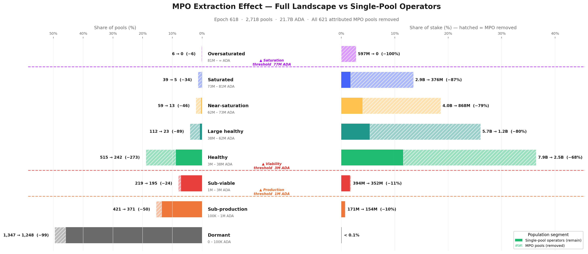

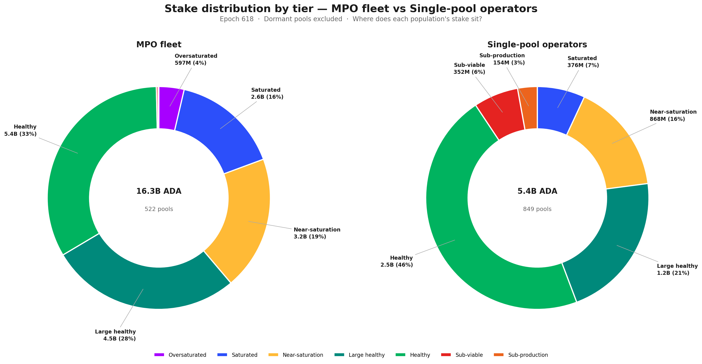

The extraction effect is starkly asymmetric. Below viability, MPO pools are rare — only **9%** of below-viable pools are MPO fleet members. Above viability, MPOs dominate: **53%** of Healthy pools, **79%** of Large healthy, **87%** of Saturated, and **100%** of Oversaturated. The higher the tier, the greater the MPO share.

Mapping the [*Incentive Mechanism Analysis*](https://github.com/input-output-hk/spo-incentives/blob/main/report.pdf)'s categories to our finer tier taxonomy and applying entity attribution:

- **Inactive (1,305 pools)** → mostly Dormant and Sub-production in our taxonomy. MPO presence is low (~9%). This category is essentially unchanged by entity attribution — the long tail of inactive pools is genuinely independent.
- **Struggling (627 pools)** → maps to our Sub-viable and lower Sub-production tiers. MPO share remains modest (~11%). These operators are real — they are independent, they are trying, and they are failing.
- **Viable but small (246 pools)** → straddles the Sub-viable/Healthy boundary. After extraction, the majority remain — these are the community operators the reward scheme was designed for.
- **Healthy (741 pools, 21.14B ADA)** → this is where the picture collapses. Our epoch-618 snapshot shows **731 viable-and-above pools** (the near-identical count confirms structural stability). After removing MPO fleet members, only **283 viable single-pool operators remain** — **61% of the "healthy" headline was MPO pools**. The stake reduction is even more dramatic: from 21.2B to 4.9B ADA — a **77% drop**.

The [*Incentive Mechanism Analysis*](https://github.com/input-output-hk/spo-incentives/blob/main/report.pdf)'s conclusion that "the existence of a large and diverse set of healthy operators is an indicator of the incentive scheme's success" was based on a population that was neither as large nor as diverse as it appeared. The 741 pools were not 741 independent actors making individual economic decisions — they were ~280 independent operators plus ~450 fleet members whose pledge, fee, and delegation strategies were set at the entity level.

> **Finding F5.5 — The [*Incentive Mechanism Analysis*](https://github.com/input-output-hk/spo-incentives/blob/main/report.pdf)'s "741 healthy pools" were 61% MPO fleet members.** After entity attribution, only 283 viable single-pool operators remain (39% of the headline count), holding 4.9B of the original 21.2B viable stake (23%). The competitive field for independent operators is far smaller than the full landscape suggests. The incentive scheme's success should be measured against the 283, not the 741.

#### 4.3.2 Pledge compliance and the policy-sensitive population

With MPOs removed, the single-pool landscape can be evaluated on its own terms: do independent operators behave differently with respect to pledge?

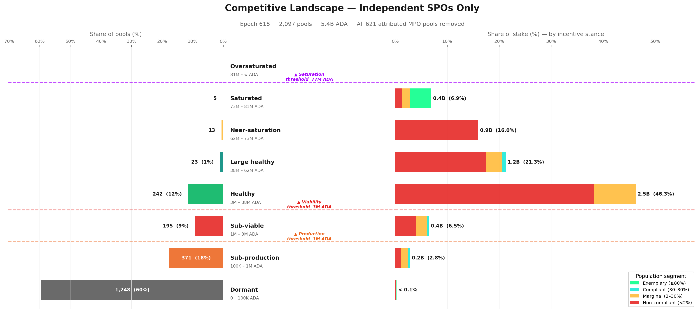

The single-pool landscape is dominated by a **massive below-viability tail** — **1,814 pools (87%)** sit below the viability threshold, carrying only **0.52B ADA (9.5%)** of single-pool stake. The **Healthy tier** (3M–38.5M ADA) is the centre of gravity: **242 pools** holding **2.52B ADA (46%)**. Above it, the tiers thin out rapidly — reaching Near-saturation as an independent single-pool operator, without custodial or institutional delegation, is genuinely rare (13 pools). The Saturated tier contains only **5 pools**, and no single-pool operator reaches Oversaturated.

Applying the pledge-compliance classification from §4.2.4.1 to this population:

| Stance | Pools | Stake (B ₳) | % of single-pool stake | Reading |
| --- | ---: | ---: | ---: | --- |
| **Non-compliant** | 905 | 4.25 | 78.1% | The large majority — pledge signal too weak at their scale |
| **Marginal** | 561 | 0.87 | 16.1% | Operators who *partially* pledge (2–30%) — the policy-sensitive population |
| **Exemplary** | 360 | 0.23 | 4.3% | Self-staked micro-pools and a handful of high-pledge community operators |
| **Compliant** | 271 | 0.08 | 1.5% | Mostly very small pools with high pledge ratios but negligible stake |

Without MPO stake, the exemplary and compliant classes are economically negligible — **5.8% of single-pool stake combined**. The pledge bonus, at current $a_0$, does not meaningfully reward community operators. Nearly **78%** of independent stake is non-compliant — not because operators are irrational, but because the incentive is *correctly priced as irrelevant* at their scale. The Healthy core that anchors the single-pool landscape sits almost entirely in the non-compliant band.

**The marginal operators — the policy-sensitive population.** The **561 marginal single-pool operators** (0.87B ADA, 16.1% of single-pool stake) sit at the decision boundary. These operators partially pledge — enough to show awareness of the mechanism, not enough to capture a significant share of the bonus. They are the population most likely to respond to a parameter change: already engaged with the pledge concept, but not yet committed at a level where the current reward justifies further capital lock-up.

For mechanism design, this is the highest-return target. A reformed pledge curve that differentiates at realistic pledge levels (100K–10M ADA) rather than at saturation scale could shift this population toward higher compliance — provided the marginal reward exceeds the opportunity cost of locking additional capital.

#### 4.3.3 Historical evolution — has the single-pool landscape always looked like this?

The tier and pledge snapshots above describe the current state. But the single-pool population is not static — pools enter, exit, grow, and shrink across epochs. To understand whether the current picture is a recent development or a long-standing structural feature, the chart below tracks today's single-pool basket backwards through pool history, reconstructing each pool's pledge stance at every past epoch from on-chain pool update records.

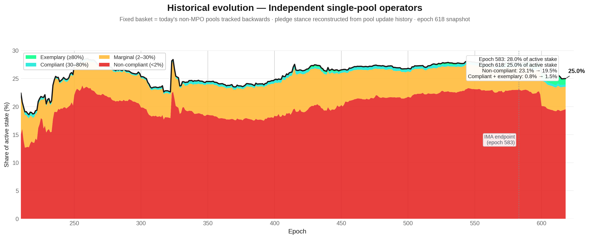

The answer is unambiguous: **the single-pool landscape has been structurally stable since the early Shelley era.** Independent operators have held between 20% and 28% of active stake since epoch ~250, with the non-compliant band (red) consistently dominating — typically 75–80% of the SPO share. The marginal band (amber) has hovered at 4–6% throughout, and the compliant + exemplary sliver has never exceeded 2% until the very recent epochs.

Two features stand out. First, the **drop from ~28% to ~25%** between epoch 583 (the [*Incentive Mechanism Analysis*](https://github.com/input-output-hk/spo-incentives/blob/main/report.pdf)'s endpoint) and epoch 618. This is not noise — it reflects a real decline in independent operator stake share, likely driven by delegation migrating toward MPO fleets offering lower margins and higher reliability. The competitive landscape for single-pool operators is *shrinking*, not growing.

Second, the **composition within the band has barely moved**. Non-compliant stake was 23.1% at epoch 583 and is 19.5% at epoch 618 — the drop tracks the overall decline, not a shift toward compliance. The compliant + exemplary slice improved from 0.8% to 1.5%, but this remains negligible in absolute terms. The pledge mechanism has not produced a behavioural transition among independent operators over any time horizon visible in the data.

> **Finding F3.10 — The single-pool landscape is in slow structural decline.** Independent operators' share of active stake has fallen from 28.0% to 25.0% since epoch 583 — a 3 percentage-point loss in 35 epochs. The internal pledge composition has barely changed: non-compliant stake dominates now just as it did at the start of the Shelley era.

#### 4.3.4 Conclusion

> **Finding F3.7 — The [*Incentive Mechanism Analysis*](https://github.com/input-output-hk/spo-incentives/blob/main/report.pdf) overstated the competitive field by 3×.** The headline of 741 healthy pools collapses to 283 independent operators once MPO fleet members are removed. The "large and diverse" ecosystem presented as evidence of a functioning incentive scheme was 61% multi-pool fleet members operating under entity-level strategies unrelated to single-pool economics.

> **Finding F3.8 — Independent operators do not pledge better — they pledge *worse*.** 78% of single-pool stake is non-compliant (pledge ratio < 2%). The compliant and exemplary classes combined hold only 5.8% of single-pool stake — economically negligible. The pledge mechanism, at current $a_0 = 0.3$, is correctly priced as irrelevant by the very population it was designed to reward.

> **Finding F3.9 — The policy-sensitive population is narrow but real.** 561 marginal operators (16% of single-pool stake) partially pledge — enough to show awareness, not enough to capture meaningful bonus. These are the operators most likely to respond to a reformed pledge curve. Any parameter change should be evaluated against this 16%, not against the 78% non-compliant majority for whom the mechanism is structurally out of reach.

The implication is clear: the reward sharing scheme, as currently parameterised, does not differentiate effectively at the scale where independent operators actually live. The pledge bonus rewards saturation-level commitment that only MPOs and a handful of large community pools can reach. For the 2,097 single-pool operators carrying 5.4B ADA, the mechanism is functionally inert.

### 4.4 The full picture

Section 3 has peeled the pool landscape layer by layer:

- **Structure** (§4.1) — what a pool *can* be, from Dormant to Oversaturated, defined by protocol-derived tier boundaries.
- **Entities** (§4.2) — who actually controls the pools, how many games they play, and whether they respond to the pledge signal.
- **Independent operators** (§4.3) — the community base that remains once the fleets are removed, and how it compares to the [*Incentive Mechanism Analysis*](https://github.com/input-output-hk/spo-incentives/blob/main/report.pdf)'s landscape.

This section reassembles those layers into a single map. The picture that emerges is one of three distinct populations — bad actors, good actors, and a struggling middle — competing on a field where the pledge mechanism reaches only a fraction of the stake it was designed to influence.

#### 4.4.1 The bad actors

The pool-level view — 2,718 registered pools spread across eight tiers — is a statistical illusion. Entity attribution reveals that **85 MPO entities** operate 901 of those pools and control **16.4B ADA — 75% of participating stake** (F4.1). The competitive dynamics, pledge decisions, and delegation flows are governed at the entity level, not the pool level.

The vast majority of these entities do not play the pledge game. Among the 48 MPOs that are capital-sufficient — meaning they hold enough aggregate stake to self-pledge at meaningful ratios — **41 are non-compliant** (F4.3). They forfeit **~550K ADA/epoch** (~40.2M/year) in pledge bonus and absorb the cost without changing behaviour.

The non-compliance has two distinct causes:

- **Architectural** (can't play). CEX and IVaaS operators — Coinbase, Binance, Upbit, Kiln, Figment, Everstake, and others — hold **7.39B ADA** at structurally zero pledge (F4.4). Exchanges cannot pledge customer deposits; validator-as-a-service providers do not own the institutional stake they operate. No parameter change can bring this capital into the pledge game.

- **Strategic** (won't play). The remaining capital-sufficient fleets *could* pledge, but the reward trade-off is too weak. At $a_0 = 0.3$, the penalty amounts to 11–21% of maximum reward for the biggest offenders — a modest tax, not a deterrent. These actors are not maximizing within the reward sharing scheme alone; they optimize across a broader landscape where custody constraints, governance posture, brand continuity, and adjacent business lines all dominate the pledge signal. This is ***multi-game optimization***.

Adding the 37 capital-insufficient MPOs (who are multi-pool by form but single-pool-like in economics), the non-responsive population totals **78 of 85 entities**, accounting for:

- **13.74B ADA** — 63.2% of active stake
- **636.8K ADA/epoch** in pledge waste — 82.7% of the network total
- Every tier from Healthy (4.07B) through Oversaturated (1.50B) — meaning any parameter adjustment ripples across the full spectrum (F4.5, F4.6)

#### 4.4.2 The good actors

A handful of entities demonstrate that high pledge *is* achievable at scale:

| Entity | Bonus capture | Type |
| --- | ---: | --- |
| Cardano Foundation | 93.9% | Institutional mandate |
| Chuck / Bux | 81.1% | Private choice |
| Liqwid | 73.9% | Private choice |
| Wave | 63.9% | Private choice |

These are deliberate capital commitments, not accidents. But the mechanism's entire MPO output rests on **3 entities**, one of which (Cardano Foundation) pledges by institutional mandate rather than economic incentive (F4.7). Two private entities — Chuck/Bux and Adalite — account for **67%** of all bonus captured by pledging MPOs. A mechanism designed to differentiate 500 pools has collapsed into a transfer to two.

Among single-pool operators, **360 exemplary pools** self-pledge at high ratios, proving that small operators *can* play. But they hold only **0.23B ADA** in aggregate — economically marginal. The good actors exist; they are too few and too small to anchor the mechanism.

#### 4.4.3 The struggling middle

The operators the reward sharing scheme was originally designed for — independent, single-pool, community-run — are the population most affected by this landscape and least served by the current mechanism.

**The field is far smaller than it appears.** The [*Incentive Mechanism Analysis*](https://github.com/input-output-hk/spo-incentives/blob/main/report.pdf)'s headline of 741 healthy pools collapses to **283 independent viable operators** once MPO fleet members are removed — the other 61% were fleet pools operating under entity-level strategies unrelated to single-pool economics (F3.7). The 2,097 single-pool operators that remain hold **5.44B ADA**, 25% of staked supply.

**They do not pledge better than MPOs — they pledge *worse*.** 78% of single-pool stake is non-compliant (pledge ratio < 2%). The compliant + exemplary classes combined hold just **5.8%** of the basket — economically negligible (F3.8). The pledge mechanism, at current $a_0 = 0.3$, is correctly priced as irrelevant by the very population it was designed to reward.

**A policy-sensitive population exists, but it is narrow.** 561 marginal operators (16% of single-pool stake) partially pledge — enough to show awareness, not enough to capture meaningful bonus (F3.9). These operators sit at the decision boundary and are the most likely to respond to a reformed pledge curve.

**And the window is closing.** Independent operators' share of active stake has fallen from 28.0% to 25.0% since epoch 583 — a 3 percentage-point loss in 35 epochs. The internal pledge composition has barely moved: non-compliant stake dominates now just as it did at the start of the observation window (F3.10).

#### 4.4.4 The incentive-responsive field

How large is the arena where the pledge mechanism actually has an observable effect?

To measure this, we strip out all pools belonging to non-responsive MPOs. Among the remaining MPO entities, only pools that are at least marginally pledging are retained. The result:

- **2,218 pools** carrying **7.89B ADA** — roughly **36% of active stake**
- Of which **121 retained MPO pools** account for **2.45B ADA**
- Everything outside this perimeter is either structurally unable or strategically unwilling to respond to the pledge signal

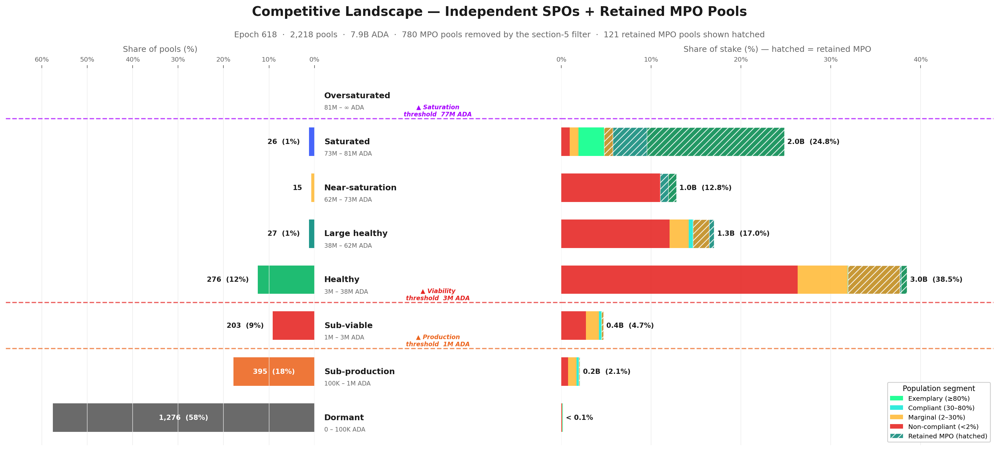

The retained MPOs — 70 marginal, 17 compliant, 34 exemplary — reshape the tier structure when added back. The Saturated tier, nearly empty in the single-pool-only view (§4.3), now carries **2.0B ADA** (24.8% of the filtered basket). These are the only MPO pools where the pledge signal visibly influences behaviour.

The contrast between the two views captures the core asymmetry:

| View | Compliant + exemplary stake | % of basket |
| --- | ---: | ---: |
| Single-pool operators only | 0.32B ADA | 5.8% |
| Filtered proxy (+ retained MPOs) | 2.07B ADA | 26.3% |
| **Multiplier** | | **6.6×** |

The pledge bonus *does* capture meaningful capital — but almost exclusively among operators who already sit at or near saturation scale. For the vast majority of independent operators, the mechanism is functionally inert.

#### 4.4.5 The structural mismatch

The reward sharing scheme was designed for a world of independent, single-pool operators competing on pledge commitment. The world that exists is fundamentally different. Three numbers frame the gap:

| Population | Stake | Relationship to pledge |
| --- | ---: | --- |
| Capital-insufficient MPOs | 1.74B ADA | *Cannot* enter the game |
| Capital-sufficient non-compliant MPOs | 12.00B ADA | *Could* enter but do not |
| Independent single-pool operators | 5.44B ADA | Mechanism built for them, but delivers zero differentiation |

The tier boundaries that define all of these populations are themselves dynamic — functions of active stake, fixed costs, and $k$ (F3.5). A CIP proposing $k = 1000$ halves the saturation threshold; a CIP targeting fees reshapes the lower tail entirely (F3.6). Any reform reshapes the terrain it targets.

SL-D1 modelled a single-game world to derive tractable equilibria — this was standard and appropriate. But the on-chain reality is a multi-game environment where **78 of 85 MPO entities** are outside the intended pledge-response path. This is not a marginal edge effect. It explains why the observed pool distribution diverges from the $k$-equilibrium the model predicts, and it defines the actual population structure against which any future reform must be evaluated.


---

## 5. Reproduction

### 5.1 Full rebuild

All figures and data summaries rebuild from a single entry point:

```bash
cd scripts/
bash build_all.sh
```

Or selectively:

```bash
python3 build_pool_distribution_snapshot.py   # snapshot JSON + MD
python3 build_reward_anatomy.py               # reward anatomy JSON
python3 build_reward_anatomy_visual.py
python3 build_playing_field_visual.py
python3 build_pledge_bonus_activation_visual.py
python3 build_saturation_utilisation_visual.py
python3 build_pool_landscape_by_size_visual.py
python3 build_three_thresholds_visual.py
python3 build_mpo_entity_deep_dive.py          # fetches Koios — see §5.2
python3 build_mpo_progression_analysis.py      # reads local history CSV
```

**Requirements:** Python 3.9+, `matplotlib`, `numpy`. No other dependencies.

**Static input data** (self-contained in `data/`, no network required):
- `koios_pool_list_mainnet.csv` — current pool snapshot (one row per pool)
- `koios_pool_history_mainnet.csv` — epoch-by-epoch pool stake timeseries
- `pool_reward_pool_summary_mainnet.csv` — aggregated pool-level rewards
- `pool_reward_epoch_summary_mainnet.csv` — epoch-wide reward totals
- `koios_pool_updates_mainnet.csv` — pool registration/update history
- `mainnet_entity_owner_capital_status_quo.csv` — entity attribution

**MPO derived data** (generated by `build_mpo_entity_deep_dive.py`, checked in for offline use):
- `mpo_entity_summary_mainnet.csv` — one row per attributed entity
- `mpo_entity_pool_mapping_mainnet.csv` — pool → entity mapping
- `mpo_entity_health_overview_mainnet.csv` — health metrics per entity
- `mpo_unresolved_group_labels_mainnet.csv` — unresolved Koios group labels
- `mpo_progression_proxy_key_epochs_mainnet.csv` — historical concentration at key epochs

### 5.2 Refreshing MPO data

The MPO scripts (`build_mpo_entity_deep_dive.py` and `build_mpo_progression_analysis.py`) fetch live data from the [Koios REST API](https://api.koios.rest) and require an internet connection. They should be re-run whenever a new epoch's pool snapshot is needed.

**Refresh procedure:**

```bash
cd scripts/

# Step 1 — refresh the base pool list and history (if not already done)
# These come from Koios exports — replace data/koios_pool_list_mainnet.csv
# and data/koios_pool_history_mainnet.csv with updated exports.

# Step 2 — re-run the MPO entity analysis (fetches live Koios data)
python3 build_mpo_entity_deep_dive.py

# Step 3 — re-run the progression analysis (reads local history CSV)
python3 build_mpo_progression_analysis.py
```

`build_mpo_entity_deep_dive.py` calls three Koios endpoints:
- `pool_list` — all registered pools with current stake and metadata
- `pool_groups` — Koios-curated group labels (used as a seed for entity attribution)
- `tip` + `totals` — live epoch number and circulating supply

The entity attribution logic (regex patterns, manual overrides, pledge thresholds) is entirely self-contained in the script — no external configuration file is needed. To add or update an entity cluster, edit the `ENTITY_PATTERNS` block near the top of `build_mpo_entity_deep_dive.py`.

---

_Last updated: 2026/03/18_
