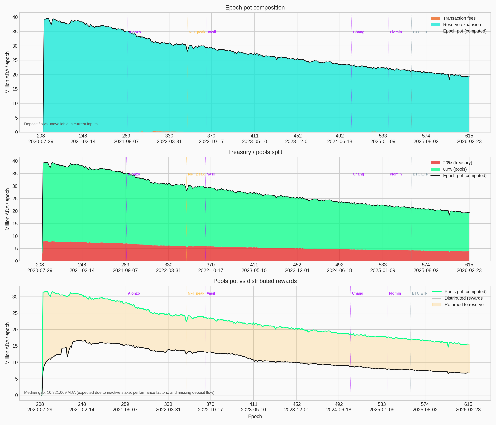
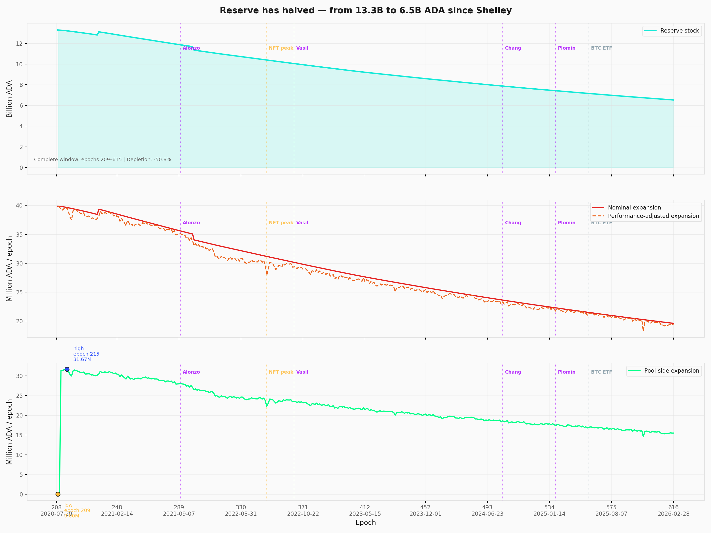
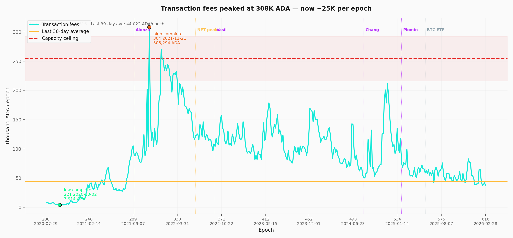
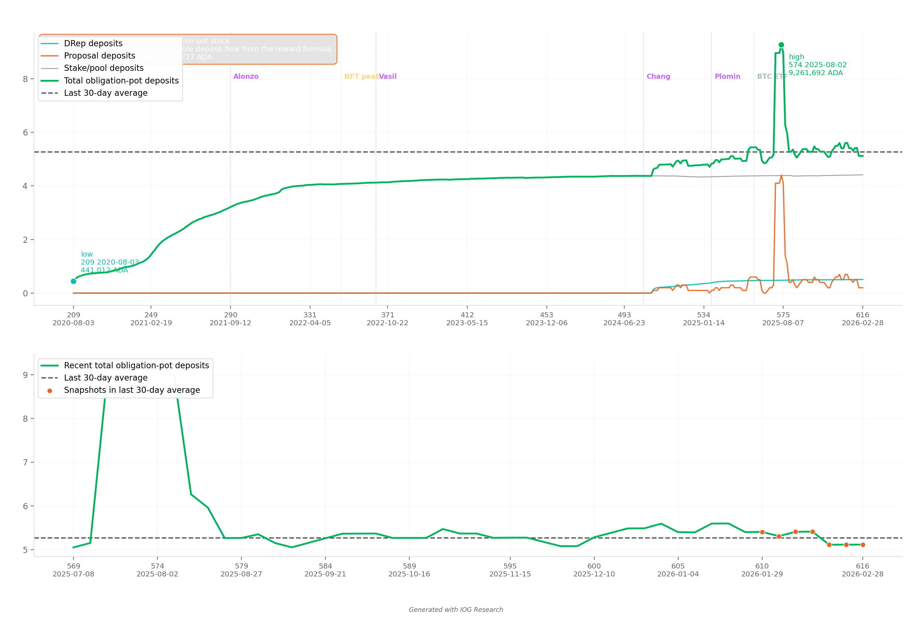
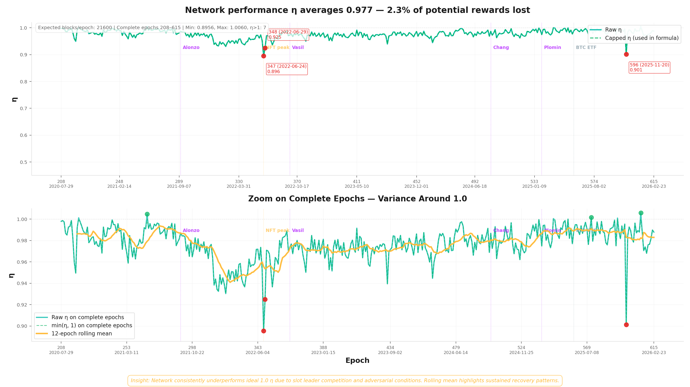
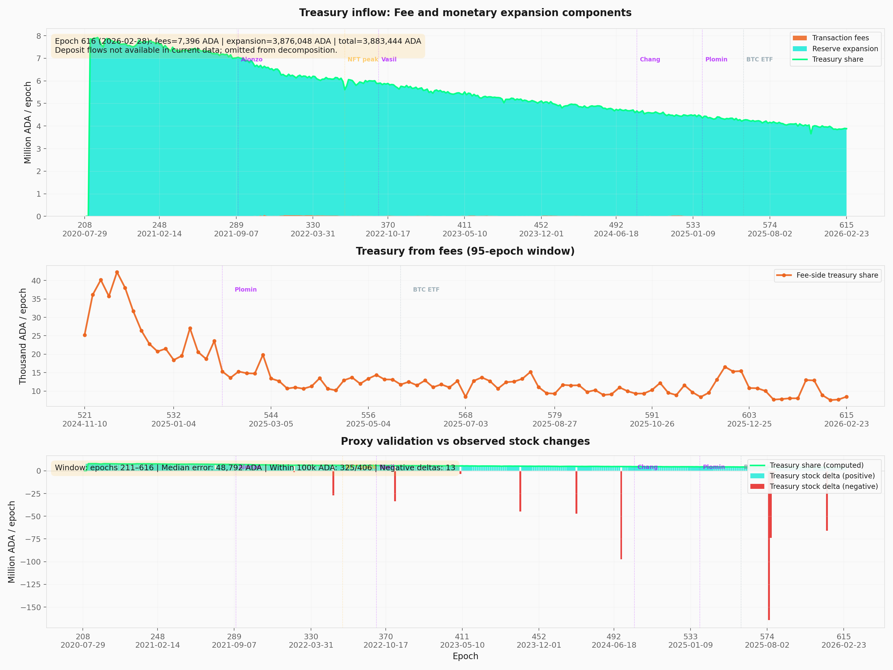
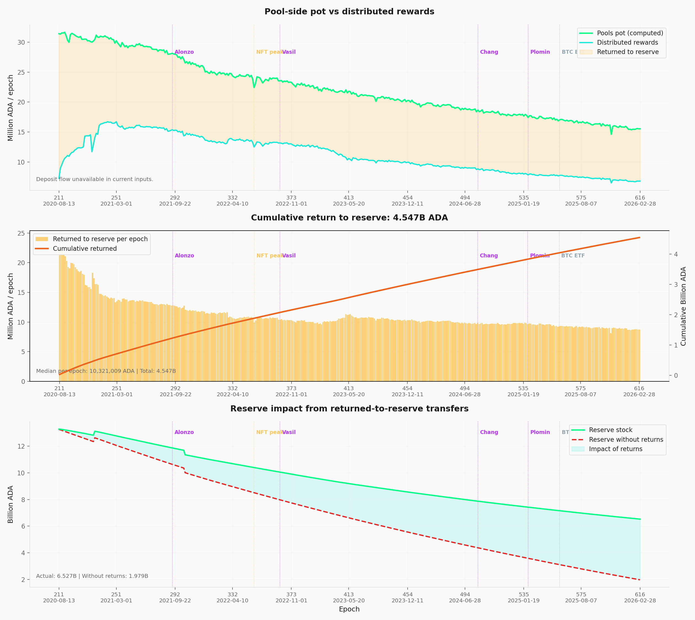

# Treasury & Pool Pots Distribution — Mainnet Analysis

_Built on 2026/03/17 from mainnet data at epoch `618` plus historical analysis from epoch `208` (Shelley inception)._

## Objective

This report documents the **epoch-level reward budget** — the first stage of Cardano's reward pipeline — and traces the structural forces that shape the budget before any individual pool receives a single lovelace. It extends the empirical baseline established in the [*Analysis of Cardano's Incentive Mechanism*](https://github.com/input-output-hk/spo-incentives/blob/main/report.pdf) (Lopez de Lara, 2025; hereafter the *Incentive Mechanism Analysis*).

Every epoch, the protocol assembles a reward pot from three on-chain sources, then splits it between the **treasury** (20%) and the **pools pot** (80%). At epoch 616, the gross pot stood at ~19.4M ADA — but only **6.8M ADA** ultimately reached operators and delegators. This report asks *where the rest goes*, and follows the answer upstream.

The argument proceeds in five steps:

1. **The initial design** (§2). The epoch-pot assembly formula — from the original SL-D1 specification through a reader-friendly rewrite to mainnet parameterization. This establishes the mechanism whose behaviour the rest of the report diagnoses.

2. **Current snapshot** (§3). The epoch-budget pipeline at a single point in time — reserve stock, expansion draw, fee contribution, treasury/pools split, and the gap between allocation and distribution.

3. **Historical analysis** (§4). Seven time-series decompositions covering epochs 208–617: pot composition (§4.1), reserve trajectory (§4.2), fee volatility (§4.3), deposit obligations (§4.4), block-production reliability (§4.5), treasury inflow (§4.6), and the return-to-reserve mechanism (§4.7) that has extended the reserve's life by ~4.55B ADA.

4. **Forward-looking** (§5). Reserve depletion trajectory, the conditions for fee self-sufficiency, and the upcoming events — Leios, governance activation, parameter governance — that will reshape this budget layer.

5. **Scope boundary.** Observations O1–O4 are structural to the epoch-budget layer and fall **outside the scope of the four CIPs** under evaluation (CIP-0023, CIP-0037, CIP-0050, CIP-0082). They document the sustainability context within which all CIP proposals operate. The pool-level distribution analysis continues in the companion report [*The Pools Pot Distribution Gaps*](../../pools-distribution/mainnet-analysis/).

All counts and amounts use the latest complete epoch with reward data (**epoch 616**, ending 2026/03/05) unless stated otherwise. The latest available pool snapshot is **epoch 618**.
Source dataset: `data/reward_epoch_pools_mainnet.csv` (Koios).

## Contents

1. [Mainnet Observations](#1-mainnet-observations)
2. [The initial design](#2-the-initial-design)
   - 2.1 [Formulas](#21-formulas)
      - 2.1.1 [SL-D1 (Original)](#211-sl-d1-original)
      - 2.1.2 [Reader-friendly epoch pot formula](#212-reader-friendly-epoch-pot-formula)
      - 2.1.3 [Mainnet parameterization](#213-mainnet-parameterization)
      - 2.1.4 [Concept glossary](#214-concept-glossary)
   - 2.2 [Design choices](#22-design-choices)
   - 2.3 [Downstream: where the pools pot goes next](#23-downstream-where-the-pools-pot-goes-next)
3. [Current snapshot](#3-current-snapshot)
4. [Historical](#4-historical)
   - [4.1 Epoch pot composition](#41-epoch-pot-composition)
   - [4.2 Reserve stock and monetary expansion](#42-reserve-stock-and-monetary-expansion)
   - [4.3 Transaction fees](#43-transaction-fees)
   - [4.4 Deposit obligations](#44-deposit-obligations)
   - [4.5 Block-production ratio (η)](#45-block-production-ratio-η)
   - [4.6 Treasury inflow decomposition](#46-treasury-inflow-decomposition)
   - [4.7 Return to reserve](#47-return-to-reserve)
   - [4.8 Protocol parameters](#48-protocol-parameters)
5. [Forward-looking](#5-forward-looking)
   - [5.1 Reserve depletion trajectory](#51-reserve-depletion-trajectory)
   - [5.2 Fee-to-expansion crossover](#52-fee-to-expansion-crossover)
   - [5.3 Upcoming events and risks](#53-upcoming-events-and-risks)
6. [Reproduction](#6-reproduction)
   - 6.1 [Full rebuild](#61-full-rebuild)

---

## 1. Mainnet Observations

| # | Observation | Section | Nature |
| --- | --- | --- | --- |
| | **O1 — The epoch pot is a single-source budget** | | |
| F1.1 | Monetary expansion dominates the epoch pot (~99.8%) | §4.1 | Structural — unchanged since Shelley |
| F1.2 | Fee revenue is structurally insufficient — even at full capacity, fees cover ~1.3% of expansion | §4.3, §5.2 | Structural — 12–16× capacity gap |
| F1.3 | Deposit contribution is small and unmeasurable at epoch granularity | §4.4 | Data limitation — Koios coverage |
| F1.4 | SPOs produce ~97% of their assigned blocks — the pot assembles reliably | §4.5 | Structural — avg η = 0.977 |
| | **O2 — The reserve has crossed its half-life** | | |
| F2.1 | Reserve is half-depleted (−50.95%) in 5.5 years | §4.2 | Structural — exponential decay |
| F2.2 | Significant reward pressure expected at epochs 1000–1200 | §5.1 | Projected — ~2028–2029 |
| | **O3 — The reward mechanism operates at ~44% of its potential** | | |
| F3.1 | Only ~44% of the pools pot is distributed to operators and delegators — the rest returns to the reserve | §4.7 | Epoch 616 — 6.8M of 15.5M ADA |
| F3.2 | 4.55B ADA cumulative (~70% of current reserve) exists because of undistributed rewards | §4.7 | Structural — side-effect, not design |
| F3.3 | The primary driver is inactive stake — ~17B ADA (~44%) does not participate in delegation | §4.7 | Upstream — outside formula control |
| | **O4 — Reward parameters have never been adjusted** | | |
| F4.1 | Treasury split and expansion rate never adjusted since Shelley | §4.8 | Governance — τ = 20%, ρ = 0.3% constant |

### The big picture

Five and a half years after Shelley, the epoch-budget stage tells a clear story: **the system works, but it runs on a finite fuel supply that is now half-spent.**

### O1 — The epoch pot is a single-source budget

The protocol assembles the epoch reward pot from three sources: monetary expansion, transaction fees, and deposit flows. In practice only one matters.

**Monetary expansion: ~99.8% of the pot** (F1.1). Every epoch, 0.3% of the reserve is drawn. This has dominated the pot in every single epoch since Shelley — fees have never crossed 3%, even during peak NFT/DeFi activity.

**Transaction fees: ~0.19% of the pot** (F1.2). At current levels, fees are negligible. Even at full realistic network capacity (3.1 TPS, ~1.34M tx/epoch), fee revenue would reach only ~254K ADA/epoch — barely 1.3% of the reserve expansion term. Reaching fee self-sufficiency would require **12–16× today's realistic maximum throughput**: both a capacity upgrade (Leios) and a fundamental shift in transaction demand.

**Deposits: unmeasurable at epoch granularity** (F1.3). The non-refundable deposit flow is not directly available in the Koios dataset. Cross-validation shows a median gap of only ~49K ADA against treasury stock deltas — a rounding error.

**Block production: the pot assembles reliably** (F1.4). SPOs produce ~97% of their assigned blocks on average (η = 0.977). The pot assembly mechanism works as intended — block production is not a bottleneck.

### O2 — The reserve has crossed its half-life

The reserve has gone from **13.29B to 6.53B ADA** — half depleted in ~5.5 years (F2.1). The decline is exponential: each epoch draws 0.3% of whatever remains, so the absolute draw shrinks over time. The nominal expansion has already halved, from ~39.9M to ~19.5M ADA/epoch.

**Projected timeline** (F2.2). At current parameters and participation levels, the reserve reaches ~2B ADA around epochs 1000–1200 (~2028–2029) — at which point per-epoch rewards drop significantly. Full depletion is projected around epoch 3500 (~2040s).

### O3 — The reward mechanism operates at ~44% of its potential

Every epoch, the protocol allocates ~15.5M ADA to the pools pot. Only **~6.8M ADA (~44%) is actually distributed as rewards** to operators and delegators — the remaining ~8.7M returns to the reserve (F3.1).

This is not a small leak. Over 400+ epochs, **4.55B ADA** has flowed back to the reserve through this mechanism — roughly **70% of the current reserve stock** exists because rewards were not fully distributed (F3.2). It is the single biggest reason the reserve has lasted as long as it has.

The root cause is straightforward: **the staking mechanism is half-utilised** (F3.3). Out of ~38.5B ADA in circulation, only ~21.6B (~56%) participates in delegation. The remaining ~17B ADA sits outside the system entirely — it earns no rewards, but it still dilutes the distribution. If that inactive stake were to enter consensus — through governance incentives, exchange staking changes, or new delegation products — this buffer would shrink and reserve depletion would accelerate.

This creates a paradox: the return-to-reserve mechanism slows depletion, but it is a side effect of low participation, not a design feature. Greater adoption — normally desirable — would remove this safety margin.

### O4 — Reward parameters have never been adjusted

The two parameters that shape this entire pipeline — the monetary expansion rate ($\rho = 0.3\%$) and the treasury rate ($\tau = 20\%$) — have **never been adjusted** since Shelley inception (F4.1). The decentralisation parameter $d$ was gradually reduced to 0 and $k$ was raised from 150 to 500, but the reward-level parameters remain at their day-one values. Neither has been the subject of a formal governance proposal.

> **Scope note.** Observations O1–O4 are structural to the epoch-budget layer and fall **outside the scope of the four CIPs** under evaluation (CIP-0023, CIP-0037, CIP-0050, CIP-0082). They document the sustainability context within which all CIP proposals operate, and distinguish them from the problems the CIPs actually target — at the pool-distribution and operator/delegator layers downstream.

---

## 2. The initial design

The epoch-pot assembly and treasury/pools split analysed in this report were specified in [*Design Specification for Delegation and Incentives in Cardano*](https://github.com/IntersectMBO/cardano-ledger/releases/latest/download/shelley-delegation.pdf) (Kant, Brünjes & Coutts, IOHK, 2019 — deliverable **SL-D1**). The mechanism has been operational on mainnet since the Shelley hard fork on 2020/07/29 and its governing parameters ($\rho$, $\tau$) have never been modified since.

This section presents the formula in three layers — the original SL-D1 notation, a reader-friendly rewrite, and the mainnet-parameterized form — then identifies the two design choices that matter most for the empirical analysis that follows.

### 2.1 Formulas

#### 2.1.1 SL-D1 (Original)

The design spec defines the **gross epoch pot** — the total ADA entering the reward pipeline each epoch:

$$
Pot^{\text{epoch}}
:=
F + D + \min(\eta,1)\,\rho\,(T_{\infty}-T)
$$

Then, the **treasury/pools split** — a single parameter $\tau$ determines how the pot is divided:

$$
R
:=
(1-\tau)\,Pot^{\text{epoch}}
$$

$$
TreasuryPot^{\text{epoch}}
:=
\tau\,Pot^{\text{epoch}}
$$

> **Reading note.** $F$ = transaction fees, $D$ = non-refundable deposits, $\eta$ = block-production ratio ($Blocks_{\text{produced}}/Blocks_{\text{expected}}$), $\rho$ = monetary expansion rate, $(T_{\infty}-T)$ = remaining reserve. The full mapping to reader-friendly names is in the glossary (§2.1.4).

#### 2.1.2 Reader-friendly epoch pot formula

Same logic, with self-documenting names. The epoch pot aggregates **three inputs** — fees, deposits, and a reserve draw gated by the block-production ratio:

$$
Pot^{\text{epoch}}
= Fee^{\text{epoch}}_{\text{tx}}
+
Deposit^{\text{epoch}}_{\text{nonRefundable}}
+
\min\left(\frac{Blocks^{\text{epoch}}_{\text{produced}}}{Blocks^{\text{epoch}}_{\text{expected}}},1\right)\rho^{\text{monetaryExpansion}}_{\text{rate}}\left(Supply^{\text{system}}_{\text{total}}-Supply^{\text{system}}_{\text{circulating}}\right)
$$

The split is then purely multiplicative — no pool-level logic is involved:

$$
PoolsPot^{\text{epoch}}
:=
(1-\tau^{\text{treasury}}_{\text{rate}})\,Pot^{\text{epoch}}
$$

$$
TreasuryPot^{\text{epoch}}
:=
\tau^{\text{treasury}}_{\text{rate}}\,Pot^{\text{epoch}}
$$

Conservation — the split is exhaustive, nothing is lost:

$$
PoolsPot^{\text{epoch}} + TreasuryPot^{\text{epoch}}
= Pot^{\text{epoch}}
$$

#### 2.1.3 Mainnet parameterization

Substituting the current mainnet protocol parameters ($\rho = 0.3\%$, $\tau = 20\%$, 21,600 expected blocks per epoch, 45 billion max supply):

$$
Pot^{\text{epoch}}
= Fee^{\text{epoch}}_{\text{tx}}
+
Deposit^{\text{epoch}}_{\text{nonRefundable}}
+
\min\left(\frac{Blocks^{\text{epoch}}_{\text{produced}}}{21{,}600},1\right)\cdot 0.3\% \cdot \left(45\,\text{billion} - Supply^{\text{system}}_{\text{circulating}}\right)
$$

$$
PoolsPot^{\text{epoch}}
:=
80\% \cdot Pot^{\text{epoch}}
$$

$$
TreasuryPot^{\text{epoch}}
:=
20\% \cdot Pot^{\text{epoch}}
$$

At epoch 616, this produces:

| Component | Value | Share of pot |
| --- | ---: | ---: |
| Reserve-sourced expansion ($\rho \times \text{Reserve}$) | 19.38M ADA | 99.81% |
| Transaction fees | 36,978 ADA | 0.19% |
| Deposits | unmeasurable | ~0% |
| **Gross epoch pot** | **~19.42M ADA** | **100%** |
| Treasury cut ($\tau = 20\%$) | 3.88M ADA | 20% |
| **Pools pot** ($1-\tau = 80\%$) | **15.53M ADA** | **80%** |

#### 2.1.4 Concept glossary

| SL-D1 | Reader-Friendly | Meaning | Mainnet baseline |
| --- | --- | --- | --- |
| $F$ | $Fee^{\text{epoch}}_{\text{tx}}$ | Epoch transaction fees | Dynamic |
| $D$ | $Deposit^{\text{epoch}}_{\text{nonRefundable}}$ | Epoch non-refundable deposits | Dynamic |
| $\eta$ | $\frac{Blocks^{\text{epoch}}_{\text{produced}}}{Blocks^{\text{epoch}}_{\text{expected}}}$ | Epoch block-production ratio | $Blocks^{\text{epoch}}_{\text{expected}}=21{,}600$ |
| $\rho$ | $\rho^{\text{monetaryExpansion}}_{\text{rate}}$ | Monetary expansion rate | $0.3\%$ |
| $T_{\infty}-T$ | $Supply^{\text{system}}_{\text{total}}-Supply^{\text{system}}_{\text{circulating}}$ | Reserve entering the monetary-expansion term | $45\,\text{billion} - Supply^{\text{system}}_{\text{circulating}}$ |
| $\tau$ | $\tau^{\text{treasury}}_{\text{rate}}$ | Treasury take rate | $20\%$ treasury / $80\%$ pools |
| $R$ | $PoolsPot^{\text{epoch}}$ | Pool-side share of the epoch pot | $80\% \cdot Pot^{\text{epoch}}$ |
| n/a | $TreasuryPot^{\text{epoch}}$ | Treasury-side share of the epoch pot | $20\% \cdot Pot^{\text{epoch}}$ |

### 2.2 Design choices

Two design choices embedded at this stage matter for the rest of the analysis:

- **Cooperative-behavior gate.** The monetary expansion draw is scaled by $\min(\eta, 1)$ — the ratio of blocks actually produced to blocks expected. If pools collectively miss slots, the entire epoch pot shrinks. This discourages sabotage but also means the pot depends on aggregate network health. On mainnet, $\eta$ has averaged 0.977 since Shelley — the gate is satisfied but never binding (§4.5).

- **Fixed split rule.** The treasury/pools ratio is a protocol constant ($\tau$), not a function of network activity or reserve level. It does not adapt as the balance between fees and expansion shifts over time. Both $\rho$ and $\tau$ have been unchanged since Shelley (§4.8).

A third property is structural rather than a parameter choice:

- **Single-source dominance.** Although the formula admits three inputs, monetary expansion accounts for ~99.8% of the epoch pot on mainnet (§4.1). The pot's trajectory is therefore determined almost entirely by the reserve stock and $\rho$. Transaction fees and deposits are second-order corrections — a condition that will only change when fee revenue grows by at least an order of magnitude (§5.2).

### 2.3 Downstream: where the pools pot goes next

The pools pot ($PoolsPot^{\text{epoch}}$) produced by this stage is the **total budget** entering the pool-level reward formula. That formula — specified in the same SL-D1 document — distributes the budget across individual pools based on their stake, pledge, and block performance. Any rewards not distributed return to the reserve.

The companion report [*The Pools Pot Distribution Gaps*](../../pools-distribution/mainnet-analysis/) analyses the pool-distribution stage in full, including the SL-D1 reward curve, its normalized rewrite, and the efficiency and behavioural analysis of mainnet outcomes.

At epoch 616, of the 15.53M ADA entering the pool-distribution stage, only **6.79M ADA (43.7%) was distributed** to operators and delegators. The rest returned to the reserve — primarily because ~43.5% of circulating ADA does not participate in delegation. This return-to-reserve mechanism is analysed in §4.7 and its implications for reserve sustainability in §5.1.

---

## 3. Current snapshot

Reference epoch: **616** (2026/02/28 – 2026/03/05), latest complete epoch with reward data. The formulas in §2 produce the values below.

| Metric | Value |
| --- | --- |
| Reserve stock | **6.53B ADA** (down 50.87% from Shelley inception) |
| Monetary expansion rate ($\rho$) | **0.3%** |
| Treasury rate ($\tau$) | **20%** |
| Block-production ratio (η) | **0.990** (epoch 616) · **0.977** historical average |
| Gross epoch pot proxy | **19.42M ADA** |
| — Reserve-sourced expansion | 19.38M ADA (**99.81%**) |
| — Transaction fees | 36,978 ADA (**0.19%**) |
| Treasury cut (20%) | **3.88M ADA** |
| Pools pot (80%) | **15.53M ADA** |
| Observed paid rewards | **6.79M ADA** |
| Return to reserve (this epoch) | **8.75M ADA** (undistributed) |
| 30-day average fees (epochs 611–616) | **44,022 ADA/epoch** |
| Median return to reserve (epochs 211–616) | **10.32M ADA/epoch** |
| Cumulative return to reserve (epochs 211–616) | **4.55B ADA** (~70% of current reserve) |

---

## 4. Historical

### 4.1 Epoch pot composition



The top panel decomposes the gross epoch pot into its two measurable sources — **reserve-sourced monetary expansion** and **transaction fees** — since Shelley (epoch 208). Monetary expansion has dominated in every single epoch; fees have never exceeded 3% of the pot, even during peak activity (epoch 304, ~308K ADA).

The middle panel shows the resulting **treasury / pools split** ($\tau = 20\%$). Both tracks decline in parallel, reflecting the shrinking reserve.

The bottom panel compares the **pool-side pot proxy** to **observed paid rewards**. The persistent gap (~10.3M ADA/epoch median) represents rewards that were not distributed and returned to the reserve — see §4.7.

### 4.2 Reserve stock and monetary expansion



**Reserve stock** (top panel).
The reserve has fallen from **13.29B ADA** (epoch 209) to **6.52B ADA** (epoch 617) — a decline of **−50.95%** over ~5.5 years.

**Nominal draw** (middle panel).
The nominal monetary expansion ($\rho \times \text{Reserve}$) has decreased from ~39.9M ADA/epoch to ~19.5M ADA/epoch, tracking the reserve decline mechanically.

**Pool-side contribution** (bottom panel).
After applying the treasury cut, decentralisation gate $g(d)$, and block-production ratio, the pool-side reserve term peaked at **31.7M ADA/epoch** (epoch 215, 2020/09/02) and currently sits at ~15.2M ADA/epoch.

The declining trajectory is structural: each epoch draws from a smaller reserve, producing a smaller pot. The monetary expansion rate $\rho = 0.3\%$ has remained constant since Shelley.

### 4.3 Transaction fees



| Metric | Value |
| --- | --- |
| Coverage | Epochs 208–617 |
| 30-day average (epochs 611–616) | **44,022 ADA/epoch** |
| All-time minimum | 3,914 ADA (epoch 221, 2020/10/02) |
| All-time maximum | 308,294 ADA (epoch 304, 2021/11/21) |

Fee revenue is volatile and tracks network activity spikes (NFT minting, DeFi waves), but the structural baseline sits around **30–50K ADA/epoch**.

The **realistic capacity ceiling** (red dashed line on the visual) estimates the maximum fee revenue if the network operated at full realistic throughput: **~254K ADA/epoch** (3.1 TPS × 432,000 s × 0.19 ADA avg fee). Even at this theoretical maximum, fees would cover only **~1.3% of the reserve expansion term** (19.4M ADA at epoch 616). The all-time peak (epoch 304, 308K ADA) briefly exceeded this ceiling during exceptional NFT/DeFi activity.

The *Analysis of Cardano's Incentive Mechanism* (Lopez de Lara, 2025; hereafter the *Incentive Mechanism Analysis*, §4.8) estimates the network would need to process **12–16× more transactions** than its current realistic maximum capacity to fund rewards through fees alone — requiring both a throughput upgrade (Leios) and a fundamental shift in network utilization.

### 4.4 Deposit obligations



| Metric | Value |
| --- | --- |
| Coverage | Epochs 209–617 |
| 30-day average obligation | ~5.26M ADA |
| Minimum | 441K ADA |
| Maximum | 9.26M ADA |

The deposit obligation (stake key, DRep, proposal deposits) is tracked as a **stock-level proxy** because the true epoch-level non-refundable deposit flow ($Deposit^{\text{epoch}}_{\text{nonRefundable}}$) is not directly available in the Koios dataset. The actual per-epoch contribution to the epoch pot is likely small and irregular.

The `general_reward_pot` proxy omits deposits entirely, and the resulting median verification gap (~49K ADA against treasury stock deltas) suggests this omission is acceptable for analysis purposes.

### 4.5 Block-production ratio (η)



The block-production ratio $\eta = \frac{\text{Blocks produced}}{\text{Blocks expected}}$ acts as the **cooperative-behavior gate** in the epoch pot formula: $\min(\eta, 1)$ scales the monetary expansion draw.

| Metric | Value |
| --- | --- |
| Average η (complete epochs) | **0.977** |
| Minimum η | 0.896 (epoch 347, 2022/06/24) |
| Maximum η | 1.006 (epoch 606, 2026/01/09) |
| Epochs with η > 1 (clipped) | 7 |

The network has consistently filled ~97% of available slots since Shelley.
The $\min(\eta, 1)$ clamp has been activated in only 7 epochs.
The cooperative incentive is **satisfied but never binding**.

Even at the lowest observed η (0.896, epoch 347 — infrastructure stress), the impact on the epoch pot was a ~10% reduction, not a system-level event.

### 4.6 Treasury inflow decomposition



This visual decomposes the treasury inflow into its two observable components: the **fee-side cut** ($\tau \times Fee^{\text{epoch}}_{\text{tx}}$) and the **reserve-side cut** ($\tau \times g(d)\,\min(\eta,1)\,\rho \times \text{Reserve}$).

The top panel shows total treasury inflow since Shelley — the declining slope mirrors the reserve depletion.
The middle panel zooms on the fee-side contribution in recent epochs.
The bottom panel verifies the proxy against observed treasury stock deltas.

**Verification.** On epochs 211–616, the median absolute gap between the proxy and observed treasury stock delta is **48,792 ADA**. 325 out of 406 epochs fall within 100K ADA. The 13 epochs with negative stock deltas correspond to treasury outflows (governance disbursements).

### 4.7 Return to reserve



Not all of the pool-side pot is distributed as rewards. The difference between the pool-side pot proxy and observed paid rewards **returns to the reserve** — a mechanism that significantly slows reserve depletion.

| Metric | Value |
| --- | --- |
| Analysis window | Epochs 211–616 |
| Median per-epoch return | **10.32M ADA** |
| Cumulative return | **4.55B ADA** |
| Largest single-epoch return | 24.19M ADA (epoch 211) |

**Reserve impact.**
At epoch 616, the actual reserve stood at **6.53B ADA**. Without the return-to-reserve mechanism, the counterfactual reserve would be only **1.98B ADA** — meaning approximately **4.55B ADA** (~70% of the current reserve) exists because rewards were not fully distributed.

The primary driver is **inactive stake** — the ~16B ADA not participating in consensus. The gap decomposition analysis attributes ~70.9% of the cumulative return to inactive/non-eligible stake.

### 4.8 Protocol parameters

Three protocol parameters directly govern the epoch-pot assembly and treasury/pools split. All three have been constant since they reached their current value.

| Parameter | Symbol | Value | History |
| --- | --- | --- | --- |
| Monetary expansion rate | $\rho$ | 0.3% (0.003) | Set at Shelley (epoch 208), **never changed** |
| Treasury growth rate | $\tau$ | 20% (0.2) | Set at Shelley (epoch 208), **never changed** |
| Decentralisation | $d$ | 0 | Reduced from 1.0 to 0.0 over epochs 208–257, **inert since** |

$\rho$ controls how much of the reserve is drawn each epoch. At 0.3%, the current draw is ~19.5M ADA/epoch. This rate has never been the subject of a governance proposal, despite the reserve crossing its half-life.

$\tau$ sets the treasury/pools split. At 20%, the treasury receives ~3.9M ADA/epoch and the pools pot receives ~15.5M ADA/epoch. This ratio has likewise never been reviewed.

$d$ affected the epoch pot during the Shelley-to-decentralisation transition through the gate function $g(d)$. It reached 0 at epoch 257 and has been inert since — included here only for completeness.

---

## 5. Forward-looking

### 5.1 Reserve depletion trajectory

The reserve has lost 50.95% of its initial value in ~5.5 years. The depletion is not linear — it follows an exponential decay driven by $\rho \times \text{Reserve}$, meaning each epoch draws a smaller absolute amount.

The *Incentive Mechanism Analysis* (§4.8, Figure 19) projects:

| Horizon | Reserve estimate | Implication |
| --- | --- | --- |
| **Epochs 1000–1200** (~2028–2029) | ~2B ADA | Significant pressure on reward levels begins |
| **~Epoch 3500** (~2040s) | near-zero | Full reserve depletion at current parameters |

The return-to-reserve mechanism (§4.7) is currently extending the reserve's life by returning ~10.3M ADA/epoch. However, if inactive stake were to enter consensus (e.g. through governance incentives or exchange staking changes), this buffer would shrink, accelerating depletion.

### 5.2 Fee-to-expansion crossover

For the reward system to become self-sustaining, fees must eventually replace monetary expansion as the dominant input to the epoch pot.

**Current gap.** Fees represent ~0.19% of the epoch pot. Closing this gap requires a combination of:

| Lever | Current | Required for fee self-sufficiency |
| --- | --- | --- |
| Network utilization | ~234K tx/epoch (~13% of realistic capacity) | 12–16× current realistic max |
| Fee per transaction | ~0.19 ADA avg | Higher value through tiered pricing or congestion |
| Network capacity | ~1.34M tx/epoch (3.1 TPS realistic) | Leios upgrade (higher throughput) |

No single lever is sufficient. The report recommends a multi-pronged approach: capacity expansion (Leios), tiered fee models (Kiayias et al., 2023), and ecosystem growth to drive transaction volume.

### 5.3 Upcoming events and risks

**Leios upgrade.** Designed to substantially increase network throughput. This is a necessary precondition for fee growth, but does not guarantee traffic. "Leios provides the highway — it does not guarantee the traffic" (Lopez de Lara, 2025, §5).

**Governance activation of latent stake.** If a significant portion of the ~16B ADA currently outside consensus enters staking — through governance incentives, exchange policy changes, or new delegation products — the return-to-reserve buffer shrinks, the pool-side pot gets distributed more fully, and reserve depletion accelerates. This is a double-edged dynamic: more participation strengthens decentralization but increases sustainability pressure.

**Parameter governance.** The monetary expansion rate $\rho$ and treasury rate $\tau$ are currently fixed constants. The report recommends they be treated as dynamic parameters subject to periodic governance review. A reduction in $\rho$ would slow reserve depletion but also reduce per-epoch rewards, affecting operator viability. A change in $\tau$ would shift the treasury/pools balance. Neither has been adjusted since Shelley.

---

## 6. Reproduction

### 6.1 Full rebuild

All figures and data summaries can be regenerated from the source dataset in a single pass:

```bash
cd scripts/
bash build_all.sh
```

Or individually:

```bash
cd scripts/
python3 build_general_reward_pot_visual.py        # → figures/general_reward_pot_mainnet.png + data/general_reward_pot_mainnet.md
python3 build_monetary_expansion_reserve_history.py # → figures/monetary_expansion_reserve_history_mainnet.png + data/*.md + data/*.csv
python3 build_fee_epoch_tx_history_visual.py       # → figures/fee_epoch_tx_history_mainnet.png + data/fee_epoch_tx_history_mainnet.md
python3 build_treasury_epoch_source_visual.py      # → figures/treasury_epoch_source_mainnet.png + data/treasury_epoch_source_mainnet.md
python3 build_deposit_obligation_history_visual.py # → figures/deposit_obligation_history_mainnet.png + data/deposit_obligation_history_mainnet.md
python3 build_return_to_reserve_impact_visual.py   # → figures/return_to_reserve_impact_mainnet.png + data/return_to_reserve_impact_mainnet.md
python3 build_eta_history_visual.py                # → figures/eta_history_mainnet.png + data/eta_history_mainnet.md
```

**Requirements:** Python 3.9+, `matplotlib`, `numpy`. No other dependencies.

**Input data** (self-contained in `data/`, no network required):
- `reward_epoch_pools_mainnet.csv` — Koios epoch-level export (epochs 208–618): block counts, fees, reserves, treasury, deposits, stake levels, and reward parameters

**Generated data summaries** (produced by scripts, checked in for offline reference):
- `general_reward_pot_mainnet.md` — gross pot proxy breakdown (expansion vs fees)
- `monetary_expansion_reserve_history_mainnet.md` — reserve trajectory and draw mechanics
- `monetary_expansion_reserve_history_mainnet.csv` — reserve history with nominal/adjusted draws
- `fee_epoch_tx_history_mainnet.md` — fee volatility metrics and capacity ceiling estimates
- `treasury_epoch_source_mainnet.md` — treasury decomposition and stock delta validation
- `deposit_obligation_history_mainnet.md` — deposit obligation stock proxy
- `return_to_reserve_impact_mainnet.md` — undistributed rewards and counterfactual reserve
- `eta_history_mainnet.md` — block-production ratio statistics

---

_Last updated: 2026/03/25_
