# Pool Landscape Report (Mainnet) - Snapshot March 12, 2026

_Built on 2026-03-12 14:19 UTC from live mainnet data at epoch `618` plus the local historical analysis already present in this workspace._

## Objective

This is the **single canonical landscape report** for current pool structure, pool parameters, entity / MPO concentration, and history.
It opens with a dated **network statistics** snapshot, then moves into overall stake structure, pool parameters, entity concentration, and history.

All current counts below use **currently registered pools only**.
Retired pools are excluded from current pool counts and from current live stake totals.

The pool operating parameters explicitly analyzed here are **declared pledge**, **margin**, and **fixed cost**. Other fields such as owners, reward addresses, relays, and metadata URLs are used for attribution rather than treated as headline operating parameters.

## Contents

1. [Network statistics](#1-network-statistics)
2. [Stake and rewards](#2-stake-and-rewards)
   - [Categorization](#21-categorization)
   - [Pool mix by size](#22-pool-mix-by-size)
      - [Live](#221-live)
      - [Historical](#222-historical)
   - [Reward distribution](#23-reward-distribution)
      - [Live](#231-live)
      - [Historical](#232-historical)
3. [Entity and MPO concentration](#3-entity-and-mpo-concentration)
   - [Entity landscape](#31-entity-landscape)
   - [MPO low-pledge pattern](#32-mpo-low-pledge-pattern)
   - [Historical entity and MPO concentration history](#33-historical-entity-and-mpo-concentration-history)
4. [Pledge](#4-pledge)
   - [Current pledge bands](#41-current-pledge-bands)
   - [Declared pledge relative to current active stake by pool scale](#42-declared-pledge-relative-to-current-active-stake-by-pool-scale)
   - [Historical pledge compliance](#43-historical-pledge-compliance)
   - [Historical large low-pledge pool history](#44-historical-large-low-pledge-pool-history)
5. [Operator fees](#5-operator-fees)
   - [Margin](#51-margin)
      - [Current margin regimes](#511-current-margin-regimes)
      - [Margin read](#512-margin-read)
      - [Historical margin read](#513-historical-margin-read)
   - [Fixed cost](#52-fixed-cost)
      - [Current fixed-cost regimes](#521-current-fixed-cost-regimes)
      - [Fixed-cost read](#522-fixed-cost-read)
      - [Historical fixed-cost read](#523-historical-fixed-cost-read)
6. [Method and caution](#6-method-and-caution)
7. [Companion documents](#7-companion-documents)

## 1. Network statistics

- Live epoch: **618**
- Circulating supply used here: **38.494B ADA**
- Current live active stake in registered pools: **21.849B ADA** (**56.76%** of supply)
- Protocol `k`: **500**
- Approximate saturation point: **76.99M ADA per pool**

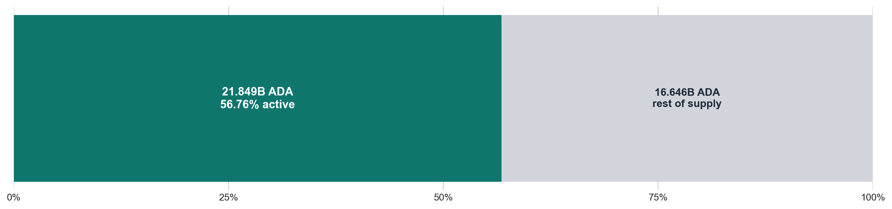

## 2. Stake and rewards

### 2.1 Categorization

The report uses the prior report’s **`3M ADA` viability line** plus a small set of saturation anchors to describe the upper tail.

Here, the `3M ADA` viability line keeps the prior report’s meaning: it marks the shift from sporadic block production toward more regular rewards. It is not presented here as a universal profitability guarantee.

At epoch `618`, the saturation point used here is approximately **76.99M ADA per pool**.

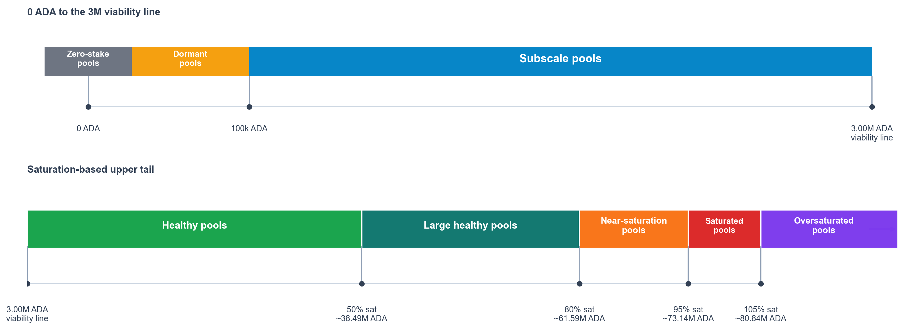

### 2.2 Pool mix by size

#### 2.2.1 Live

- **2,217** pools (**75.18%**) sit in the zero-stake, dormant, sub-production, or sub-viable tiers; together they carry only **2.60%** of current active stake.
- The **732** pools at or above the viability line carry **97.39%** of current active stake.
- The **106** pools from near-saturation upward carry **7.747B ADA** (**35.45%** of current active stake).

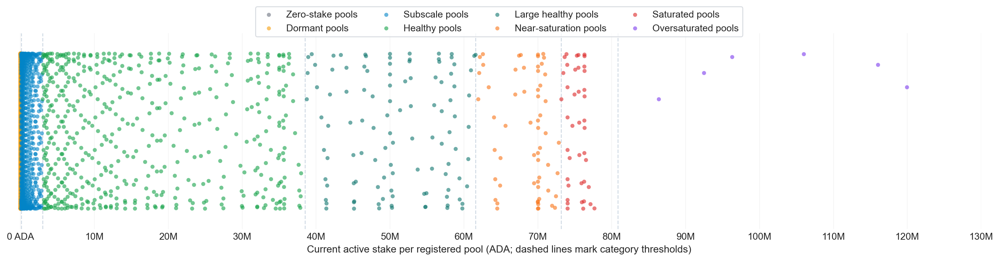

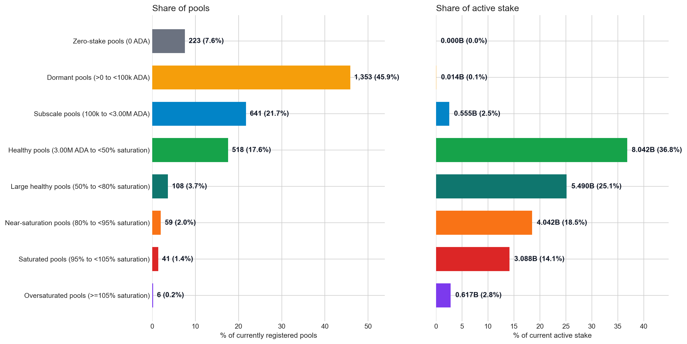

#### 2.2.2 Historical

- Positive-stake pools peaked at **3,029** in epoch `331`; the live point is **2,726** at epoch `618` (**90.00%** of that peak).
- Pools at or above the viability line peaked at **851** in epoch `439`; the live point is **732**.
- Under each epoch's own saturation point, the near-saturation-and-above layer peaked at **240** pools in epoch `248`; the live point is **106**.

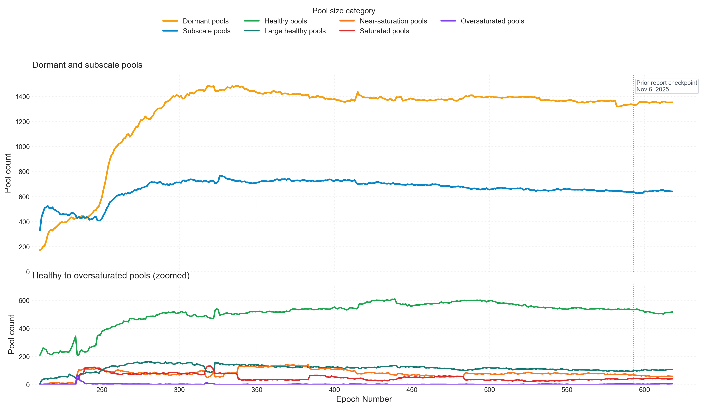

### 2.3 Reward distribution

#### 2.3.1 Live

#### 2.3.2 Historical

## 3. Entity and MPO concentration

This theme isolates the attributed entity layer rather than treating pools only as standalone registrations.
The attributed entity set currently covers **451** registered pools, or **15.29%** of registered pools by count, but **28.92%** of total supply by stake.
It also captures **66.98%** of near-saturation pools.

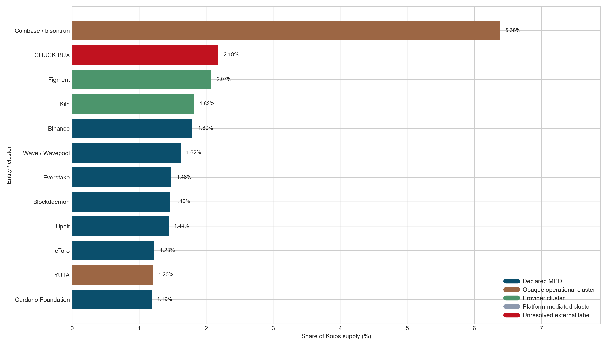

### 3.1 Entity landscape

| Entity / cluster | Type | Registered pools | Pools with stake | Stake (B ADA) | % supply | Healthy core | Near sat | Median pledge | Avg margin | Pressure |
| --- | --- | --- | --- | --- | --- | --- | --- | --- | --- | --- |
| Coinbase / bison.run | Opaque operational cluster | 48 | 47 | 2.451 | 6.37% | 41 | 23 | 0 | 4.64% | Very high |
| CHUCK BUX | Unresolved external label | 17 | 15 | 0.834 | 2.17% | 13 | 10 | 73,000,000 | 94.00% | High |
| Figment | Provider cluster | 37 | 36 | 0.788 | 2.05% | 19 | 4 | 0 | 8.36% | High |
| Binance | Declared MPO | 53 | 50 | 0.691 | 1.80% | 20 | 1 | 2 | 6.10% | High |
| Kiln | Provider cluster | 11 | 11 | 0.687 | 1.78% | 9 | 6 | 100 | 5.00% | Moderate |
| Wave / Wavepool | Declared MPO | 17 | 17 | 0.611 | 1.59% | 14 | 5 | 1,000,000 | 14.83% | Moderate |
| Blockdaemon | Declared MPO | 15 | 15 | 0.577 | 1.50% | 12 | 4 | 200 | 5.73% | Moderate |
| Everstake | Declared MPO | 15 | 15 | 0.567 | 1.47% | 12 | 1 | 1,000 | 2.93% | Moderate |
| Upbit | Declared MPO | 20 | 20 | 0.551 | 1.43% | 20 | 0 | 200,000 | 100.00% | High |
| eToro | Declared MPO | 24 | 12 | 0.472 | 1.23% | 11 | 0 | 0 | 100.00% | Moderate |
| YUTA | Opaque operational cluster | 25 | 25 | 0.465 | 1.21% | 25 | 0 | 50,000 | 12.59% | High |
| Cardano Foundation | Declared MPO | 6 | 6 | 0.456 | 1.19% | 6 | 6 | 76,000,000 | 100.00% | Moderate |
| NuFi | Provider cluster | 18 | 18 | 0.313 | 0.81% | 17 | 0 | 1,000 | 3.00% | High |
| Emurgo | Declared MPO | 14 | 11 | 0.271 | 0.70% | 8 | 1 | 500 | 1.55% | Moderate |
| 1PCT | Declared MPO | 30 | 30 | 0.270 | 0.70% | 16 | 1 | 50,000 | 0.97% | High |
| Bloom | Declared MPO | 7 | 7 | 0.220 | 0.57% | 7 | 1 | 1,000,000 | 17.71% | Moderate |
| AdaOcean | Declared MPO | 10 | 10 | 0.189 | 0.49% | 6 | 0 | 10,000 | 3.77% | Moderate |
| Adalite platform cluster | Platform cluster | 3 | 3 | 0.158 | 0.41% | 3 | 2 | 71,000,000 | 100.00% | Limited |
| StakeBowl | Opaque operational cluster | 10 | 9 | 0.140 | 0.36% | 2 | 2 | 0 | 80.67% | Limited |
| BigLazyCat | Declared MPO | 3 | 3 | 0.130 | 0.34% | 3 | 1 | 1,000 | 0.67% | Limited |
| P2P | Declared MPO | 7 | 6 | 0.098 | 0.25% | 5 | 1 | 1,000 | 2.17% | Moderate |
| Spire | Declared MPO | 5 | 5 | 0.096 | 0.25% | 3 | 1 | 880 | 22.20% | Limited |
| AutoStake | Declared MPO | 4 | 4 | 0.084 | 0.22% | 2 | 1 | 100 | 0.00% | Limited |
| IOG | Declared MPO | 35 | 9 | 0.013 | 0.03% | 1 | 0 | 64,000,000 | 59.11% | Limited |
| RAID | Declared MPO | 7 | 7 | 0.000 | 0.00% | 0 | 0 | 30,000 | 1.00% | Limited |
| RockX | Declared MPO | 10 | 10 | 0.000 | 0.00% | 0 | 0 | 100 | 2.00% | Limited |

Current read:
- Coinbase / bison.run remains the largest cluster with 6.37% of supply and 48 registered pools.
- The clusters with very high average margin are CHUCK BUX (94.00%, 2.17% of supply), Upbit (100.00%, 1.43% of supply), eToro (100.00%, 1.23% of supply), Cardano Foundation (100.00%, 1.19% of supply), Adalite platform cluster (100.00%, 0.41% of supply).
- The landscape is not homogeneous: Coinbase / bison.run (47/48 with stake), CHUCK BUX (15/17 with stake), Figment (36/37 with stake), Binance (50/53 with stake).

#### What these entities do beyond SPO

The largest names in the attributed MPO layer are not homogeneous. Some are exchanges and custodians, some are institutional validator providers, and only a smaller tail looks like classic retail or community pool operation.

- `Coinbase / bison.run`: exchange, custody, and institutional prime brokerage. The public business is [Coinbase Prime](https://www.coinbase.com/prime), not `bison.run`; Cardano staking sits alongside execution, financing, custody, and dedicated-validator products.
- `Binance`: global exchange plus custody, wallet, payments, and [Earn](https://www.binance.com/en/earn/version) products. The Cardano pools look more like exchange inventory than like a standalone SPO business.
- `Kiln`: institutional validator and staking infrastructure. [Kiln](https://www.kiln.fi/) sells staking, DeFi, and onchain asset infrastructure to enterprises and institutions.
- `Figment`: institutional staking provider. [Figment](https://figment.io/company/about/) serves asset managers, custodians, exchanges, wallets, and foundations with staking, APIs, reporting, and related infrastructure.
- `Blockdaemon`: institutional blockchain infrastructure. [Blockdaemon](https://www.blockdaemon.com/) combines node and API infrastructure, staking, DeFi access, and MPC wallet / vault products.
- `Everstake`: yield and validator infrastructure rather than a Cardano-only operator. [Everstake](https://everstake.one/) markets institutional staking, Validator-as-a-Service, and wallet / yield SDKs.
- `P2P`: staking-as-a-business infrastructure. [P2P.org](https://www.p2p.org/) focuses on APIs, white-label staking, and related products for wallets, exchanges, custodians, and asset managers.
- `Emurgo`: Cardano's commercial and venture arm rather than a pure SPO. [EMURGO](https://www.emurgo.io/about/) spans fintech, ventures, tokenization, and products such as Yoroi, USDA, and Anzens.
- `AutoStake`: small multi-chain validator operator. [AutoStake](https://autostake.com/) presents itself as a bare-metal validator business across several PoS networks, not just Cardano.
- `StakeBowl`: small staking and asset-services operator. [StakeBowl](https://stakebowl.io/) describes node operation, digital asset storage, investment, and asset management beyond Cardano pool operation.
- `BigLazyCat`: community and content-led operator. [BigLazyCat](https://www.biglazycat.com/stake-ada.html) combines an ADA pool with DRep activity, multi-chain validators, and community-facing content and token activity.
- `CHUCK BUX`: still low-confidence. The public first-party identity is weak; the strongest surviving signal is legacy `Staked / staked.cloud` metadata in the local registration history, which suggests institutional staking infrastructure rather than a transparent retail SPO brand.

### 3.2 MPO low-pledge pattern

The next table isolates the current low-pledge pattern inside the attributed set. This is the configuration that usually drives MPO concern: many registered pools, low declared pledge, and still meaningful delegated stake.

| Entity / cluster | Registered pools | Zero pledge | <10k pledge | Stake <10k (B) | <10k & >=80% sat | Stake <10k & >=80% sat (B) |
| --- | --- | --- | --- | --- | --- | --- |
| Coinbase / bison.run | 48 | 47 | 48 | 2.457 | 24 | 1.725 |
| Kiln | 11 | 0 | 11 | 0.699 | 6 | 0.521 |
| Figment | 37 | 0 | 37 | 0.798 | 4 | 0.345 |
| Blockdaemon | 15 | 0 | 15 | 0.561 | 4 | 0.287 |
| StakeBowl | 10 | 10 | 10 | 0.140 | 2 | 0.140 |
| CHUCK BUX | 17 | 5 | 5 | 0.165 | 1 | 0.071 |
| BigLazyCat | 3 | 0 | 3 | 0.131 | 1 | 0.069 |
| P2P | 7 | 2 | 5 | 0.088 | 1 | 0.065 |
| AutoStake | 4 | 0 | 4 | 0.083 | 1 | 0.063 |
| Everstake | 15 | 0 | 15 | 0.568 | 1 | 0.062 |
| Emurgo | 14 | 2 | 11 | 0.272 | 1 | 0.062 |

The largest current pools inside the attributed set are summarized below.
These rows use the live pledge field directly, which avoids conflating a true exact zero with a tiny non-zero micro-pledge.

| Entity | Ticker | Pool | Stake (M ADA) | % sat | Pledge | Margin | Fixed cost |
| --- | --- | --- | --- | --- | --- | --- | --- |
| Coinbase / bison.run | N/A | pool12m7z9p7...c8s4t9 | 119.94 | 155.83% | 0 | 5.00% | 340 |
| Kiln | TW001 | pool1gaztx97...rw62tm | 116.02 | 150.73% | 100 | 10.00% | 340 |
| Kiln | KILN9 | pool1k3nkfa5...q0z38t | 95.40 | 123.95% | 100 | 5.00% | 340 |
| Figment | N/A | pool1f2wfjqk...xjqfze | 92.76 | 120.52% | 2 | 6.00% | 170 |
| Figment | gjp7a | pool19yzqr3m...t5kg3v | 91.51 | 118.89% | 2 | 10.00% | 170 |
| Figment | LBF4 | pool1ra2su7c...yp5ela | 84.69 | 110.03% | 2 | 6.00% | 170 |
| CHUCK BUX | N/A | pool1vhz8753...8kp83z | 76.33 | 99.17% | 76,000,000 | 100.00% | 340 |
| CHUCK BUX | N/A | pool1r99a6pu...4yevz5 | 76.32 | 99.16% | 76,000,000 | 100.00% | 340 |
| Cardano Foundation | CF1 | pool18rjrygm...quv4au | 76.32 | 99.15% | 76,000,000 | 100.00% | 170 |
| Cardano Foundation | CF4 | pool1n6erydn...fl7sc5 | 76.30 | 99.13% | 76,000,000 | 100.00% | 170 |
| Cardano Foundation | CF2 | pool1xmlq3sg...2ysk2c | 76.30 | 99.13% | 76,000,000 | 100.00% | 170 |
| Cardano Foundation | CF3 | pool1l0erdjr...q6zuvp | 76.30 | 99.13% | 76,000,000 | 100.00% | 170 |
| Adalite platform cluster | N/A | pool1r9fpxs4...740nj9 | 76.27 | 99.10% | 71,000,000 | 100.00% | 340 |
| CHUCK BUX | N/A | pool1yafxktv...a7aknf | 76.27 | 99.09% | 76,000,000 | 100.00% | 340 |
| Adalite platform cluster | N/A | pool1kmmahq4...549yqe | 76.22 | 99.03% | 71,000,000 | 100.00% | 340 |
| Wave / Wavepool | N/A | pool1l0m820v...qvg0je | 76.12 | 98.90% | 50,000,000 | 4.00% | 340 |
| Kiln | KILN4 | pool10d6mmw3...g5yknr | 76.01 | 98.76% | 100 | 5.00% | 340 |
| Kiln | KILN3 | pool1mtxmk0s...3vccux | 75.94 | 98.67% | 100 | 3.00% | 340 |
| Kiln | KILN2 | pool1v62c7d9...patklv | 75.75 | 98.42% | 100 | 3.00% | 340 |
| Blockdaemon | N/A | pool1mfyzxyg...krlps5 | 75.57 | 98.19% | 200 | 3.00% | 340 |

### 3.3 Historical entity and MPO concentration history

Across the current attributed entity set, the combined share was:

- **30.09%** at epoch `400`
- **26.53%** at epoch `410`
- **26.42%** at epoch `584`
- **28.92%** at live epoch `618`

The stacked composition view below shows how that total was internally distributed across the attributed entities with at least two currently registered pools.

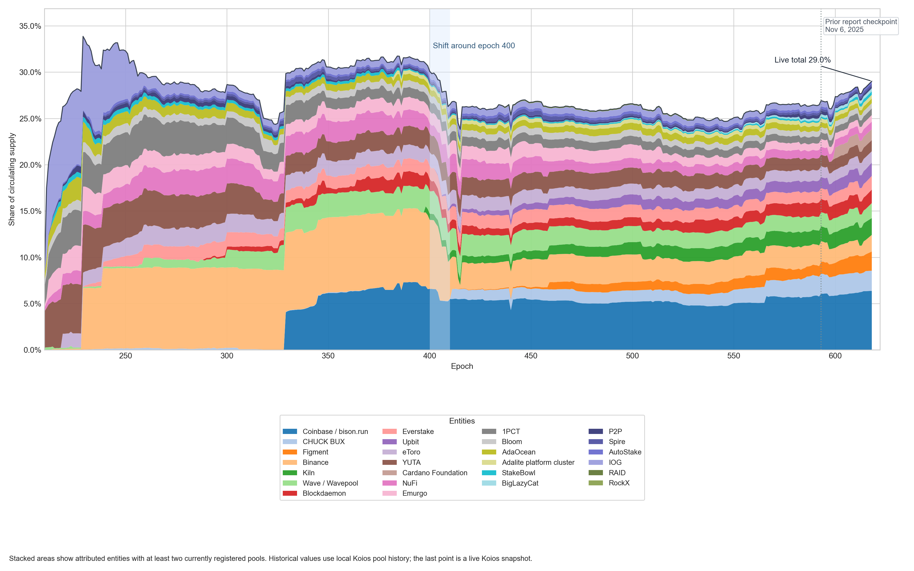

On the same `>=2 pools` basis, this cohort currently covers **451 pools** across **26 entities** and represents:

- **11.176B ADA** of active stake, equal to **51.15%** of stake currently participating in consensus (**29.03%** of circulating supply)
- **3.635B ADA** of declared pledge, equal to **84.61%** of all declared pledge across currently registered pools (**9.44%** of circulating supply)
- roughly **3.07x** active stake over declared pledge

| Entity / cluster | Epoch 400 | Epoch 410 | Epoch 584 | Epoch 618 | Delta 400 -> live |
| --- | --- | --- | --- | --- | --- |
| Coinbase / bison.run | 6.60% | 5.50% | 5.71% | 6.37% | -0.23 pts |
| CHUCK BUX | 0.00% | 0.03% | 1.99% | 2.17% | +2.17 pts |
| Figment | 0.00% | 0.00% | 1.09% | 2.05% | +2.05 pts |
| Binance | 7.44% | 4.22% | 2.41% | 1.80% | -5.64 pts |
| Kiln | 0.66% | 0.72% | 1.56% | 1.78% | +1.12 pts |
| Wave / Wavepool | 2.44% | 2.39% | 1.60% | 1.59% | -0.85 pts |
| Blockdaemon | 1.31% | 0.93% | 1.50% | 1.50% | +0.19 pts |
| Everstake | 1.41% | 1.43% | 1.20% | 1.47% | +0.06 pts |
| Upbit | 0.00% | 0.27% | 1.16% | 1.43% | +1.43 pts |
| eToro | 1.49% | 1.48% | 1.17% | 1.23% | -0.26 pts |
| YUTA | 2.00% | 1.94% | 1.28% | 1.21% | -0.79 pts |
| Cardano Foundation | 0.00% | 0.00% | 0.00% | 1.19% | +1.19 pts |
| NuFi | 1.14% | 1.97% | 0.88% | 0.81% | -0.33 pts |
| Emurgo | 1.30% | 1.43% | 0.74% | 0.70% | -0.59 pts |
| 1PCT | 1.06% | 1.00% | 0.73% | 0.70% | -0.36 pts |

- Since epoch 400, the largest declines are Binance (-5.64 pts), Wave / Wavepool (-0.85 pts), YUTA (-0.79 pts), IOG (-0.69 pts), Emurgo (-0.59 pts).
- Since epoch 400, the largest increases are CHUCK BUX (+2.17 pts), Figment (+2.05 pts), Upbit (+1.43 pts), Cardano Foundation (+1.19 pts), Kiln (+1.12 pts).
- Since epoch 584, the declines are more limited: Binance (-0.61 pts), IOG (-0.54 pts), P2P (-0.12 pts), NuFi (-0.07 pts), YUTA (-0.07 pts).
- Since epoch 584, the most visible increases are Cardano Foundation (+1.19 pts), Figment (+0.96 pts), Coinbase / bison.run (+0.66 pts), Everstake (+0.28 pts), Upbit (+0.27 pts).

## 4. Pledge

This section isolates declared pledge as its own analytical surface and starts with the current pledge-band view before moving into ratio and history.

### 4.1 Current pledge bands

| Declared pledge band | Pools | % registered pools | Active stake (B ADA) | % current active stake | % supply |
| --- | --- | --- | --- | --- | --- |
| Zero-pledge pools (0 ADA) | 251 | 8.51% | 3.607 | 16.51% | 9.37% |
| Micro-pledge pools (>0 to <10k ADA) | 1,451 | 49.20% | 6.243 | 28.57% | 16.22% |
| Low-pledge pools (10k to <100k ADA) | 740 | 25.09% | 3.592 | 16.44% | 9.33% |
| Modest-pledge pools (100k to <1M ADA) | 381 | 12.92% | 5.172 | 23.67% | 13.44% |
| Material-pledge pools (1M to <10M ADA) | 57 | 1.93% | 1.155 | 5.29% | 3.00% |
| High-pledge pools (>=10M ADA) | 69 | 2.34% | 2.080 | 9.52% | 5.40% |

### 4.2 Declared pledge relative to current active stake by pool scale

#### Healthy pools (>= viability line, ~3M ADA)

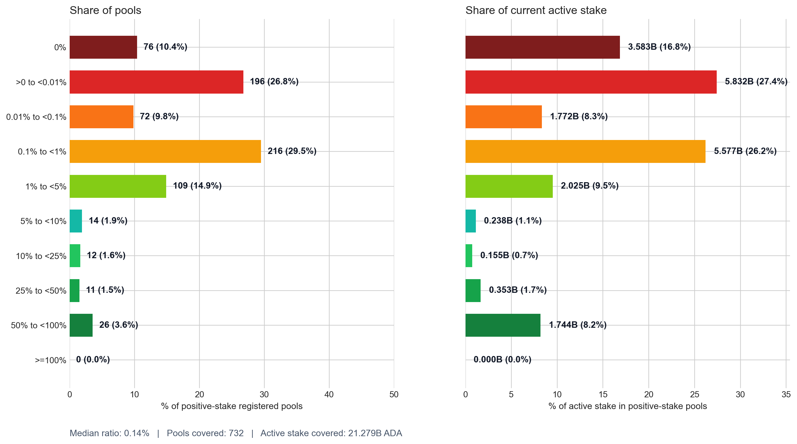

- The median live ratio is **0.14%** across **732** healthy-core pools.
- **>=10% combined**: **49** pools (**6.69%**), carrying **2.252B ADA** (**10.58%**).
- **10% to <25%**: 12 pools (1.64%), 0.155B ADA (0.73%)
- **25% to <50%**: 11 pools (1.50%), 0.353B ADA (1.66%)
- **50% to <100%**: 26 pools (3.55%), 1.744B ADA (8.20%)
- **>=100%**: 0 pools (0.00%), 0.000B ADA (0.00%)

#### Sub-production + Sub-viable pools (100K to < viability threshold, ~3M ADA)

> **Sub-production** (100K → ~1M ADA): below the production threshold — sporadic block production, high reward variance.
> **Sub-viable** (~1M → ~3M ADA): below the viability threshold — regular block production but insufficient to cover fixed costs.

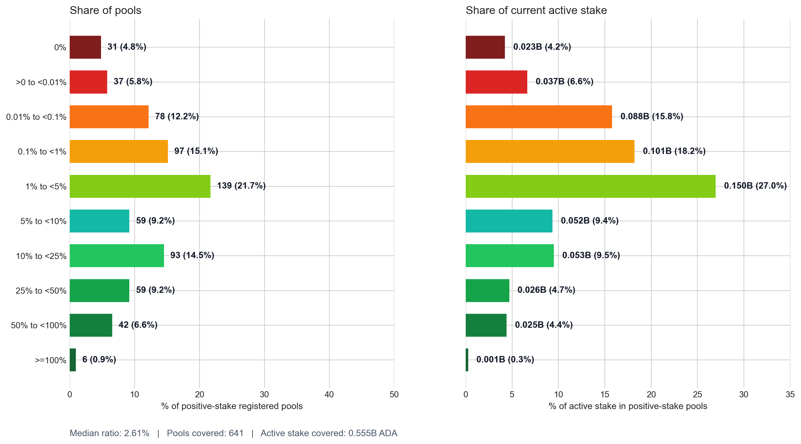

- The median live ratio is **2.61%** across **641** below-viability pools (sub-production + sub-viable).
- **>=10% combined**: **200** pools (**31.20%**), carrying **0.105B ADA** (**18.88%**).
- **10% to <25%**: 93 pools (14.51%), 0.053B ADA (9.50%)
- **25% to <50%**: 59 pools (9.20%), 0.026B ADA (4.70%)
- **50% to <100%**: 42 pools (6.55%), 0.025B ADA (4.42%)
- **>=100%**: 6 pools (0.94%), 0.001B ADA (0.26%)

### 4.3 Historical pledge compliance

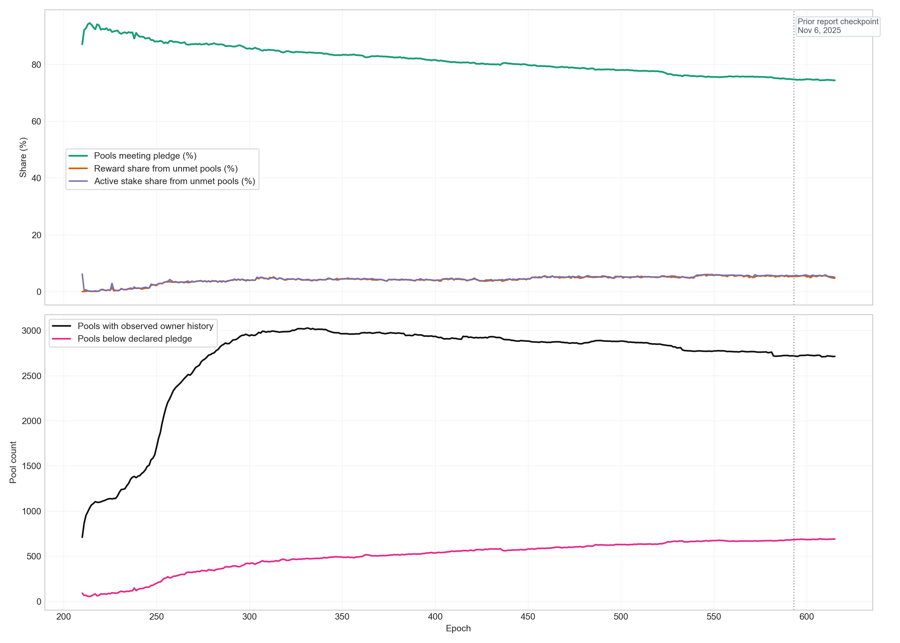

- Median epoch pledge-met share: **80.8%** of pools with observed owner history.
- Latest epoch pledge-met share: **74.5%**.
- Full-window realized rewards linked to pledge-unmet pool-epochs: **182.11M ADA** (4.03% of realized pool rewards).
- Pools with perfect observed compliance: **3,099**.
- Pools below 90% observed compliance: **1,469**.

Historical read:

- The pledge proxy does not show a world where non-compliance dominates rewards, but it is still large enough to matter analytically.
- Low pledge and failed pledge are not the same thing: one is a choice of declared skin in the game, the other is a failure to meet a declared threshold.

### 4.4 Historical large low-pledge pool history

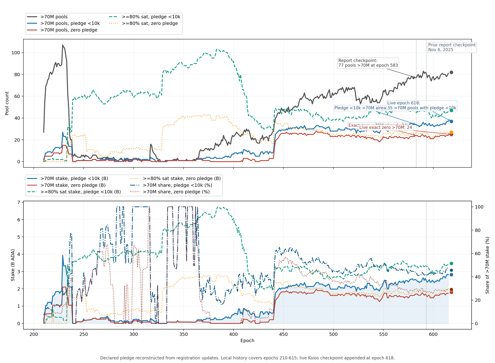

| Epoch | Source | >70M pools | >70M & pledge <10k | >70M & zero pledge | >=80% sat & pledge <10k | >=80% sat & zero pledge |
| --- | --- | --- | --- | --- | --- | --- |
| 400 | local history | 23 | 7 | 0 | 92 | 33 |
| 410 | local history | 27 | 11 | 3 | 66 | 25 |
| 441 | local history | 35 | 18 | 13 | 47 | 35 |
| 448 | local history | 49 | 29 | 26 | 44 | 33 |
| 583 | local history | 77 | 34 | 24 | 45 | 26 |
| 615 | local history | 81 | 37 | 24 | 46 | 28 |

Historical read:

- The major structural break is the jump beginning at **epoch 441** and extending through roughly **epoch 448**.
- By epoch `583`, the report-comparable `>70M ADA` bucket already contained **34** pools below **10k ADA** pledge and **24** exact zero-pledge pools.
- Live epoch `618` remains in the same broad regime rather than showing a brand-new recent explosion.

## 5. Operator fees

Margin is the operator's variable skim on pool rewards. It is analytically distinct from pledge and from fixed cost, so it is treated on its own here.

### 5.1 Margin

#### 5.1.1 Current margin regimes

| Margin band | Pools | % registered pools | Active stake (B ADA) | % current active stake | % supply |
| --- | --- | --- | --- | --- | --- |
| Zero-margin pools (0%) | 648 | 21.97% | 2.782 | 12.73% | 7.23% |
| Low-margin pools (>0 to <3%) | 1,200 | 40.69% | 6.571 | 30.07% | 17.07% |
| Standard-margin pools (3% to <5%) | 372 | 12.61% | 3.860 | 17.67% | 10.03% |
| Elevated-margin pools (5% to <10%) | 328 | 11.12% | 4.184 | 19.15% | 10.87% |
| High-margin pools (10% to <100%) | 224 | 7.60% | 1.215 | 5.56% | 3.16% |
| Private-margin pools (100%) | 177 | 6.00% | 3.237 | 14.81% | 8.41% |

#### 5.1.2 Margin read

- Median margin today is **2.00%**.
- Average margin today is **10.41%**.
- A non-trivial fraction of stake still sits in `100%` margin pools, even though these are a minority of pools by count.

#### 5.1.3 Historical margin read

- Latest median active margin: **2.00%**.
- The median active margin remained structurally low, around **2%**, even while low-pledge pools remained common.

### 5.2 Fixed cost

Fixed cost is the flat fee floor on pool rewards. It should be read separately from margin because it bites small pools differently from large pools, so it is treated on its own here.

#### 5.2.1 Current fixed-cost regimes

| Fixed cost regime | Pools | % registered pools | Active stake (B ADA) | % current active stake | % supply |
| --- | --- | --- | --- | --- | --- |
| Min-cost pools (170 ADA) | 510 | 17.29% | 4.990 | 22.84% | 12.96% |
| Standard-cost pools (340 ADA) | 1,956 | 66.33% | 14.762 | 67.56% | 38.35% |
| Non-standard-cost pools (other) | 483 | 16.38% | 2.097 | 9.60% | 5.45% |

#### 5.2.2 Fixed-cost read

- Median fixed cost today is **340 ADA**.
- `340 ADA` remains the dominant fixed-cost regime.

#### 5.2.3 Historical fixed-cost read

- Latest share of pools at 340 ADA fixed cost: **66.5%**.
- The fixed-cost baseline converged strongly around **340 ADA**.

## 6. Method and caution

- The live sections use the current mainnet snapshot at epoch `618` on **March 12, 2026**.
- Current counts keep only **currently registered** pools. Retired pools are intentionally excluded from "today" counts.
- Entity attribution inherits the current MPO mapping and deep-dive work. It is strongest where first-party metadata, branded tickers, and repeated relay or domain signals converge.
- The stacked historical MPO figure keeps only attributed entities with **at least two currently registered pools**.
- `Zero pledge` means exact zero in the raw pledge field. Tiny non-zero micro-pledges are not counted as zero.
- `Very low pledge` means declared pledge strictly below **10,000 ADA**.
- The live pledge-ratio figures use **declared pledge / current active stake** as the current proxy. Zero-stake registered pools are excluded from that ratio because the denominator is zero.
- Historical entity markers are reconstructed from the local pool history export plus epoch supply.
- The large-pool low-pledge history uses pledge declaration updates, not just owner snapshots, because owner snapshots materially undercount many large low-pledge pools.

## 7. Companion documents

- `../docs/pool-reward-distribution-mainnet.md`
- `../docs/pool-pledge-and-updates-mainnet.md`
- `../outputs/mpo_entity_deep_dive_mainnet.md`
- `../outputs/mpo_entity_pool_table_mainnet.md`
- `../outputs/mpo_entity_pool_health_mainnet.csv`
