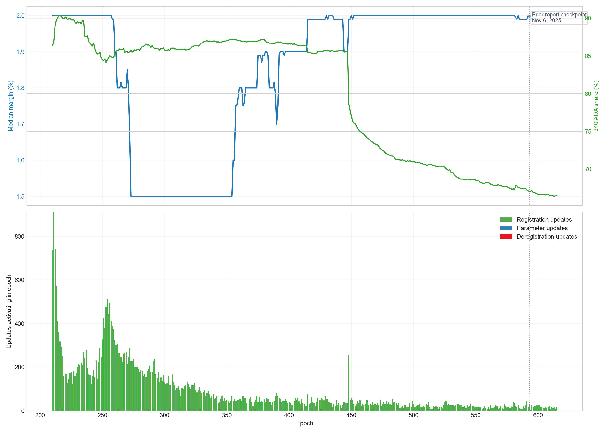
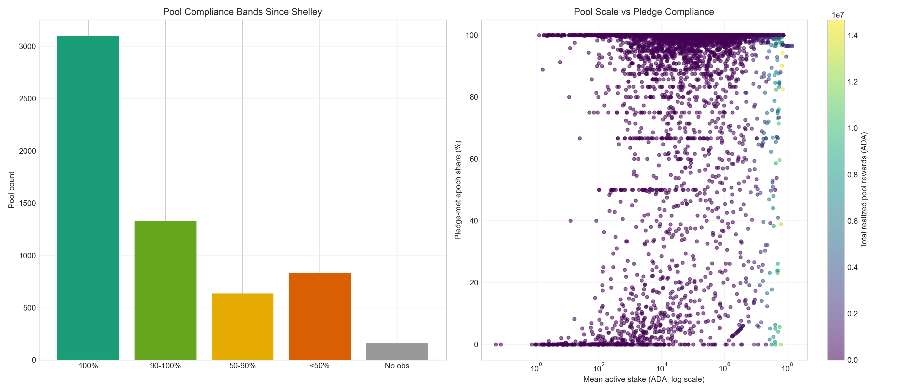

# Pool Pledge and Updates Analysis (Mainnet)

## Objective
Go one level deeper than realized pool rewards and inspect two governance-relevant mechanics:
1. whether owner stake appears to meet declared pledge over time,
2. how fee regimes and update activity evolved across the Shelley window.

## Raw sources
- `koios_pool_history_mainnet.csv`: realized pool rewards, active stake, block counts.
- `koios_pool_owner_history_mainnet.csv`: owner stake by epoch and declared pledge.
- `koios_pool_updates_mainnet.csv`: active parameter changes and deregistration/registration history.

## Compliance proxy
- Per pool and epoch, the proxy tests $Stake^{owners}_{active} \geq Pledge_{declared}$ when owner history is observed.
- If owner history is not observed but `pool_updates` gives a pledge amount, the pledge target is still known but not the coverage ratio.
- This is a same-epoch Koios join, useful for incentive analysis but not a direct ledger-validity proof.

[Summary](pool_pledge_and_updates_mainnet_summary.md)

## Graph 1: Pledge Compliance Proxy
Top panel: share of pools meeting pledge, plus reward/stake share linked to pledge-unmet pool-epochs.
Bottom panel: observed pool count and non-compliant pool count.

## Graph 2: Active Fee Regimes and Update Pressure
Top panel: median active margin and share of pools at 340 ADA fixed cost.
Bottom panel: registrations, deregistrations, and other parameter updates activating by epoch.

## Graph 3: Pool-Level Compliance Distribution
Left panel: pool counts by compliance band across the full window.
Right panel: stake scale versus pledge-met epoch share, colored by realized pool rewards.

## Interpretation
- This dataset can now support CIP-level arguments about whether stronger skin-in-the-game rules would bind often or rarely.
- It also gives a concrete baseline for talking about fee-regime changes without relying on anecdotal pool examples.
