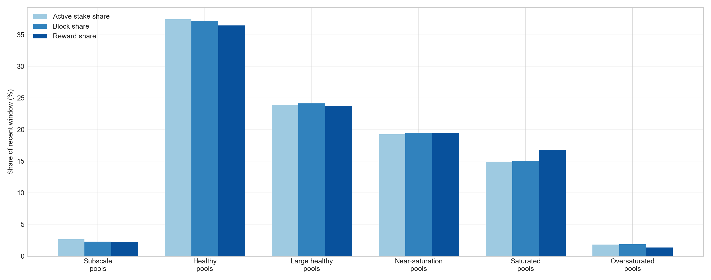
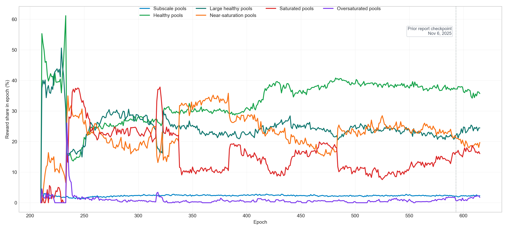
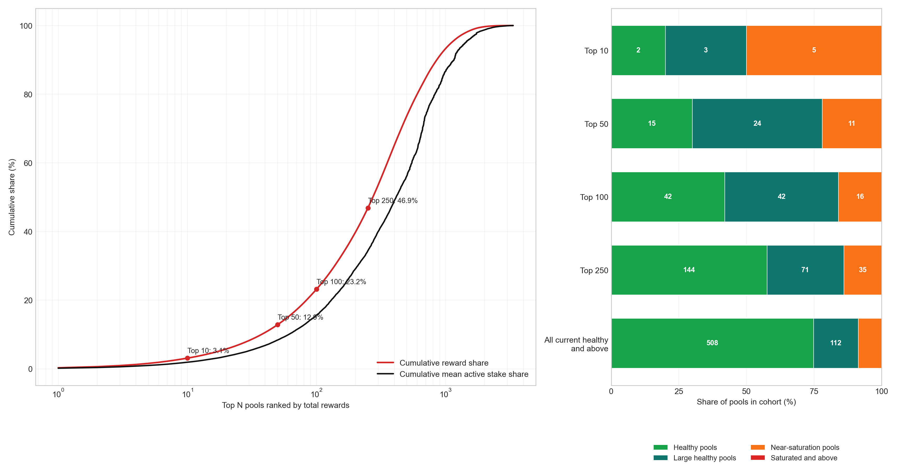
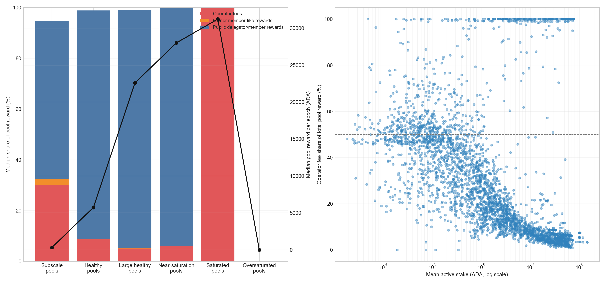

# Pool Reward Distribution Analysis (Mainnet)

Target quantity: realized pool-level rewards since Shelley using Koios `pool_history`.

## Objective
Go one level below the epoch-wide reward pot and inspect how realized rewards were distributed across pools from the start of Shelley to current mainnet tip.

## Data source
- `koios_pool_history_mainnet.csv` provides pool-by-pool, epoch-by-epoch realized rewards, operator fees, member rewards, block counts, and active stake.
- `koios_pool_list_mainnet.csv` provides current pool metadata and ticker/status enrichment.
- `reward_epoch_pools_mainnet.csv` is used only as a cross-check against the epoch-wide pool reward total.

## Exact split now available
- Total pool reward: $Reward^{pool}_{actual}=Fee^{operator}_{pool}+Reward^{delegators}_{pool}$
- Public delegator/member rewards come from `member_rewards`.
- Owner member-like rewards are inferred as $Reward^{delegators}_{pool}-Reward^{members}_{pool}$ when `member_rewards` is available.

[Summary](pool_reward_distribution_mainnet_summary.md)

## Graph 1: Reward Distribution Since the Prior Report Checkpoint
Window: epochs `593..latest`.

## Graph 2: Reward Distribution Across the Full Shelley Window
Top panel: full-window distribution of stake, blocks, and rewards by reward-bearing size categories.
Bottom panel: how reward share by reward-bearing size categories evolved over time.

## Graph 3: Reward Concentration
Pools are ranked by total realized rewards since Shelley.

## Graph 4: Exact Reward Split Mechanics
Left panel: median exact split of pool reward by size category.
Right panel: operator fee share as a function of pool scale.

## First read (full Shelley window)
- `Subscale pools`: reward share **2.3%**, block share **2.3%**
- `Healthy pools`: reward share **32.1%**, block share **33.7%**
- `Large healthy pools`: reward share **25.0%**, block share **24.7%**
- `Near-saturation pools`: reward share **23.1%**, block share **23.1%**
- `Saturated pools`: reward share **16.7%**, block share **15.1%**
- `Oversaturated pools`: reward share **0.9%**, block share **1.1%**

## Recent-window read (since prior report checkpoint)
- `Subscale pools`: reward share **2.2%**, block share **2.3%**
- `Healthy pools`: reward share **36.5%**, block share **37.1%**
- `Large healthy pools`: reward share **23.7%**, block share **24.1%**
- `Near-saturation pools`: reward share **19.4%**, block share **19.5%**
- `Saturated pools`: reward share **16.8%**, block share **15.1%**
- `Oversaturated pools`: reward share **1.3%**, block share **1.8%**
- Top 10 pools captured **3.1%** of realized rewards.
- Top 50 pools captured **12.9%**.
- Top 100 pools captured **23.2%**.
- Top 250 pools captured **46.9%**.
- Top 10 bucket mix: **5 Near-saturation pools, 3 Large healthy pools, 2 Healthy pools**.
- Top 50 bucket mix: **24 Large healthy pools, 15 Healthy pools, 11 Near-saturation pools**.
- Top 100 bucket mix: **42 Healthy pools, 42 Large healthy pools, 16 Near-saturation pools**.
- Top 250 bucket mix: **144 Healthy pools, 71 Large healthy pools, 35 Near-saturation pools**.
- All current healthy-and-above pools (`n=679`) bucket mix: **508 Healthy pools, 112 Large healthy pools, 59 Near-saturation pools**.

## Exact split by size
- `Subscale pools`: operator fees **30.0%**, public delegator/member rewards **62.1%**, median pool reward **335.3 ADA/epoch**
- `Healthy pools`: operator fees **8.7%**, public delegator/member rewards **89.9%**, median pool reward **5741.4 ADA/epoch**
- `Large healthy pools`: operator fees **5.1%**, public delegator/member rewards **93.8%**, median pool reward **22572.2 ADA/epoch**
- `Near-saturation pools`: operator fees **6.2%**, public delegator/member rewards **93.8%**, median pool reward **28002.6 ADA/epoch**
- `Saturated pools`: operator fees **100.0%**, public delegator/member rewards **0.0%**, median pool reward **31223.6 ADA/epoch**
- `Oversaturated pools`: operator fees **0.0%**, public delegator/member rewards **0.0%**, median pool reward **0.0 ADA/epoch**

## Next level down
- Add `pool_updates` to make size-category and fee-regime transitions explicit over time.
- Add `pool_owner_history` to test pledge compliance and owner-capital effects directly.
