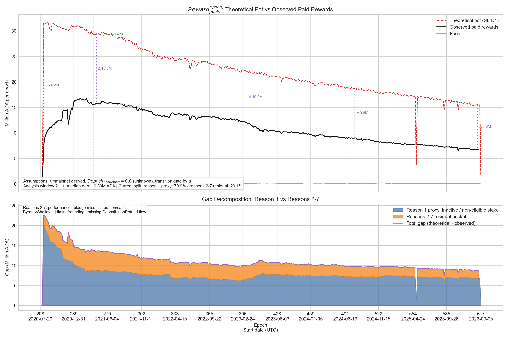
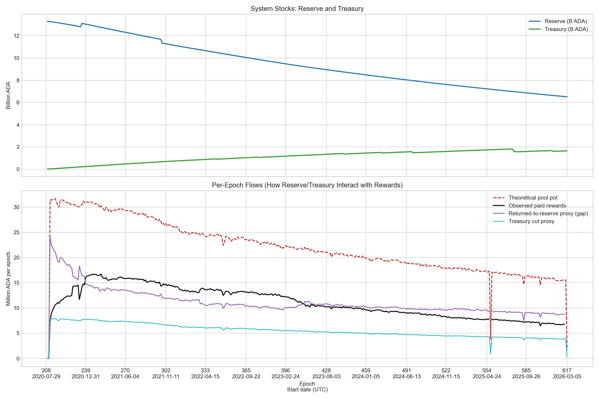

# Epoch Pool Reward Analysis (Mainnet)

Target quantity: $Reward^{epoch}_{pools}$

## Objective
Understand why observed paid rewards are below the theoretical epoch reward pot, identify the seven ledger-level causes of the gap, and separate them from the subset that can currently be quantified from the available mainnet dataset.

## What the reserve does
In SL-D1, the reserve is the long-term monetary source used by monetary expansion.
Each epoch, a part of rewards comes from fees and a part from reserve via $\eta\cdot\rho$.
Then treasury takes $\tau$ from the gross reward sources, and pool rewards are paid from the remaining pot.
If actual paid rewards are below this pot, the remainder is returned to reserve (not to treasury).

## Formula Layer
1. Gross sources (approximation here): $Gross = Fee + \eta\cdot\rho\cdot Reserve\cdot g^{transition}$
2. Theoretical pool pot: $R^{epoch}_{pot}=(1-\tau)\cdot Gross$
3. Observed paid rewards: $R^{epoch}_{paid}$
4. Gap: $Gap=R^{epoch}_{pot}-R^{epoch}_{paid}$

Transition gate used in this report:
$g^{transition}=0$ when $d\ge1$ (bootstrap), otherwise $g^{transition}=1$.

## Seven reasons why a gap exists
| Reason | Mechanism | Status in this report |
| --- | --- | --- |
| 1 | Inactive / reward-ineligible stake: Byron funds, undelegated stake, retired pools, and similar non-participating stake. | Approximated directly with an active-stake proxy. |
| 2 | Pool performance losses: $\bar{p}<1$ because of missed blocks, forks, or underperformance. | Residual bucket only. |
| 3 | Unmet pledge: if pledge is not respected, pool reward can collapse to zero for the epoch. | Residual bucket only. |
| 4 | Saturation / cap effects: $\sigma'=\min(\sigma,z_0)$ and $s'=\min(s,z_0)$. | Residual bucket only. |
| 5 | Byron -> Shelley transition: early epochs depend on $d$ and the OBFT/Praos transition. | Partially modeled via the transition gate. |
| 6 | Ledger timing and rounding: epoch offsets and integer lovelace arithmetic. | Residual bucket only. |
| 7 | Incomplete $Deposit_{nonRefund}$ measurement when the true epoch flow is unavailable. | Explicit limitation; currently set to 0. |

This means the current graph is not a seven-way attribution. It is a one-way measured proxy plus a residual block that still contains reasons 2-7.

## Graph 1: Pot vs Paid + Gap Decomposition
The top panel shows theoretical pot and observed paid rewards.
Purple markers annotate the absolute gap at selected epochs.
The bottom panel quantifies the gap into two measurable buckets:
- Bucket A: reason 1 proxy, inactive / non-eligible stake.
- Bucket B: residual bucket containing reasons 2-7.

## Current quantification (epoch >= 211)
- Total gap: **4527.86M ADA**
- Reason 1 proxy: **3212.38M ADA** (**70.9%**) 
- Reasons 2-7 residual bucket: **1315.48M ADA** (**29.1%**) 

## Graph 2: Reserve/Treasury Mechanics
Top panel: stock variables (reserve and treasury) through time.
Bottom panel: per-epoch flow view to read how the reward pot, treasury cut, paid rewards, and return-to-reserve proxy interact.

## Interpretation
- A near-parallel shape between theoretical and observed curves means the model captures dynamics, but there is a structural offset.
- In this window, most of the offset is consistent with the inactive / non-eligible stake proxy, and the rest is a stable residual block containing reasons 2-7.
- To break the residual further, the next step is pool-level data: performance, pledge compliance, saturation state, and exact non-refundable deposit flow.

## Assumptions and limitations
- $Deposit_{nonRefund}$ is not directly available at epoch-level in this dataset and is set to 0.
- $\eta$ uses mainnet-derived values from epoch block counts ($\eta_{mainnet,capped}$).
- Gap decomposition is an analytical proxy, not a full ledger-state replay or full seven-way attribution.
