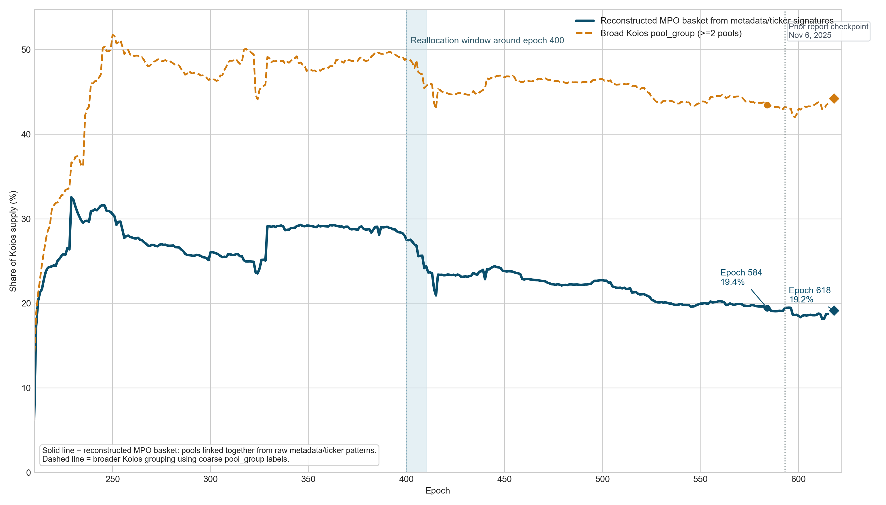

# MPO progression from raw Koios data

## Files

- Figure: `../figures/mpo_progression_proxy_mainnet.png`
- Entity composition figure: `../figures/mpo_entity_progression_stacked_mainnet.png`
- Table CSV: `mpo_progression_proxy_key_epochs_mainnet.csv`

## Method

- Historical stake uses the local Koios pool history export.
- Reconstructed MPO basket = pools I can confidently link together from repeated metadata domains, tickers, and related raw registration signatures.
- The broad comparator uses Koios `pool_group` labels whenever a group has at least two pools.
- The final row in the table is a live Koios snapshot fetched at runtime.

## Key read

- Reconstructed basket peak: epoch 229 at 32.55% of Koios supply.
- Reconstructed basket low: epoch 210 at 6.24% of Koios supply.
- Pools matched into the reconstructed basket: 688.

## Key epochs

| Epoch | Source | Reconstructed stake (B ADA) | Reconstructed % supply | Broad % supply | Top reconstructed groups |
| --- | --- | ---: | ---: | ---: | --- |
| 220 | local history | 7.809 | 24.50% | 31.57% | IOG_Group (2.60B), 1percentpool.eu (1.26B), emurgo.io (0.68B) |
| 250 | local history | 9.846 | 30.56% | 51.75% | BNP (2.53B), IOG_Group (1.67B), 1percentpool.eu (1.14B) |
| 400 | local history | 9.784 | 27.49% | 48.96% | BNP (2.39B), bison.run (2.35B), WAV (0.87B) |
| 410 | local history | 8.724 | 24.39% | 45.68% | bison.run (1.97B), BNP (1.31B), WAV (0.85B) |
| 584 | local history | 7.406 | 19.43% | 43.46% | bison.run (2.18B), BNP (0.74B), WAV (0.61B) |
| 618 | live Koios | 7.384 | 19.18% | 44.25% | bison.run (2.46B), WAV (0.62B), kiln.fi (0.58B) |

